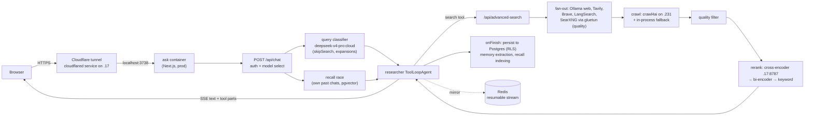

# Overview

**Ask** is a self-hosted, Perplexity-style answer engine. A user types a question; Ask
decides whether it needs the web, searches several providers in parallel, crawls and
reranks the result pages, then streams back an answer with inline citations. It also
has long-term memory, recall over the user's own past chats, file/URL grounding
(RAG), image generation, voice (read-aloud and dictation), a weather widget and a
Discover feed.

Ask is a fork of [Morphic](https://github.com/miurla/morphic) (the `upstream` git
remote). Most of the original generative-UI skeleton is still recognisable; the search
pipeline, streaming/persistence layer, auth/RLS, and everything that talks to the home
GPU fleet were rebuilt for self-hosting.

- Public URL: `https://ask.hbqnexus.win` (production only; staging and lab are LAN-only).
- Repository: `git@github.com:hbqdev/ask.git`, three long-lived branches — see
  [Environments](/operations/environments).

## Stack

| Layer | Technology | Where it shows up |
|---|---|---|
| Web framework | Next.js 16 (App Router, RSC, Turbopack in dev), React 19 | `app/`, `next.config.mjs`, `proxy.ts` (Next 16's replacement for `middleware.ts`) |
| Language / tooling | TypeScript 5, **bun 1.3** as package manager and script runner, Node 22 at runtime (`Dockerfile` uses `node:22-slim`) | `package.json`, `bun.lock` |
| LLM orchestration | Vercel AI SDK v6 (`ai`, `@ai-sdk/*`, `ai-sdk-ollama`) — `ToolLoopAgent`, `createUIMessageStream` | `lib/agents/`, `lib/streaming/` |
| Models | Ollama (local GPU models + Ollama Cloud `*:cloud` models proxied through a local daemon) | `lib/utils/registry.ts`, `lib/config/default-model.ts` |
| Database | Postgres 17 + pgvector (`pgvector/pgvector:pg17`), Drizzle ORM, row-level security | `lib/db/`, `drizzle/` |
| Cache / pub-sub | Redis (per-env container, `noeviction`) | search cache, resumable streams, budgets, rate limits |
| Search | Per-env SearXNG behind a Mullvad VPN sidecar (gluetun), plus Ollama web search, Tavily, Brave, LangSearch | `lib/tools/search/`, `app/api/advanced-search/route.ts` |
| Crawl / rerank / embed | crawl4ai (headless Chromium), a cross-encoder reranker, a GPU embedder (Qwen3-Embedding-0.6B) | `lib/utils/crawl4ai.ts`, `lib/utils/cross-encoder.ts`, `lib/embeddings/` |
| Auth | Supabase (prod/staging); anonymous shared user on the lab | `lib/auth/get-current-user.ts` |
| UI | Tailwind v4, Radix/shadcn components, streamdown for Markdown | `components/` |
| Tests | Vitest + Testing Library (jsdom) | `vitest.config.mts`, `**/__tests__/` |

## Mental model

Four ideas explain most of the code:

1. **One chat turn = one long-lived server generation.** `POST /api/chat`
   (`app/api/chat/route.ts:38`) starts an agent run that is bounded only by a 300 s
   timeout or an explicit Stop — *not* by the browser connection
   (`app/api/chat/route.ts:36`, `GENERATION_TIMEOUT_MS`). The stream is mirrored to Redis
   so a reloaded tab can resume it. See [Streaming](/request-lifecycle/streaming).
2. **The answering model drives retrieval.** A fast classifier decides whether a turn
   needs search at all; then a `ToolLoopAgent` (`lib/agents/researcher.ts:426`) calls
   tools (`search`, `fetch`, `recall`, …) until it writes plain text. The heavy lifting
   of search happens server-side in `/api/advanced-search`, not in the model.
3. **Everything degrades rather than fails.** Rerank tiers, the snippet gate, metered
   APIs, crawl4ai, voice, the ingest worker — all fail open. Only SearXNG (in quality
   mode) and Postgres are hard dependencies.
4. **Environments differ by env flags, not by builds.** Lab, staging and prod run the
   same Dockerfile; each builds from its own git worktree and branch, and behavioural
   differences between them are env vars set in compose overlays or `.env`. See
   [Environments](/operations/environments).

## A request's journey

The same flow in prose, with file anchors:

| Step | What happens | Code |
|---|---|---|
| 1 | Request arrives; user resolved (Supabase or anonymous); search mode read from the `searchMode` cookie; model chosen (saved preference outranks the default) | `app/api/chat/route.ts:38`, `lib/utils/model-selection.ts` |
| 2 | Authed turns register an abort controller so Stop works; guests get an ephemeral, unpersisted stream | `app/api/chat/route.ts:223-237`, `lib/streaming/active-generations.ts` |
| 3 | Turn orchestration: prepare messages, classify (fused query expansion), recall, title generation, build agent | `lib/streaming/create-chat-stream-response.ts:140`, `:299` |
| 4 | Agent picks a turn mode (`direct` / `stable-knowledge` / `research`) and step budget (speed 20 / balanced 50 / quality 100) | `lib/agents/researcher.ts:146`, `:574-657` |
| 5 | `search` tool → advanced pipeline (fan-out → crawl → filter → rerank) | `lib/tools/search.ts:325`, `app/api/advanced-search/route.ts:532` |
| 6 | Model streams the answer; narration stripped; client throttles rendering | `lib/streaming/helpers/smooth-and-strip-narration.ts`, `components/chat.tsx` |
| 7 | `onFinish`: persist (with retry), memory extraction, recall indexing — all under RLS | `lib/streaming/create-chat-stream-response.ts:1040`, `lib/db/with-rls.ts:39` |

The interactive version of this walk-through lives on
[One chat turn](/request-lifecycle/chat-turn).

## The 10-minute tour

Open these in order; each is the entry point for a whole subsystem.

1. **`docker-compose.yaml`** — the prod stack: `ask`, `postgres`, `redis`, `searxng`,
   and the long comments that explain *why* each env value is set. Then skim
   `docker-compose.lab.yaml` to see what an overlay looks like.
2. **`app/api/chat/route.ts`** — the front door of every turn: auth, gates, the abort
   wiring, and the guest/authed split.
3. **`lib/streaming/create-chat-stream-response.ts`** — the turn orchestrator (classifier,
   recall, title, agent, persistence, resumable stream).
4. **`lib/agents/researcher.ts`** — the agent: turn modes, tool registry, step budgets,
   answer deadline.
5. **`lib/tools/search.ts`** then **`app/api/advanced-search/route.ts`** — how one
   `search` call becomes a multi-provider fan-out, a crawl and a rerank.
6. **`components/chat.tsx`** — the client side: `useChat`, the resumable transport,
   Stop, and refresh rules.
7. **`lib/db/schema.ts`** + **`lib/db/with-rls.ts`** — the data model and how RLS is enforced.
8. **`fleet-boot/rebuild-ask.sh`** and **`fleet-boot/ask-fleet-boot.sh`** — how the
   stacks are deployed and how they come back after a reboot.

## Where to look for what

| If you need to… | Start at |
|---|---|
| Understand or change what the model sees for a search | [Search pipeline](/search/pipeline), `app/api/advanced-search/route.ts` |
| Change the default model / classifier / reasoning | [Models & reasoning](/search/models-reasoning), `lib/config/default-model.ts`, `lib/agents/query-classifier.ts` |
| Debug a vanished / duplicated / stuck answer | [Streaming](/request-lifecycle/streaming), [Client state](/request-lifecycle/client-state) |
| Find which host runs a service | [Fleet](/infrastructure/fleet), [Services](/infrastructure/services) |
| Change an env flag in one environment | [Environments](/operations/environments), [Env flags reference](/reference/env-flags) |
| Ship a change | [Deploy](/operations/deploy) |
| Something is down | [Runbooks](/operations/runbooks) |
| A turn is slow | [Telemetry](/operations/telemetry) |
| Know whether an idea was already tried | [Decisions](/history/decisions) |
| Run tests / do QA | [Testing & QA](/operations/testing-qa) |
| Find a file | [Repo tour](/getting-started/repo-tour) |

::: tip Read the compose comments
The compose files are unusually well commented: most env values carry the measurement
that justified them and the condition under which they should be revisited. Read the
comment before changing a value.
:::
