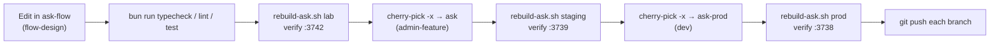

# Recipes: how to…

Step-by-step procedures for the changes that come up most often. Each recipe names the
exact files to touch and the traps that have bitten this codebase before. The deep "why" lives
on the linked pages; this page is the checklist.

Every recipe that changes code ends the same way: commit on `flow-design` in the lab worktree
(`/home/nightfury/selfhosted/ask-flow`), rebuild the lab, verify, then port. See
[Ship a change lab → staging → prod](#ship-a-change-lab-staging-prod).



::: tip Before any recipe
Run the static checks in the worktree you edited: `bun run typecheck`, `bun run lint`,
`bun run format:check`, `bun run test` (`package.json`). Several tests fail on every branch
already. Compare against the list in [Testing & QA](/operations/testing-qa#pre-existing-failures)
instead of chasing them.
:::

## Add or remove a chat model

The model picker has no code list. It is the comma-separated **`OLLAMA_MODELS`** env var, read
when the container starts (`lib/models/fetch-models.ts:393`). Every entry is an **Ollama Cloud**
model (`<name>:cloud`) served through the Ollama daemon on NightFuryX. Do not add direct
Anthropic, OpenAI or Google models. See [Models & reasoning](/search/models-reasoning#model-roster).

"The three model lists" are the three environments' `OLLAMA_MODELS` values. Each lives in the
gitignored `.env` of its own worktree:

| Env | File | How to edit |
|---|---|---|
| prod | `/home/nightfury/selfhosted/ask-prod/.env` | **Model Manager** (preferred), see [Model Manager](/infrastructure/model-manager) |
| staging | `/home/nightfury/selfhosted/ask/.env` | by hand, then recreate |
| lab | `/home/nightfury/selfhosted/ask-flow/.env` | by hand, then recreate |

No compose overlay sets `OLLAMA_MODELS`, so `.env` is authoritative in all three. The lab
overlay does pin `DEFAULT_CHAT_MODEL` (`docker-compose.lab.yaml:101`). As of 2026-09-22 the three
lists are identical. Keep them identical unless an experiment needs otherwise, because list
drift makes staging results unrepresentative of prod.

**Add a model**

1. **Prove it generates.** Send it one real generation on the daemon
   (`POST http://192.168.50.17:11434/api/generate` with `"model": "<name>:cloud"`). A metadata
   probe (`/api/show`, ollama.com's tag list) proves nothing: "extra usage" models return
   **HTTP 402 on the first token** while metadata looks fine
   ([Models & reasoning](/search/models-reasoning)).
2. **Prod:** open the Model Manager (`ssh -L 3939:127.0.0.1:3939 nightfury@192.168.50.17`, then
   `http://localhost:3939`), Models → Chat → *Chat model list* (field `OLLAMA_MODELS`, type
   `model-list`, `selfhosted/model-manager/lib/env-schema.ts:131`). Add the id, preview the diff,
   **Apply**. Apply writes `.env` with a backup and runs the prod
   `docker compose -p ask-stack … up -d --force-recreate --no-deps --wait ask`
   (`selfhosted/model-manager/lib/apply.ts`).
3. **Staging and lab:** edit the `OLLAMA_MODELS=` line in each `.env` and recreate (no rebuild):
   ```bash
   cd /home/nightfury/selfhosted/ask
   docker compose -p ask-stack-admin-feature -f docker-compose.yaml -f docker-compose.admin-feature.yaml \
     -f docker-compose.vpn.yaml -f docker-compose.vpn.admin-feature.yaml up -d --force-recreate --no-deps ask
   cd /home/nightfury/selfhosted/ask-flow
   docker compose -p ask-stack-lab -f docker-compose.yaml -f docker-compose.lab.yaml \
     -f docker-compose.vpn.lab.yaml up -d --force-recreate --no-deps ask
   ```
   (The `-p`/`-f` sets are the ones `fleet-boot/rebuild-ask.sh:13-38` uses.)
4. Verify on each container: `docker exec <ask|ask-admin-feature|ask-lab> printenv OLLAMA_MODELS`.

**Make it the default:** set `DEFAULT_CHAT_MODEL` (Model Manager on prod; `.env` on staging; the
overlay line `docker-compose.lab.yaml:101` on the lab). The code fallback is `kimi-k2.6:cloud`
(`lib/config/default-model.ts:10`). A new default only affects sessions **without** a saved pick.

**Remove a model**

1. Remove it from all three `OLLAMA_MODELS` as above.
2. **Delisting does not move anyone off it.** A logged-in user's saved pick
   (`user_settings.preferred_chat_model`) outranks the list and the default forever
   (`lib/utils/model-selection.ts:118`). The stale id keeps being sent to Ollama while the picker
   displays a fallback. To migrate users, clear the saved pick on each DB. The value is stored as
   `providerId:encodeURIComponent(modelId)` (`lib/config/model-selection-cookie.ts:8-14`), so the
   `:` inside the model id is encoded:
   ```sql
   -- docker exec -it ask-postgres psql -U morphic -d morphic
   UPDATE user_settings SET preferred_chat_model = NULL
    WHERE preferred_chat_model = 'ollama:deepseek-v4-flash%3Acloud';
   ```
   (`ask-postgres-admin-feature` / `ask-postgres-lab` for the other envs.)
3. Check afterwards which model actually answers from the `modelId` field of the `[latency]`
   line ([Telemetry](/operations/telemetry)), never from the picker.

::: warning Other model roles are separate settings
The query classifier (`CLASSIFIER_MODEL_ID`), expander, title and memory-extractor models are
**not** in `OLLAMA_MODELS`. `CLASSIFIER_MODEL_ID` is set in prod's `.env` but **hardcoded in the
staging and lab overlays** (`docker-compose.admin-feature.yaml:54`, `docker-compose.lab.yaml:164`),
which win over `.env`. Changing it fleet-wide is a `.env` edit plus an overlay commit per branch.
`EMBEDDING_MODEL` must never change without a re-embed migration (it is read-only in the Model
Manager, `selfhosted/model-manager/lib/env-schema.ts:250-262`).
:::

## Add an agent tool

The research agent is a `ToolLoopAgent` built in `createResearcher`
(`lib/agents/researcher.ts`). A tool is an AI SDK `tool({ description, inputSchema, execute })`.
`lib/tools/calculate.ts` is the smallest example to copy.

1. **Write the tool** in `lib/tools/<name>.ts`. Keep the description and the parameter
   descriptions accurate. Models copy the examples in them literally: `calculate` once
   advertised `"17% of 4500"`, which mathjs cannot parse, and a model burned its last step
   retrying it and returned an empty answer (`lib/tools/calculate.ts:4-12`). Return errors as
   values (`{ success: false, error }`), don't throw, and bound any untrusted input.
2. **Type it** in `ResearcherTools` (`lib/types/agent.ts:20-32`). Make it optional (`?`) if it
   is only registered under a condition, as `generateImage` is.
3. **Register it in the tools map** `rawTools` (`lib/agents/researcher.ts:786`). Everything in
   this map is wrapped by `enforceAnswerDeadline` (`researcher.ts:817`,
   `lib/agents/answer-deadline.ts:173`), which refuses late calls.
4. **Advertise it** by adding its name to `activeToolsList` in each turn mode that should offer
   it (`researcher.ts:585` direct, `:610` stable-knowledge, `:624` speed, `:645` quality,
   `:667` balanced). If it is conditional, gate the `activeToolsList.push` and the map entry
   **identically** (compare `researcher.ts:703` with `:806-810`).
5. **Prompt it if needed.** A mode prompt that should steer usage lives in
   `lib/agents/prompts/search-mode-prompts.ts`. Only append guidance when the tool is actually
   registered: guidance for an absent tool makes models hallucinate calls to it (see the
   `IMAGE_TOOL_GUIDANCE` gate in `researcher.ts`).
6. **Render it.** Typed tool parts render via the `switch` in `components/tool-section.tsx:99`.
   A tool without a case falls to `default: null` in the live stream, and after a reload it
   comes back as a `dynamic-tool` rendered by `components/dynamic-tool-display.tsx`. Add a case
   (or an inline branch like `tool-calculate` at `tool-section.tsx:80`) for a readable step. See
   [Generative UI](/request-lifecycle/generative-ui) for spec-driven output.
7. **Persistence needs no migration.** `parts` has dedicated columns only for search, fetch,
   question and todo tools. Any other `tool-*` part is stored as `tool-dynamic`
   (`lib/utils/message-mapping.ts:327-342`), which satisfies the `tool_fields_required` check
   constraint (`lib/db/schema.ts:247`).
8. **Test** in `lib/tools/__tests__/<name>.test.ts`, then try it on the lab.

::: danger `activeTools` is advertising, not enforcement
`activeTools: activeToolsList` (`researcher.ts:850`) only controls which tools are **described
to the model**. The AI SDK (v6) executes any tool call against the full `tools` map, so a model
that names a non-advertised tool still runs it. The stable-knowledge mode relies on this on
purpose: `search` is not advertised but stays in the map as an escape hatch
(`researcher.ts:115-118`, `:605-611`). **To actually block a tool, leave it out of the map**
(or wrap its `execute`, as the answer deadline does). Never rely on `activeTools` for a
security or budget boundary.
:::

## Add a search provider

There are two kinds of provider. Almost every addition is the second kind.

- **Primary provider** (`SEARCH_API`): one of `tavily | exa | searxng | firecrawl | brave`,
  chosen in `createSearchProvider` (`lib/tools/search/providers/index.ts:16-37`), implementing
  `SearchProvider` (`providers/base.ts`). The fleet runs SearXNG as primary.
- **Merged source** in the advanced route's concurrent fan-out
  (`app/api/advanced-search/route.ts`). Tavily, Brave, LangSearch, Ollama web search and degoog
  are all of this kind.

To add a merged source (LangSearch is the template):

1. **Client** in `lib/utils/<x>-client.ts` with a timeout and a 30 s circuit breaker
   (`lib/utils/langsearch-client.ts:34`, `:126`, `:174`), so a dead provider does not add its
   full timeout to every search.
2. **Budget gate** if it is metered: a `maybeFetchX` that reads a Redis counter first and skips
   if Redis cannot be read (**fail closed**), and increments only after success
   (`route.ts:467-500`). Prod and staging share API keys and count separately, so set the daily
   or monthly budget below the provider quota.
3. **Fan out**: add the call to the `Promise.allSettled` array (`route.ts:838`). Decide the
   tier: everything hangs off `includeSearxngDegoog = searchMode !== 'balanced'`
   (`route.ts:824`).
4. **Merge**: add `lib/tools/search/providers/merge-<x>.ts` that dedups by `normalizeUrl` and
   caps (`merge-langsearch.ts`), and call it where the others merge (`route.ts:1058`).
5. **Prefetched URLs**: if the source returns usable page text, add its URLs to
   `prefetchedUrls` (`route.ts:992`) so crawl4ai does not re-fetch them.
6. **Env flags** for enable/timeout/budget: see [the next recipe](#add-an-env-flag).
7. **Measure on the lab** and judge the answers, not source counts. See
   [Search pipeline → How to change things](/search/pipeline#how-to-change-things) and
   [Evaluation](/operations/evaluation). Do not fire ad-hoc live queries against prod to test it
   ([Testing & QA](/operations/testing-qa#no-live-search-probing)).

## Add an env flag

1. **Read it in code** with a safe default that preserves current behaviour, e.g.
   `process.env.MY_FLAG === 'true'` or `parseInt(process.env.MY_N || '10', 10)`. A default of
   "off" is what makes a staging-only or lab-only rollout possible: staging has no separate build,
   so "staging only" always means a flag.
   - Server vars are read at runtime. A **`NEXT_PUBLIC_*`** var is inlined by `next build` from
     the build context's `.env`, so changing it needs a rebuild, not a recreate.
   - Module-scope reads (`const X = process.env.X` at the top of a file) are frozen at container
     start. That is fine, as long as nobody expects a live change.
2. **Set it per environment.** The base `docker-compose.yaml:9-10` loads `env_file: .env` and then
   an `environment:` block. The overlays (`docker-compose.admin-feature.yaml`,
   `docker-compose.lab.yaml`) add their own `environment:` blocks. **An `environment:` entry beats
   `.env`**, so:
   - Value that differs per env and is not secret: put it in the env's overlay (tracked, reviewed).
     Lab experiments go in `docker-compose.lab.yaml`.
   - Secret, or something an operator tunes: put it in that worktree's `.env` only (gitignored).
   - Never set the same name in both an overlay and `.env` without a comment. The overlay wins
     silently (this caused the `CLASSIFIER_MODEL_ID` mismatch; see the warning above).
3. **Document the name** in `.env.local.example`. Names only, never real values.
4. **Model Manager** (only if operators should edit it on prod): add an `EnvVarSpec` entry to
   `REGISTRY` in `selfhosted/model-manager/lib/env-schema.ts` (fields at `:73-92`: `key`,
   `category`, `group`, `label`, `type`, `validate`, `help`, `default`, `readOnly`). Use
   `type: 'secret'` for anything credential-like and `readOnly: true` for values locked to stored
   data. Run the Model Manager tests (`bun run test` in `selfhosted/model-manager/`), then rebuild
   it from the **staging** worktree, which is where the running instance is built:
   `cd /home/nightfury/selfhosted/ask/selfhosted/model-manager && docker compose up -d --build`.
   See [Model Manager](/infrastructure/model-manager).
5. **Docs reference**: run `cd docs-site && bun run gen`. `scripts/gen/env.ts` rediscovers every
   `process.env.X` in `app/ lib/ components/ hooks/ config/`, every compose reference and every
   `.env*.example` entry, and never reads real `.env` files (`scripts/gen/lib.ts:76-79`). The
   [Env flags](/reference/env-flags) page updates from that data.
6. **Apply**: env-only changes need `up -d --force-recreate --no-deps ask` for the env, not a
   rebuild ([Deploy → Env-only changes](/operations/deploy#env-only-changes)). Verify with
   `docker exec <container> printenv MY_FLAG`.

## Add a DB table or column (with a migration)

Schema is Drizzle, in `lib/db/schema.ts`; migrations are the numbered SQL files in `drizzle/`
with their journal in `drizzle/meta/_journal.json`. Details: [Data layer](/infrastructure/data-layer).

1. **Edit `lib/db/schema.ts`.** For a user-owned table, give it a `user_id` and an RLS policy,
   and call `.enableRLS()`. Copy the `notes` table (`schema.ts:315-323`):
   ```ts
   pgPolicy('users_manage_own_<thing>', {
     as: 'permissive', for: 'all', to: 'public',
     using: sql`user_id = (select current_setting('app.current_user_id', true))`,
     withCheck: sql`user_id = (select current_setting('app.current_user_id', true))`
   })
   ```
   Keep `current_setting` wrapped in `(select …)`, so Postgres evaluates it once per statement.
   For child rows, use the `EXISTS (… chats.user_id = …)` shape the `messages`/`parts` policies use.
2. **Generate**: `bunx drizzle-kit generate` (config `drizzle.config.ts`, needs `DATABASE_URL`,
   falls back to `.env.local`). Review the SQL. A hand-written migration also needs a matching
   entry in `_journal.json`, or the migrator (`lib/db/migrate.ts`) will not apply it.
3. **Write it idempotently**: `CREATE … IF NOT EXISTS`, `ADD COLUMN IF NOT EXISTS`. A new column
   should be nullable or have a default, so the old image can still run against the new schema
   during a rollback. `0020_preferred_chat_model.sql` is a one-line example.
4. **Query it through RLS**: user-facing code uses `withRLS(userId, tx => …)` or
   `withOptionalRLS` (`lib/db/with-rls.ts:39`, `:80`) on the restricted `db` client. Use
   `dbAdmin` only for token-gated system jobs.
5. **Grants**: `app_user` gets DML on future tables through default privileges set by
   `fleet-boot/create-app-user.sh`. After deploying a new table, confirm the app can read it (a
   permission error shows up in `docker logs`).
6. **Deploy with care.** The container entrypoint runs `bun run migrate` under `set -e` before
   `next start`. **A failing migration means the container never serves** and crash-loops under
   `restart: unless-stopped` ([Deploy → Migrations at boot](/operations/deploy#migrations-at-boot)).
   For an extension or a large index, pre-apply by hand on each DB **before** the rebuild:
   ```sql
   -- docker exec -it ask-postgres psql -U morphic -d morphic   (as the owner)
   CREATE EXTENSION IF NOT EXISTS pg_trgm;
   CREATE INDEX CONCURRENTLY IF NOT EXISTS "<name>" ON "<table>" USING gin ("<col>" gin_trgm_ops);
   SELECT indisvalid FROM pg_index WHERE indexrelid = '"<name>"'::regclass;  -- expect t
   ```
   The boot migration's `IF NOT EXISTS` statements are then no-ops. This is how
   `0021_pg_trgm_search_indexes.sql` shipped.
7. **Regenerate the docs schema**: `cd docs-site && bun run gen` updates
   [Database](/reference/database).

::: danger Migrations are forward-only
Reverting code does not revert schema. Anything destructive (drop/rename/type change) needs a
hand-written reverse SQL ready before deploy. Prefer additive changes across two releases:
add, migrate data, switch reads, and only drop later.
:::

## Add an API route

Routes are Next.js App Router handlers at `app/api/<name>/route.ts`. Pick the auth pattern
first. The [API routes](/reference/api-routes) generator (`docs-site/scripts/gen/api-routes.ts:10-14`)
detects these call patterns, and a handler without one is listed as `public`.

| Caller | Pattern | Example |
|---|---|---|
| A signed-in user | `const userId = await getCurrentUserId(); if (!userId) return 401` (`lib/auth/get-current-user.ts:17`) | `app/api/voice/speak/route.ts` |
| A service (ingestor, loopback search, maintenance cron) | `checkIngestAuth` (`lib/utils/ingest-auth.ts`), bearer `INGEST_API_TOKEN` | `app/api/ingest/*` |
| A scheduled job that touches every user's data | `requireCronSecret(request)` (`lib/auth/cron-auth.ts:26`), bearer `MEMORY_CRON_SECRET` | `app/api/memory/consolidate` |

Rules:

1. **Derive the user id from the session, never from the request.** No route accepts a user id
   parameter, and that is why there is no IDOR ([Security](/infrastructure/security#authentication)).
   `getCurrentUserId()` verifies the session with Supabase (`getUser()`, not `getSession()`).
   With `ENABLE_AUTH=false` it returns `ANONYMOUS_USER_ID`.
2. **Fail closed.** A secret that is not configured must mean "route disabled" (503), never
   "unguarded". `requireCronSecret` exists because the older check failed open and let an
   unauthenticated POST re-embed every user's history.
3. **Feature-gate** with a 404 when the feature flag is off (`speak/route.ts:13`).
4. **Validate the body** and cap sizes before calling anything expensive.
5. **Query with `withRLS`** so Postgres enforces ownership even if the handler has a bug.
6. **Outbound fetches** of user-supplied URLs must go through the SSRF guard
   ([Security → SSRF guard](/infrastructure/security#ssrf-guard)).
7. Remember that prod is internet-reachable through the Cloudflare tunnel: every route is
   public surface unless it checks something. `proxy.ts` only refreshes the Supabase session. It
   does not block anything.
8. Add a test next to the route (`app/api/<name>/__tests__/`), run `bun run gen` in `docs-site/`.

See [Auth & accounts](/request-lifecycle/auth-and-accounts) for the session machinery.

## Add a page or component

1. **Page**: create `app/<route>/page.tsx` (App Router; `app/library/page.tsx` and
   `app/discover/page.tsx` are self-contained client pages). The root `app/layout.tsx` supplies
   the sidebar, theme and providers, so a page renders only its own content.
2. **Navigation**: add it to the sidebar's nav list (`components/app-sidebar.tsx:49-50`).
3. **Components**: shared primitives are shadcn/ui in `components/ui/` (`components.json`; icons
   are Tabler, `@tabler/icons-react`). Feature components live flat in `components/` or in a
   feature folder (`components/sidebar/`, `components/artifact/`, `components/settings/`). Use
   the `cn()` helper from `@/lib/utils` and the CSS variables in `app/globals.css` so light and
   dark themes both work ([Frontend → Theming](/request-lifecycle/frontend#theming)).
4. **Server data**: fetch in a server component or a server action (`lib/actions/*`) that calls
   `getCurrentUserId()` and `withRLS`. Never pass a user id from the client.
5. **Mobile**: check the phone layout with Playwright on the lab
   ([Testing & QA](/operations/testing-qa#mobile-responsive-qa-with-playwright)). A desktop
   browser resize does not emulate a phone.
6. **If it needs geolocation, the microphone or the camera**, check the `Permissions-Policy`
   header in `next.config.mjs`. `geolocation=()` once silently broke the weather widget.
7. Tests use Vitest + Testing Library (`components/**/__tests__/`, `app/library/__tests__/`).

## Change a prompt safely

Prompts shape every answer, and small wording changes have produced measurable regressions.
Treat a prompt edit as an **architectural change**: lab first, measured, then port.

Where prompts live:

| Prompt | Location |
|---|---|
| Speed / balanced / quality mode prompts | `lib/agents/prompts/search-mode-prompts.ts` (`getQuickModePrompt` `:70`, `getAdaptiveModePrompt` `:286`, `getQualityModePrompt` `:436`) |
| Direct and stable-knowledge turn prompts | `lib/agents/researcher.ts:82` (`DIRECT_ANSWER_PROMPT`), `:119` (`STABLE_KNOWLEDGE_PROMPT`) |
| Prompt-injection rule appended to every turn | `UNTRUSTED_CONTENT_RULE`, `search-mode-prompts.ts:516` |
| Image tool guidance | `lib/agents/prompts/image-tool-guidance.ts` |
| Query classifier | `CLASSIFIER_SYSTEM_PROMPT`, `lib/agents/query-classifier.ts:155` |
| Title, memory extraction, expansion | `lib/agents/title-generator.ts`, `memory-extractor.ts`, `query-expander.ts` |

Procedure:

1. **Read the comments around the text first.** Many sentences exist because of a specific
   measured failure (emoji density, narration preambles, citation anchors, the literal `[n]`
   citation bug). The comments name the failure. Removing that sentence brings the failure back.
2. **Keep the regression tests green**, and add one for the new rule.
   `lib/agents/prompts/__tests__/search-mode-prompts.test.ts` asserts the wording that fixed
   past issues (for example "Default to NO emojis").
3. **Remember what gets appended.** The final system prompt is the mode prompt plus sources
   addendum, `UNTRUSTED_CONTENT_RULE`, scope-of-turn block, user instructions, memories,
   recall, attached-source citation rules and image guidance, in that order
   (`researcher.ts:690-780`). Later text overrides earlier text, so a rule in the mode prompt can
   be contradicted by an addendum.
4. **Answering-model prompts must be model-agnostic.** The answering model is whatever the user
   picked, so do not tune wording for one model
   ([Models & reasoning](/search/models-reasoning#optimize-the-pipeline-not-the-model)).
   The classifier prompt, by contrast, targets one fixed model and can be tuned for it.
5. **Measure on the lab** with an interleaved A/B over a fixed question set and judge the answers
   ([Evaluation](/operations/evaluation), [Telemetry → Running a lab A/B](/operations/telemetry#running-a-lab-a-b-properly)).
   Check both grounding and tokens: a longer prompt costs prompt-processing time on every step.
6. Port as its own commit.

## Ship a change lab → staging → prod {#ship-a-change-lab-staging-prod}

The authoritative procedure, with conflict handling, is [Deploy](/operations/deploy). Short form:

1. **Commit on the lab** (`/home/nightfury/selfhosted/ask-flow`, branch `flow-design`). Author
   is the maintainer only, with no AI-attribution trailers
   ([Deploy → Commit authorship](/operations/deploy#commit-authorship)).
2. **Rebuild the lab, in the foreground**, and verify on `:3742`:
   ```bash
   /home/nightfury/selfhosted/ask-flow/fleet-boot/rebuild-ask.sh lab
   ```
   The script builds the right worktree, polls for HTTP 200 for up to 6 minutes, exits 1
   without reclaiming on failure, and runs `fleet-boot/reclaim-space.sh` on success. Wait for
   `== done ==`. Never run two rebuilds at once, and never use a bare `up -d --build`: it skips
   the reclaim ([Fleet scripts](/operations/fleet-scripts)).
3. **Port by explicit SHA** to staging, then prod. The branches are not fast-forward related,
   so cherry-pick each lab commit with `-x`:
   ```bash
   cd /home/nightfury/selfhosted/ask      && git cherry-pick -x <flow-design-sha>   # admin-feature
   /home/nightfury/selfhosted/ask/fleet-boot/rebuild-ask.sh staging                  # verify :3739
   cd /home/nightfury/selfhosted/ask-prod && git cherry-pick -x <flow-design-sha>   # dev
   /home/nightfury/selfhosted/ask-prod/fleet-boot/rebuild-ask.sh prod                # verify :3738
   ```
   List the SHAs explicitly (`git log --oneline flow-design -n 10`). Do not cherry-pick a range
   blindly, because the lab carries experiments that must not reach prod. Run git commands in
   the worktree where the branch is checked out.
4. **Pre-apply heavy migrations** before the prod rebuild (see the DB recipe above).
5. **Verify**: `docker ps` shows `(healthy)`; `curl` the port and `https://ask.hbqnexus.win/`;
   read `docker logs --since 5m ask`; exercise the change in the browser with the test account
   ([Deploy → Verify](/operations/deploy#_4-verify)).
6. **Push** each branch from its own worktree (`flow-design`, `admin-feature`, `dev`).

Env-only and flag-only changes skip the build: see
[Deploy → Env-only changes](/operations/deploy#env-only-changes).

## Roll back

Pick the fastest safe option:

| Situation | Rollback |
|---|---|
| The change is behind a flag | Flip the flag back and `up -d --force-recreate --no-deps ask`. No build. |
| An env value (model list, default model, classifier) | Model Manager → Backups → restore (prod), or restore the previous line by hand, then recreate. |
| A code commit | `git revert <sha>` on the env's branch in its worktree (newest first for several), `rebuild-ask.sh <env>`, verify, push; mirror the revert on the other branches. |
| An image tagged before deploy | `docker tag ask-stack-ask:pre-<date> ask-stack-ask:latest`, then `up -d --no-build --force-recreate --no-deps ask`. Only possible if the tag was made **before** the deploy, because reclaim deletes the dangling old image. |
| A migration | Not covered by any of the above. Apply a hand-written reverse SQL as the owner **before** the old code boots. |

Prefer `revert` to `reset --hard`, so history stays linear and pushable. Full procedure:
[Deploy → Rollback](/operations/deploy#rollback). If prod is down rather than just wrong, start
from the [Runbooks](/operations/runbooks) and the [FAQ](/history/faq).
