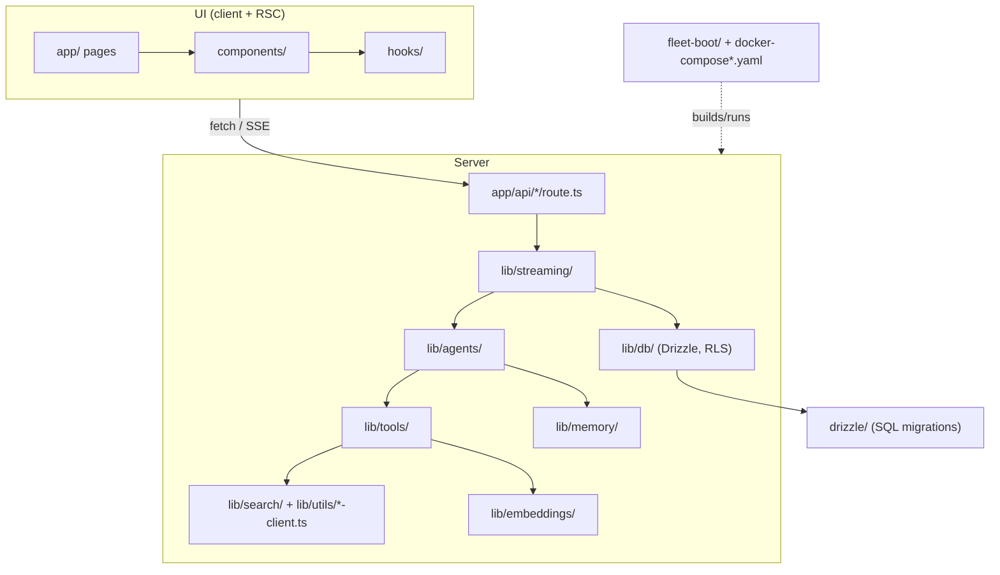

# Repo tour

A directory-by-directory map of the Ask repository (as checked out in any of the three
worktrees). Paths are repo-relative. For the request flow that ties these together, see
[Overview](/getting-started/overview).

## Top level

| Path | What it is |
|---|---|
| `app/` | Next.js App Router: pages, layouts, API route handlers. |
| `components/` | React components (chat UI, sidebar, settings, voice, `ui/` primitives). |
| `hooks/` | Client hooks (voice dictation, speech playback, weather, file dropzone, …). |
| `lib/` | All server and shared logic, organised by concern (below). |
| `drizzle/` | SQL migrations + `schema.ts`/`relations.ts` snapshots and `meta/` journal. The app's source-of-truth schema is `lib/db/schema.ts`. |
| `fleet-boot/` | Operational scripts: rebuild/reclaim, boot reconcile, cron jobs, VPN rotation. See [Runbooks](/operations/runbooks). |
| `scripts/` | Dev/one-off scripts: chat CLI, backfills, the eval harness. |
| `docs/` | Older hand-written docs (`CONFIGURATION.md`, `DOCKER.md`, build reports) and `docs/superpowers/{specs,plans}` — ~50 design specs and implementation plans, including negative results. |
| `docs-site/` | This documentation site (VitePress). Excluded from the Ask image by `.dockerignore`. |
| `selfhosted/` | Companion apps shipped in the repo but **not** in the Ask image: `model-manager/` and `reranker/`. |
| `config/models/cloud.json` | Model list used only when `MORPHIC_CLOUD_DEPLOYMENT=true` (not the self-hosted path). |
| `public/` | Static assets (provider icons, images). |
| `Dockerfile` | Two-stage build (`node:22-slim` + bun 1.3.14). The runtime entrypoint runs `bun run migrate` **then** `next start`; a failing migration stops the container from booting. |
| `docker-compose.yaml` | **Prod** stack (`name: ask-stack`): `ask`, `postgres`, `redis`, `searxng`. Also the base every overlay builds on. |
| `docker-compose.admin-feature.yaml` | Staging overlay (`ask-stack-admin-feature`). |
| `docker-compose.lab.yaml` | Lab overlay (`ask-stack-lab`), incl. shell-settable A/B toggles and `ask-tts-lab`. |
| `docker-compose.vpn*.yaml` | VPN overlays: add a gluetun (Mullvad WireGuard) container per stack and move SearXNG into its network namespace. |
| `searxng-settings*.yml`, `searxng-limiter.toml` | Bind-mounted SearXNG config (prod/lab share `searxng-settings.yml`; staging has its own). |
| `gluetun-auth.toml` | Gluetun control-server auth config (needed by `fleet-boot/rotate-mullvad.sh`). |
| `next.config.mjs` | Next config incl. security headers (`Permissions-Policy` must keep `geolocation=(self)` and `microphone=(self)`). |
| `proxy.ts` | Next 16 request proxy (formerly middleware): Supabase session refresh + forwarded-host handling. |
| `instrumentation.ts` | OpenTelemetry/Langfuse registration and Ollama validation at server start. |
| `vitest.config.mts`, `vitest.setup.ts` | Test config (jsdom, aliases, `server-only` stub). |
| `AGENTS.md`, `CLAUDE.md` | Contributor notes carried over from upstream plus local conventions. |

## `app/`

| Path | Contents |
|---|---|
| `app/page.tsx`, `app/layout.tsx` | Homepage (composer, headline, Discover preview) and root layout. |
| `app/search/page.tsx`, `app/search/[id]/page.tsx` | Chat view. `[id]` loads the conversation with `loadChatUncached` — the cached loader can serve a stale snapshot right after a turn. |
| `app/library/`, `app/discover/` | Library (chats, notes, files) and Discover pages. |
| `app/auth/*` | Supabase auth pages (login, sign-up, OAuth, password reset). |
| `app/uploads/[...path]/route.ts` | Serves uploaded/generated files (optional signed URLs). |

### `app/api/` (route handlers)

| Route | Purpose |
|---|---|
| `chat/route.ts` | **Main turn endpoint** (POST). |
| `chat/[chatId]/stream` | GET — resume an in-flight stream (204 if none). |
| `chat/[chatId]/stop` | POST — stop a generation. |
| `chat/[chatId]/messages` | GET — owner-only, uncached reload of a conversation. |
| `chats/`, `chats/search` | Sidebar history and search (pg_trgm). |
| `advanced-search/route.ts` | The search pipeline: fan-out → crawl → filter → rerank. Bearer-token gated (`INGEST_API_TOKEN`), called by the `search` tool. |
| `upload/`, `files/status` | Uploads and ingest status polling. |
| `ingest/{claim,progress,complete,file/[id]}` | Pull-queue API for the external ingestor worker. |
| `maintenance/expire-uploads` | Upload TTL sweep (driven by cron, see [Runbooks](/operations/runbooks)). |
| `memory/{consolidate,recall-backfill}` | Memory maintenance endpoints. |
| `voice/{speak,transcribe}` | TTS / STT proxies. |
| `warm` | Demand-triggered GPU warm-up while the user is typing. |
| `weather`, `geocode`, `geolocate`, `discover`, `quotes`, `feedback` | Widgets and small features. |
| `health` | Liveness only (does not touch Postgres/Redis) — used by the Docker healthcheck. |

The generated [API routes reference](/reference/api-routes) lists methods and auth for each.

## `components/`

| Path | Contents |
|---|---|
| `chat.tsx` | The chat client: `useChat`, resumable transport, Stop, refresh rules. |
| `chat-panel.tsx` | Composer (attachments, mode/source selectors, voice). |
| `render-message.tsx`, `answer-section.tsx`, `research-process-section.tsx`, `*-section.tsx` | Message rendering: answer, tool steps, sources, reasoning pill. |
| `citation-*.tsx`, `source-favicons.tsx`, `search-results*.tsx` | Citations and source cards. |
| `sidebar/` | Recent-chats sidebar (`recent-time.ts` handles viewer-timezone rendering). |
| `settings/`, `settings-dialog.tsx` | Settings incl. the memory tab. |
| `voice/` | Mic button, recording bar, speak button, waveform. |
| `library/`, `inspector/`, `artifact/` | Library panel, inspector drawer, artifact views. |
| `ui/` | shadcn/Radix primitives plus the animated logo (`wild-breath-*`, `animated-logo.tsx`). |
| `__tests__/` | Component tests. |

## `hooks/`

`use-voice-dictation.ts`, `use-speech-playback.ts`, `use-weather.ts`,
`use-file-dropzone.ts`, `use-keyboard-shortcut.ts`, `use-mobile.tsx`,
`use-typewriter-cycle.ts`, auth/user helpers. (`lib/hooks/` holds two more generic hooks.)

## `lib/`

| Folder | What lives there | Key files |
|---|---|---|
| `agents/` | The answering agent and helper LLM calls | `researcher.ts` (ToolLoopAgent, turn modes), `query-classifier.ts` (skipSearch + fused expansion), `query-expander.ts` (fallback), `title-generator.ts`, `memory-extractor.ts`, `answer-deadline.ts`, `flows/` (lab-only flow variants), `prompts/` |
| `streaming/` | Turn orchestration and stream plumbing | `create-chat-stream-response.ts`, `create-ephemeral-chat-stream-response.ts` (guests), `active-generations.ts` (Stop registry), `resumable-stream-context.ts`, `resumable-chat-transport.ts`, `helpers/` (persist, narration stripping, stopped-message sanitising, doc-source budgeting) |
| `tools/` | Tools the agent can call | `search.ts` + `search/` (providers, merges, intent, telemetry), `fetch.ts`, `recall.ts`, `remember.ts`, `generate-image.ts`, `weather.ts`, `calculate.ts`, `todo.ts`, `question.ts` |
| `search/` | Pipeline pieces used by `advanced-search` | `quality-content.ts`, `snippet-gate.ts`, `build-excerpt.ts`, `crop-position.ts`, `engine-health*.ts`, `basic-search-cache.ts`, `brave-budget.ts`, `rehydrate-full-content.ts` |
| `embeddings/` | Rerank, embeddings, upload/URL RAG | `rerank.ts`, `transformers-embedding.ts`, `passage-budget.ts`, `split-text.ts`, `upload-rag.ts`, `url-rag.ts` |
| `memory/` | Long-term memory and conversation recall | `recall-index.ts`, `recall-search.ts`, `recall-inject.ts`, `inject.ts`, `write.ts` |
| `db/` | Drizzle schema, RLS, queries | `schema.ts`, `with-rls.ts`, `index.ts`, `migrate.ts`, `actions.ts`, `file-actions.ts`, `keyword-search.ts` |
| `actions/` | Server actions (chat, memory, notes, recall, model preference, account) | `chat.ts` (`loadChat`/`loadChatUncached`) |
| `utils/` | Service clients and shared utilities | `registry.ts` (model providers), `model-selection.ts`, `ollama-think.ts`, `searxng-client.ts`, `crawl4ai.ts`, `cross-encoder.ts`, `degoog-client.ts`, `brave/tavily/langsearch/ollama-search-client.ts`, `flaresolverr.ts`, `ssrf-guard.ts`, `safe-url.ts`, `safe-redirect.ts`, `ingest-auth.ts`, `ingest-heartbeat.ts`, `local-llm-host.ts` |
| `config/` | Model and mode configuration | `default-model.ts`, `search-modes.ts`, `source-modes.ts`, `upload-allowlist.ts`, `ollama-validator.ts` |
| `auth/` | Current-user resolution, cron auth | `get-current-user.ts` |
| `supabase/` | Supabase clients and session middleware | |
| `telemetry/` | Latency log store and stage timers | `latency-store.ts`, `stage-timer.ts` (see [Telemetry](/operations/telemetry)) |
| `imagegen/` | Replicate image generation: registry, budget, rotation, retry escalation | `registry.ts`, `models/*.json` |
| `voice/` | TTS/STT clients, spoken-gist generation | |
| `warm/` | Demand-warm request builder and client trigger | |
| `rate-limit/` | Guest, chat and adaptive rate limits | |
| `render/` | Generative-UI spec blocks (json-render) | |
| `storage/` | R2/S3 client and upload URL signing | |
| `analytics/` | PostHog event tracking | |
| `quotes/`, `wild-breath/`, `firecrawl/`, `ollama/`, `models/`, `model-selector/`, `contexts/`, `schema/`, `types/`, `constants/`, `errors/`, `hooks/` | Smaller supporting modules | |

## `drizzle/`

Numbered SQL migrations `0000_…` through `0021_pg_trgm_search_indexes.sql`, applied in
order by `bun run migrate` (drizzle-orm migrator, `migrationsFolder: 'drizzle'`) at every
container start. There are no down-migrations. See [Data layer](/infrastructure/data-layer)
and [Deploy › Migrations](/operations/deploy#migrations-at-boot).

## `fleet-boot/`

| Script | Role |
|---|---|
| `rebuild-ask.sh {prod\|staging\|lab}` | Build + recreate + health-wait + reclaim for one stack. **The** deploy command. |
| `reclaim-space.sh` | Prune all unused build cache + dangling images (never `-a`, never volumes/containers). |
| `ask-fleet-boot.sh` + `ask-fleet-boot.service` | Host-aware boot reconcile (systemd oneshot) — app stacks, VPN sidecars, GPU services, model warm-up. |
| `deploy.sh` | Pushes the boot script + unit to `.17`, `.160`, `.171` (not `.231`). |
| `docker-maintenance.sh` | Daily 04:30 cron: dangling-image prune, 7-day builder prune, disk warning, btree `amcheck`. |
| `expire-uploads-daily.sh` | Daily 04:15 cron: calls `/api/maintenance/expire-uploads` on all three stacks. |
| `rotate-mullvad.sh`, `rotate-daily.sh` | Mullvad exit-IP rotation (manual verbs / daily 05:00 cron). |
| `update-ollama-fleet.sh`, `update-ollama.sh` | Weekly (Sun 03:30) Ollama upgrade on every host + re-pin resident models. |
| `update-images.sh`, `update-public-search.sh`, `fleet-update-public-search.*` | Pull + recreate third-party images (public search stacks weekly). |
| `check-crawl4ai-version.sh` | Notify-only check for a newer crawl4ai release. |
| `create-app-user.sh` | Create the restricted `app_user` Postgres role for a stack. |
| `keep-warm.sh`, `gpu-idle-log.sh` | Legacy 24/7 GPU keep-warm (superseded by `/api/warm`) and a P-state sampler. |
| `degoog-engine-watchdog.py` | Suspends/restores degoog engines that upstream is blocking. |

## `scripts/`

| Path | Purpose |
|---|---|
| `chat-cli.ts` | Terminal client for `/api/chat` (`bun run chat`). |
| `eval/` | Answer-quality harness: `run-eval.ts` (pairwise judge), `mine-questions.ts`, lab flow-arm runners (`run-flow-arms.py`, `run-flow-conversations.py`, `judge-flow-arms.py`), classifier evals, committed `results/`. See [Testing & QA](/operations/testing-qa). |
| `backfill-embeddings.ts`, `backfill-file-object-keys.ts`, `clean-narration-preambles.ts` | One-off data backfills. |
| `test-cache-performance.ts` | Ad-hoc cache benchmark. |

## `selfhosted/`

| Path | What it is |
|---|---|
| `selfhosted/model-manager/` | Standalone Next.js app (**Ask Model Manager**) to edit prod's `.env` with automatic backups and apply with a recreate. Own compose file, runs as container `model-manager` on `127.0.0.1:3939`. Effectively root on the host (Docker socket + repo RW) — LAN/loopback only. The running instance is built from the **staging** worktree's copy (`/home/nightfury/selfhosted/ask/selfhosted/model-manager`) but is wired to manage the prod worktree. |
| `selfhosted/reranker/` | FastAPI cross-encoder service source. The deployed reranker is the separate directory `/home/nightfury/selfhosted/reranker-qwen` on .17, whose `app.py` differs from this copy — treat the out-of-repo directory as what runs. |

## Outside the repo (but part of the system)

These live beside the worktrees under `/home/nightfury/selfhosted/` and are not built
from this repo:

| Directory | What |
|---|---|
| `ingestor/` | Async upload-processing worker (office/media/image extraction; images via `qwen3-vl:4b`). Three instances: `ingestor`, `ingestor-staging`, `ingestor-lab`. |
| `reranker-qwen/` | Deployed cross-encoder reranker (`:8787`). |
| `whisper/` | Whisper STT (speaches) on `:8788`. |
| `degoog/` | Per-env degoog scraper stacks (currently stopped and disabled). |
| `embedder/` (on .160) | GPU embedding service. |
| `crawl4ai/` (on .231) | crawl4ai stack + `memory-watchdog.sh`. |
