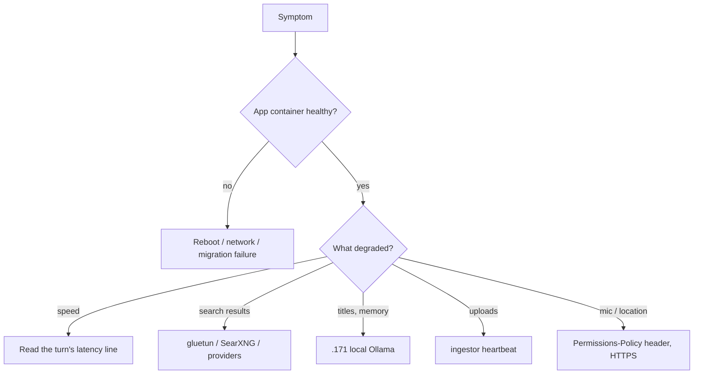

# Troubleshooting FAQ

A symptom-first index. Each entry gives the **first check** (the quickest command or fact that
tells you which branch you are on) and links to the page that holds the full procedure. The
playbooks themselves live in [Runbooks](/operations/runbooks) and the open problems in
[Known issues](/history/known-issues); this page does not repeat them.

::: tip General rules before debugging
- Read logs and telemetry; never fire test searches to "see if search works"
  ([why](/operations/testing-qa#no-live-search-probing)).
- Check what the running container really has (`docker exec <container> printenv VAR`, masking
  secrets), not the code default or `.env` ([overlay trap](/history/known-issues#overlay-pinned-env-vars-beat-env)).
- Log locations for every component are in [Runbooks › Reading logs](/operations/runbooks#reading-logs).
:::

Containers: prod `ask`, staging `ask-admin-feature`, lab `ask-lab` (see
[Environments](/operations/environments)). Commands below use prod; substitute as needed.

## The app is down or crash-looping

### Prod crash-loops after a host reboot

**First check.** `docker logs --tail 30 ask` shows `getaddrinfo ENOTFOUND` during
`Running database migrations...`, and
`docker inspect ask --format '{{range $k,$v := .NetworkSettings.Networks}}{{$k}} {{end}}'`
lists only `shared-infra`.

The container was recreated on the wrong network and cannot resolve `postgres`. A plain
`up -d` does not fix it; stop it and `--force-recreate` with the full compose file set.
→ [Runbooks › Host reboot strands prod on the wrong network](/operations/runbooks#host-reboot-strands-prod-on-the-wrong-network)

### Nothing came back at all after a reboot

**First check.** Is the Windows host sitting at the login screen? The app host relies on
auto-login so Docker Desktop can start. Then read the boot reconcile:
`journalctl -u ask-fleet-boot.service -b -o cat`.
→ [Runbooks › What automation already exists](/operations/runbooks#what-automation-already-exists),
[Known issues › Boot and power-loss fragilities](/history/known-issues#boot-and-power-loss-fragilities),
[Fleet scripts](/operations/fleet-scripts)

### The container restarts right after a deploy

**First check.** `docker logs --tail 50 ask` — anything other than `Migrations completed
successfully` followed by Next.js `Ready` is a boot failure. The boot migration is fail-hard: a
migration that errors (for example a non-`CONCURRENTLY` index build that should have been
pre-applied) keeps the app down.
→ [Deploy › Migrations at boot](/operations/deploy#migrations-at-boot),
[Deploy › Rollback](/operations/deploy#rollback), [Recipes](/getting-started/recipes)

### Builds fail with "no space left on device"

**First check.** `df -h /` and `docker system df`. Run `fleet-boot/reclaim-space.sh` first; it
only removes unused build cache and dangling images.
→ [Runbooks › Disk full / reclaiming space](/operations/runbooks#disk-full-reclaiming-space)

## Answers

### Answers are slow

**First check.** Find the turn's `[latency]` line
(`docker logs --since 1h ask 2>&1 | grep '\[latency'`) and split `total_ms` into pre-work,
tools, waiting for the answer and writing. Compare against the reference numbers for the same
mode, not against a different mode.

- `crawl_ms` / `slowest_chunk_ms` huge → crawl4ai on .231 is saturated
  ([runbook](/operations/runbooks#crawl4ai-memory-saturation-slow-retrieval)).
- First turn after an Ollama restart slow → the model is not resident
  ([runbook](/operations/runbooks#ollama-model-not-resident-after-a-restart)).
- `recall_budget_hit:true` on most turns → [known issue](/history/known-issues#recall-is-dropped-on-most-turns).
- Large `last_prompt_tokens` or many `fetch` calls → pipeline levers, not a model swap.

→ [Telemetry › Diagnosing "slow answers", step by step](/operations/telemetry#diagnosing-slow-answers-step-by-step)

### No search results, or answers without sources

**First check.** `docker ps -a --format '{{.Names}}\t{{.Status}}' | grep -E 'gluetun|searxng'`.
If `ask-gluetun` is `Exited` or SearXNG has no network, quality-mode searches come back empty
while balanced/speed still answer (they do not use SearXNG). Bring gluetun and searxng up
**together**; do not `docker restart ask-gluetun` alone.

If the sidecars are fine but many engines are skipped: Ask suspends an engine by name after
repeated errors, with a 30-minute cooldown by default (`DEFAULT_COOLDOWN_MS`,
`lib/search/engine-health.ts:45`). Rotating the exit with `--clear-health` clears them.

On builds before the lab fix, a SearXNG failure also discarded every other provider's results
([known issue](/history/known-issues#searxng-failure-empties-a-quality-search)).
→ [Runbooks › Search dead after boot](/operations/runbooks#search-dead-after-boot-gluetun-searxng-vpn-sidecar-down),
[Search pipeline](/search/pipeline), [Fleet scripts](/operations/fleet-scripts) (`rotate-mullvad.sh`)

### The answer keeps spinning, or Stop does nothing

**First check.** A turn is hard-capped at 300 s (`GENERATION_TIMEOUT_MS`,
`app/api/chat/route.ts:36`). Press Stop, then reload; the client reattaches or reloads the
saved conversation.
→ [Runbooks › A stuck chat](/operations/runbooks#a-stuck-chat),
[Streaming › Stop](/request-lifecycle/streaming#stop)

### A selected model errors immediately

**First check.** For an Ollama Cloud model, an HTTP 402 in `docker logs ask` means the model is
billed as extra usage and the balance is empty. `/api/show` resolving proves nothing; only a
real generation does.
→ [Models & reasoning › Model roster](/search/models-reasoning#model-roster)

### A user still gets a model that was removed from the list

By design: a saved per-user pick outranks the default, and delisting does not migrate anyone.
Read `modelId` from the `[latency]` line to see what really ran.
→ [Known issues › Delisted model picks keep being used](/history/known-issues#delisted-model-picks-keep-being-used)

### Reasoning text appears in an answer, or flashes while streaming

→ [Known issues › Chain-of-thought flash in the live stream](/history/known-issues#chain-of-thought-flash-in-the-live-stream),
[Old answers with leaked reasoning stay leaked](/history/known-issues#old-answers-with-leaked-reasoning-stay-leaked),
[Models & reasoning › Narration and chain-of-thought leak handling](/search/models-reasoning#narration-and-chain-of-thought-leak-handling)

### Citations missing or pointing nowhere

The model sometimes invents citation anchors; the UI drops them, so the claim ends up uncited.
Check `citations_unresolved` (and `citations_recovered`) on the turn's `[latency]` line. Three
pipeline causes were fixed on 2026-09-24; a rate that stays high on live turns is worth a look.
→ [Known issues › Unresolved citations](/history/known-issues#unresolved-citations)

## Titles, memory and recall

### Chat titles are missing, or just the first words of the question

**First check.** `curl -s -m5 http://192.168.50.171:11434/api/ps` from the app host, and
`docker logs --since 1h ask 2>&1 | grep 'Error generating chat title'`.

Titles are written by a local model on Serenity (.171), `granite4.2:8b` by default
(`lib/agents/title-generator.ts:32`), with an 8 s timeout. On any failure the generator returns
the first 75 characters of the user's message (`lib/agents/title-generator.ts:69`,
`lib/agents/title-generator.ts:149`). So a "title that is the question" means .171 was
unreachable, not that titling is broken. `ECONNREFUSED` usually means Ollama is listening on
loopback only.
→ [Runbooks › A fleet service on .171 / .160 / .231 is unreachable](/operations/runbooks#a-fleet-service-on-171-160-231-is-unreachable),
[Known issues › Serenity Ollama bound to loopback](/history/known-issues#serenity-ollama-bound-to-loopback)

### Ask does not remember things, or past chats are never recalled

Long-term memory extraction uses the same .171 model as titles (check it first, as above).
Recall depends on the embedder on .160 and the reranker on .17; both fail open to empty results.
Memory consolidation runs nightly at 03:45 from the .17 crontab (since 2026-09-24); its log is
`~/.local/state/fleet-boot/memory-consolidate.log`.
→ [Memory & recall](/knowledge/memory-recall),
[Known issues › Memory consolidation never runs](/history/known-issues#memory-consolidation-never-runs)

## Uploads

### Uploads stay "processing", or the answer says file processing is down

**First check.** `docker exec ask-redis redis-cli TTL ingest:heartbeat`. A positive TTL means a
worker polled within the last minute; `-2` means no worker is alive for that environment. Then
`docker ps | grep ingestor` and `docker logs --since 30m ingestor`.

The answer path waits at most `INGEST_WAIT_TIMEOUT_MS` (default 30000) and gives up after
`INGEST_WAIT_UNCLAIMED_MS` (default 8000) if nobody claimed the job
(`lib/streaming/helpers/transform-file-parts.ts:73-75`). Image OCR can legitimately take ~90 s
per image. Each environment has its own ingestor.
→ [Runbooks › A stuck chat](/operations/runbooks#a-stuck-chat) (upload paragraph),
[RAG & uploads › Worker liveness](/knowledge/rag-uploads#worker-liveness-heartbeat-and-ingest-unavailable),
[Ingestor](/knowledge/ingestor),
[Known issues › Ingest wait and ingestor single point of failure](/history/known-issues#ingest-wait-and-ingestor-single-point-of-failure)

## Browser features

### Weather widget shows the wrong city, or never asks for location

**First check.** `curl -sI https://ask.hbqnexus.win/ | grep -i permissions-policy` must contain
`geolocation=(self)` (`next.config.mjs:53`). With `geolocation=()` the widget silently falls
back to IP geolocation. LAN clients on IP fallback see the host's own city, which is expected.
→ [Media › Permissions-Policy must allow mic and geolocation](/knowledge/media#permissions-policy-must-allow-mic-and-geolocation),
[Media › Weather widget](/knowledge/media#weather-widget)

### Mic button does nothing

Check, in order:

1. The same header must contain `microphone=(self)`.
2. The page must be a secure context: `getUserMedia` fails on plain-HTTP LAN URLs such as
   `http://192.168.50.17:3742`. Test on the HTTPS prod URL.
3. The very first hold on a new origin only triggers the permission prompt.
4. The voice UI missing entirely means `NEXT_PUBLIC_VOICE_ENABLED` was not in the worktree's
   `.env` at build time (it is inlined); a 404 from `/api/voice/transcribe` means
   `VOICE_ENABLED` is not `true` on the server (`lib/voice/config.ts:8`).
5. Is `ask-whisper` (.17:8788) up?

→ [Media › Dictation (Whisper STT)](/knowledge/media#dictation-whisper-stt), [Media › Voice](/knowledge/media#voice)

### Read-aloud is silent

The TTS service `ask-tts` (.17:8890) returns 503 through the app when it is down; text chat is
unaffected. → [Media › Read-aloud (Kokoro TTS)](/knowledge/media#read-aloud-kokoro-tts)

### Layout problems on phones

Desktop browser resizing does not emulate a phone; use Playwright on the lab.
→ [Testing & QA › Mobile / responsive QA with Playwright](/operations/testing-qa#mobile-responsive-qa-with-playwright),
[Known issues › Mobile keyboard / composer on real devices](/history/known-issues#mobile-keyboard-composer-on-real-devices)

### Sign-in or account problems

→ [Auth & accounts](/request-lifecycle/auth-and-accounts), [Security › Authentication](/infrastructure/security#authentication)

## Configuration and deploys

### An env change had no effect

**First check.** `docker exec <container> printenv VAR` (mask values).

- Not recreated → `up -d --force-recreate` the app service.
- An overlay's `environment:` block pins the old value → edit the overlay in the worktree that
  environment builds from.
- `NEXT_PUBLIC_*` → build-time value; rebuild.
- Prod model and flag values → change them through the Model Manager, then recreate.

→ [Local dev › Common pitfalls](/getting-started/local-dev#common-pitfalls),
[Deploy › Env-only changes](/operations/deploy#env-only-changes),
[Model Manager](/infrastructure/model-manager)

### A change works on the lab but not on staging/prod

Each environment builds from its own worktree and branch; the change has to be cherry-picked and
that stack rebuilt. Untracked files in a worktree also ship in its image.
→ [Deploy](/operations/deploy), [Recipes](/getting-started/recipes)

### A tool the model should not call still gets called

`activeTools` only advertises tools; the AI SDK executes against the full `tools` map. Withhold
the tool from the map to block it.
→ [Models & reasoning › `activeTools` does not block a tool](/search/models-reasoning#activetools-does-not-block-a-tool)

### Unit tests time out or fail on the host

→ [Testing & QA › Pre-existing failures](/operations/testing-qa#pre-existing-failures),
[Known issues › Pre-existing test failures](/history/known-issues#pre-existing-test-failures)

## Fleet

### A GPU host service is unreachable

**First check.** Run `fetch` from inside the app container, then `ping` and `curl` from the host.
If `ping` fails, the box or its WSL VM is down; if you get `ECONNREFUSED`, the service is
listening on loopback or is stopped.
→ [Runbooks › A fleet service on .171 / .160 / .231 is unreachable](/operations/runbooks#a-fleet-service-on-171-160-231-is-unreachable),
[Fleet](/infrastructure/fleet), [Services](/infrastructure/services)

### Old Ask containers reappear on .231

→ [Runbooks › Retired stacks on .231](/operations/runbooks#retired-stacks-on-231),
[Fleet scripts](/operations/fleet-scripts) (`deploy.sh`)

### degoog looks orphaned

It is not: it serves human users on :4444 and must not be decommissioned.
→ [Runbooks › degoog](/operations/runbooks#degoog)
