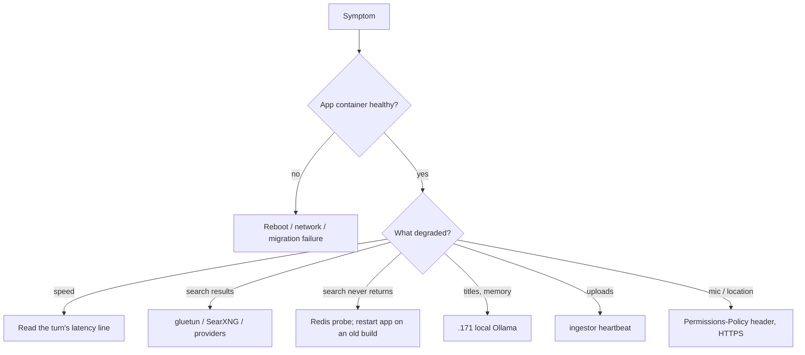

# Troubleshooting FAQ

A symptom-first index. Each entry gives the **first check** (the quickest command or fact that
tells you which branch you are on) and links to the page that holds the full procedure. The
playbooks themselves live in [Runbooks](/operations/runbooks) and the open problems in
[Known issues](/history/known-issues); this page does not repeat them.

::: tip General rules before debugging
- Read logs and telemetry; never fire test searches to "see if search works"
  ([why](/operations/testing-qa#no-live-search-probing)).
- Check what the running container really has (`docker exec <container> printenv VAR`, masking
  secrets), not the code default or `.env` ([overlay trap](/history/known-issues#overlay-pinned-env-vars-beat-env)).
- Log locations for every component are in [Runbooks › Reading logs](/operations/runbooks#reading-logs).
:::

Containers: prod `ask`, staging `ask-admin-feature`, lab `ask-lab` (see
[Environments](/operations/environments)). Commands below use prod; substitute as needed.


```mermaid
flowchart TD
  S[Symptom] --> A{App container healthy?}
  A -- no --> R[Reboot / network / migration failure]
  A -- yes --> B{What degraded?}
  B -- speed --> L[Read the turn's latency line]
  B -- search results --> V[gluetun / SearXNG / providers]
  B -- search never returns --> RD[Redis probe; restart app on an old build]
  B -- titles, memory --> O[.171 local Ollama]
  B -- uploads --> I[ingestor heartbeat]
  B -- mic / location --> P[Permissions-Policy header, HTTPS]
```

## The app is down or crash-looping

### Prod crash-loops after a host reboot

**First check.** `docker logs --tail 30 ask` shows `getaddrinfo ENOTFOUND` during
`Running database migrations...`, and
`docker inspect ask --format '{{range $k,$v := .NetworkSettings.Networks}}{{$k}} {{end}}'`
lists only `shared-infra`.

The container was recreated on the wrong network and cannot resolve `postgres`. A plain
`up -d` does not fix it; stop it and `--force-recreate` with the full compose file set.
→ [Runbooks › Host reboot strands prod on the wrong network](/operations/runbooks#host-reboot-strands-prod-on-the-wrong-network)

### Nothing came back at all after a reboot

**First check.** Is the Windows host sitting at the login screen? The app host relies on
auto-login so Docker Desktop can start. Then read the boot reconcile:
`journalctl -u ask-fleet-boot.service -b -o cat`. On the WSL hosts it starts about 75 s after
boot (from `fleet-boot.timer`), so an empty journal right after a reboot is normal; if it stays
empty, check `systemctl is-enabled fleet-boot.timer`.
→ [Runbooks › What automation already exists](/operations/runbooks#what-automation-already-exists),
[Known issues › Boot and power-loss fragilities](/history/known-issues#boot-and-power-loss-fragilities),
[Fleet scripts](/operations/fleet-scripts)

### A WSL host never finishes booting

**First check.** In the distro (SSH usually still works): `systemd-analyze` prints "Bootup is
not yet finished" and `docker info` fails. Then `ls /etc/systemd/system/multi-user.target.wants/`
for a unit that waits for Docker; `systemctl is-enabled ask-fleet-boot.service` must be
`disabled` on .17, .160 and .171.

Docker Desktop attaches to WSL only after boot finishes, so a Docker-waiting unit enabled at boot
deadlocks it. Disable the unit, then `wsl --shutdown` and restart Docker Desktop from Windows.
→ [Runbooks › WSL host hangs at boot](/operations/runbooks#wsl-host-hangs-at-boot),
[D41](/history/decisions#d41-on-wsl-hosts-nothing-that-waits-for-docker-is-enabled-at-boot)

### The container restarts right after a deploy

**First check.** `docker logs --tail 50 ask` — anything other than `Migrations completed
successfully` followed by Next.js `Ready` is a boot failure. The boot migration is fail-hard: a
migration that errors (for example a non-`CONCURRENTLY` index build that should have been
pre-applied) keeps the app down.
→ [Deploy › Migrations at boot](/operations/deploy#migrations-at-boot),
[Deploy › Rollback](/operations/deploy#rollback), [Recipes](/getting-started/recipes)

### Builds fail with "no space left on device"

**First check.** `df -h /` and `docker system df`. Run `fleet-boot/reclaim-space.sh` first; it
only removes unused build cache and dangling images.
→ [Runbooks › Disk full / reclaiming space](/operations/runbooks#disk-full-reclaiming-space)

## Answers

### Answers are slow

**First check.** Find the turn's `[latency]` line
(`docker logs --since 1h ask 2>&1 | grep '\[latency'`) and split `total_ms` into pre-work,
tools, waiting for the answer and writing. Compare against the reference numbers for the same
mode, not against a different mode.

- `crawl_ms` / `slowest_chunk_ms` huge → crawl4ai on .231 is saturated
  ([runbook](/operations/runbooks#crawl4ai-memory-saturation-slow-retrieval)).
- First turn after an Ollama restart slow → the model is not resident
  ([runbook](/operations/runbooks#ollama-model-not-resident-after-a-restart)).
- `recall_budget_hit:true` on most turns → [known issue](/history/known-issues#recall-is-dropped-on-most-turns);
  on some turns, usually while another turn searches → the
  [rerank contention limit](/history/known-issues#recall-misses-the-budget-under-rerank-contention)
  (expected, harmless).
- Large `last_prompt_tokens` or many `fetch` calls → pipeline levers, not a model swap.

→ [Telemetry › Diagnosing "slow answers", step by step](/operations/telemetry#diagnosing-slow-answers-step-by-step)

### Answers got slower after 2026-09-26

**First check.** Is the slow turn a forced search? `forced_search:true` on its `[latency]` line
means yes.

That is the intended cost of "every question gets a web search"
([D37](/history/decisions#d37-always-search-every-question)). Questions that used to be answered
from memory (settled concepts, how-tos, follow-ups that confirm or choose) now wait for a search
first. On the lab their first prose arrived about 7–20 s later (median about 3 s → 21 s in the
A/B). Measure time to first prose with `stream["text-start"]`, **not** `ttft_ms`: on a forced turn
`ttft_ms` covers only the pre-work, so it looks faster than before. If the extra time is inside
the search itself (`search_ms`, `crawl_ms`, `rerank_ms`), use "Answers are slow" above.

**Revert switch.** Set `ALWAYS_SEARCH=off` in that env's `.env` (the Model Manager's Search tab
has an "Always search" switch for prod; it writes `on`/`off`) and force-recreate `ask` (no
rebuild); confirm with `docker exec ask printenv ALWAYS_SEARCH`. That restores the old classifier prompt and the `stable-knowledge` gate exactly,
and with them the ungrounded answers D37 was made to stop. It is an owner decision, not an
operator default.
→ [Recipes › Add an env flag](/getting-started/recipes#add-an-env-flag) (apply step),
[D3](/history/decisions#d3-needssources-skip-retrieval-for-stable-knowledge)

### Ask did not search my question

**First check.** The turn's `[latency]` line
(`docker logs ask 2>&1 | grep '<chatId>' | grep '\[latency\]'`): read `turn_mode` and
`forced_search`.

| `turn_mode` / `forced_search` | Meaning | Next step |
|---|---|---|
| `direct` / `false` | The classifier judged the message **not a question** (`skipSearch`): a greeting, thanks, venting, a pure rewrite/translate/summarise of text already in the chat, arithmetic, an image request, an explicit remember/forget instruction | Expected for those. A real question here is a classifier miss: press **Retry** (regenerate bypasses the classifier and force-searches the raw message) and keep the example for the classifier prompt (`CLASSIFIER_SYSTEM_PROMPT`, `lib/agents/query-classifier.ts:234`) |
| `research` / `true` | A search did run at step 0 | Look for the chat's `[latency:search]` lines. Empty or irrelevant results are answered without citations on purpose. See "No search results" below |
| `research` / `false` | The user supplied the source: `forced_skip` says `url` (a URL in the text or a link chip), `attachment-only`, or `attachment-reference` (an attachment the text only points at, e.g. "what is this"). The model reads the page or attachment first and may still search. `forced_skip:null` means nothing searchable was left, or `ALWAYS_SEARCH=off` | Expected for a URL or attachment. Otherwise `docker exec ask printenv ALWAYS_SEARCH` |
| `stable-knowledge` | `ALWAYS_SEARCH=off` is set on that container | Intended only as a revert; see above |
| field missing | A line from before 2026-09-26, or a guest turn | Guest turns write no `[latency]` line: grep `[Researcher] always-search` in the logs |

An image with "what is this?" is not force-searched: the image is the subject, and the model
sees it. An image with a real question ("is this mushroom safe to eat?") is force-searched on
the words alone, so that first search can be generic
([known issue](/history/known-issues#image-attachment-forces-a-generic-search)).
→ [Telemetry › the per-turn line](/operations/telemetry#latency-the-per-turn-line),
[Models & reasoning › Turn modes](/search/models-reasoning#turn-modes)

### No search results, or answers without sources

**First check.** `docker ps -a --format '{{.Names}}\t{{.Status}}' | grep -E 'gluetun|searxng'`.
If `ask-gluetun` is `Exited` or SearXNG has no network, quality-mode searches come back empty
while balanced/speed still answer (they do not use SearXNG). Bring gluetun and searxng up
**together**; do not `docker restart ask-gluetun` alone.

If the sidecars are fine but many engines are skipped: Ask suspends an engine by name after
repeated errors, with a 30-minute cooldown by default (`DEFAULT_COOLDOWN_MS`,
`lib/search/engine-health.ts:45`). Rotating the exit with `--clear-health` clears them.

On builds before the lab fix, a SearXNG failure also discarded every other provider's results
([known issue](/history/known-issues#searxng-failure-empties-a-quality-search)).
→ [Runbooks › Search dead after boot](/operations/runbooks#search-dead-after-boot-gluetun-searxng-vpn-sidecar-down),
[Search pipeline](/search/pipeline), [Fleet scripts](/operations/fleet-scripts) (`rotate-mullvad.sh`)

### Answers never arrive / search spins for minutes

**First check.** Is it every balanced and quality question, while speed mode still answers? Run
the search-path Redis probe inside the app container (it PINGs Redis, fires no search):

```bash
docker exec ask node -e "fetch('http://127.0.0.1:3000/api/advanced-search',{headers:{authorization:'Bearer '+(process.env.INGEST_API_TOKEN||'')}}).then(async r=>console.log(r.status,await r.text()))"
```

`200 {"redis":"ok",…}` means Redis is not the cause. A `405` means a build from before
2026-09-27, whose Redis clients wedge for good when Redis restarts under them: if
`docker inspect -f '{{.State.StartedAt}}' ask-redis` is newer than the app's start, `docker
restart ask`. That was the 2026-09-27 incident, triggered by the Sunday image update; the homepage and
health checks stayed green throughout. On a current build a stuck search falls back to a basic
search after 20 s (`[search] advanced-search timed out` in the log) instead of spinning for
five minutes, and the Redis clients log `[redis:<label>] reconnected` by themselves.
→ [Runbooks › Search hangs after a Redis restart](/operations/runbooks#search-hangs-after-a-redis-restart),
[Telemetry › aborted turns](/operations/telemetry#aborted-turns-provider-stall-or-hung-tool)

### The answer keeps spinning, or Stop does nothing

**First check.** A turn is hard-capped at 300 s (`GENERATION_TIMEOUT_MS`,
`app/api/chat/route.ts:36`). Press Stop, then reload; the client reattaches or reloads the
saved conversation.
→ [Runbooks › A stuck chat](/operations/runbooks#a-stuck-chat),
[Streaming › Stop](/request-lifecycle/streaming#stop)

### A selected model errors immediately

**First check.** For an Ollama Cloud model, an HTTP 402 in `docker logs ask` means the model is
billed as extra usage and the balance is empty. `/api/show` resolving proves nothing; only a
real generation does.
→ [Models & reasoning › Model roster](/search/models-reasoning#model-roster)

### A user still gets a model that was removed from the list

By design: a saved per-user pick outranks the default, and delisting does not migrate anyone.
Read `modelId` from the `[latency]` line to see what really ran.
→ [Known issues › Delisted model picks keep being used](/history/known-issues#delisted-model-picks-keep-being-used)

### Reasoning text appears in an answer, or flashes while streaming

The model sometimes "thinks out loud" in the answer text: a status note before a tool call
("Let me search…", "Tôi cần đọc trang này…") or a preamble in front of the answer's heading,
sometimes glued to it ("…câu trả lời.## Title").

**First check.** Is the build older than 2026-09-28 (prod `48d5b06d`)? Older builds cleaned only
English phrasing, so non-English status notes were kept and a preamble glued to the heading showed
as "…sentence.## Title". Current builds clean both in any language, and apply the cleanup
whenever a message is shown, copied, spoken, fed back to the model or indexed, so old answers
display clean too.

If it still appears on a current build, match it to one of the cases left alone on purpose:

- **Narration before a proper heading on its own line** in a language other than English, or
  a long or list-shaped status note: kept by design
  ([known issue](/history/known-issues#narration-the-structural-rules-keep-by-design)).
- **An answer with no `## ` heading at all**: never cut, since there is no safe place to cut.
- **An outline plus notes about "cite strings", toolCallIds or a "spec block" in front of the
  answer** (glm-5.3-flash): a planning draft. Builds since 2026-10-06 (lab and staging; prod
  pending) cut it when the answer is glued to the last note; while the answer streams the draft
  is shown until enough of the answer has arrived
  ([known issue](/history/known-issues#a-planning-draft-shows-while-the-answer-streams)).
- **Only in search results or a recall excerpt**: the stored row still holds it. Staging and
  prod history was cleaned on 2026-09-28/29; an answer saved before a newer rule needs the
  backfill re-run ([runbook](/operations/runbooks#re-run-the-narration-backfill)).
- **A brief flash while streaming** that disappears after reload: the live transform is
  best-effort ([known issue](/history/known-issues#chain-of-thought-flash-in-the-live-stream)).
  An answer that appears a moment late, with no flash, is the glued-preamble case working as
  designed ([known issue](/history/known-issues#an-answer-with-a-glued-preamble-appears-late-while-streaming)).
  On a build older than prod `6e19914f` (2026-09-28), such an answer could stay blank until the
  whole answer had streamed.

A new shape outside these cases needs a rule plus tests in `lib/streaming/helpers/__tests__`.
→ [Models & reasoning › Narration and chain-of-thought leak handling](/search/models-reasoning#narration-and-chain-of-thought-leak-handling)

### An answer shows "[blocked]" after a citation or a link

**First check.** Is the build older than 2026-09-25 (prod `a9ad0ce8`)? On older builds a citation
cut off at the stream tail rendered as "1 [blocked]" for a moment, and an answer stopped in
the middle of a citation kept it permanently, even after a reload. Current builds drop the
unfinished anchor and show any unfinished link as plain text, so neither case should appear.

If it still appears on a finished answer, the model wrote a link whose `href` the sanitizer
removed (for example `javascript:` or another non-http scheme). That is the XSS defence working;
do not loosen the sanitize schema to hide it.
→ [Frontend › Half-streamed links and the "[blocked]" flash](/request-lifecycle/frontend#blocked-flash),
[Security › XSS pipeline](/infrastructure/security#xss-pipeline)

### Quality mode stops searching, skips a search, or a quality answer cites a snippet

**First check.** The turn's `[latency:search]` lines: a `kind:"round-cap"` line with
`search_round_budget:10` and `fetch_allowed:true` means the search cap was reached. That is by
design since 2026-09-30: after 10 searches a quality turn may still fetch pages it found (up to 8
fetch calls, `[fetch] fetch cap reached` in stdout). A citation that opens a search result whose
text (a snippet) does not hold the claim is an open issue: most such citations credit the wrong
page of the turn, or back a number the model assembled from several sources, rather than a page
of the same URL the turn fetched. `citations_snippet` on the turn's `[latency]` line counts
them. A "Skipped: near-duplicate" search is a repeat of one the turn already ran
(`[search-dedup] skipping … (exact)` or `(near, cos=…)` in stdout); since 2026-10-01 a search
that names a different product, number or facet is never skipped.
→ [Pipeline › round cap](/search/pipeline#round-cap),
[Known issues › snippet citations](/history/known-issues#citations-point-at-a-snippet-instead-of-the-fetched-page),
[Pipeline › dedup](/search/pipeline#round-cap)

### Citations missing or pointing nowhere

The model sometimes writes a citation anchor that resolves to nothing (an invented or copied
id, or a number past the end of that call's results); the UI drops it, so the claim ends up
uncited. Check `citations_unresolved` (and `citations_recovered`) on the turn's `[latency]` line.
Three pipeline causes were fixed on 2026-09-24, and copied placeholders and too-high numbers on
2026-09-26. Builds with the 09-26 fix also count out-of-range numbers as unresolved, so their
rate reads higher than older lines for the same answers
([telemetry](/operations/telemetry#tokens-citations-and-totals)). Since 2026-09-27 models copy a
ready-made citation from each result, so out-of-range numbers should be rare. The typical
leftover was an id copied with one character missing or cut short (`[1](#71cee5ba...)`); builds
since 2026-10-06 (lab, staging and prod) resolve both when the id names exactly one call
of the turn and count them in `citations_recovered`
([D44](/history/decisions#d44-shortened-and-one-character-off-citation-ids-resolve)). A rate
that stays high on live turns of one build is worth a look.
→ [Known issues › Unresolved citations](/history/known-issues#unresolved-citations),
[Citation placeholders and out-of-range numbers](/history/known-issues#citation-placeholders-and-out-of-range-numbers)

### A citation links to the wrong page of the right search

The chip opens a real source from the turn's search, but not the one the sentence came from.
The anchor is valid, so no counter sees it (`citations_unresolved` stays 0 for it). Diagnose by
reading the stored answer text next to that call's stored `results` order: `[N](#id)` renders
result N of call `id`.

**What changed on 2026-09-27** (prod `8878a42d`, `0ca166fe`):

- **Models no longer count.** The usual cause was a model numbering its sources as a running
  count across the answer: `[5](#<search id>)` meaning "my fifth source" rendered that search's
  **fifth result**. Every result the model sees now carries its finished citation (`cite`), and
  the prompts say to copy it. On the lab A/B this cut unsupported citations from 64.0 % to
  11.0 % (deepseek-v4.1-flash) and from 47.8 % to 18.7 % (kimi-k2.6). The ones left are mostly a
  real result cited for a claim it does not make, or the model's own knowledge given a citation.
  Check the container: `docker exec <container> printenv CITATION_HANDLES` must not print `off`.
- **Reloads no longer shift positions.** A speed-mode answer could cite correctly live and a
  different page after a reload, because the saved search list was the pre-dedup one. Answers
  saved before that fix keep their shifted list; nothing rewrites stored messages.

→ [Known issues › Running-count citation numbers](/history/known-issues#running-count-citation-numbers-can-point-at-the-wrong-result),
[Reloaded speed-mode answers cited a different page](/history/known-issues#reloaded-speed-mode-answers-cited-a-different-page),
[D38](/history/decisions#d38-ready-made-citation-handles)

## Titles, memory and recall

### Chat titles are missing, or just the first words of the question

**First check.** `curl -s -m5 http://192.168.50.171:11434/api/ps` from the app host, and
`docker logs --since 1h ask 2>&1 | grep 'Error generating chat title'`.

Titles are written by a local model on Serenity (.171), `granite4.2:8b` by default
(`lib/agents/title-generator.ts:32`), with an 8 s timeout. On any failure the generator returns
the first 75 characters of the user's message (`lib/agents/title-generator.ts:69`,
`lib/agents/title-generator.ts:152`). So a "title that is the question" means .171 was
unreachable, not that titling is broken. `ECONNREFUSED` usually means Ollama is listening on
loopback only.

A title like "Here is the short, concise title (4 words):" came from a build older than
2026-09-25. The generator now skips lines ending with `:` and strips a leading `Title:` label
(`lib/agents/title-generator.ts:113-117`). Titles already stored are not rewritten.
→ [Runbooks › A fleet service on .171 / .160 / .231 is unreachable](/operations/runbooks#a-fleet-service-on-171-160-231-is-unreachable),
[Known issues › Serenity Ollama bound to loopback](/history/known-issues#serenity-ollama-bound-to-loopback)

### Ask does not remember things, or past chats are never recalled

Long-term memory extraction uses the same .171 model as titles (check it first, as above).
Recall depends on the embedder on .160 and the reranker on .17; both fail open to empty results.
Memory consolidation runs nightly at 03:45 from the .17 crontab (since 2026-09-24); its log is
`~/.local/state/fleet-boot/memory-consolidate.log`.
→ [Memory & recall](/knowledge/memory-recall),
[Known issues › Memory consolidation never runs](/history/known-issues#memory-consolidation-never-runs)

## Uploads

### Uploads stay "processing", or the answer says file processing is down

**First check.** `docker exec ask-redis redis-cli TTL ingest:heartbeat`. A positive TTL means a
worker polled within the last minute; `-2` means no worker is alive for that environment. Then
`docker ps | grep ingestor` and `docker logs --since 30m ingestor`.

The answer path waits at most `INGEST_WAIT_TIMEOUT_MS` (default 30000) and gives up after
`INGEST_WAIT_UNCLAIMED_MS` (default 8000) if nobody claimed the job
(`lib/streaming/helpers/transform-file-parts.ts:73-75`). Image OCR can legitimately take ~90 s
per image. Each environment has its own ingestor.
→ [Runbooks › A stuck chat](/operations/runbooks#a-stuck-chat) (upload paragraph),
[RAG & uploads › Worker liveness](/knowledge/rag-uploads#worker-liveness-heartbeat-and-ingest-unavailable),
[Ingestor](/knowledge/ingestor),
[Known issues › Ingest wait and ingestor single point of failure](/history/known-issues#ingest-wait-and-ingestor-single-point-of-failure)

## Browser features

### Weather widget shows the wrong city, or never asks for location

**First check.** `curl -sI https://ask.hbqnexus.win/ | grep -i permissions-policy` must contain
`geolocation=(self)` (`next.config.mjs:53`). With `geolocation=()` the widget silently falls
back to IP geolocation. LAN clients on IP fallback see the host's own city, which is expected.
→ [Media › Permissions-Policy must allow mic and geolocation](/knowledge/media#permissions-policy-must-allow-mic-and-geolocation),
[Media › Weather widget](/knowledge/media#weather-widget)

### Mic button does nothing

Check, in order:

1. The same header must contain `microphone=(self)`.
2. The page must be a secure context: `getUserMedia` fails on plain-HTTP LAN URLs such as
   `http://192.168.50.17:3742`. Test on the HTTPS prod URL.
3. The very first hold on a new origin only triggers the permission prompt.
4. The voice UI missing entirely means `NEXT_PUBLIC_VOICE_ENABLED` was not in the worktree's
   `.env` at build time (it is inlined); a 404 from `/api/voice/transcribe` means
   `VOICE_ENABLED` is not `true` on the server (`lib/voice/config.ts:8`).
5. Is `ask-whisper` (.17:8788) up?

→ [Media › Dictation (Whisper STT)](/knowledge/media#dictation-whisper-stt), [Media › Voice](/knowledge/media#voice)

### Read-aloud is silent

The TTS service `ask-tts` (.17:8890) returns 503 through the app when it is down; text chat is
unaffected. → [Media › Read-aloud (Kokoro TTS)](/knowledge/media#read-aloud-kokoro-tts)

### Layout problems on phones

Desktop browser resizing does not emulate a phone; use Playwright on the lab.
→ [Testing & QA › Mobile / responsive QA with Playwright](/operations/testing-qa#mobile-responsive-qa-with-playwright),
[Known issues › Mobile keyboard / composer on real devices](/history/known-issues#mobile-keyboard-composer-on-real-devices)

### Sign-in or account problems

→ [Auth & accounts](/request-lifecycle/auth-and-accounts), [Security › Authentication](/infrastructure/security#authentication)

## Configuration and deploys

### An env change had no effect

**First check.** `docker exec <container> printenv VAR` (mask values).

- Not recreated → `up -d --force-recreate` the app service.
- An overlay's `environment:` block pins the old value → edit the overlay in the worktree that
  environment builds from.
- `NEXT_PUBLIC_*` → build-time value; rebuild.
- Prod model and flag values → change them through the Model Manager, then recreate.

→ [Local dev › Common pitfalls](/getting-started/local-dev#common-pitfalls),
[Deploy › Env-only changes](/operations/deploy#env-only-changes),
[Model Manager](/infrastructure/model-manager)

### The Model Manager cannot turn recall, memory or Ollama search off

**First check.** `docker exec ask printenv RECALL_ENABLED` (likewise `MEMORY_ENABLED`,
`OLLAMA_SEARCH_ENABLED`). These three are kill switches: the app disables them **only** for the
literal `off`, so `false` leaves them on. Before 2026-09-25 the Model Manager switch wrote
`false`, and showed an unset key as "Disabled" although the app treats it as enabled. Current
builds write `on`/`off`, reject `false`, and label an unset key with the app's real default.
Set the switch again (or write `off` by hand) and recreate `ask`.

If `DATABASE_SSL_DISABLED`, `ENABLE_AUTH` or `MORPHIC_CLOUD_DEPLOYMENT` "does nothing": the base
`docker-compose.yaml:20-22` pins them under `environment:`, which beats `.env`.
→ [Model Manager › Boolean switches](/infrastructure/model-manager#boolean-switches),
[Memory & recall › Knob reference](/knowledge/memory-recall#knob-reference)

### `.env` owner or permissions changed after a Model Manager apply

**First check.** `stat -c '%U:%G %a' /home/nightfury/selfhosted/ask-prod/.env` should print
`nightfury:nightfury 600`. `root:root 644` is the damage an apply did with a build older than
2026-09-25: the tool runs as root and replaced the file with a new root-owned one. The current
build keeps whatever owner and mode the file has, so it will not repair it. Fix it once:
`sudo chown nightfury:nightfury .env && sudo chmod 600 .env` in `ask-prod`. No recreate is
needed.
→ [Model Manager › File ownership and mode](/infrastructure/model-manager#file-ownership-and-mode),
[Known issues › Prod `.env` left `root:root 0644`](/history/known-issues#prod-env-left-root-root-0644)

### A change works on the lab but not on staging/prod

Each environment builds from its own worktree and branch; the change has to be cherry-picked and
that stack rebuilt. Untracked files in a worktree also ship in its image.
→ [Deploy](/operations/deploy), [Recipes](/getting-started/recipes)

### A tool the model should not call still gets called

`activeTools` only advertises tools; the AI SDK executes against the full `tools` map. Withhold
the tool from the map to block it.
→ [Models & reasoning › `activeTools` does not block a tool](/search/models-reasoning#activetools-does-not-block-a-tool)

### Unit tests time out or fail on the host

→ [Testing & QA › Pre-existing failures](/operations/testing-qa#pre-existing-failures),
[Known issues › Pre-existing test failures](/history/known-issues#pre-existing-test-failures)

## Fleet

### A GPU host service is unreachable

**First check.** Run `fetch` from inside the app container, then `ping` and `curl` from the host.
If `ping` fails, the box or its WSL VM is down; if you get `ECONNREFUSED`, the service is
listening on loopback or is stopped.
→ [Runbooks › A fleet service on .171 / .160 / .231 is unreachable](/operations/runbooks#a-fleet-service-on-171-160-231-is-unreachable),
[Fleet](/infrastructure/fleet), [Services](/infrastructure/services)

### Old Ask containers reappear on .231

→ [Runbooks › Retired stacks on .231](/operations/runbooks#retired-stacks-on-231),
[Fleet scripts](/operations/fleet-scripts) (`deploy.sh`)

### degoog looks orphaned

It is not: it serves human users on :4444 and must not be decommissioned.
→ [Runbooks › degoog](/operations/runbooks#degoog)
