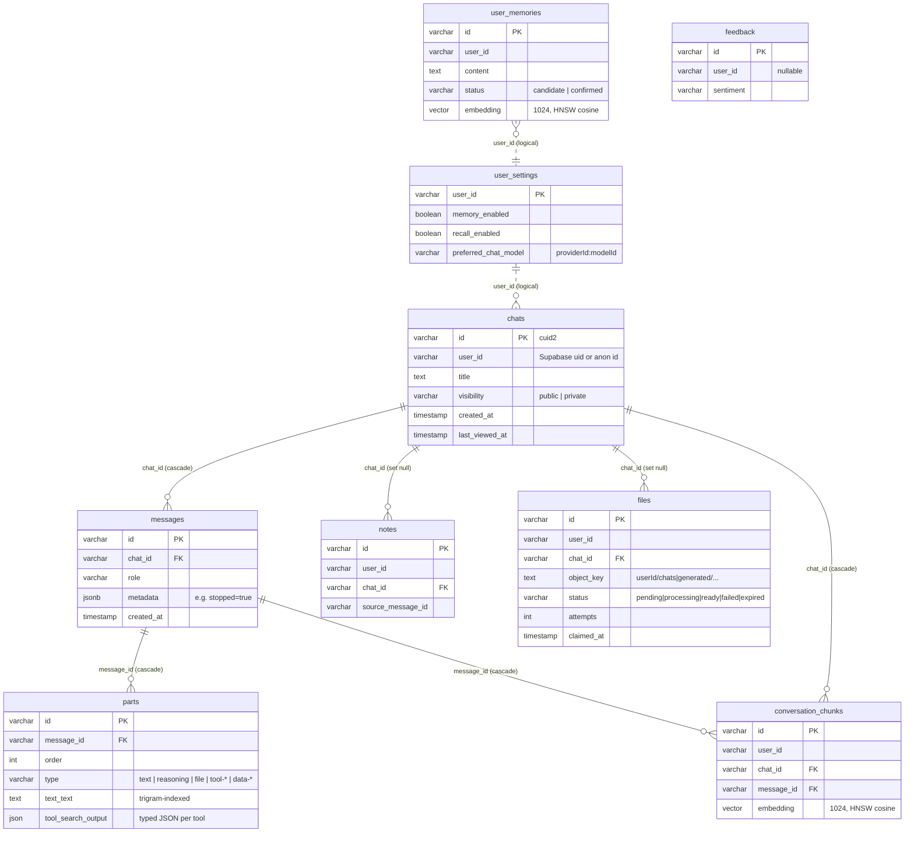

# Data layer

Ask keeps durable state in **Postgres** (one database per environment) and ephemeral or
counter state in **Redis** (one per environment). Uploaded file bytes and their RAG chunks live on
**local disk** in the app container's `uploads` volume, not in either store.

Every column, index and policy, generated from the schema, is in
[Database reference](/reference/database). This page explains the design and the operational
rules.

## Postgres

- Image `pgvector/pgvector:pg17`. Containers `ask-postgres`, `ask-postgres-admin-feature` and
  `ask-postgres-lab` on NightFuryX (.17). No host port: reach it with
  `docker exec -it ask-postgres psql -U morphic -d morphic`.
- Extensions: `vector` (0.8.x), `pg_trgm`, `amcheck` (used by the daily btree integrity check in
  `fleet-boot/docker-maintenance.sh`).
- ORM: **Drizzle** (`drizzle-orm/postgres-js`). The schema is `lib/db/schema.ts`, relations are
  in `lib/db/relations.ts`, and the client is `lib/db/index.ts` (pool of 20 for the runtime, 5
  for `dbAdmin`).
- Server time zone is `Etc/UTC`.

### Tables and relationships



What each table is for:

- **`chats` → `messages` → `parts`.** The conversation store. A message is a row plus ordered
  `parts` that mirror AI SDK UI message parts. Each part type has **typed columns** (`text_text`,
  `reasoning_text`, `file_*`, `source_url_*`, `tool_<name>_input/output`, `data_*`) instead of a
  single JSON blob, and CHECK constraints enforce the required fields per type. Adding a new tool
  means adding columns and a migration. `chats.title` is unbounded `text`, capped in code at
  `CHAT_TITLE_MAX_LENGTH` (255).
- **`files`.** Upload and generated-image metadata, plus the **ingestion job state machine**
  (`pending → processing → ready | failed`, and `expired` as the tombstone after the idle-TTL
  sweep deletes the bytes). The ingest pull queue claims rows with `FOR UPDATE SKIP LOCKED`.
- **`notes`.** Knowledge-library notes saved from answers.
- **`feedback`.** Thumbs and feedback. `user_id` becomes NULL when a user anonymises their
  feedback.
- **`user_memories`.** Long-term memory facts (`preference|fact|interest`). A fact starts as
  `candidate` and becomes `confirmed` after repeated sightings.
- **`conversation_chunks`.** Embedded chunks of the user's **own** past chats for recall.
- **`user_settings`.** Per-user toggles and the saved model pick. The saved pick outranks
  `DEFAULT_CHAT_MODEL` indefinitely.

`user_id` is a string (Supabase UUID, or `ANONYMOUS_USER_ID` such as `lab-harness` in anonymous
mode). There's no `users` table, because identities live in Supabase.

### pgvector

Only two tables use pgvector: **`user_memories`** and **`conversation_chunks`**, both
`vector(1024)` with HNSW `vector_cosine_ops` indexes. The vectors come from
**Qwen/Qwen3-Embedding-0.6B** on the .160 embedder.

::: danger The embedding model is data-locked
Changing `EMBEDDING_MODEL` without re-embedding every row silently breaks recall and memory. A
different 1024-d model passes the dimension check. See [Services → Embedder](/infrastructure/services#embedder).
:::

**Uploads and URL-RAG don't use pgvector.** Their chunks, with embeddings inlined, are written to
a **`.chunks.json` sidecar next to the uploaded file** on disk (`lib/embeddings/upload-rag.ts`),
and searched per turn by in-process cosine plus cross-encoder. The upload volume is local to the
app container host (`/app/uploads/<userId>/chats/<chatId>/…`). It is path-scoped per user (not
RLS), capped at 2 GB per file, and swept after `UPLOAD_TTL_DAYS` of chat idleness (except
`generated/`). See [RAG & uploads](/knowledge/rag-uploads).

### Row-level security

Every table has `ENABLE ROW LEVEL SECURITY`. Policies compare the row's owner to a
**transaction-local GUC**:

```sql
-- chats, notes, files, user_memories, conversation_chunks, user_settings
USING      (user_id = (select current_setting('app.current_user_id', true)))
WITH CHECK (user_id = (select current_setting('app.current_user_id', true)))

-- messages / parts: ownership through the parent chat
USING (EXISTS (SELECT 1 FROM chats
               WHERE chats.id = chat_id
                 AND chats.user_id = (select current_setting('app.current_user_id', true))))

-- public sharing (SELECT only): chats.visibility = 'public'  (and EXISTS … for messages/parts)
-- feedback: anyone may INSERT/SELECT; UPDATE only to anonymise your own row (WITH CHECK user_id IS NULL)
```

- The app sets the GUC with **`withRLS(userId, tx => …)`** (`lib/db/with-rls.ts`), which runs
  `SELECT set_config('app.current_user_id', $1, true)` inside a transaction. The setting ends
  with the transaction, so a pooled connection never leaks one user's id to the next query.
- `current_setting` is wrapped in `(select …)` so Postgres evaluates it **once per statement**
  (an InitPlan) instead of once per row. Migration `0019` retrofitted the four older policies.
- If the GUC is unset, `current_setting(..., true)` returns NULL and no private rows match, so
  RLS fails closed.

### Two database roles

| Role | Env var | Used by | RLS |
|---|---|---|---|
| **Owner** (`morphic`, superuser) | `DATABASE_URL` | `bun migrate` at boot; **`dbAdmin`** client | **Bypassed** |
| **`app_user`** (NOSUPERUSER, NOBYPASSRLS; SELECT/INSERT/UPDATE/DELETE only) | `DATABASE_RESTRICTED_URL` | The default **`db`** client, for every user-facing query | **Enforced** |

`dbAdmin` is reserved for genuine system or cross-user operations that have no single user
context. Every one of them sits behind a bearer token:

- `lib/db/file-actions.ts`, the ingest queue (claim, progress, complete, expiry sweep)
- `app/api/ingest/complete` and `app/api/ingest/file/[id]`, where the worker reads any user's file
- `lib/memory/recall-backfill.ts`, the cross-user recall re-index (cron secret)

If `DATABASE_RESTRICTED_URL` is unset, `db` falls back to `DATABASE_URL` and `dbAdmin` **is**
`db`. RLS is then bypassed everywhere. The **fail-fast guard** in `lib/db/index.ts` refuses to
serve (`process.exit(1)`) when `ENABLE_AUTH=true` and the runtime role has `rolsuper` or
`rolbypassrls`. The base compose file defaults `DATABASE_RESTRICTED_URL` to the owner URL, so a
deploy without the real `.env` would otherwise boot with RLS off. The guard runs only when
`ENABLE_AUTH` is exactly `'true'` (`lib/db/index.ts:98`), although the app treats an unset
`ENABLE_AUTH` as auth on; every compose file sets it today
([known issue](/history/known-issues#rls-guard-ignores-an-unset-enable-auth)).

**Creating the role for a new stack:** `fleet-boot/create-app-user.sh <postgres-container>` drops
and recreates `app_user` with a fresh random password, grants DML plus default privileges for
future tables, verifies the flags are `f f t`, and prints the `DATABASE_RESTRICTED_URL` line to
paste into that stack's `.env`. Then recreate the app.

### Migrations

- Migration files are in `drizzle/` (`0000_…` to `0021_pg_trgm_search_indexes.sql`, journal in
  `drizzle/meta/_journal.json`). To generate one, edit `lib/db/schema.ts`, then run
  `bunx drizzle-kit generate` (config in `drizzle.config.ts`, which uses `DATABASE_URL`). Review
  the SQL before committing.
- **Boot-time, fail-hard.** The Docker entrypoint runs `bun run migrate` (`lib/db/migrate.ts`,
  the Drizzle migrator, as the **owner**) under `set -e`, then `next start`. **A migration error
  means the container never serves.** `restart: unless-stopped` then crash-loops it, and a
  rebuild of prod takes prod down.
- Applied migrations are tracked in `drizzle.__drizzle_migrations`. On 2026-09-22 prod had
  **23 rows for 22 journal entries** (the newest dated 2026-08-17). The extra row is probably the
  never-registered `0016_wrap_rls_current_setting.sql` that `0019` supersedes. That's unverified
  and harmless.

::: warning Runbook: index or extension migrations on live data
`CREATE INDEX` without `CONCURRENTLY` takes a write lock for the whole build, and Drizzle
migrations run inside the fail-hard boot step. For any migration that creates an extension or a
large index (the pattern `0021` used for `pg_trgm`):

1. **Before deploying**, apply it by hand as the owner on each target DB:
   `CREATE EXTENSION IF NOT EXISTS pg_trgm;` then
   `CREATE INDEX CONCURRENTLY IF NOT EXISTS "<name>" ON … USING gin (… gin_trgm_ops);`
2. Verify the index is valid:
   `SELECT indisvalid FROM pg_index WHERE indexrelid = '<name>'::regclass;` → `t`.
   A failed `CONCURRENTLY` leaves an invalid index. Drop it and retry.
3. Deploy. The boot migration finds everything, and its `IF NOT EXISTS` statements are no-ops.

Write the migration SQL with `IF NOT EXISTS` so the no-op is guaranteed.
:::

### Timestamps

All timestamp columns are **`timestamp without time zone`** (Drizzle `timestamp()` with no
`withTimezone`), filled by `defaultNow()` in a UTC server. Drizzle reads naive values **as UTC**
(it appends `+0000`), so JavaScript `Date`s are correct instants. Convert to the viewer's zone
**on the client after hydration**. A server-rendered date is formatted in the container's UTC and
shows the wrong local time. The sidebar hit this bug and fixed it in
`components/sidebar/recent-time.ts`. When writing raw SQL, treat these columns as UTC.

### Caching reads: `loadChat` vs `loadChatUncached`

`lib/actions/chat.ts` exposes a cached `loadChat` (Next `unstable_cache`, stale-while-revalidate)
and `loadChatUncached`. Anything that reads a conversation **right after a write** (the streaming
path, `app/search/[id]/page.tsx`, `GET /api/chat/[chatId]/messages`) must use the **uncached**
reader. The cached one serves the previous snapshot, which caused both "answers my previous
question again" and a vanished first answer. See [Streaming](/request-lifecycle/streaming).

## Redis

- Containers `ask-redis`, `ask-redis-admin-feature` and `ask-redis-lab` (`redis:alpine`),
  `--appendonly yes --maxmemory 256mb --maxmemory-policy noeviction`. **`noeviction`** matters
  because budget counters must never be silently evicted. The trade-off is that writes fail once
  the store is full, and every writer treats that as best-effort.
- Client: node-redis via `LOCAL_REDIS_URL=redis://redis:6379`. Most helpers switch to Upstash
  REST when `UPSTASH_REDIS_REST_URL`/`_TOKEN` are set, which the fleet doesn't use. Resumable
  streams need **real pub/sub**, so they require `LOCAL_REDIS_URL` and degrade on Upstash.
- Nothing in Redis is authoritative. Losing it loses caches, the telemetry history and this
  month's budget counts. The counts restart from zero, which allows extra spend up to one more
  budget.

### Key families

| Key pattern | Type | TTL | Written by | Purpose |
|---|---|---|---|---|
| `search:<query>:<maxResults>:<depth>:<mode>:<incl>:<excl>:<timeRange>:<intent>:<ollN>` | string (JSON) | **1 h** | `app/api/advanced-search/route.ts` | Advanced-search result cache. `searchMode` is part of the key so balanced and quality never cross-serve. Empty results aren't cached. An hourly in-process sweep also `KEYS search:*` and deletes expired entries |
| `search:basic:<query>:<maxResults>:<timeRange>` | string | **1 h** | `lib/search/basic-search-cache.ts` | Basic-search cache, namespaced apart from advanced |
| `enginehealth:<engine>`, `enginehealth:__known` | string | 1 h (refreshed on write) | `lib/search/engine-health-store.ts` | SearXNG per-engine breach counts and `suspendedUntil` (30-minute suspension). Deliberately **not** under `search:` so flushing the search cache doesn't reset the gate. `rotate-daily.sh --clear-health` clears them after a VPN exit change |
| `ask:chat:<chatId>:activeStream` | string | **300 s** (= generation timeout) | `lib/streaming/resumable-stream-context.ts` | Pointer from a chat to its live stream id, set before the stream starts |
| `ask:resumable:rs:*` (`sentinel:<streamId>` + pub/sub channels) | string / channels | sentinel **24 h** | `resumable-stream` library, prefix `ask:resumable` | SSE mirror for reconnecting clients. A finished stream isn't replayable; the client reloads persisted messages |
| `latency:log` | **list** | none; capped by `LTRIM 0 4999` | `lib/telemetry/latency-store.ts` | Durable per-turn `[latency]` lines. **`LPUSH` puts the newest at the head (index 0)**, so `LRANGE latency:log 0 49` is the latest 50. Survives container rebuilds, unlike Docker logs |
| `ingest:heartbeat` | string | `INGEST_HEARTBEAT_TTL_S` (**60 s**; ≤ 0 disables) | `/api/ingest/claim`, `/api/ingest/progress` (`lib/utils/ingest-heartbeat.ts`) | Ingestor liveness. Stale means "processing is down" is shown to the user; unreadable counts as unknown, never down. Check with `redis-cli TTL ingest:heartbeat` |
| `tavily:budget:YYYY-MM` | counter | 35 days | advanced-search | Tavily monthly spend, incremented only on success. Read failure skips Tavily (fail closed) |
| `brave:budget:YYYY-MM` | counter | 35 days | advanced-search, `lib/search/brave-budget.ts` | Brave monthly cap (`BRAVE_MONTHLY_BUDGET`, default 2000) |
| `langsearch:budget:YYYY-MM-DD` | counter | 48 h | advanced-search | LangSearch **daily** cap (`LANGSEARCH_DAILY_BUDGET`, default 900) |
| `replicate:budget:YYYY-MM` | counter | 35 days | `lib/imagegen/budget.ts` | Image-gen monthly spend (only when `REPLICATE_MONTHLY_BUDGET` is set) |
| `imagegen:rr:<poolKey>` | counter | none | `lib/imagegen/rotation.ts` | Round-robin model rotation per task pool (falls back to in-memory) |
| `imagegen:retry:<chatKey>` | counter | 24 h | `lib/imagegen/retry-tracker.ts` | Retry count, escalating to the premium model at the 4th attempt |
| `quotes:pool` | string | 24 h | `app/api/quotes/route.ts` | Waiting quotes shown in the research-process panel while an answer is in progress (Redis, then Couchbase, then bundled); validated on read |
| `rl:chat:<userId>:<date>`, `rl:guest:chat:<ip>:<date>`, `rl:adaptive:<userId>:<date>` | counter | until UTC midnight | `lib/rate-limit/*` | Rate limits: **Upstash + `MORPHIC_CLOUD_DEPLOYMENT` only, so inert on the fleet** |

All monthly and daily counter keys use the **UTC** calendar.

Useful read-only commands (prod; use `ask-redis-lab` or `-admin-feature` for other envs):

```bash
docker exec ask-redis redis-cli --scan | cut -d: -f1-2 | sort | uniq -c   # key families
docker exec ask-redis redis-cli LRANGE latency:log 0 9                     # newest 10 turns
docker exec ask-redis redis-cli TTL ingest:heartbeat                        # ingestor alive?
docker exec ask-redis redis-cli GET "brave:budget:$(date -u +%Y-%m)"        # Brave spend
# flush the search caches (keys contain query text, so delete one per line)
docker exec ask-redis sh -c "redis-cli --scan --pattern 'search:*' | while IFS= read -r k; do redis-cli DEL \"\$k\" >/dev/null; done"
```

On 2026-09-22 prod held only budget counters, `latency:log`, `ingest:heartbeat`,
`imagegen:rr` and `ask:resumable` keys. The search caches were empty at that moment, which is
normal with a 1-hour TTL.
