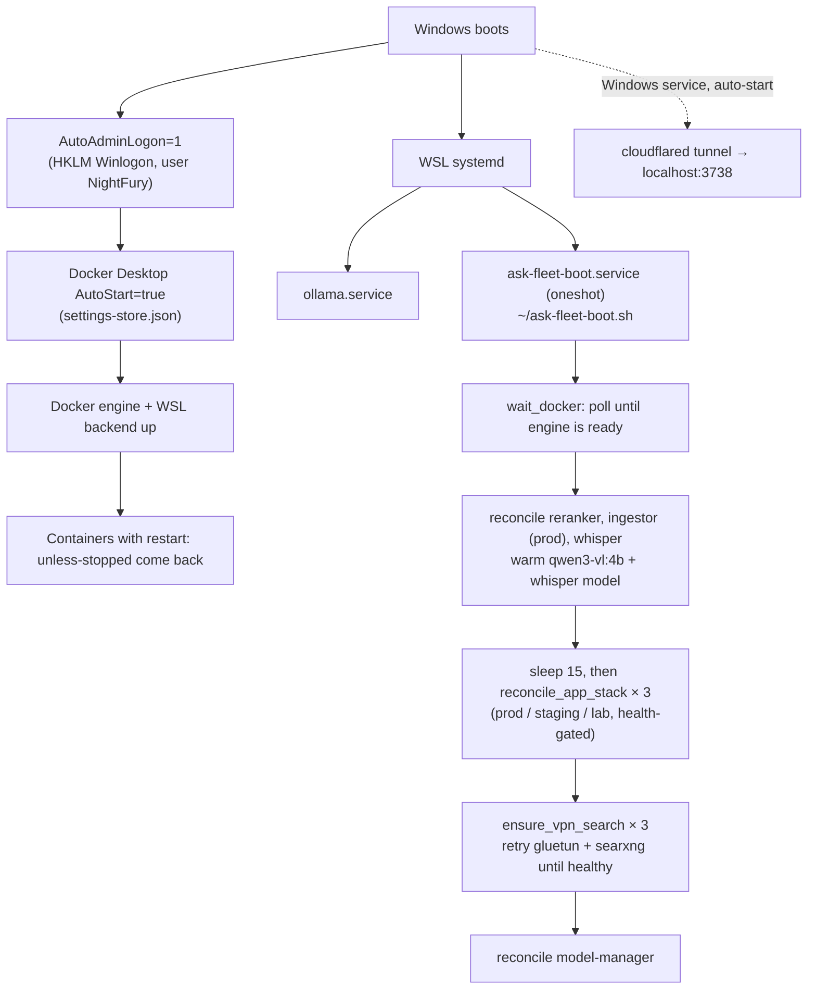

# Fleet

Ask runs on four machines on the `192.168.50.0/24` home LAN. One machine, **NightFuryX (.17)**,
runs every Ask app stack plus most of the GPU model services. The other three each hold one
specialised job: the embedder (.160), the local small LLM (.171) and the crawler (.231).

<SystemMap />

::: tip Where to look next
Per-service detail (ports, auth, config keys, failure modes) is in [Services](/infrastructure/services).
The per-environment compose layout is in [Environments](/operations/environments). Boot/reboot
incident steps are in [Runbooks](/operations/runbooks).
:::

## Hosts

Hardware and OS were checked live on 2026-09-22 (`hostname`, `nvidia-smi`, `docker info`).

| Host | Hostname | OS | CPU / RAM | GPU(s) | Role in Ask |
|---|---|---|---|---|---|
| **192.168.50.17** | NightFuryX | Windows + **WSL2** (Debian 13), **Docker Desktop** | Threadripper 3970X (32c/64t), 117 GB | RTX 2080 Ti **22 GB** (modded), Quadro P2200 5 GB, GTX 1070 8 GB | **App host**: prod/staging/lab stacks, Postgres, Redis, SearXNG+gluetun, reranker, Whisper STT, Kokoro TTS, ingestor workers, model-manager, Ollama (cloud proxy + VLM), cloudflared tunnel |
| **192.168.50.160** | NightFuryS | Windows + WSL2, Docker Desktop | i7-12700 (20t), 58 GB | Quadro P4000 8 GB | GPU **embedder** (`:8788`) |
| **192.168.50.171** | Serenity | Windows + WSL2, Docker Desktop | Xeon E5-2670 v3 (48t), 94 GB | Quadro P5000 16 GB | **Local LLM**: Ollama `granite4.2:8b` (`LOCAL_LLM_BASE_URL`) |
| **192.168.50.231** | MiniNightFury | **Native Linux** (Linux Mint 22.3) | i7-12650H (16t), 31 GB | none | **crawl4ai** (`:11235`), public SearXNG (`:8127`) + public degoog (`:4444`), Ollama used by the staging/lab classifier, legacy (idle) Ask stacks |

The three GPU boxes are WSL2. On them `nvidia-smi` is **not on `PATH`**; use
`/usr/lib/wsl/lib/nvidia-smi`. Only .231 is native Linux.

### Why each job lives where it does

- **App tier on .17.** The app stacks moved from .231 to .17 on 2026-08-23. .17 has the most CPU
  and RAM, and it already hosted the reranker/Whisper/ingestor that every turn calls, so moving the
  app there removed a LAN hop from the critical path.
- **crawl4ai on .231, not .17.** Headless-Chromium crawling is bound by **single-thread speed**
  and remote-site tail latency, not core count. The i7-12650H's Alder Lake P-cores beat the
  Threadripper's Zen 2 cores per thread. A 2026-08-04 benchmark peaked at ~2.2 pages/s at 24–32
  concurrent pages and regressed beyond that. Adding parallelism or moving the crawler to the
  64-thread box does not help.
- **Embedder on .160.** It is the only job on that GPU. The embedding model is **data-locked** to
  the `vector(1024)` columns (see [Data layer](/infrastructure/data-layer#pgvector)). Don't
  move or change it casually.
- **granite on .171.** The P5000's 16 GB holds `granite4.2:8b` (~11.6 GB resident). Reaching a
  GPU over the LAN was measured to beat running granite on a CPU or squeezing it onto a smaller
  .17 card.

## GPU assignment on NightFuryX (.17)

| GPU | Card | Runs | Pinned how |
|---|---|---|---|
| 0 | RTX 2080 Ti 22 GB | `reranker-qwen` (Qwen3-Reranker-8B, fp16) + `ask-whisper` (faster-distil-whisper-large-v3, int8_float16) | Compose `device_ids` only. That is **ignored under WSL2 GPU-PV**, so both land on CUDA device 0, which is the 2080 Ti |
| 1 | Quadro P2200 5 GB | `ask-tts` + `ask-tts-lab` (Kokoro) | `CUDA_VISIBLE_DEVICES=<GPU UUID>` in the container env |
| 2 | GTX 1070 8 GB | Ollama `qwen3-vl:4b` (resident, `keep_alive=-1`) | `CUDA_VISIBLE_DEVICES=<GPU UUID>` in the `ollama` systemd unit |

Observed usage on 2026-09-22 was about 20.0/22.5 GB on the 2080 Ti, 1.6/5 GB on the P2200 and
5.7/8 GB on the 1070.

::: danger The GTX 1070 is the ingest-time VLM. Don't evict it.
`qwen3-vl:4b` on the 1070 is how the **ingestor** OCRs and captions uploaded images into
`.chunks.json` text. The app makes no live VLM call. A vision-capable chat model gets the image
directly, but a **non-vision** model sees only the chunks the ingestor produced. If this model
is evicted or the 1070 is reassigned, image uploads silently lose their text for every
non-vision model. See [RAG & uploads](/knowledge/rag-uploads).
:::

::: warning GPU pinning under WSL2
Under WSL2 GPU paravirtualisation, compose `deploy.resources.reservations.devices.device_ids` is
**ignored**. Every container sees all three GPUs, and frameworks pick CUDA device 0. The only
pinning that works is `CUDA_VISIBLE_DEVICES=<GPU-UUID>` (use UUIDs, because indexes reshuffle when
cards change). The reranker and Whisper still depend on "device 0 is the 2080 Ti". If that stops
being true, add explicit `CUDA_VISIBLE_DEVICES` to `reranker-qwen/docker-compose.yaml` and
`whisper/docker-compose.yml`.
:::

## Ollama: native systemd on every host, not Docker

Ollama runs as a **native systemd service** (`/usr/local/bin/ollama serve`, unit `ollama`) on
all four hosts. There are no Ollama containers anywhere, so restarting Docker doesn't restart
Ollama. (If a Docker Desktop restart makes Ollama lose its GPU, that comes from WSL GPU-PV.) All
four hosts ran **0.34.2** on 2026-09-22.

| Host | Bind | What Ask uses it for |
|---|---|---|
| .17 | `0.0.0.0:11434` | `OLLAMA_BASE_URL` (all envs) and prod's `CLASSIFIER_OLLAMA_BASE_URL`. It proxies `*:cloud` models to Ollama Cloud, and serves `qwen3-vl:4b` locally on the 1070 to the ingestors (`OLLAMA_URL=http://host.docker.internal:11434`). Unit env: `OLLAMA_KEEP_ALIVE=-1`, `OLLAMA_CONTEXT_LENGTH=8192` |
| .171 | `:11434` | `LOCAL_LLM_BASE_URL`: `granite4.2:8b` for titles, memory extraction, query-expansion fallback and voice gist |
| .231 | `:11434` | `CLASSIFIER_OLLAMA_BASE_URL` for **staging and lab**. Their compose overlays hardcode it to `.231`. Prod's comes from `.env` and points at `.17` |
| .160 | `:11434` | Not used by Ask (nothing resident) |

- **Cloud models are Ollama Cloud only.** "Cloud model" in Ask always means an `*:cloud` model
  served through a signed-in local Ollama daemon (ollama.com). Direct Anthropic, OpenAI or Google
  APIs aren't used. (Registry code for other providers exists from upstream Morphic but isn't
  configured.)
- **Manage models over HTTP, without SSH:** `POST /api/pull`, `DELETE /api/delete`,
  `POST /api/generate {"model":…,"keep_alive":-1}` to pin one resident, and `GET /api/ps` to list
  loaded models.
- **Weekly auto-update:** the .17 crontab runs `fleet-boot/update-ollama-fleet.sh` on Sundays at
  03:30. It runs each host's `~/update-ollama.sh` locally and over SSH, which reinstalls the binary,
  restarts the unit and re-pins the models that were resident.
- **Ollama listens unauthenticated on the LAN.** Any LAN host can spend the Ollama Cloud balance.
  See [Security](/infrastructure/security#known-lan-exposures).

## Docker Desktop on .17 and the boot-recovery chain

.17 runs **Docker Desktop for Windows**, not native `dockerd`. `docker info` reports
`Docker Desktop`. The engine runs in Docker Desktop's utility VM, and there is **no
`docker.service`** in the WSL distro. .160 and .171 are the same (Docker Desktop). WSL has
`systemd=true`, which is what runs `ollama` and `ask-fleet-boot` inside WSL.

After a power loss or reboot, recovery is unattended. The chain is:

Why each step exists:

- **AutoAdminLogon + Docker Desktop AutoStart.** Docker Desktop is a GUI app that starts only
  after a user logs in. If either setting is switched off (a Windows hardening change, a Docker
  Desktop reset), every container stays down after a reboot until someone logs in. **Check these
  two first if boot recovery fails.**
- **`wait_docker`.** On .160 the oneshot once ran 3 s after boot, before the engine was up, and
  gave up. The embedder stayed down.
- **`reconcile_app_stack`.** WSL recreates Docker network IDs on reboot, which
  `restart: unless-stopped` can't repair. A known failure mode was the `ask` container coming back
  attached **only** to `shared-infra`, so it couldn't resolve `postgres` and crash-looped on the
  boot-time migration. The function runs `up -d`, waits up to 180 s for the app to report
  **healthy**, then escalates to `up -d --force-recreate ask`, and then to `down && up -d`. It
  leaves healthy stacks alone.
- **`ensure_vpn_search`.** On a cold boot the gluetun sidecars can lose the `/dev/net/tun` race
  and exit (127), taking SearXNG down with them (`network_mode: service:gluetun`). The app comes up
  healthy without them, so the app-stack reconcile never notices, and search went silently dead for
  ~21 minutes. This step retries `up -d gluetun searxng` (6 tries, 10 s apart) per env.
- The fleet has been on a **UPS** since 2026-08-27, which removes the raw power cuts behind the
  earlier outages.

The script is committed at `fleet-boot/ask-fleet-boot.sh` and deployed to `~/ask-fleet-boot.sh`
on each host (unit file `fleet-boot/ask-fleet-boot.service`). It branches on `hostname`:

| Host | Boot actions |
|---|---|
| NightFuryX | everything in the diagram above |
| NightFuryS | reconcile `embedder` (it preloads its own model; 300 s start period) |
| Serenity | warm `granite4.2:8b` |
| MiniNightFury | reconcile `crawl4ai` |

::: warning Gaps observed on 2026-09-22
- `ask-fleet-boot` was **disabled** on Serenity (.171) (`systemctl is-enabled` → `disabled`). It
  was enabled on .17, .160 and .231. Because granite loads on first request, the only effect is a
  slower first local-LLM call after a reboot. To restore the warm-up:
  `sudo systemctl enable ask-fleet-boot` on .171.
- Only the **prod** ingestor is reconciled. `ingestor-staging` and `ingestor-lab` rely on
  `restart: unless-stopped` alone. They have come back fine so far because they have no
  tun/network race.
- The per-env degoog stacks are commented out (`ensure_degoog`) because degoog is disabled in
  every env.
:::

## SSH access

- From .17, `ssh nightfury@192.168.50.{160,171,231}` works with key auth. The GPU boxes have
  passwordless sudo.
- SSH is only needed for filesystem edits (for example redeploying `~/ask-fleet-boot.sh`) and
  host-level checks. Ollama model management uses the `:11434` HTTP API. Container logs for .17
  services are local.
- The model-manager container holds an SSH key (mounted read-only from
  `ask/selfhosted/model-manager/keys/`) that it uses to restart the reranker. Its target is
  `nightfury@192.168.50.17` (loopback SSH, since the reranker is on the same host).

## Legacy stacks on .231 (rollback net)

Before the 2026-08-23 migration, .231 ran all three app stacks. They were kept as a rollback net,
and on 2026-09-22 they were **running**, not stopped: `ask`, `ask-admin-feature` and `ask-lab`
with their own Postgres/Redis/SearXNG/gluetun, started 2026-09-18. They received **no traffic**
(no log lines in the previous 24 h), and nothing routes to them: the public tunnel points at .17.
The .231 crontab still runs its own `ask-expire-uploads.sh` and the daily Mullvad rotation for
those legacy gluetuns.

::: warning Decommission deliberately
These stacks hold a stale copy of user data and the same secrets as the live stacks, so they add
attack surface without serving anyone. Decommissioning is an operator decision. When doing it:
stop only the `ask*` containers, their Postgres/Redis/SearXNG/gluetun and `ask-tts-lab`, and remove
the two legacy cron lines. **Leave `crawl4ai`, the public `searxng`/`searxng-gluetun` (`:8127`),
`degoog-*` (`:4444`) and the .231 `cloudflared` alone.** Those serve other consumers (see
[Services → degoog](/infrastructure/services#degoog)).
:::

## Unrelated workloads on the same hosts

The hosts also run non-Ask software: `worldmonitor` (.17, `:3000`, with an Ollama shim on
`:11435`), Nextcloud AIO and media tools (.171), runtipi (.160/.171/.231), and n8n,
uptime-kuma and others (.231). They share CPU, RAM and disk with Ask but aren't part of it.
Don't treat their ports as Ask's.
