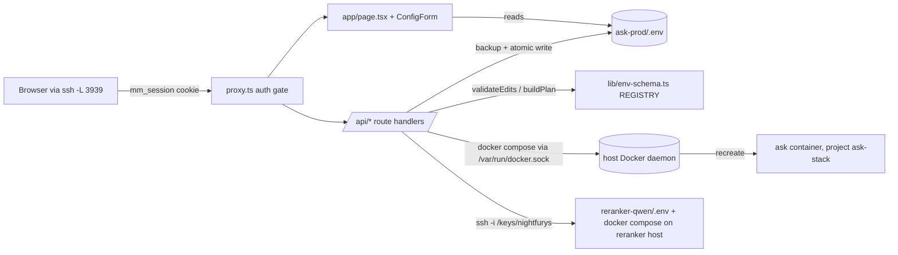
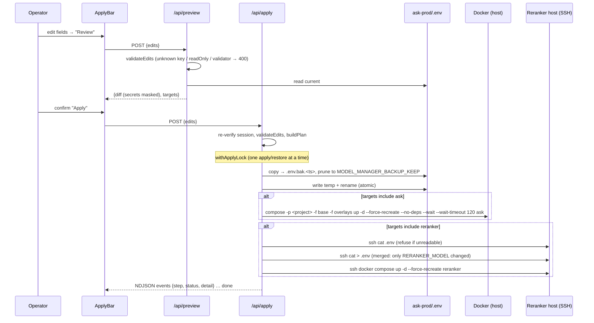

# Model Manager

The **Ask Model Manager** is a small standalone Next.js app for editing **prod's `.env`**
from a browser. It validates the edit, shows a diff, writes the file atomically with a
timestamped backup, and recreates the prod `ask` container using the real prod compose
command. It can also change the reranker model on the reranker host over SSH.

It is the **sanctioned way to change prod configuration**
([D26](/history/decisions#d26-model-manager-is-the-sanctioned-env-editor)). Hand edits to
`ask-prod/.env` still work, but they skip the validation, the backup and the
health-gated recreate.

This page covers the app's internals. For a one-screen summary see
[Services › Model Manager](/infrastructure/services#model-manager). For where it sits in the
deploy flow see [Deploy](/operations/deploy).

::: danger Root-equivalent
The container mounts the host Docker socket, the prod worktree read-write, and an SSH key for
the reranker host (`selfhosted/model-manager/docker-compose.yaml:32-36`). Anyone who can log in
effectively has **root on the app host**. It binds to loopback only
(`selfhosted/model-manager/docker-compose.yaml:20`). Never publish it on the LAN, through a
tunnel, or behind a reverse proxy.
:::

## At a glance

| | |
|---|---|
| Source | `selfhosted/model-manager/` (standalone; imports nothing from Ask, `selfhosted/model-manager/README.md:111-113`) |
| Running copy built from | `/home/nightfury/selfhosted/ask/selfhosted/model-manager` (the **staging** worktree, branch `admin-feature`) |
| Compose project / container | `model-manager` / `model-manager` (image `model-manager-model-manager`) |
| Host / port | NightFuryX (.17), **`127.0.0.1:3939`** only |
| Edits | `/home/nightfury/selfhosted/ask-prod/.env` (prod), plus `reranker-qwen/.env` over SSH |
| Auth | One shared password; per-login random session in cookie `mm_session`, allowlisted server-side with a 24 h expiry |
| Stack | Next.js 16.2 (`output: 'standalone'`), React 19, Radix/shadcn UI, Vitest |
| Restarted on boot by | `reconcile … model-manager` in `fleet-boot/ask-fleet-boot.sh:260` (see [Fleet scripts](/operations/fleet-scripts)) |

Reach it from another machine with an SSH tunnel:

```bash
ssh -L 3939:127.0.0.1:3939 nightfury@192.168.50.17
# then open http://localhost:3939
```

### Lab copy vs. running copy

The source exists in every worktree because it lives in the Ask repo. On 2026-09-23 the
flow-design (lab) copy and the staging copy were **byte-identical** in tracked source. On
2026-09-24 the lab copy gained the session, restore and clear-secret fixes described below; the
running container gets them only after they are ported to `admin-feature` and the tool is
rebuilt from the staging worktree. The staging
copy additionally holds the gitignored runtime files: `.env`, `secrets.env` and `keys/`
(`selfhosted/model-manager/.gitignore`). The running container's image was built on
2026-09-23 after the `EMBEDDING_MODEL` read-only fix (`c080ac31` on lab, cherry-picked as
`48e03628` on `admin-feature`), and the container runs that image.

::: tip Why it is built from the staging worktree while it edits prod
The *code* is deployed from the staging worktree like other companion apps. What it *targets*
is set only by its own `.env` wiring (`ASK_REPO_DIR`, `ASK_ENV_PATH`, `ASK_COMPOSE_*`), which
points at `ask-prod`. The live mounts confirm this. `docker inspect model-manager` shows
`/home/nightfury/selfhosted/ask-prod` mounted at the same path, read-write. Do not confuse the
build location with the target.
:::

## Architecture



| Module | Role |
|---|---|
| `lib/env-schema.ts` | The **registry**: every managed key with category, type, validator, help, default, `readOnly`, `target`, `testable` |
| `lib/env-file.ts` | Lossless `.env` parser/serializer. It keeps comments, ordering, CRLF endings and inline `# comments`, and a bare `#` inside a value is not a comment (`lib/env-file.ts:43-63`) |
| `lib/env-io.ts` | Read, plus atomic write: temp file in the same directory, then `rename` (`lib/env-io.ts:8-15`) |
| `lib/plan-builder.ts` | Server-side validation and the apply plan (which targets change, new file text) |
| `lib/diff.ts` | Change list + text diff; secrets masked as `••••••` (`lib/diff.ts:3`, `:36`) |
| `lib/apply.ts` | Orchestrates backup → write → recreate `ask` → reranker write/restart; rollback |
| `lib/backups.ts` | `.env.bak.<ISO-timestamp>` create / list / prune / restore |
| `lib/lock.ts` | In-process promise-chain mutex serialising apply and restore |
| `lib/exec.ts` | `spawn` wrapper with timeout (SIGKILL) and stdin input |
| `lib/config.ts` | Reads the tool's own wiring env (`ASK_*`, `RERANKER_*`, backup count) |
| `lib/auth.ts` + `proxy.ts` | Password check and session cookie; Next.js 16 `proxy` (formerly middleware) auth gate |
| `lib/connection-tests.ts` | "Test" buttons: Ollama `/api/tags`, reranker `/health` |

All paths in this table and below are relative to `selfhosted/model-manager/`.

## Deployment

`docker-compose.yaml` builds a two-stage image (`Dockerfile`). Stage one is `oven/bun:1`
(`bun install`, `bun run build`). Stage two is `node:22-slim` plus `docker-ce-cli`,
`docker-compose-plugin` and `openssh-client`, which the apply orchestration needs. It sets
`PORT=3939` because the standalone `server.js` would otherwise bind 3000
(`Dockerfile:25-29`).

Mounts (`docker-compose.yaml:22-36`) and why each exists:

| Mount | Why |
|---|---|
| `${ASK_REPO_DIR}` → **same path** (rw) | Apply runs `docker compose` through the host daemon. The daemon resolves Ask's *relative* bind mounts and `env_file` against the **host** filesystem, so the project directory must have the same path inside and outside the container, or the recreate fails. It is a directory mount, not a single file, because the atomic write needs to create a temp file next to `.env`. |
| `/var/run/docker.sock` | Runs `docker compose … up` on the host. |
| `${RERANKER_SSH_KEY_HOST:-./keys/nightfurys}` → `/keys/nightfurys` (ro) | SSH to the reranker host to edit its `.env` and recreate it. |

Its own configuration comes from two gitignored env files (`docker-compose.yaml:11-13`):

- **`.env`** holds the wiring: `MODEL_MANAGER_PORT`, `ASK_REPO_DIR`, `ASK_ENV_PATH`,
  `ASK_COMPOSE_FILE`, `ASK_COMPOSE_FILES` (whitespace-separated `-f` list, base first then
  overlays), `ASK_COMPOSE_PROJECT`, `ASK_SERVICE`, `MODEL_MANAGER_BACKUP_KEEP` (default 20),
  and `RERANKER_SSH_TARGET`, `RERANKER_SSH_KEY`, `RERANKER_REMOTE_DIR`, `RERANKER_ENV_FILE`,
  `RERANKER_SERVICE`. Defaults are in `lib/config.ts:31-62`. Templates are `.env.example` and
  `secrets.env.example`.
- **`secrets.env`** holds `MODEL_MANAGER_PASSWORD` and optionally `MODEL_MANAGER_SESSION_SECRET`.
  The password lives here, not in `.env`, because Compose interpolates `$` in a project
  `.env`. A password containing `$` would be silently mangled. In `secrets.env` each literal `$`
  must be written `$$` (`README.md:56-62`).

Rebuild after a code change (from the staging worktree, where the runtime files live):

```bash
cd /home/nightfury/selfhosted/ask/selfhosted/model-manager
docker compose up -d --build
```

Then verify the wiring before trusting an apply. Print mounts only, never `Config.Env`:

```bash
docker inspect model-manager --format '{{range .Mounts}}{{.Source}} -> {{.Destination}}{{"\n"}}{{end}}'
docker ps --filter name=^model-manager$ --format '{{.Ports}}'   # expect 127.0.0.1:3939->3939/tcp
```

::: warning The 2026-08-09 mis-wiring
Until 2026-08-09 the tool pointed at the staging worktree and ran `docker compose up -d ask`
with one `-f` and no `-p`. The base compose file is `name: ask-stack`, which is the **prod**
project. Every apply therefore recreated **prod from staging's `.env`**, without the VPN
overlay. This is why `ASK_COMPOSE_PROJECT` and `ASK_COMPOSE_FILES` exist (`lib/config.ts:12-20`),
and why the apply is health-gated (`f45b96cc`, `49ffb638`). After re-deploying the tool, check
what an apply produced:
`docker inspect ask --format '{{index .Config.Labels "com.docker.compose.project.config_files"}}'`.
:::

## Authentication

```mermaid
sequenceDiagram
  participant B as Browser
  participant P as proxy.ts
  participant L as /api/login
  B->>P: GET /
  alt MODEL_MANAGER_PASSWORD unset
    P-->>B: 503 "not configured" (fail closed)
  else no / bad mm_session
    P-->>B: 302 /login (pages) or 401 (/api/*)
  end
  B->>L: POST {password}
  L->>L: timingSafeEqual(sha256(input), sha256(password))
  L->>L: new random id → session store (expires now + 24 h)
  L-->>B: Set-Cookie mm_session=<id>.<issuedAt>.<hmac>; HttpOnly; SameSite=Strict; Max-Age=86400
  B->>P: GET / (cookie)
  P->>P: HMAC ok, age < 24 h, id present and unexpired in the store → allowed
```

- **Fail closed.** If `MODEL_MANAGER_PASSWORD` is unset, every non-public path returns **503**
  (`proxy.ts:11-17`). There is no default credential.
- **Public paths:** `/login`, `/api/login`, `/api/health` (`proxy.ts:4`). Static assets and
  `icon.svg` bypass the matcher (`proxy.ts:28-32`).
- **Password check:** both sides are hashed with SHA-256 before `timingSafeEqual`, so length
  differences do not leak through timing (`lib/auth.ts:15-19`).
- **Session token** (since 2026-09-24): `<id>.<issuedAtMs>.<hmac>` (`lib/auth.ts:85-99`). The id
  is 24 random bytes, new for every login, so every login yields a different cookie. The HMAC
  (SHA-256 over `<id>.<issuedAt>`) is keyed by `MODEL_MANAGER_SESSION_SECRET`, or else by a string
  derived from the password (`lib/auth.ts:33-37`).
- **Server-side allowlist and expiry.** Each login records `id → expiry` in a small JSON session
  store (`MODEL_MANAGER_SESSION_STORE`, default `/tmp/model-manager-sessions.json` inside the
  container, written atomically with mode 0600, `lib/auth.ts:43-83`). `verifySessionToken`
  (`:113-126`) accepts a cookie only if the HMAC matches, it is less than 24 h old, and its id is
  still in the store and unexpired. The 24 h limit is enforced by the server, not only by the
  cookie's `Max-Age`. A file is used rather than an in-memory map because the Next.js proxy is
  bundled separately from the route handlers; both run in the same container and share the
  filesystem. A missing or corrupt store means "no sessions" (fail closed).
- **Logout revokes.** `/api/logout` removes the id from the store before clearing the cookie
  (`app/api/logout/route.ts`, `lib/auth.ts:130-142`), so a copied cookie is dead too.
- **Everyone is logged out** when the container is recreated (the default store lives in the
  container's `/tmp`), and when the HMAC key changes: a new `MODEL_MANAGER_SESSION_SECRET`, or a
  new password while no explicit session secret is set. Changing either variable needs a
  container recreate anyway. Setting `MODEL_MANAGER_SESSION_STORE` to a mounted path would make
  sessions survive a recreate; nothing sets it today.
- **Defense in depth:** `/api/apply` and `/api/restore` re-verify the session inside the handler,
  so a proxy-matcher mistake cannot leave the two routes that rewrite prod's `.env` open
  (`app/api/apply/route.ts:17-20`, `app/api/restore/route.ts:13-16`). The other API routes rely on
  the proxy alone.

::: tip Session secret
With no explicit session secret, the HMAC key derives from the password. The security review
recommends setting `MODEL_MANAGER_SESSION_SECRET` explicitly and not reusing it elsewhere (see
[Security](/infrastructure/security) and [Known issues](/history/known-issues)).
:::

::: info Fixed 2026-09-24
Before this change the token was the fixed payload `authenticated` plus its HMAC: every login
produced the same cookie value, it had no server-side expiry, and logout only cleared the
browser's copy. A copied cookie stayed valid until the password or session secret changed.
:::

## The env schema (`lib/env-schema.ts`)

`REGISTRY` (`lib/env-schema.ts:109`) is the single source of truth for which Ask variables the
tool manages and how. Every entry is an `EnvVarSpec` (`lib/env-schema.ts:74-93`):

| Field | Meaning |
|---|---|
| `key` | Env var name in Ask's `.env` |
| `category` | Tab: `models`, `search`, `database`, `auth`, `memory`, `storage`, `infra` (`:1-18`) |
| `group` | Sub-heading within the tab (e.g. `Chat`, `Serenity`, `Embeddings`, `Reranker`) |
| `type` | `url`, `model`, `model-list`, `secret`, `bool`, `int`, `enum`, `string`. This picks the control: switch, select, list editor, password input or text (`components/field.tsx:80-150`) |
| `validate` | Optional `(v) => error \| null`, run in the browser **and** server-side |
| `default` | Shown as the placeholder: what the app does when the key is unset |
| `required` | Cannot be emptied: no **Clear this secret** link, and the server rejects an empty value (`lib/plan-builder.ts:26-29`). Set on the six core secrets (see below) |
| `readOnly` | Rendered read-only; the server rejects edits |
| `target` | `ask` (default) or `reranker` (written to the reranker host's `.env` over SSH) |
| `testable` | Adds a **Test** button: `ollama` (lists `/api/tags`) or `reranker` (`/health`) |

As of 2026-09-23 the registry has **97 keys**: models 30, search 25, memory 15, storage 9,
infra 7, database 6, auth 5. Of these, **26** are `type: 'secret'`.

### How secrets are handled

- The page and `/api/config` never send a secret's value to the browser. They send `''` plus a
  `secretSet` flag (`app/api/config/route.ts:12-15`, `app/page.tsx`). The input then shows
  "•••••• (unchanged — type to replace)" (`components/field.tsx:144-147`).
- The form submits only fields whose value differs from the initial one
  (`components/config-form.tsx:54-60`). An untouched secret is therefore never rewritten, and an
  empty secret box means "unchanged".
- **Clearing a secret** (since 2026-09-24). Because an empty box means "unchanged", emptying a set
  secret needs an explicit action: the **Clear this secret** link under an empty, set, optional
  secret (`components/field.tsx:40-41,152-160`). The field then reads "Will be cleared on apply",
  with **Undo**. `ConfigForm` keeps cleared keys in a separate `cleared` map and submits them as
  `''` (`components/config-form.tsx:47-60`). The preview diff shows a cleared secret as
  `(empty)`, never as the mask, so it cannot be mistaken for a still-set value (`lib/diff.ts:39-40`).
  A var marked `required: true` in the schema gets no Clear link, and `validateEdits` rejects an
  empty value for it server-side (`lib/plan-builder.ts:26-29`).

::: info Which variables are `required`
Six variables the app cannot start without are marked `required: true`: `DATABASE_URL`,
`DATABASE_RESTRICTED_URL`, `POSTGRES_PASSWORD`, `NEXT_PUBLIC_SUPABASE_URL`,
`NEXT_PUBLIC_SUPABASE_PUBLISHABLE_KEY` and `SUPABASE_SECRET_KEY` (`lib/env-schema.ts`). Feature
secrets such as `INGEST_API_TOKEN` and `MEMORY_CRON_SECRET` stay clearable on purpose: clearing
one disables that feature (its route answers 503) without taking the app down. To protect another
variable, add `required: true` to its spec.
:::
- The preview diff masks secret values (`lib/diff.ts:39-40`). During apply, any secret value
  just written is redacted from subprocess stderr before it is streamed back, so a
  `docker compose` error that echoes an `.env` line cannot leak it (`lib/apply.ts:28-51`).

### Read-only fields: `EMBEDDING_MODEL` is data-locked

`EMBEDDING_MODEL` (`lib/env-schema.ts:249-265`) is the only `readOnly` key. It used to be a
dropdown offering MiniLM, mxbai and nomic. That was dangerous. Every stored vector (long-term
memories, conversation-recall chunks, upload `.chunks.json` sidecars) was embedded with
`Qwen/Qwen3-Embedding-0.6B`. A different model produces vectors in a different space, and
mxbai is also 1024-dimensional, so it **passes the dimension guard**. Memory and recall would
silently return garbage with no error. Changing the model is a **re-embed migration**, not a
setting (see [Memory & recall](/knowledge/memory-recall)).

The lock is enforced in three places:

1. UI: rendered as a read-only input with the warning as help text (`components/field.tsx:80-94`).
2. `validateEdits` returns `This setting is read-only` → `/api/preview` and `/api/apply` answer
   **400** (`lib/plan-builder.ts:14-36`).
3. `buildPlan` skips read-only keys even if called directly (`lib/plan-builder.ts:57`).

Tests pin this behaviour: `lib/__tests__/env-schema.test.ts:49-` and
`lib/__tests__/plan-builder.test.ts:65-75` (fix `c080ac31`).

To make another key read-only, set `readOnly: true` on its spec. Use it for any value that is
baked into stored data.

### Chat model list

`OLLAMA_MODELS` (`lib/env-schema.ts:131`) is `type: 'model-list'`. It is a comma-separated list
edited with add / remove / reorder (`components/model-list-editor.tsx`, `lib/model-list.ts`).
This is what "add a model" in the Model Manager means: it only edits this list. The full
procedure for adding a chat model touches more than this one variable; see
[Recipes](/getting-started/recipes) and [Models & reasoning](/search/models-reasoning).

::: warning Hand-synced lists
The Replicate image-model enums duplicate the capability arrays in Ask's
`lib/imagegen/models/*.json`. The tool cannot import from the app, so the two must be kept in
sync by hand (`lib/env-schema.ts:330-335`).
:::

## Preview → apply flow



Step by step, with the reason for each:

1. **Validate twice.** Preview and apply both call `validateEdits` (`lib/plan-builder.ts:14`).
   It rejects unknown keys, read-only keys and failing validators. This is a server-side
   backstop; the browser validation can be bypassed.
2. **Build the plan** (`lib/plan-builder.ts:42-79`). The plan skips unchanged values and keys
   not in the registry ("never write a key we don't manage"). It routes each key to its
   `target`. `setValue` rewrites only the key's own line and keeps its inline comment and line
   ending. A new key is appended at the end (`lib/env-file.ts:109-130`). Values containing
   whitespace, quotes, `#` or `=` are double-quoted.
3. **Serialize.** `withApplyLock` (`lib/lock.ts`) is a promise-chain mutex. One Node process
   serves the tool, so this is enough to stop two applies interleaving writes or restarts.
4. **Backup** (`lib/backups.ts:8-12`), then prune to the newest `MODEL_MANAGER_BACKUP_KEEP`.
   If the backup fails, nothing is written.
5. **Atomic write** (`lib/env-io.ts:8-15`). A crash mid-write cannot leave a truncated `.env`.
6. **Recreate `ask`** (`lib/apply.ts:57-109`). The flags matter:
   - `-p <project>` pins the stack; without it the base file's `name: ask-stack` decides.
   - `-f` base **plus overlays**; otherwise the service returns without VPN networking.
   - `--force-recreate`, because an `env_file` content change does not alter the resolved
     compose config. A plain `up` would keep the old container and the new value would never
     take effect.
   - `--no-deps` leaves Postgres, Redis and SearXNG alone.
   - `--wait --wait-timeout 120` blocks until the `ask` healthcheck is healthy. A container that
     boots and then crash-loops is reported as a **failure** instead of "ok". The subprocess
     timeout is 180 s.
7. **Reranker** (only when `RERANKER_MODEL` changed; `lib/apply.ts:111-225`). The remote
   `.env` also holds `RERANKER_API_TOKEN`, and the reranker fails closed without it. The tool
   therefore reads the remote file, changes only `RERANKER_MODEL`, and writes the merged
   result back. If it cannot read the file it refuses rather than overwrite blind. An earlier
   blind `cat >` wiped the token and took the reranker down (`49ffb638`). If the `RERANKER_SSH_*`
   wiring is unset, this step fails with `reranker SSH not configured`.
8. **Stream progress** as `application/x-ndjson` (`app/api/apply/route.ts:30-68`). The final
   `done` event carries the backup path.

A failed apply does **not** roll back automatically. The new `.env` stays on disk, and the
backup path in the `done` event is what to restore.

## Backups and restore

- **Format:** `<ASK_ENV_PATH>.bak.<ISO timestamp with : and . replaced by ->`, next to the file,
  for example `ask-prod/.env.bak.2026-09-23T18-03-49-097Z` (illustrative). These are gitignored in the Ask repo (see
  [Local development](/getting-started/local-dev)). They contain secrets; treat them like
  `.env`.
- **Retention:** the newest `MODEL_MANAGER_BACKUP_KEEP` (default 20) are kept. Pruning runs on
  each apply and each restore (`app/api/apply/route.ts:39-43`, `app/api/restore/route.ts:41`).
- **Only app-made backups count** (since 2026-09-24). `listBackups` matches only names of the
  exact form `<env file>.bak.<stamp>`, where the stamp is the ISO time with `:` and `.` replaced by
  `-` (`lib/backups.ts:11,19-29`). Hand-made siblings such as `.env.bak.classifier-swap-20260903`
  are ignored: they are not listed, not pruned and not restorable from the UI. That is also what
  keeps pruning from deleting an operator's hand-made backup.
- **Restore** (the **Backups** dialog → `/api/restore`) re-verifies the session in the handler,
  then accepts `backupPath` only if `resolveOwnBackup` confirms it is in the same directory as the
  env file, has the app's name format and is currently listed (`lib/backups.ts:42-56`). Anything
  else, including `../` paths, gets 400 "Unknown backup". The restore **snapshots the current
  `.env` first** as a new backup, so a restore can itself be undone (`lib/backups.ts:60-75`), then
  copies the backup over `.env` and recreates `ask` with the same health-gated command
  (`lib/apply.ts`). The snapshot path is returned as the `backup` event.
  - Restore does not touch the reranker host. Revert a reranker model change by applying the old
    value.

Manual restore without the UI:

```bash
cd /home/nightfury/selfhosted/ask-prod
ls -1t .env.bak.* | head          # names only
cp .env.bak.<timestamp> .env
docker compose -p ask-stack -f docker-compose.yaml -f docker-compose.vpn.yaml \
  up -d --force-recreate --no-deps ask
```

## API routes

All routes are under `app/api/`. Everything except the public paths requires the `mm_session`
cookie (checked in `proxy.ts`).

| Route | Method | Auth | Does |
|---|---|---|---|
| `/api/health` | GET | public | `{ok:true}` liveness |
| `/api/login` | POST | public | `{password}` → sets `mm_session` (24 h cookie), 401 on mismatch |
| `/api/logout` | POST | session | Revokes the session server-side, then clears the cookie |
| `/api/config` | GET | session | Current values for every registry key. Secrets are returned as `''` plus `secretSet`. Also returns `rerankerManaged` |
| `/api/preview` | POST | session | `{edits}` → `{diff, targets}` or 400 `{violations}` |
| `/api/apply` | POST | session (**re-checked in handler**) | `{edits}` → NDJSON `ApplyEvent` stream; 400 `{violations}` |
| `/api/backups` | GET | session | `{backups:[{path, ts}]}`, newest first |
| `/api/restore` | POST | session (**re-checked in handler**) | `{backupPath}` (must be a listed app-made backup, else 400) → snapshot current `.env`, restore, recreate `ask`; `{ok, events}` |
| `/api/test` | POST | session | `{kind:'ollama', baseUrl}` or `{kind:'reranker', url, token}` → probe with a 5 s timeout |

`ApplyEvent` steps: `backup`, `write`, `ask-restart`, `reranker-write`, `reranker-restart`,
`done`; on restore, `backup` (the snapshot), `rollback-restore` and `ask-restart`. Status is `start`, `ok` or `fail`,
with an optional `detail` (stderr tail, at most 2000 characters, secrets redacted).

::: info Reranker "Test" button
`Field` renders `<TestButton spec={spec} value={value} />` without a `tokenValue`
(`components/field.tsx:164`), so the reranker probe is sent with an empty bearer token. If the
reranker's `/health` requires the token, the Test button reports an HTTP error even when the
reranker is healthy *(unverified: whether the reranker's `/health` enforces the token)*. The
Ollama Test button is unaffected.
:::

## How to add a new managed env var

When Ask gains a new env flag that operators should be able to change on prod:

1. **Add a spec** to `REGISTRY` in `selfhosted/model-manager/lib/env-schema.ts`, in the section
   for its category:

   ```ts
   {
     key: 'MY_NEW_FLAG',
     category: 'search',            // picks the tab
     group: 'SearXNG',              // sub-heading (optional)
     label: 'My new flag',
     type: 'int',                   // picks the control
     validate: nonNegInt,           // reuse the shared validators at the top of the file
     default: '5',                  // what Ask does when unset; shown as placeholder
     help: 'What it does, and what breaks if it is wrong.'
   },
   ```

   - Use `type: 'secret'` for any credential. That gives masking, redaction and never-sent-to-browser.
   - Use `type: 'enum'` with `enumValues` for closed sets. The registry test requires the list
     to be non-empty.
   - Set `readOnly: true` if the value is locked to stored data.
   - Set `target: 'reranker'` only for values that live in the reranker's `.env`. Today that is
     only `RERANKER_MODEL`, and `buildPlan` only forwards that one key (`lib/plan-builder.ts:59-63`).
     Any other reranker key needs a code change there.
2. **Add the key to the parity fixture** `lib/__tests__/fixtures/ask.env.sample`, with a dummy
   value and never a real one. The test `.env parity — every key in Ask .env has a spec`
   (`lib/__tests__/env-schema.test.ts:149-162`) fails for any fixture key without a spec. The
   check runs against this fixture, not the real `.env`, so it only catches keys someone listed
   there. To deliberately leave a key unmanaged, add it to `IGNORE` (`:6-8`) with a reason.
3. **Run the tool's tests:**

   ```bash
   cd selfhosted/model-manager && bun install && bun run test && bun run typecheck
   ```

4. **Ship it** like any code change: commit on lab, cherry-pick to `admin-feature` (the staging
   worktree the container builds from), then rebuild the container from
   `/home/nightfury/selfhosted/ask/selfhosted/model-manager` with `docker compose up -d --build`.
   The Ask app does not need a rebuild for this. See [Deploy](/operations/deploy).
5. The flag must also exist in Ask itself: read in code, listed in `.env.example` and the compose
   overlays where needed, and shown in the generated [Env flags](/reference/env-flags) reference.
   The full checklist is in [Recipes](/getting-started/recipes).

::: warning Variables set in overlays win
Some variables are hardcoded in the staging/lab compose overlays and read from `.env` only on
prod (for example `CLASSIFIER_MODEL_ID`; see [Deploy](/operations/deploy)). The Model Manager
only edits prod's `.env`. A key that the prod compose files set under `environment:` would
override the `.env` value, and an apply would appear to do nothing. Check with
`docker exec ask printenv <NAME>` after applying.
:::

## Tests

The tool has its own Vitest suite, separate from Ask's:
`cd selfhosted/model-manager && bun run test`. It covers the lib modules in `lib/__tests__/`
(apply, auth, backups, config, connection tests, diff, env-file, env-schema, exec, lock,
model list, plan builder), `proxy.test.ts`, and component tests in `components/__tests__/`.
See [Testing & QA](/operations/testing-qa).

## Failure modes

| Symptom | Likely cause | Fix |
|---|---|---|
| Every page returns 503 "not configured" | `MODEL_MANAGER_PASSWORD` empty in `secrets.env` | Set it and recreate the container |
| Login always "Invalid password" although it is correct | Password contains `$` and was not doubled in `secrets.env` | Write each `$` as `$$` |
| `ask-restart` fails with a mount error ("mount a directory onto a file") | `ASK_REPO_DIR` not mounted at the identical host path | Fix the wiring in the tool's `.env`, recreate it |
| Apply "succeeds" but prod lost VPN / is on the wrong `.env` | `ASK_COMPOSE_FILES` / `ASK_COMPOSE_PROJECT` wrong | Check the `config_files` label on `ask`; see the warning above |
| `ask-restart` fails after about 120 s | New value makes `ask` unhealthy | Restore the backup named in the `done` event |
| `reranker-write` fails "refusing to overwrite blind" | SSH to the reranker host failed | Check the key mount and `RERANKER_SSH_TARGET`; nothing was written remotely |
| Logged out unexpectedly | Container recreated, session older than 24 h, or password/session secret changed | Log in again; this is by design |
| UI down | Container stopped | Only the editor is affected; Ask keeps serving. Edit `.env` by hand ([Deploy](/operations/deploy)) or `docker compose up -d` in the tool's directory |

## Related

- [Services › Model Manager](/infrastructure/services#model-manager): one-screen summary and the live wiring
- [D26: Model Manager is the sanctioned `.env` editor](/history/decisions#d26-model-manager-is-the-sanctioned-env-editor)
- [Security](/infrastructure/security): threat model, root-equivalence, shared-secret findings
- [Memory & recall](/knowledge/memory-recall): why the embedding model is locked
- [Recipes](/getting-started/recipes): adding a chat model or an env flag end to end
