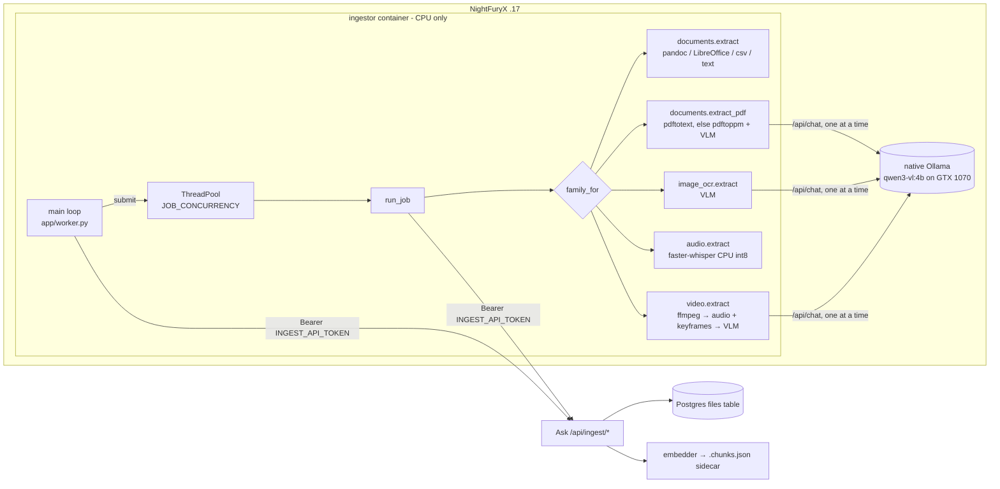

# Ingestor worker

The **ingestor** is the out-of-process worker that turns uploads the Ask app cannot index by
itself (Office files, scanned PDFs, images, audio, video, oversized text) into plain-text
chunks. It is a small Python service that **pulls** jobs from Ask over HTTP, extracts text with
pandoc / LibreOffice / poppler / ffmpeg / faster-whisper / a vision model, and hands the chunks
back. Ask does the embedding and storage.

This page documents the **worker's internals and operations**. The Ask side of the story (upload
intake, the in-app fast path, chunk sidecars, retrieval, the answer-time wait) is in
[RAG & uploads](/knowledge/rag-uploads); read that first for the end-to-end picture.

::: info Separate repository
The worker lives at `/home/nightfury/selfhosted/ingestor/` on NightFuryX (.17). It is its **own
git repository** (not part of the Ask repo, no remote configured at the time of writing; history
starts at `6028099` "Initial import", followed by `b15cb98`, the claim back-off fix, and
`ba5fc5c`, the config-error, heartbeat and `.env.example` fix of 2026-09-24). Citations below use
the form `ingestor/<path>:line` for that repo; unprefixed paths are in the Ask repo.

Every real `.env*` file is excluded by `ingestor/.gitignore`. Since `ba5fc5c` the one exception is
**`.env.example`**, which is tracked and holds variable names and safe placeholders only
(`!.env.example`). Copy it to `.env`, `.env.staging` or `.env.lab` for a new worker. The
variables are described in [Configuration](#configuration) below.
:::

## Why a separate worker

- **Heavy native tooling.** The image installs `pandoc libreoffice poppler-utils ffmpeg`
  (`ingestor/Dockerfile:2-3`) plus `faster-whisper` (`ingestor/requirements.txt:2`). Putting
  LibreOffice and a Whisper model into the Next.js image would bloat every Ask build and deploy.
- **Long, bursty jobs.** OCR of a 200-page scan or transcription of an hour of audio takes
  minutes. Running that inside the web process would compete with live answers for CPU and
  would die on every Ask redeploy. A pull queue lets the job survive an app restart (the claim
  simply goes stale and is retried).
- **Placement next to the VLM.** The vision model (`qwen3-vl:4b`) is served by the native Ollama on
  NightFuryX, pinned to the GTX 1070. The worker runs on the same host and reaches it via
  `host.docker.internal` (`ingestor/docker-compose.yaml:1-2,9-10`).
- **Pull, not push.** Ask never needs to know where the worker is or whether it is up; the worker
  only needs outbound HTTP to Ask. Adding capacity is "run another worker"; the claim query is
  `FOR UPDATE SKIP LOCKED` so concurrent claimers are safe (`lib/db/file-actions.ts:158-195`).

## Architecture



| Module | Role |
|---|---|
| `ingestor/app/config.py` | Env-driven `Settings`; fails fast on missing `ASK_URL` / `INGEST_API_TOKEN` (`:12-22`) |
| `ingestor/app/worker.py` | Poll loop, claim back-off, thread pool, dispatch by media family, error classification |
| `ingestor/app/ask_client.py` | HTTP client for the four ingest routes; defines `RetryableError` |
| `ingestor/app/vlm.py` | `describe_image()` → Ollama `/api/chat`, serialised by a process-wide lock |
| `ingestor/app/chunking.py` | Timestamp prefixes and ~120 s merging of timed segments (audio/video) |
| `ingestor/app/extractors/*.py` | One module per media family |

## The pull-queue protocol

The four routes, their auth (`lib/utils/ingest-auth.ts`, fail-closed: unset token → 503, wrong
token → 401) and their database effects are tabulated in
[RAG & uploads → Worker path](/knowledge/rag-uploads#worker-path-external-ingestor). This section
describes the same exchange **from the worker's side**.

```mermaid
sequenceDiagram
  autonumber
  participant W as ingestor main loop
  participant T as worker thread (run_job)
  participant A as Ask /api/ingest
  participant DB as Postgres files
  participant O as Ollama (VLM)
  loop every POLL_INTERVAL (15 s) while idle
    W->>A: POST /claim
    A->>A: recordIngestHeartbeat() (Redis ingest:heartbeat)
    A->>DB: finalizeStuckJobs(); UPDATE … FOR UPDATE SKIP LOCKED, attempts+1
    A-->>W: 204 (empty) or {fileId, filename, mediaType, size}
  end
  W->>T: pool.submit(run_job, job) — then claims again immediately
  T->>A: POST /progress {stage: "downloading"}
  T->>A: GET /file/{fileId} (streamed to a temp dir)
  T->>A: POST /progress {stage: "parsing" | "ocr page n/N" | "transcribing" | "frames" …}
  opt image / scanned PDF / video frames
    T->>O: /api/chat with base64 image (lock-serialised)
  end
  alt extraction succeeded
    T->>A: POST /complete {fileId, chunks[]}
    A->>A: storeExtractedChunks() — embed + write sidecar
    alt embedder down
      A-->>T: 503
      T->>T: sleep 30 s, POST /progress "embedding", retry (≤ 20×)
    else stored
      A->>DB: status = ready
      A-->>T: {status: "ready"}
    end
  else RetryableError
    T->>A: POST /complete {fileId, error, retryable: true}
    A->>DB: pending again if attempts < 3, else failed
  else any other exception
    T->>A: POST /complete {fileId, error, retryable: false}
    A->>DB: failed
  end
```

Key points, each checkable in code:

- **Claim response shape.** `{fileId, filename, mediaType, size}` (`app/api/ingest/claim/route.ts:16-21`).
  The `objectKey` never leaves Ask; the worker downloads by id.
- **The worker is single-target.** One process talks to exactly one `ASK_URL`
  (`ingestor/app/ask_client.py:29`), which is why each environment has its own container.
- **Progress doubles as a lease renewal.** `updateIngestProgress` sets `claimed_at = now()`
  (`lib/db/file-actions.ts:198-208`). A job that stops reporting progress for
  `STALE_CLAIM_MINUTES` (30) becomes re-claimable by any worker. It also refreshes the Redis
  heartbeat that the answer path uses to tell "worker down" from "worker busy"
  (`app/api/ingest/progress/route.ts:10-13`, `lib/utils/ingest-heartbeat.ts`).
- **The worker keeps the lease fresh during long steps** (since `ba5fc5c`). Extractors report
  progress only at stage boundaries: audio once before a Whisper transcription that can run for
  hours on CPU, video before its audio pass and again before frames, office conversions once. A
  single step longer than 30 minutes used to get the job re-claimed as stale and run twice.
  `run_job` now wraps the client in a per-job `_Heartbeat` (`ingestor/app/worker.py:33-92`) that
  remembers the last stage the extractor reported and re-sends it through `/progress` every
  `HEARTBEAT_INTERVAL` seconds (default 180, well under the 30-minute window; `≤ 0` disables it)
  from a daemon thread. A failed heartbeat is logged once and never fails the job. The thread
  stops before `complete` is sent.
- **Chunks are strings only.** The worker never embeds. `/complete` rejects more than 2,000 chunks
  or non-string chunks with 400 (`app/api/ingest/complete/route.ts:13,56-63`). A 400 there is
  *not* retried by the worker (`raise_for_status` raises a plain `HTTPError`).
- **Error strings are truncated** to 400 characters by the worker (`ingestor/app/worker.py:110,114`)
  and to 500 by Ask (`app/api/ingest/complete/route.ts:50`); that text is what users see as
  "processing failed: …".

### Error classification

The single most important contract in the worker is **retryable vs permanent**, because it decides
whether Ask puts the row back to `pending` (up to `MAX_ATTEMPTS = 3`) or marks it `failed` at once
(`lib/db/file-actions.ts:210-231`).

| Raised as | Examples | Outcome |
|---|---|---|
| `RetryableError` (`ingestor/app/ask_client.py:23`) | connection error / timeout talking to Ask; any HTTP ≥ 500 from Ask; mid-stream download failure; VLM returned non-200 (`VlmError`) or Ollama unreachable/slow, re-raised by the PDF/image/video extractors | `complete_failure(retryable=True)` → `pending` if attempts < 3 |
| `requests.HTTPError` (4xx) | download 404 (file swept by the TTL job), 403 | permanent |
| Plain `Exception` / `RuntimeError` | `no extractable text` (< 20 chars), `no speech found`, scanned PDF over 200 pages, `no audio and no frames extracted`, pandoc/LibreOffice non-zero exit | permanent → `failed` |

`run_job` maps these at `ingestor/app/worker.py:95-116`. When adding an extractor, **classify every
failure deliberately**: an infrastructure hiccup raised as a plain exception fails the user's file
permanently; a genuinely bad file raised as `RetryableError` burns three attempts (and up to three
30-minute stale windows if the worker dies) before failing.

## Main loop and claim back-off

`main()` (`ingestor/app/worker.py:200-213`):

1. Reap finished futures with `_drain` (`:119-133`), printing any exception that escaped `run_job`
   (for example `complete_failure` itself failing because Ask is down). The loop never dies from a
   job's exception.
2. If fewer than `JOB_CONCURRENCY` jobs are running, try to claim one via `_try_claim`.
3. Got a job → submit it and loop **immediately** (drains a backlog quickly). No job → sleep.

`_try_claim` (`ingestor/app/worker.py:152-197`) never lets a claim error kill the worker. It keeps a
`ClaimState` (`status` = `ok`, `unreachable`, `auth` or `disabled`, plus a failure counter) so that
each problem is logged **once per change of state** rather than on every poll:

| Claim outcome | Raised as | Delay | Log |
|---|---|---|---|
| Connection error, timeout, HTTP ≥ 500 (Ask restarting, rebuilt, host rebooting) | `RetryableError` | `min(POLL_INTERVAL × 2^(failures−1), 300)`: 15 → 30 → 60 → 120 → 240 → 300 … | `claim failed (Nx), retrying in Ds` at each step of the ramp; once at the 300 s cap it repeats only every 12th failure (about hourly) |
| **401 / 403** (the worker's `INGEST_API_TOKEN` does not match Ask's) | `AskConfigError("auth")` (`ingestor/app/ask_client.py:27-40,51-57`) | 300 s | `ingestor: CONFIG ERROR — Ask rejected INGEST_API_TOKEN …`, once |
| **503** on claim (Ask has no `INGEST_API_TOKEN`, so its ingest API is off) | `AskConfigError("disabled")` (`:58-66`) | 300 s | `ingestor: CONFIG ERROR — Ask's ingest API is disabled …`, once |
| Success after any of the above | — | `POLL_INTERVAL` | `ingestor: claims working again (was: <state>)` |

**Why:** before `b15cb98` an unreachable Ask raised an uncaught `RetryableError` out of `main()`,
the process exited, and Docker's `restart: unless-stopped` restarted it in a tight loop during
every Ask deploy (more than 1,100 restarts during Ask outages). Before `ba5fc5c` a 401 still
escaped as an uncaught `HTTPError` and crash-looped the container the same way, and a 503 was
retried silently forever. A token problem needs a person, so the worker now says so clearly,
once, and re-checks every 5 minutes; it recovers by itself when the token is fixed. Tests:
`test_try_claim_backs_off_instead_of_crashing`, `test_try_claim_config_error_backs_off_and_logs_once`,
`test_unreachable_logging_is_throttled_at_the_cap` (`ingestor/tests/test_dispatch.py`) and
`test_claim_config_errors_are_typed` (`ingestor/tests/test_ask_client.py`).

::: tip Busy slots
When all `JOB_CONCURRENCY` slots are busy the loop sleeps a full `POLL_INTERVAL` before
re-checking (`ingestor/app/worker.py:207-213`), so a freed slot waits up to 15 s.
:::

## Extractors

Dispatch is by media type only (`family_for`, `ingestor/app/worker.py:20-29`): `application/pdf` →
`pdf`, `image/*` → `image`, `audio/*` → `audio`, `video/*` → `video`, everything else → `document`.
Which files reach the worker at all is decided by Ask: text-family files ≤ 20 MB are indexed
in-app and only fall through to the worker if the fast path declines them
(`app/api/upload/route.ts:25,129-163`); the accepted extensions are in
`lib/config/upload-allowlist.ts`.

### Documents (`ingestor/app/extractors/documents.py:35-69`)

| Input | Method |
|---|---|
| `.docx .epub .html .htm .md` | `pandoc -t plain` (`PANDOC_EXTS`, `:24`) |
| `.csv` | Python `csv` reader, rows joined with `, ` (no subprocess) |
| `.xlsx` | `libreoffice --headless --convert-to csv`, then read the CSV. LibreOffice's CSV export emits a single sheet, so multi-sheet workbooks lose sheets beyond the first *(unverified against this image's LibreOffice version)* |
| `.pptx` | LibreOffice → PDF → `pdftotext -layout` |
| anything else | read as UTF-8 text with replacement characters |

Fewer than 20 characters after stripping → permanent `no extractable text`. Output is split into
fixed 1,800-character windows with 200 overlap (`_split`, `:64-69`) — deliberately the same size
as Ask's own fast-path chunks so retrieval behaves the same regardless of which path indexed a file.

### PDF (`ingestor/app/extractors/documents.py:72-102`)

1. `pdftotext -layout -enc UTF-8`. More than 200 characters → treat as a text PDF and `_split` it.
2. Otherwise it is a scan: report stage `ocr`, rasterise with `pdftoppm -r 150 -png`, refuse more
   than `MAX_OCR_PAGES = 200` pages (permanent), then send each page to the VLM with
   "Transcribe this page verbatim. Briefly describe any figures." Each page becomes one chunk
   prefixed `[page n]`, and progress is reported per page (`ocr page n/N`), which keeps the claim
   lease fresh during long scans.

### Images (`ingestor/app/extractors/image_ocr.py:15-25`)

One VLM call: "Transcribe any text in this image verbatim, then describe the image (charts: report
every value; UI: name the visible elements)." The result is a single chunk. This text is what a
**non-vision** chat model sees for an image; vision models get the raw image too (see
[RAG & uploads §9](/knowledge/rag-uploads#_9-images-vision-vs-non-vision-models)).

### Audio (`ingestor/app/extractors/audio.py:13-23`)

`faster_whisper.WhisperModel(WHISPER_MODEL, device="cpu", compute_type="int8")` — **CPU inside the
container**, not the shared GPU `ask-whisper` service used for dictation. Segments are merged into
~120 s chunks prefixed `[hh:mm:ss–hh:mm:ss]` (`ingestor/app/chunking.py:10-29`) so answers can cite
a time range. No segments → permanent `no speech found`.

- The import is lazy (heavy module), and the model is **constructed per job** — there is no model
  cache in the process, so each audio/video job pays the model load.
- The first job after a fresh volume downloads the Whisper weights into
  `/root/.cache/huggingface`, which is a named volume per environment (`ingestor-whisper-cache`,
  `ingestor-staging-whisper-cache`, `ingestor-lab-whisper-cache`) so the three workers do not race
  on the same download.

### Video (`ingestor/app/extractors/video.py:26-69`)

1. `ffmpeg` demuxes a 16 kHz mono WAV and runs the audio extractor on it. A **permanent** audio
   failure (music-only track, no speech) degrades to frames-only instead of failing the job; a
   `RetryableError` still propagates.
2. `ffmpeg` scene detection (`select='gt(scene,0.3)'`) writes keyframes; the first
   `MAX_VIDEO_FRAMES` (default 40) are captioned by the VLM ("Describe this video frame in one
   sentence.") and emitted as `[hh:mm:ss–hh:mm:ss] [frame] …` chunks.
3. No audio chunks and no frames → permanent failure.

::: warning Frame timestamps
Frame files are named with `-frame_pts 1`, and the code treats that number as seconds
(`:60-62`). ffmpeg's `-frame_pts` uses the frame's presentation timestamp in **stream time-base
units**, which is seconds only for a 1/1 time base; for typical MP4 time bases the `[frame]`
timestamps may be wrong *(unverified — not tested against a real upload)*. Note also that
neither ffmpeg call checks its exit code; failures surface only as "no frames".
:::

### The VLM client (`ingestor/app/vlm.py`)

`describe_image` posts base64 PNG/JPEG to `OLLAMA_URL/api/chat` with `temperature 0`,
`stream: false`, timeout 600 s. A module-level `threading.Lock` (`:8`) allows **one VLM call at a
time per worker process**, because the GTX 1070 has 8 GB and concurrent requests would thrash or
OOM. Note the lock is per container: the three environment workers share one Ollama, so a busy lab
worker can still slow prod OCR (Ollama queues the requests).

## Configuration

Read in `ingestor/app/config.py:19-35`. `ingestor/.env.example` lists the same names with
placeholders. Values live in each deployment's env file (never commit
them; see the note above about `.gitignore`).

| Variable | Required | Default | Meaning |
|---|---|---|---|
| `ASK_URL` | yes (process exits if missing) | — | Base URL of the one Ask environment this worker serves |
| `INGEST_API_TOKEN` | yes | — | Bearer token; must equal the same variable in that Ask environment's `.env` |
| `OLLAMA_URL` | no | `http://host.docker.internal:11434` | Ollama serving the VLM |
| `VLM_MODEL` | no | `qwen3-vl:4b` | Vision model for images, scanned PDFs, video frames |
| `WHISPER_MODEL` | no | `large-v3` | faster-whisper model name |
| `MAX_VIDEO_FRAMES` | no | `40` | Cap on captioned keyframes per video |
| `JOB_CONCURRENCY` | no | `2` | Jobs in flight per worker (thread pool size) |
| `POLL_INTERVAL` | no | `15` | Seconds between idle claims; also the back-off base |
| `HEARTBEAT_INTERVAL` | no | `180` | Seconds between lease-refreshing progress heartbeats during a job. Keep well under Ask's 30-minute stale window; `≤ 0` disables |

Ask-side variables that interact with the worker: `INGEST_API_TOKEN` (gate),
`INGEST_HEARTBEAT_TTL_S` (liveness window, default 60 s, `lib/utils/ingest-heartbeat.ts:27-30`),
and the answer-path wait knobs documented in
[RAG & uploads](/knowledge/rag-uploads#waiting-for-ingest-on-the-answer-path).

::: tip Changing the VLM
`VLM_MODEL` must be pulled on NightFuryX's native Ollama, and `fleet-boot/ask-fleet-boot.sh`
warms `qwen3-vl:4b` **by literal name** at boot — update that line too, or the new model is cold
on the first upload after every reboot. Do not evict the VLM from the GTX 1070; image and
scanned-PDF ingestion depend on it.
:::

## Deployments

The worker is single-target, so there is **one container per Ask environment**, all on NightFuryX,
all built from the same `Dockerfile`:

| Container | Compose file | Compose project (`name:`) | Env file | Targets | Whisper cache volume |
|---|---|---|---|---|---|
| `ingestor` | `ingestor/docker-compose.yaml` | `ingestor` | `.env` | prod `:3738` | `ingestor-whisper-cache` |
| `ingestor-staging` | `ingestor/docker-compose.staging.yaml` | `ingestor-staging` | `.env.staging` | staging `:3739` | `ingestor-staging-whisper-cache` |
| `ingestor-lab` | `ingestor/docker-compose.lab.yaml` | `ingestor-lab` | `.env.lab` | lab `:3742` | `ingestor-lab-whisper-cache` |

All three use `restart: unless-stopped` and `extra_hosts: host.docker.internal:host-gateway`.
Because each compose file carries its own `name:`, passing `-f` is enough — no `-p` needed.
`fleet-boot/ask-fleet-boot.sh:223-227` reconciles all three on NightFuryX at boot (see
[Fleet scripts](/operations/fleet-scripts)).

Common operations (run on NightFuryX):

```bash
cd /home/nightfury/selfhosted/ingestor
docker logs --since 30m ingestor                     # prod worker log
docker compose up -d --build                         # rebuild prod worker after a code change
docker compose -f docker-compose.staging.yaml up -d --build
docker compose -f docker-compose.lab.yaml up -d --build
```

Each image is about 2.3 GB (LibreOffice + ffmpeg + faster-whisper); reclaim build cache afterwards
with `fleet-boot/reclaim-space.sh` (see [Fleet scripts](/operations/fleet-scripts)). The worker has
no lab→staging→prod promotion flow of its own: all three containers build from the same working
tree, so to trial a worker change on lab only, rebuild only `ingestor-lab` and rebuild the others
once satisfied.

## Tests

The suite (`ingestor/tests/`, 46 tests as of `ba5fc5c`) is fully mocked — no network, no Ollama, no Whisper
weights. `ingestor/conftest.py` sets placeholder `ASK_URL` / `INGEST_API_TOKEN` so `config.py`'s
fail-fast does not abort collection. `pytest` is not in `requirements.txt`, so the reliable way to
run it is a throwaway container from an already-built worker image (it has pandoc, ffmpeg etc.),
with the repo mounted read-only:

```bash
cd /home/nightfury/selfhosted/ingestor
docker run --rm -v "$PWD":/srv:ro -w /srv -e PYTHONDONTWRITEBYTECODE=1 \
  ingestor-ingestor:latest \
  sh -c "pip install -q pytest && python -m pytest -q -p no:cacheprovider"
# → 46 passed
```

`-p no:cacheprovider` and `PYTHONDONTWRITEBYTECODE` stop pytest writing caches into the read-only
mount. The container does not load any env file, so no real token is involved.

| File | Covers |
|---|---|
| `tests/test_dispatch.py` | `family_for`, retryable vs permanent mapping in `run_job`, `_drain` surfacing exceptions, `_try_claim` back-off, config-error handling and log throttling, the per-job heartbeat |
| `tests/test_ask_client.py` | download: success, 4xx permanent, 5xx and connection errors retryable; claim 401/403/503 typed as config errors, other 5xx retryable |
| `tests/test_documents.py` | pandoc/CSV dispatch, short text, PDF text layer, OCR fallback per page, page cap, VLM error retryable |
| `tests/test_image_ocr.py` | single chunk, `VlmError` and connection errors retryable |
| `tests/test_audio.py` | transcription merge, no speech permanent |
| `tests/test_video.py` | frame cap, no audio + no frames permanent |
| `tests/test_chunking.py` | timestamp formatting and window merging |

Ask's side of the protocol has its own tests in `app/api/ingest/__tests__/routes.test.ts` and
`lib/db/__tests__/file-actions.test.ts`.

## Failure modes

| Symptom | Likely cause | Where to look / fix |
|---|---|---|
| Upload stuck "processing"/"pending"; chat says ingest is unavailable | Worker for **that environment** is down (heartbeat key expired) | `docker ps \| grep ingestor`; `docker logs ingestor-<env>`; Redis `TTL ingest:heartbeat` in that env. See [Runbooks](/operations/runbooks) |
| Container restarting every few seconds | Missing `ASK_URL`/`INGEST_API_TOKEN` (the process exits at import) | Log shows `missing required env var`; fix the env file, `up -d` |
| Log shows `CONFIG ERROR — Ask rejected INGEST_API_TOKEN` | The worker's token does not match the Ask env's (401/403) | Make both `INGEST_API_TOKEN` values equal; the worker re-checks every 300 s and logs `claims working again` |
| Log shows `CONFIG ERROR — Ask's ingest API is disabled` | The Ask env has no `INGEST_API_TOKEN` (gate is closed, 503) | Set it in the Ask env and recreate the app |
| Log repeats `claim failed … Connection refused` | Ask is down or rebuilding | Normal during deploys; the worker recovers on its own |
| Images / scanned PDFs fail with `VLM … failed` after 3 attempts | Ollama on .17 down, model not pulled, or GPU busy past the 600 s timeout | `curl` NightFuryX Ollama `/api/tags`; check `qwen3-vl:4b` is present; see [Services](/infrastructure/services) |
| `complete … still 503 after 20 attempts` | Ask's embedder (on .160) is down for > ~10 min | Restore the embedder; the file returns to `pending` and is retried |
| Same file processed twice / `attempts` jumps | A job ran > 30 min without a progress report and was re-claimed as stale. Since `ba5fc5c` the heartbeat prevents this for a live worker | Check `HEARTBEAT_INTERVAL` is set and positive (default 180) and look for `heartbeat for <id> failed` in the log. A worker that died mid-job is still re-claimed, by design |
| File `failed` with `ingest_error = 'retries exhausted'` and no worker error | Worker died silently three times mid-job; `finalizeStuckJobs` swept it (`lib/db/file-actions.ts:133-151`) | Worker log around the claim times (OOM, container restart) |
| `unknown file` / download 404 | File deleted by the daily TTL sweep or by the user before the worker got to it | Harmless; the job fails permanently |
| Scanned PDF fails immediately | More than 200 pages (`MAX_OCR_PAGES`) | By design; split the file |

For the broader "uploads stuck" triage path see the [FAQ](/history/faq) and the ingestor entries in
[Known issues](/history/known-issues) (single point of failure; the shared `INGEST_API_TOKEN`
across environments).

## How to add a new file type

1. **Ask side:** add the extension (and media type if needed) to
   `lib/config/upload-allowlist.ts`. If it is plain text, consider whether the in-app fast path
   (`lib/embeddings/upload-rag.ts`, `isTextFamily`) should handle it instead — that avoids the
   worker round trip entirely.
2. **Worker side:** either extend an existing extractor (e.g. add to `PANDOC_EXTS`) or add a module
   under `ingestor/app/extractors/` with signature `extract(path, job, client) -> list[str]`,
   register it in `EXTRACTORS` and route to it in `family_for` (`ingestor/app/worker.py:11-29`).
3. Report a `progress` stage at least every few minutes during long work (it renews the 30-minute
   claim lease), classify errors as described in [Error classification](#error-classification),
   and keep chunks around 1,800 characters (Ask re-splits anything over 4,000).
4. Add mocked tests next to the existing ones and run the container command above.
5. Rebuild `ingestor-lab` first, upload a sample on the lab, then rebuild staging and prod workers.
