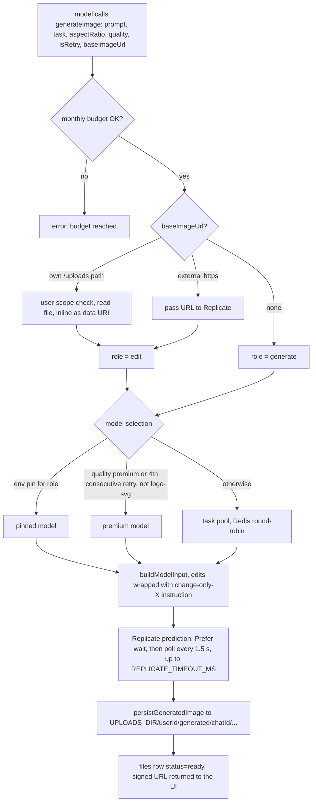
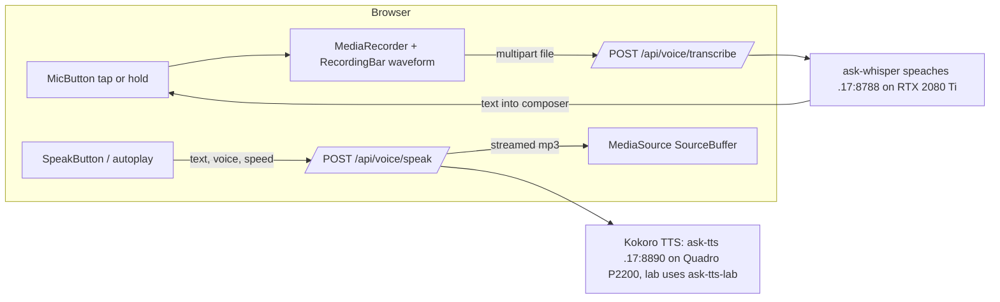
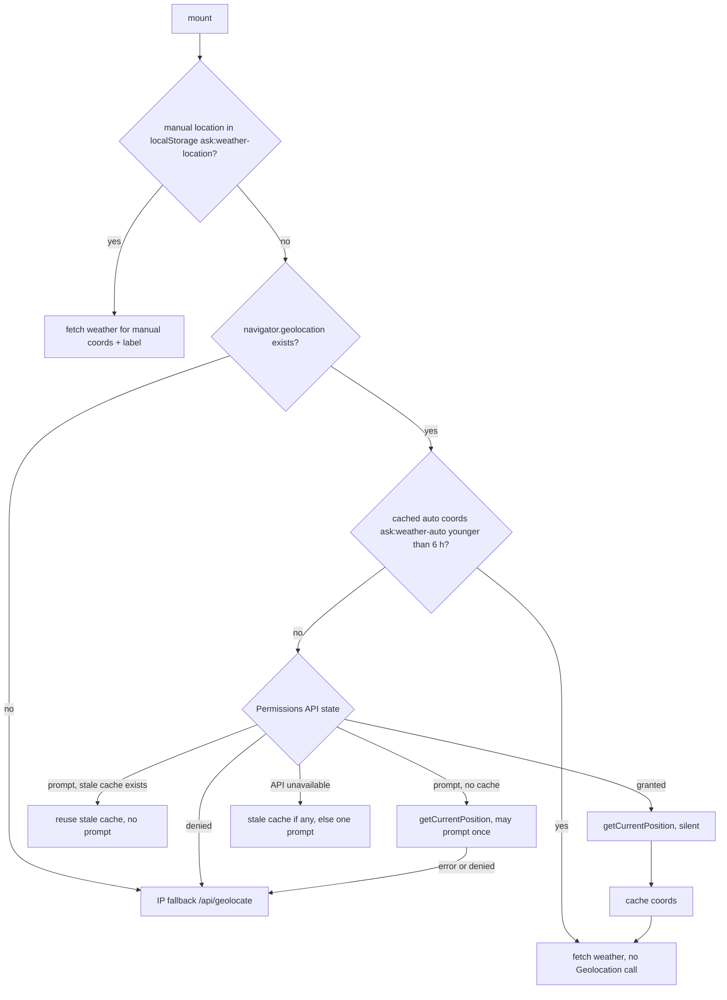

# Media, voice, weather & Discover

This page covers the features that are not text search: **image generation**,
**voice** (read-aloud and dictation), the **weather widget**, and the **Discover** news
briefing.

## Image generation

### When the tool exists

`generateImage` (`lib/tools/generate-image.ts`) is offered to the researcher only when
`REPLICATE_API_TOKEN` is set **and** the turn has an authenticated user
(`isImageGenEnabled() && userId`, `lib/agents/researcher.ts`). Generated images are stored
in that user's upload area, so ephemeral/guest turns never get the tool. When it is offered,
`IMAGE_TOOL_GUIDANCE` is appended to the system prompt. The guidance is gated identically so
the model is never told about a tool it cannot call.

### Flow



- **Schema tolerance.** Every enum argument (`aspectRatio`, `task`, `quality`, `isRetry`) is coerced and `.catch(undefined)`, so a model that paraphrases a hint ("hd", "high") degrades to "unspecified" instead of failing validation and wasting a retry.
- **Registry** (`lib/imagegen/registry.ts` + 32 JSON files in `lib/imagegen/models/`). Each model declares `modelPath` (Replicate `owner/name`), `capabilities` (`generate`/`edit`), `tier` (`draft`/`standard`/`flagship`/`premium`), task `categories` (`photoreal`, `illustration`, `design-text`, `logo-svg`, `draft-fast`, `general`), the field names for prompt/image/aspect ratio, `defaults`, optional `editDefaults`, and a `costNote`.
- **Selection precedence** (`generate-image.ts` ~L345):
  1. **Env pin**: `REPLICATE_IMAGE_MODEL` (generate) / `REPLICATE_IMAGE_EDIT_MODEL` (edit). All environments pin edits to `google/nano-banana-2`; generation is unpinned. The pin wins even over a premium request.
  2. **Premium**: the registry's `premium`-tier model (currently `google/nano-banana-pro`), when `quality:'premium'` is requested or the chat has had 4 consecutive retries (`RETRY_ESCALATION_THRESHOLD`, tracked in Redis for 24 h). SVG/logo requests never escalate, because no premium model emits SVG.
  3. **Rotation**: `resolveImagePool` filters by role, task (a prompt containing "svg"/"vector" is forced to `logo-svg`), excludes draft-tier unless `draft-fast`, falls back to the general pool when empty, and prefers models supporting the requested aspect ratio. `nextRotationIndex` round-robins per pool key in Redis.
- **Edits** preserve the source's shape with `match_input_image` when the model supports it and no ratio was requested, and merge `editDefaults` (e.g. higher quality for edits).
- **Budget** (`lib/imagegen/budget.ts`): `REPLICATE_MONTHLY_BUDGET` caps generations per UTC calendar month. Unset or 0 means unlimited and Redis is not touched. When a budget is set and Redis cannot be read, generation is **denied** (fail-closed, to protect spend).
- **Persistence** (`lib/imagegen/persist-image.ts`): downloads Replicate's output, writes `<userId>/generated/<chatId|none>/<ts>-<rand>.<ext>`, inserts a `files` row with `status='ready'` (so the ingestor never claims it), and returns a signed URL. The `generated` path segment exempts it from the [upload TTL sweep](/knowledge/rag-uploads#_10-ttl-sweep); the SVG `sandbox` CSP on `/uploads` covers `recraft-v4.1-svg` output.
- **Rendering.** The image card renders as answer content, outside the research accordion (`components/render-message.tsx`).

| Env var | Default | Effect |
|---|---|---|
| `REPLICATE_API_TOKEN` | unset → feature off | Replicate auth (secret) |
| `REPLICATE_IMAGE_MODEL` / `REPLICATE_IMAGE_EDIT_MODEL` | unset / `google/nano-banana-2` (compose) | Per-role pin; an unknown or incapable pin warns and falls back to rotation |
| `REPLICATE_MONTHLY_BUDGET` | unlimited | Generations per UTC month |
| `REPLICATE_TIMEOUT_MS` | 120000 | Whole-prediction bound |

**Add a model:** drop a JSON file into `lib/imagegen/models/`, import it and add it to `MODELS` in `registry.ts`. Only one `premium` model per role is used (the first found).

## Voice

Voice is fully self-hosted and fail-open: if any voice service is down, text chat is
unaffected.

| Gate | Where read | Notes |
|---|---|---|
| `VOICE_ENABLED=true` | server, per request (`lib/voice/config.ts`) | Off → `/api/voice/speak` and `/api/voice/transcribe` return 404 and no speech part is emitted. Set in the base compose, so all environments have it |
| `NEXT_PUBLIC_VOICE_ENABLED=true` | client, **inlined at build time** | Must be in each worktree's `.env` **before** `next build`. Setting it only under compose `environment:` ships the bundle with it undefined, and the voice UI disappears |

Both routes also require an authenticated user (401 otherwise).



### Read-aloud (Kokoro TTS)

- **Voice mode toggle.** When on (`localStorage.voiceMode`), each chat request carries `voice: true`. After the answer finishes, the server emits a `data-spokenGist` part (`lib/voice/emit-spoken-gist.ts`). Despite the name, it is the **full answer**, cleaned for speech by `stripForSpeech` (markdown, citations and URLs removed) and truncated at a sentence boundary past 20,000 chars. No extra model call is made. (Until 2026-08-15, commit `ca098cd2`, a granite model condensed the answer into a 2–3 sentence gist. `lib/voice/spoken-gist.ts` / `condenseForSpeech` and `VOICE_GIST_MODEL_ID` are now unused leftovers.)
- **Listen button.** `SpeakButton` sits in the answer's action row (`components/message-actions.tsx`) for answers that carry the part, and autoplays on the latest answer while voice mode is on.
- **Playback** (`hooks/use-speech-playback.ts`): **single-flight**. A new `speak()` aborts the previous fetch and bumps a generation counter, so voices never overlap. It is **progressive**: the mp3 stream is pumped into a `MediaSource` `SourceBuffer`, so audio starts on the first bytes (about 0.2 s, versus about 9 s to buffer a full 2k-char clip), with a buffered fallback on browsers without MSE mp3 support.
- **Server** (`app/api/voice/speak/route.ts` → `lib/voice/tts-client.ts`): OpenAI-style `POST $TTS_SERVICE_URL/v1/audio/speech` with `response_format: mp3`, 20,000-char cap. Service failure → 503.
- **Voice and speed** are per-browser settings (`localStorage` `voiceTtsVoice`, `voiceTtsSpeed`) chosen from a curated list in `lib/voice/voices.ts` (9 Kokoro voices, default `af_heart`; speeds 0.9–1.6×, default **1.2×**, clamped to 0.5–2.0). The route validates both; missing or invalid values fall back to `VOICE_TTS_VOICE` / `VOICE_TTS_SPEED`.
- **Where the controls live.** On desktop, the read-aloud toggle and a `VoiceSettingsPopover` sit inline in the composer. On **mobile**, both move into a single "⋯" `ComposerVoiceMenu` popover (`components/voice/composer-voice-menu.tsx`), because the action row cannot fit them without pushing Send off-screen. The mic stays inline because its hold gesture does not work inside a popover.
- **Services.** Prod and staging share `ask-tts` (compose in `/home/nightfury/selfhosted/tts/`, image `kokoro-fastapi-gpu`, host port 8890 → 8880), pinned to the **Quadro P2200** with `CUDA_VISIBLE_DEVICES=<UUID>`. The compose `device_ids` reservation is ignored under WSL2 GPU-PV. The lab runs its own `ask-tts-lab` (`http://ask-tts-lab:8880` inside the lab network, host `:3744`).

### Dictation (Whisper STT)

- **One button, two gestures** (`components/voice/mic-button.tsx`, `lib/voice/gesture.ts`). Recording starts on `pointerdown`. Releasing before **250 ms** (`HOLD_THRESHOLD_MS`) counts as a **tap**: recording continues and is stopped from the `RecordingBar` (pulsing dot, timer, live Web-Audio waveform, Stop / Cancel). Holding for 250 ms or longer counts as **push-to-talk**: recording stops on release (detected at window level, because the button unmounts when the bar appears). Keyboard Enter/Space goes through `onClick`.
- **No auto-submit.** The transcript is appended to the composer and focused for review, and the user sends manually (`handleTranscript` in `components/chat-panel.tsx`).
- **Server** (`app/api/voice/transcribe/route.ts` → `lib/voice/stt-client.ts`): multipart `file`, 25 MB cap (413 over), forwarded as OpenAI-style `POST $WHISPER_SERVICE_URL/v1/audio/transcriptions` with `model=$VOICE_STT_MODEL` (`Systran/faster-distil-whisper-large-v3`).
- **Service.** `ask-whisper` (speaches, compose in `/home/nightfury/selfhosted/whisper/`) on NightFuryX `:8788`, RTX 2080 Ti (shared with the reranker), `int8_float16`. Two gotchas are baked into the compose file:
  - `WHISPER__TTL: '-1'` keeps the model resident. The default 300 s idle unload caused a 6–19 s cold load on nearly every dictation.
  - speaches ignores `PRELOAD_MODELS` and does not auto-download. The model is installed with `POST /v1/models/Systran/faster-distil-whisper-large-v3` (path form). `fleet-boot/ask-fleet-boot.sh` `warm_whisper` re-ensures it at boot.
- **Secure context required.** `getUserMedia` only works over HTTPS or `http://localhost`. Plain-HTTP LAN URLs (`http://192.168.50.17:3742`) show the mic but it fails open to idle. Test dictation on the public HTTPS prod URL, or with Chrome's insecure-origin flag. The first push-to-talk hold on a new origin only triggers the browser permission prompt; recording works from the next press.

::: info Not the same Whisper
The ingestor worker transcribes **uploaded** audio/video with its own CPU faster-whisper
(`large-v3`). The `ask-whisper` GPU service is only for live dictation. See
[RAG & uploads](/knowledge/rag-uploads#worker-path-external-ingestor).
:::

### The removed hands-free loop (Voice "Slice 3")

A hands-free conversation loop (voice activity detection → auto-transcribe → auto-submit →
read the answer → re-arm the mic) was built and validated on the lab, then **removed on
2026-08-22** in commit `b0ff56ad` on `flow-design`. It never shipped to staging or prod.

**Why it was removed:** it worked, but every turn stacked VAD end-of-speech detection,
Whisper, answer generation and TTS, and the per-turn latency made conversation feel
cumbersome. The STT itself was already optimal; the cost was the serial pipeline. A
responsive version would need a streaming design (streaming STT/TTS, barge-in), which is a
much larger subsystem.

**How to revive:** `git revert b0ff56ad` (or cherry-pick the 14 build commits
`746204ca..a10cbf0f`), then `bun install`. The design record is
`docs/superpowers/specs/2026-08-22-hands-free-voice-loop-design.md` and
`docs/superpowers/plans/2026-08-22-hands-free-voice-loop.md`. Known pitfalls if revived:

- `@ricky0123/vad-web@0.0.30` needs **exactly** `onnxruntime-web@1.22.0`. A caret range let bun install 1.27, whose wasm loader breaks with "error loading model file". Pin it with a bun `overrides` entry and vendor the `.mjs` glue and `.wasm` under `public/vad/`.
- **Self-talk loop:** `speak()` must resolve on `onended`/`onerror`/`stop()`, not on `play()`, or the mic re-arms mid-reply and the VAD hears the assistant.
- **Hot mic on a background tab:** gate every detector start on a `visibilitychange` handler.

## Permissions-Policy must allow mic and geolocation

`next.config.mjs` sends, for every path:

```
Permissions-Policy: camera=(), microphone=(self), geolocation=(self), payment=()
```

Both `microphone=(self)` (dictation) and `geolocation=(self)` (weather) are **required**.
`()` means "deny everywhere", including Ask's own origin. The failures are silent: an
earlier hardening pass set `geolocation=()` and the weather widget quietly fell back to
IP-based location for everyone, and `microphone=()` made dictation do nothing (no
`/api/voice/transcribe` requests at all).

::: tip Check the header first
When location or mic "just stopped working", check the header before debugging app code:
`curl -sI https://ask.hbqnexus.win/ | grep -i permissions-policy`
:::

## Weather widget

`hooks/use-weather.ts` backs both the home widget (`weather-widget.tsx`) and the compact
sidebar card (`components/sidebar-weather.tsx`). On mobile the sidebar card collapses to a
one-line summary that expands on tap.

### Location resolution order



**Why the caching and Permissions-API gating exist.** Many browsers, most mobile ones in
particular, treat a geolocation grant as per-session or "allow once". Calling
`getCurrentPosition()` on every mount therefore re-prompted for location on every reload.
The hook now caches auto-detected coordinates for 6 hours and only calls the Geolocation API
when the cache is stale **and** permission is already granted (silent), or on a true first
visit. A stale cache is preferred over re-prompting (fixed 2026-09-17). Weather data itself
is always re-fetched from the chosen coordinates.

Other details:

- `getCurrentPosition` options: `enableHighAccuracy:false`, `timeout: 15000`, `maximumAge: 600000`.
- **IP fallback** `GET /api/geolocate`: calls `ipapi.co` server-side (browser tracking-protection lists block it client-side), geolocating the visitor's public IP from `cf-connecting-ip`, `x-forwarded-for`, then `x-real-ip`. Private or LAN IPs are skipped, in which case the lookup falls back to the server's own egress IP, so LAN clients see the host's city. The app's egress is not behind the VPN (only SearXNG is). Cached 1 h per URL.
- **Weather data** `GET /api/weather?lat&lon`: server-side proxy to Open-Meteo (`revalidate: 300`). Temperatures are Celsius and converted to the user's unit at display time (dual-unit display in the sidebar).
- **City name**: reverse geocoding calls Nominatim **directly from the browser**. A manual pick carries its own label and skips it.
- **Manual location**: worldwide search via `GET /api/geocode` (server-side Nominatim search with a descriptive User-Agent, debounced about 400 ms). The pick is persisted to `ask:weather-location` and overrides auto-detection; "use my location" clears it.

## Discover / news briefing

Two surfaces share `GET /api/discover` (`app/api/discover/route.ts`, unauthenticated):

| Surface | Request | Behaviour |
|---|---|---|
| Home briefing (`components/discover-briefing.tsx`, below the hero, hidden by the `showNewsWidget` setting) | `?topic=mix&mode=preview` | Up to 5 articles, one each from 5 randomly chosen categories |
| Discover page (`app/discover/page.tsx`) | `?topic=<key>&page=N` | Per-topic tabs with infinite scroll (IntersectionObserver), up to 40 per page |

**Sources.** Each of 9 topics (tech, science, finance, art & culture, sports, entertainment,
world, gaming, health) has a list of news domains and seed queries. Queries are
`site:<domain> <query>`, sent in parallel to:

- the environment's **SearXNG** with engine `bing news` (through the shared `fetchSearxngJson` client, so it inherits the primary→fallback circuit breaker; 10 s timeout);
- **degoog** news search (`type=news`) when `DEGOOG_API_URL` is set and `DEGOOG_ENABLED` is not `false`. degoog is currently disabled in every Ask environment, so SearXNG is the only live source.

**Mixing** (`lib/utils/discover-mix.ts`):

- *mix*: shuffle the topics, take 5, run one query each (first domain + first query), keep the first **displayable** result (has a thumbnail and a title of at least 20 chars), tag it with its category, dedupe by URL, shuffle again.
- *per-topic*: `linksForPage` rotates through the domain list 3 at a time (page N shows different sites), combines them with every seed query, dedupes by URL, drops titles under 20 chars, shuffles, and caps at 40. `page` is clamped to 1–20 because the route is public and each request fans out to many upstream searches.
- All text is HTML-entity-decoded server-side. Card links go through `sanitizeHttpUrl` (only http/https) before rendering.

**Home briefing behaviour.** The component keeps a shuffled pool of thumbnailed articles
(up to 12, in practice at most 5 from the mix feed) and shows a window of **4 cards**,
advancing every **20 s** when the pool is larger than 4. It pauses on hover and does not
auto-advance under `prefers-reduced-motion`. Bing thumbnail URLs are trimmed to their stable
`id` parameter, and failed thumbnails fall back to a category-coloured gradient. Each card
has an **Ask Summary** action linking to `/?q=Summary: <url>`.

**Mobile layout.** The grid is `grid-cols-1` → `sm:grid-cols-2` → `lg:grid-cols-4`, so on a
phone the briefing is a tall single column. The empty-chat container therefore uses
`justify-start overflow-y-auto` on mobile and `md:justify-center` on desktop
(`components/chat.tsx`). A centred, non-scrolling flex container previously pushed the
composer off the **top** of the screen on phones, leaving only the news feed visible (fixed
2026-09-12). If content ever gets pushed off-screen on mobile again, inspect the scroll and
overflow container, not only the element that moved.

## How to…

**Verify voice end to end.** `curl` the services directly: `http://192.168.50.17:8788/health` (whisper) and `http://192.168.50.17:8890/health` (TTS). Then in a browser on the HTTPS URL, enable read-aloud, ask a question and confirm `POST /api/voice/speak` returns 200 with `audio/mpeg`. Dictation needs a real microphone on HTTPS.

**Change the default voice or speed for everyone.** Set `VOICE_TTS_VOICE` (must be one of the ids in `lib/voice/voices.ts`) / `VOICE_TTS_SPEED` and recreate the container. Users who picked their own keep their localStorage choice.

**Turn image generation off.** Unset `REPLICATE_API_TOKEN` and recreate. The tool and its prompt guidance disappear together.
