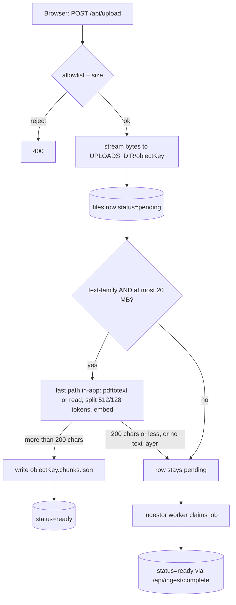
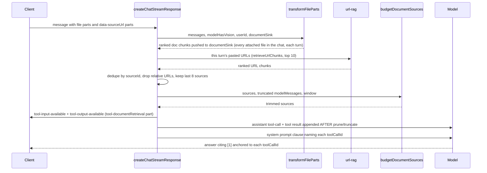

# RAG & uploads

Ask lets a user attach files (documents, code, images, audio, video) and paste URLs into
the composer. Both are turned into **ranked, citable excerpts** that are injected into the
answering model's prompt as a synthetic `documentRetrieval` tool result. This page covers
the whole path: upload intake, the two ingestion paths, chunk storage, retrieval, citation,
context-window budgeting, expiry and file serving.

::: tip Mental model
- Uploads are **files on a local disk volume** plus a JSON sidecar of embedded chunks. They are **not** in pgvector.
- Small text/PDF files are indexed **inside the app** (fast path). Everything else goes to a **separate ingestor worker** that pulls jobs over HTTP.
- At answer time, chunks are ranked **per turn** (cosine, then cross-encoder) and injected **after** history truncation, with their own token budget.
:::

## Components at a glance

| Piece | Where | Role |
|---|---|---|
| Upload endpoint | `app/api/upload/route.ts` | Auth, allowlist, stream to disk, create `files` row, kick fast path |
| Allowlist | `lib/config/upload-allowlist.ts` | Extension **and** media type must pass (shared by server + client picker) |
| Fast-path indexer | `lib/embeddings/upload-rag.ts` (`processFileForRAG`) | `pdftotext` / plain read → chunk → embed → `.chunks.json` |
| Ingest queue API | `app/api/ingest/{claim,progress,complete,file/[id]}` | Token-gated pull queue for the external worker |
| Queue state | `lib/db/file-actions.ts` | Claim / progress / failure / TTL sweep SQL (uses the RLS-bypassing `dbAdmin`) |
| Ingestor worker | `/home/nightfury/selfhosted/ingestor/` (separate dir, **not** in the Ask repo, not under git) | Office/PDF-OCR/image/audio/video extraction, returns chunk **strings** |
| Heartbeat | `lib/utils/ingest-heartbeat.ts` | Redis key proving the worker is alive |
| Answer-time transform | `lib/streaming/helpers/transform-file-parts.ts` | Wait for ingest, vision vs text decision, ranked chunks → document sink |
| URL RAG | `lib/embeddings/url-rag.ts` | Fetch a pasted URL, chunk, embed, rank (ephemeral) |
| Citable injection | `lib/streaming/helpers/document-retrieval-part.ts`, `create-chat-stream-response.ts` | Build the synthetic tool call + UI part |
| Token budget | `lib/streaming/helpers/budget-document-sources.ts` | Trim injected chunks to the real remaining context window |
| File serving | `app/uploads/[...path]/route.ts`, `lib/storage/upload-url-signing.ts` | Serve bytes; optional HMAC-signed expiring URLs |
| TTL sweep | `app/api/maintenance/expire-uploads/route.ts` + `fleet-boot/expire-uploads-daily.sh` | Delete idle uploads (cron-driven) |

## 1. Upload intake

`POST /api/upload` (`app/api/upload/route.ts`) receives the raw file body with metadata in
headers (`x-filename`, `x-chat-id`, `content-type`, `content-length`).

1. **Auth.** `getCurrentUserId()`; no user → 401. (In the lab, `ENABLE_AUTH=false` maps every request to the anonymous `lab-harness` user.)
2. **Allowlist.** `isAllowedUpload(mediaType, filename)` requires an allowed extension **and** an allowed media type/family (`image/`, `audio/`, `video/`, `text/`, PDF, JSON, docx/xlsx/pptx, epub, or `application/octet-stream` for code files). Checking both prevents the octet-stream entry from becoming a wildcard.
3. **Size cap.** `MAX_FILE_SIZE = 2 GB`, a hard-coded constant (not an env var). It is checked against `content-length` up front **and** enforced while streaming via a `Transform` guard, so a lying header cannot fill the disk. The body is streamed straight to disk and is never buffered in memory.
4. **Object key.** `<userId>/chats/<chatId|none>/<Date.now()>-<sanitized-name>`, written under `UPLOADS_DIR` (default `/app/uploads`, a Docker volume per environment). The filename is lower-cased and reduced to `[a-z0-9._-]`; `chatId` (client-controlled) is reduced to `[a-z0-9_-]` so it cannot contain `..`.
5. **DB row.** `createFileRecord` inserts into `files` with `status='pending'` and `chat_id = NULL`. The chat id is deliberately not stored: files are often attached on the home screen *before* the chat row exists, and `files.chat_id` is a foreign key. The chat association lives in the object key and in the message's file part.
6. **Fast-path decision.** If `isTextFamily(mediaType, filename)` (PDF, `text/*`, JSON, or a known code/text extension) **and** size ≤ `FAST_PATH_MAX_BYTES` (20 MB constant), `processFileForRAG` runs fire-and-forget and flips the row to `ready` when it writes a sidecar.
7. **Response.** The client receives `{ id, url, objectKey, status:'pending', … }`. The DB stores the **stable, unsigned** URL; the client gets a signed one (a no-op while signing is not configured, see [§8](#_8-serving-uploads-and-signed-urls)).

::: warning Uploads are local and user-path-scoped, not RLS-scoped
Files live on a local volume, isolated per user by the first path segment of the object key.
The ingest routes use `dbAdmin` (bypasses Row-Level Security) and are protected only by
`INGEST_API_TOKEN`. The answer path rejects any attachment URL whose first segment is not
the requesting user (`transform-file-parts.ts:134`).
:::

## 2. Two ingestion paths



### Fast path (in-app)

`processFileForRAG` (`lib/embeddings/upload-rag.ts:95`):

- PDF → `pdftotext -layout -enc UTF-8` (poppler, installed in the app image); other text-family files are read as UTF-8.
- Text of **200 characters or fewer** is treated as "not meaningful" and the function returns `false`.
- Otherwise: `splitText(text, 512, 128)` (512-token chunks, 128 overlap, js-tiktoken cl100k), embed with `EMBEDDING_MODEL`, write the sidecar, mark `ready`.

If the fast path returns `false` (tiny file, or a scanned PDF with no text layer) the row
simply **stays `pending`** — and because the worker claims *any* pending row, the worker
becomes the fallback (for a scanned PDF it will rasterise and OCR with the VLM). This is an
implicit fallback, not an explicit hand-off.

::: info Observation (not verified in production)
Because `claimNextIngestJob` selects every `pending` row, a worker that wakes up while a
fast-path job is still embedding can claim the same file and re-process it. The result is
duplicate work and the worker's sidecar (1,800-character chunks) overwriting the fast
path's (512-token chunks). It is harmless for correctness but worth knowing if chunk shapes
look inconsistent.
:::

### Worker path (external ingestor)

The ingestor is a small Python service in `/home/nightfury/selfhosted/ingestor/`
(`app/worker.py`, `app/ask_client.py`, `app/extractors/*`). It is **not** in the Ask repo
and not part of any Ask compose file.

**Pull-queue protocol** (all four routes require `Authorization: Bearer $INGEST_API_TOKEN`; unset token → 503, wrong token → 401, constant-time compare in `lib/utils/ingest-auth.ts`):

| Route | Called when | Server effect |
|---|---|---|
| `POST /api/ingest/claim` | Every `POLL_INTERVAL` (15 s) when idle, or immediately after submitting a job | Records heartbeat; finalises stuck rows; atomically claims the oldest `pending` (or stale `processing`) row with `UPDATE … FOR UPDATE SKIP LOCKED`, `attempts+1`; 204 when empty |
| `GET /api/ingest/file/[id]` | After claim | Streams the raw bytes (`nosniff`, path-containment check) |
| `POST /api/ingest/progress` | Several times per job (`downloading`, `parsing`, `ocr page n/N`, `transcribing`, `frames`, `embedding`) | Records heartbeat; updates `ingest_stage` and refreshes `claimed_at` |
| `POST /api/ingest/complete` | End of job | Success: validates ≤ `MAX_CHUNKS` (2000) string chunks, **the app embeds them** (`storeExtractedChunks`, re-splitting any chunk over 4,000 chars) → sidecar → `ready`. Failure: `retryable` + attempts < 3 → back to `pending`, else `failed`. Embedder down → **503**, and the worker sleeps 30 s, sends a progress heartbeat, retries (up to 20 times) |

Queue constants (`lib/db/file-actions.ts`): `MAX_ATTEMPTS = 3`, `STALE_CLAIM_MINUTES = 30`
(a `processing` row whose `claimed_at` is older than that is re-claimable, or finalised as
`failed / retries exhausted` if already at the attempt cap).

**What the worker extracts** (`app/worker.py:family_for`):

| Family | Extractor | Tooling |
|---|---|---|
| `pdf` | text layer via `pdftotext`; if ≤ 200 chars, rasterise at 150 dpi and transcribe each page with the VLM (cap 200 pages) | poppler, VLM |
| `image` | "transcribe text verbatim, then describe; charts: report every value" | VLM |
| `audio` | faster-whisper `large-v3`, **CPU int8 inside the worker container** (not the shared `ask-whisper` GPU service); merged into ~120 s timestamped chunks | faster-whisper |
| `video` | ffmpeg demux → audio extractor, plus scene-change keyframes (`MAX_VIDEO_FRAMES`, 40) captioned by the VLM | ffmpeg, VLM |
| `document` | pandoc (docx/epub/html/md), CSV reader, LibreOffice (xlsx → csv, pptx → pdf), else read as text; split into 1,800-char chunks with 200 overlap | pandoc, LibreOffice |

**The VLM runs at ingest time only.** `VLM_MODEL=qwen3-vl:4b` is served by the **native
Ollama on NightFuryX (.17)** (`OLLAMA_URL=http://host.docker.internal:11434`), which keeps
that model on the **GTX 1070**. The worker serialises VLM calls (one at a time, 8 GB card).
The Ask app itself never calls a VLM on the live answer path (see [§9](#_9-images-vision-vs-non-vision-models)).
Do not evict qwen3-vl from the 1070: image and scanned-PDF ingestion depend on it.

**One worker per environment.** The worker is single-target (one `ASK_URL`), so there are three containers on .17:

| Container | Compose file | Env file | `ASK_URL` |
|---|---|---|---|
| `ingestor` | `docker-compose.yaml` | `.env` | prod `http://192.168.50.17:3738` |
| `ingestor-staging` | `docker-compose.staging.yaml` | `.env.staging` | staging `:3739` |
| `ingestor-lab` | `docker-compose.lab.yaml` | `.env.lab` | lab `:3742` |

Worker env names: `ASK_URL`, `INGEST_API_TOKEN` (both required, fail-fast), `OLLAMA_URL`,
`VLM_MODEL`, `WHISPER_MODEL`, `MAX_VIDEO_FRAMES`, `JOB_CONCURRENCY` (2), `POLL_INTERVAL` (15).
`INGEST_API_TOKEN` must equal the value in the corresponding Ask environment's `.env`.
Today the same token is shared by all three environments (a known security finding; see
[security](/infrastructure/security)). `fleet-boot/ask-fleet-boot.sh` reconciles only the
prod `ingestor` at boot; the lab and staging workers rely on `restart: unless-stopped`.

::: warning Secrets hygiene
`ingestor/.env` is mode 0600, but `.env.lab`, `.env.staging` and the `.env.bak` /
`.env.premigfix` backups in that directory were group/world-readable (0664) at the time of
writing, and they carry `INGEST_API_TOKEN`. `chmod 600` them.
:::

### Worker liveness: heartbeat and "ingest unavailable"

The worker has no health endpoint. Instead, every authenticated `claim` and `progress` call
refreshes the Redis key `ingest:heartbeat` with TTL `INGEST_HEARTBEAT_TTL_S` (default 60 s;
`≤ 0` disables). A 15-second idle poll gives about four missed polls before the key expires.

- `isIngestorAlive()` returns `true` (key present), `false` (expired or never set) or `null` (disabled, or Redis unreadable). **`null` is never treated as down** (fail-open).
- Writes are best-effort and never fail the worker's request.
- Operator check: `docker exec <redis-container> redis-cli TTL ingest:heartbeat` (each environment has its own Redis, so the key name is not environment-prefixed).

### Waiting for ingest on the answer path

When a turn references a file that is still `pending` / `processing`, and the file is a
document **or** an image going to a non-vision model, `waitForIngestReady`
(`transform-file-parts.ts:68`) polls the row:

| Env var | Default | Meaning |
|---|---|---|
| `INGEST_WAIT_TIMEOUT_MS` | `30000` | Maximum wait on the critical path. `≤ 0` disables waiting |
| `INGEST_WAIT_POLL_MS` | `1500` | Poll interval |
| `INGEST_WAIT_UNCLAIMED_MS` | `8000` | Early bail: if the row is **still `pending`** (never claimed) after this long, stop waiting |

After the wait, the model receives one of these notes instead of content:

- still `pending` **and** heartbeat `false` → *"attachment processing is temporarily unavailable … tell the user file/image processing is down"*;
- still `pending`/`processing` otherwise → *"still being processed (stage) … ask again shortly"*;
- `failed` → *"processing failed: {ingest_error}"*;
- `expired` → *"this upload expired after N days of chat inactivity … re-upload"*.

::: info Discrepancy with older notes
Older operational notes say prod waits 120 s (`INGEST_WAIT_TIMEOUT_MS=120000`). Neither the
code (all branches default to `30000`) nor any running container sets this variable. **All
three environments currently wait at most 30 s**, and bail after 8 s if no worker claimed
the job.
:::

## 3. Chunk storage: `.chunks.json` sidecars

Every indexed upload has a sidecar at `<UPLOADS_DIR>/<objectKey>.chunks.json`
(`chunksFilePath`, `upload-rag.ts:36`):

```json
{ "model": "Qwen/Qwen3-Embedding-0.6B", "filename": "report.pdf",
  "chunks": [ { "content": "…", "embedding": [0.01, …1024 floats] } ] }
```

- **Not pgvector.** Only conversation recall (`conversation_chunks`) and long-term memory (`user_memories`) use `vector(1024)` columns. Upload and URL RAG never touch Postgres for vectors.
- The model id is recorded in the file, and the query is embedded with **that** model at retrieval time (`queryFileChunks`), so a sidecar keeps working even if `EMBEDDING_MODEL` changes later (provided the old model is still servable).
- The volume is per environment. Recreating a container keeps it (named volume), but removing the volume loses every upload and sidecar.

## 4. Retrieval: cosine, then cross-encoder

`rankChunks(query, chunks, queryEmbedding, topK = 10)` (`upload-rag.ts:186`) is shared by
uploads and pasted URLs:

1. **Stage 1, bi-encoder:** cosine similarity over **every** chunk (full scan, in process), keep the top `max(topK × 3, 30)` candidates.
2. **Stage 2, cross-encoder:** if `RERANKER_URL` + `RERANKER_API_TOKEN` are configured, POST the candidates to the reranker (`maxLength: 512` so the whole chunk is judged, `timeoutMs: 10000`), sort by its score.
3. **Relevance floor:** drop chunks below `RAG_MIN_SCORE` (default **0.01**, on the cross-encoder scale; `0` disables). If nothing clears it, the source contributes **nothing** this turn, so an off-topic question about an attached document does not produce a citation without support.
4. **Fallback:** if the reranker is unconfigured or throws, return the cosine top-K **unfiltered** (fail-open). The floor is deliberately not applied to cosine scores, because relevant and irrelevant chunks score in a narrow band there (about 0.63 vs 0.57 measured) and the user explicitly attached the file.

The query is the user's text from the message that carried the file (or the filename if
empty) for uploads, and the classifier's standalone query for URLs.

::: info Discrepancy with older notes
The 2026-09-10 review recorded "no score threshold" for document RAG. `RAG_MIN_SCORE` has
since been added; the code is authoritative. The 0.01 value was calibrated against an
earlier reranker model; the live reranker is now `Qwen/Qwen3-Reranker-8B` (see
[memory & recall](/knowledge/memory-recall#reranker-service)). Re-validate the floor if
off-topic excerpts start appearing or relevant ones disappear.
:::

## 5. `documentRetrieval`: making excerpts citable

Documents and URLs do not reach the model as inline text. They become a **synthetic tool
call** that looks exactly like a `search`/`fetch` result, so the existing citation machinery
works unchanged.



Key details (`create-chat-stream-response.ts` around L614–L735, `document-retrieval-part.ts`):

- **Deterministic id.** `documentSourceId(kind, key)` hashes `doc:<objectKey>` or `url:<url>` into a UUID-shaped string. The prompts tell the model a real `toolCallId` is a 36-character UUID and to discard anything else, so a readable slug would be rejected.
- **One result per chunk**, each with URL `<base>#chunk-N`, so excerpts stay individually addressable. The base URL **must be absolute** (`processCitations` runs `new URL()`; a relative `/uploads/…` URL would silently strip the citation). The upload route's `publicUrlFor` builds an absolute URL from the request's `Host` and `x-forwarded-proto`.
- **Both sides see it.** The UI part is written to the stream (and persisted with the assistant message; `message-mapping.ts` rehydrates it on reload), and the matching assistant tool-call + tool-result pair is pushed onto `modelMessages` after pruning/truncation so it cannot be stripped.
- **Prompt permission clause** (`lib/agents/researcher.ts` ~L743): the base prompts restrict citations to `search`/`fetch` calls made this turn. The clause overrides that for the listed ids and instructs the model to cite as `[1](#<toolCallId>)`, always with the digit **1** (the top-ranked excerpt of that source), never a running counter. An earlier version used a placeholder `[n]`, which models copied verbatim and produced dead badges. Titles (attacker-controlled for URLs) pass through `sanitizeSourceTitle()` before entering the system prompt.
- **Documents persist across turns; URLs do not.** Every attached file in the conversation is re-ranked against the current query on every turn. Pasted URLs are fetched only for the turn they were pasted in.
- **Scope.** Only the authenticated streaming path injects documents. The ephemeral/guest path does not.
- **Known limitation:** `[1]` always links to the source's top excerpt, which is not necessarily the one the model actually used.

## 6. Pasted-URL RAG

When the user pastes a bare URL (`^https?://\S+$`) into an **empty** composer, it becomes a
favicon chip and is sent as a `data-sourceUrl` part (`components/chat-panel.tsx` ~L818). A URL
pasted mid-sentence stays inline text and is not RAG'd. On the server,
`convertDataPart` also passes the URL through as plain text so the model sees it.

`retrieveUrlChunks` (`lib/embeddings/url-rag.ts`) reuses the **fetch tool's whole extraction
chain** (SSRF guard, per-URL deadline, YouTube/PDF handling, Crawl4AI → FlareSolverr →
Jina/Tavily → Firecrawl rescue tiers). Bodies under 200 chars or titled `Fetch failed:` are
treated as a miss. The content is split 512/128, embedded, ranked with `rankChunks`, and
**nothing is persisted**. It is fail-open: any error means that URL is simply not grounded.

## 7. Context-window budget for injected documents

Injected sources are appended **after** `truncateMessages`, so they escape its budget. Two
limits apply, in order:

1. **Count cap.** `MAX_INJECTED_DOC_SOURCES = 8` (constant). Sources are ordered history documents first, then this turn's URLs; the **last** 8 are kept, favouring recent attachments. Drops are logged (`[docs] injected sources capped …`).
2. **Token budget.** `budgetDocumentSources()` computes the remaining room as `getMaxAllowedTokens(model, contextWindow)` minus the estimated tokens of the already-truncated messages. This is the same budget and estimator `truncateMessages` uses, and it already reserves the answer plus a 10% buffer. Each chunk is charged its text plus title/URL plus framing overhead. Sources are funded newest-first and chunks best-first, so the lowest-ranked chunks drop first, then whole sources. Survivors keep a contiguous top slice, so `#chunk-N` anchors still resolve.

| Env var | Default | Effect |
|---|---|---|
| `DOC_INJECT_MAX_TOKENS` | unset | Unset: derive purely from the window. Positive: cap lower. `0`: disable clipping (old always-inject behaviour; escape hatch only) |

Telemetry: the `[latency]` line gets the flag `doc_inject_clipped`, and a `[docs] … clipped`
warning reports dropped chunks/sources. Without this budget, 8 sources × 10 chunks × 512
tokens (~40k tokens) could push a small-window model past its `context_length` and turn a
successful retrieval into a provider 400.

## 8. Serving uploads and signed URLs

`GET /uploads/<userId>/(chats|generated)/<chatId>/<file>` (`app/uploads/[...path]/route.ts`)
streams files from `UPLOADS_DIR`. It always:

- rejects anything outside `UPLOADS_DIR` (realpath containment) and any second segment other than `chats` / `generated`;
- infers `Content-Type` from the extension (png/jpg/webp/svg/pdf, otherwise octet-stream);
- sends `X-Content-Type-Options: nosniff`, `Cache-Control: private, max-age=3600`, and on SVGs `Content-Security-Policy: sandbox` (an SVG opened in a new tab would otherwise run embedded script same-origin).

The only consumer is the browser. The LLM provider never fetches these URLs: vision images
are inlined as base64 data URIs and documents are read from disk.

### Signed, expiring URLs (shipped, dormant)

`lib/storage/upload-url-signing.ts` can mint `?exp=<unix>&sig=<hmac>` capability URLs:

- HMAC-SHA256 over `<objectKey>\n<exp>`. The host is not signed (the same file is reached via LAN IP, public domain and tunnel), and the object key starts with `<userId>/`, so the signature binds the owner.
- The **stable, unsigned** URL is what gets persisted. URLs are re-signed at **render time** (`loadChat` → `signUploadUrlsInMessages`) for file parts, `generateImage` output and `documentRetrieval` result cards, so old chats always get fresh links.
- Verification: bad or missing signature → **403**, valid but expired → **410**; comparison is timing-safe.

| Env var | Default | Effect |
|---|---|---|
| `UPLOADS_URL_SECRET` | unset | Unset: signing and verification are no-ops |
| `UPLOADS_REQUIRE_SIGNATURE` | `false` | `true` enforces signatures on GET, **but only if a secret is also set** |
| `UPLOADS_URL_TTL_S` | `3600` | Lifetime of a minted URL |

::: danger Set the secret before requiring signatures
The route enforces only when `uploadSignatureRequired() && isUploadSigningConfigured()`
(`route.ts:55`). Setting `UPLOADS_REQUIRE_SIGNATURE=true` without `UPLOADS_URL_SECRET`
**fails open** and keeps serving unsigned URLs. Enablement order: set a secret of 32+
characters, rebuild or recreate, confirm new uploads carry `exp`/`sig`, then flip
`UPLOADS_REQUIRE_SIGNATURE=true`. Test on the lab first: old chats' images and citations
still render, a fresh upload works, and tampered or expired links return 403/410. None of
the three environments has a secret set today, so the unguessable path (UUID user id +
timestamp) is the only capability. In lab (anonymous user) the user segment is a known
constant, which makes this weaker there.
:::

## 9. Images: vision vs non-vision models

`modelSupportsVision(model)` (`lib/config/model-vision.ts`) decides per turn, and only when
the message has attachments:

- an explicit `vision` boolean on the model config wins;
- for `ollama` models, it asks Ollama `/api/show` and looks for `"vision"` in `capabilities` (cached 10 minutes per model);
- anything unknown or failed → **text-only** (the safe direction: sending an image to a text-only model makes the provider reject the whole turn).

Then `transformPart` (`transform-file-parts.ts:176`):

| Case | What the model receives |
|---|---|
| Vision model + image | The raw image as a base64 data URI **immediately** (no waiting on ingest), **plus** the ingest-time extracted text if already `ready` |
| Non-vision model + image | Only the worker's VLM-extracted text (after the bounded wait). None available → *"no extractable text is available and the selected model cannot view images"* |
| Any model + document | Ranked chunks via `documentRetrieval` (above). Ready but no sidecar: PDFs fall back to full `pdftotext`, other types get "(Could not extract content.)" |

A pointer part `[Attachment <name> — URL: /uploads/<objectKey>]` is added only where content
was actually delivered. The image generation tool uses it as `baseImageUrl` for edits.

::: warning Single point of failure
For non-vision models, image understanding depends entirely on the ingestor worker and on
qwen3-vl on the 1070. If either is down, the user gets the "processing is temporarily
unavailable" or "cannot view images" note. Also note that a transient Ollama blip during
`/api/show` caches `vision=false` for 10 minutes, so a vision model is treated as text-only
for that window.
:::

## 10. TTL sweep

`expireIdleUploads()` (`lib/db/file-actions.ts:246`) is **disabled unless `UPLOAD_TTL_DAYS`
is a positive number** (all three environments set `14`). It:

- selects files whose chat has been idle past the TTL. Activity is `GREATEST(chat.last_viewed_at, chat.created_at, last message)`, falling back to the file's own `created_at` when the chat is gone or `none`;
- **skips `generated/` object keys** (generated images are chat content) and files currently being processed;
- unlinks the bytes and the sidecar, and tombstones the row `status='expired'` (kept so the answer path can tell the user to re-upload);
- then runs `gcOrphanUploads`, which walks the volume and deletes files older than the TTL that match **no** `files` row (capped at 500 deletions per run).

There is **no in-app scheduler**. The sweep runs from the NightFuryX crontab:

```
15 4 * * * /home/nightfury/selfhosted/ask-prod/fleet-boot/expire-uploads-daily.sh
```

The script reads `INGEST_API_TOKEN` from `ingestor/.env` and POSTs to
`/api/maintenance/expire-uploads` on ports 3738, 3739 and 3742, logging to
`~/.local/state/fleet-boot/expire-uploads-daily.log`. The maintenance route reuses the ingest
token gate.

::: info Minor inconsistency
The expiry note shown to the model reads `UPLOAD_TTL_DAYS ?? 14` for its wording, while the
sweep itself treats unset as disabled. They only disagree if the variable is unset.
:::

## Knob reference

| Knob | Kind | Default | Where |
|---|---|---|---|
| `UPLOADS_DIR` | env | `/app/uploads` | upload, ingest, serve, sweep |
| `MAX_FILE_SIZE` | constant | 2 GB | `app/api/upload/route.ts` |
| `FAST_PATH_MAX_BYTES` | constant | 20 MB | `app/api/upload/route.ts` |
| `MAX_CHUNKS` | constant | 2000 | `app/api/ingest/complete/route.ts` (worker path only; fast path is uncapped) |
| `INGEST_API_TOKEN` | env (secret) | unset → ingest routes 503 | app + each ingestor |
| `INGEST_HEARTBEAT_TTL_S` | env | 60 | `lib/utils/ingest-heartbeat.ts` |
| `INGEST_WAIT_TIMEOUT_MS` / `_POLL_MS` / `_UNCLAIMED_MS` | env | 30000 / 1500 / 8000 | `transform-file-parts.ts` |
| `RAG_MIN_SCORE` | env | 0.01 | `upload-rag.ts` |
| `MAX_INJECTED_DOC_SOURCES` | constant | 8 | `create-chat-stream-response.ts` |
| `DOC_INJECT_MAX_TOKENS` | env | unset (derive) | `create-chat-stream-response.ts` |
| `UPLOAD_TTL_DAYS` | env | 0 (disabled); all envs set 14 | `file-actions.ts` |
| `UPLOADS_URL_SECRET` / `UPLOADS_REQUIRE_SIGNATURE` / `UPLOADS_URL_TTL_S` | env | unset / false / 3600 | `upload-url-signing.ts` |
| `EMBEDDING_MODEL` | env | must be `Qwen/Qwen3-Embedding-0.6B` | see [memory & recall](/knowledge/memory-recall#embeddings) |

## How to…

**Diagnose "my file is still processing".** Check the row: `SELECT status, ingest_stage, attempts, ingest_error, claimed_at FROM files WHERE object_key LIKE '%<name>%';`. Then check the heartbeat TTL in that environment's Redis, then `docker logs ingestor[-lab|-staging]`. `pending` with a stale heartbeat means the worker is down. `processing` stuck on an `ocr`/`reading image` stage points at Ollama/qwen3-vl on .17.

**Add a new upload type.** Add the extension to `ALLOWED_EXTENSIONS` (and the media type if it is not already covered) in `lib/config/upload-allowlist.ts`. If it is plain text, add it to `TEXT_EXTENSIONS` in `upload-rag.ts` for the fast path. Otherwise teach the worker's `family_for` / extractors in the ingestor repo, and rebuild all three ingestor containers.

**Change the retrieval depth.** `topK` is 10 in `queryFileChunks` / `retrieveUrlChunks` call sites (`transform-file-parts.ts`, `create-chat-stream-response.ts`). Raising it increases injected tokens; the budget will clip, but more candidates reach the reranker each turn.
