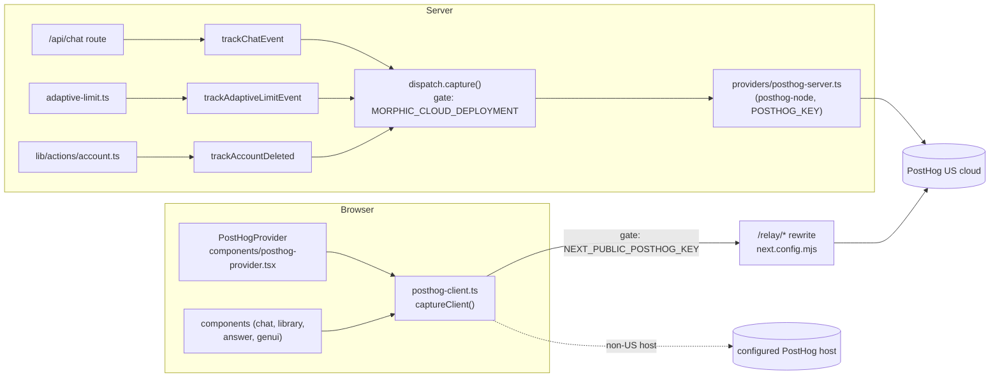
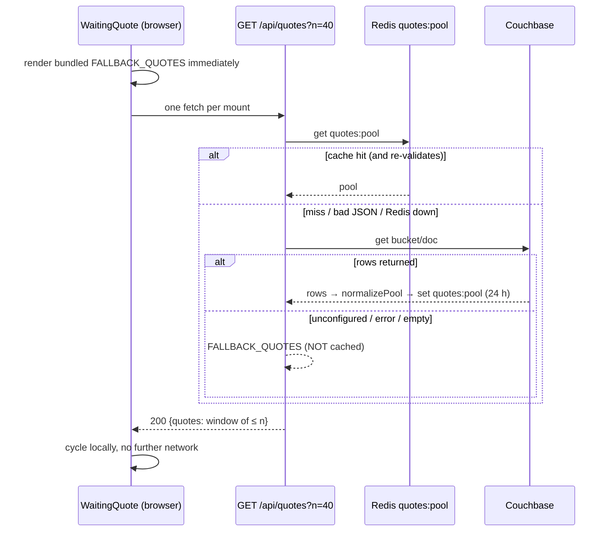

# Analytics & product details

This page covers the small product subsystems that sit around the chat turn but are
not part of it: product analytics (PostHog), the quotes shown while an answer is being
researched, the rotating footer tips, keyboard shortcuts, and which search modes a
user is allowed to pick.

For **latency** instrumentation (`[latency]` lines, `latency:log`) see
[Telemetry](/operations/telemetry) — that is a separate, always-on system and is what
operators actually use to diagnose Ask. For the generative-UI blocks that the
`genui_*` events describe, see [Generative UI](/request-lifecycle/generative-ui).

::: warning On the fleet, server-side analytics is inert
Every server-side analytics call funnels through `capture()`, which returns
immediately unless `MORPHIC_CLOUD_DEPLOYMENT === 'true'`
(`lib/analytics/dispatch.ts:7-12`). The base compose file sets it to `'false'`
(`docker-compose.yaml:22`). Client-side events additionally require a PostHog key at
build time. The analytics code is inherited from the upstream project (Morphic) and is
kept compiling and tested, but lab, staging and prod do not ship events anywhere
unless those variables are deliberately set. Whether a `NEXT_PUBLIC_POSTHOG_KEY` is
baked into any current image is *(unverified)* — the build files in the repo do not
pass one (`grep POSTHOG Dockerfile* docker-compose*.yaml` finds nothing).
:::

## Analytics architecture



Two independent pipes exist, each with its own gate:

| Pipe | Module | Gate | Transport |
|---|---|---|---|
| Server events | `lib/analytics/dispatch.ts` → `lib/analytics/providers/posthog-server.ts` | `MORPHIC_CLOUD_DEPLOYMENT=true` **and** `POSTHOG_KEY` set (`posthog-server.ts:5-7`) | `posthog-node`, `flushAt: 1` — every event is flushed immediately (`posthog-server.ts:10-14`, `:34-35`) |
| Client events | `lib/analytics/posthog-client.ts` | `NEXT_PUBLIC_POSTHOG_KEY` set (`posthog-client.ts:7-15`) | `posthog-js`; `api_host` is `/relay` when the host is empty or US cloud (`posthog-client.ts:17-24`) |

Why the `/relay` reverse proxy: the browser talks to Ask's own origin and Next.js
rewrites `/relay/*` to `us.i.posthog.com` / `us-assets.i.posthog.com`
(`next.config.mjs:62-72`), which avoids ad-blockers dropping third-party analytics
requests. Only the US cloud is proxied; any other `NEXT_PUBLIC_POSTHOG_HOST` is used
directly.

Client defaults are deliberately conservative: `autocapture: false`,
`capture_pageview: false`, session recording disabled and inputs masked
(`posthog-client.ts:25-28`). Page views are sent manually on every pathname change by
`PostHogProvider` (`components/posthog-provider.tsx:35-38`), which is mounted in the
root layout (`app/layout.tsx:122`).

**Identity.** `PostHogProvider` calls `identify(userId)` when a user is signed in and
calls `reset()` only when PostHog currently holds an identified id and the user is now
anonymous — i.e. an actual logout (`components/posthog-provider.tsx:25-33`). Guests
keep a stable distinct id across page loads. The chat route attributes server events
to the user id, or for guests to the `analyticsId` the client sends, so guest server and
client events merge (`app/api/chat/route.ts:261-266`). See
[Auth & accounts](/request-lifecycle/auth-and-accounts) for how the user id is resolved.

### Privacy rules baked into the events

- **The raw query is never sent.** `chat_message_sent` carries a derived
  `QueryShape` — length bucket (`0-20`, `21-50`, `51-120`, `120+`), `hasUrl`, and a
  coarse `lang` of `en`/`other` (`lib/analytics/types.ts:5-19`,
  `lib/analytics/utils.ts:9-32`). Regenerations send no shape because there is no new
  query (`app/api/chat/route.ts:284-289`).
- **Account deletion erases the person.** `trackAccountDeleted` records an anonymous
  counter under the fixed distinct id `account-lifecycle`, then calls PostHog's
  `persons/bulk_delete` with `delete_events: true` for the deleted user
  (`lib/analytics/track-account-event.ts:4-18`,
  `lib/analytics/providers/posthog-server.ts:43-65`). The deletion is a no-op unless
  `POSTHOG_PERSONAL_API_KEY`, `POSTHOG_PROJECT_ID` and `POSTHOG_API_HOST` are all set.
  It is called after the Supabase user is deleted (`lib/actions/account.ts:90`).
- **Analytics must never break a request.** Server capture swallows errors
  (`dispatch.ts:14-18`); the chat route runs tracking in a detached async IIFE after
  the stream response is created, wrapped in its own try/catch
  (`app/api/chat/route.ts:258-306`).

### Server-side events

| Event | Fired from | Properties | Notes |
|---|---|---|---|
| `chat_message_sent` | `app/api/chat/route.ts:291` via `lib/analytics/track-chat-event.ts:13` | `searchMode`, `conversationTurn`, `isNewChat`, `trigger` (`submit-message`/`regenerate-message`), `chatId`, `isGuest`, `userId?`, `providerId`, `modelId`, plus the query shape | `conversationTurn` counts distinct user-message ids incl. the one being sent (`lib/analytics/utils.ts:44-53`); for signed-in users the history is loaded from the DB, for guests it comes from the request body (`route.ts:268-280`) |
| `adaptive_limit_check` | `lib/rate-limit/adaptive-limit.ts:125-131` via `track-adaptive-limit-event.ts:28` | `outcome` (`allowed`/`blocked`), `userId`, `used`, `limit` | See below |
| `account_deleted` | `lib/actions/account.ts:90` | none (anonymous distinct id) | Followed by person deletion |

### Adaptive-limit events

Balanced and Quality ("adaptive") modes have a per-user daily cap, checked in the chat
route for signed-in users only (`app/api/chat/route.ts:205-212`). The limiter
increments the Redis key `rl:adaptive:<userId>:<YYYY-MM-DD>`, expiring at the next UTC
midnight (`lib/rate-limit/adaptive-limit.ts:78-90`); the cap is `ADAPTIVE_CHAT_DAILY_LIMIT`,
default 30 (`adaptive-limit.ts:6-15`). Over the cap it returns a 429 with
`X-RateLimit-*` headers (`adaptive-limit.ts:134-153`).

An `adaptive_limit_check` event fires on **every** enforced check — `allowed` events
give the daily-usage distribution, `blocked` events give the 429 hit-rate used to decide
whether to move the cap (`track-adaptive-limit-event.ts:14-22`). Events fire only when
the check actually ran against Redis (`enforced: true`), so local and unconfigured
deployments do not pollute the dashboard (`adaptive-limit.ts:122-132`).

The limiter itself is inert on the fleet: it short-circuits to "allowed" unless
`MORPHIC_CLOUD_DEPLOYMENT=true` and the Upstash REST variables are set
(`adaptive-limit.ts:47-70`), and a Redis error or 3 s timeout also fails open
(`adaptive-limit.ts:81-110`). This is covered from the security angle in
[Security](/infrastructure/security).

### Client-side events

All go through `captureClient(event, props)` (`lib/analytics/posthog-client.ts:58-65`).

| Area | Events | Where |
|---|---|---|
| Navigation | `$pageview` | `components/posthog-provider.tsx:37` |
| Generative UI | `genui_component_shown`, `genui_component_clicked` (image lightbox), `related_question_clicked` | `components/chat.tsx:310-312`, `lib/render/components/image.tsx:43`, `components/spec-block.tsx:41` |
| Homepage examples | `example_category_opened`, `example_prompt_clicked` | `components/action-buttons.tsx:108-112` |
| Composer cards | `content_card_created`, `content_card_expanded`, `content_card_submitted`, `url_card_created`, `url_card_removed`, `url_card_submitted` | `components/chat-panel.tsx:539-827` |
| Notes / Library | `note_save_clicked`, `note_saved`, `note_save_failed`, `selection_note_actions_shown`, `selection_followup`, `library_auth_prompt_opened`, `library_auth_prompt_cta_clicked`, `library_opened`, `library_list_loaded`, `library_list_load_failed`, `note_opened`, `note_delete_requested`, `note_deleted`, `note_delete_failed`, `library_closed` | `components/message-actions.tsx:138-356`, `components/answer-section.tsx:169-372`, `components/library/library-panel.tsx:174-359` |

To list the current set: `grep -rn "captureClient('" components lib app`.

### The GenUI summary

When an assistant message finishes, `components/chat.tsx:310` calls
`summarizeGenui(text)` (`lib/analytics/genui-summary.ts:23`). It scans the final text
for ` ```spec ` fences, parses each with the same `parseSpecBlock` the renderer uses,
and returns:

| Field | Meaning |
|---|---|
| `blockCount` | Number of spec fences |
| `contentBlockCount` | Blocks other than the related-questions block |
| `imageCount` / `hasImage` | `Image` elements across content blocks |
| `hasRelated` | Whether a related-questions block was present |
| `componentTypes` | Distinct element types across content blocks |

A block that contains any `Button` element is treated as the related-questions block
and excluded from the content metrics, because related-question usage is tracked
separately by `related_question_clicked` (`genui-summary.ts:17-22`, `:45-48`). A block
that fails to parse is skipped rather than failing the summary (`genui-summary.ts:39-43`).
Messages with no spec fences produce no event. **If a new renderable component uses
`Button`, the heuristic will misclassify its block** — update `genui-summary.ts` and
`lib/analytics/__tests__/genui-summary.test.ts` together.

### Feature flags

`posthog-client.ts` also exposes `isFeatureEnabled(key)` and
`subscribeFeatureFlags(cb)` (`posthog-client.ts:67-82`). Both return the control path
(false / no-op) when no key is configured or before flags have loaded. Ask's own
experiments do **not** use PostHog flags; they use env flags and lab A/B runs — see
[Evaluation](/operations/evaluation).

## Waiting quotes

While a turn is in progress, the research-process accordion shows `WaitingQuote`: an
elapsed-time counter plus a quote that reveals word by word
(`components/research-process-section.tsx:554`, `components/waiting-quote.tsx:43`).
It exists because Quality-mode turns can run for minutes; the elapsed timer tells the
user the turn is alive, and the quote gives them something to read. It is pure
decoration, so every failure path degrades silently to a bundled set.



### Pool and sources

- **Route:** `app/api/quotes/route.ts`. Degradation order is Redis → Couchbase →
  bundled (`route.ts:58-82`). It always returns 200; nothing in it may throw
  (`route.ts:106-122`).
- **Redis cache:** key `quotes:pool`, TTL 24 h (`route.ts:17-18`), reusing the
  telemetry Redis client (`getLatencyRedis`). The cached value is **re-validated on
  read** with `normalizePool`, because anything holding the Redis credentials could have
  written it and an older format may still be cached (`route.ts:40-45`).
- **Couchbase:** `lib/quotes/couchbase-quotes.ts` reads one document whose `quotes`
  field is an array of `{ q, a }`. Configuration names: `COUCHBASE_URL`,
  `COUCHBASE_USERNAME`, `COUCHBASE_PASSWORD`, optional `COUCHBASE_QUOTES_BUCKET`
  (default `Quotes`) and `COUCHBASE_QUOTES_DOC` (default `quotes_collection`)
  (`couchbase-quotes.ts:45-68`). One connection is held for the process lifetime; a
  failed connect is not cached so the next call retries (`couchbase-quotes.ts:23-38`).
  If any of the three required variables is missing it logs **once per process**
  `[quotes] Couchbase not configured (missing …)` — this line is the only signal that
  prod is serving the small bundled set instead of the full library
  (`couchbase-quotes.ts:49-64`). The Couchbase host itself is listed in
  [Services](/infrastructure/services).
- **Bundled fallback:** 22 quotes in `lib/quotes/fallback-quotes.ts:8`. The fallback
  is deliberately **not** written to Redis: caching it for 24 h would outlast the
  Couchbase outage that caused it (`route.ts:71-74`).
- **Normalisation:** `normalizePool` keeps rows with non-empty `q` and `a`, trims,
  de-duplicates case-insensitively and Fisher–Yates shuffles once server-side
  (`lib/quotes/quote-pool.ts:8-46`). There is intentionally **no length filter** — the
  timing function adapts to long quotes.
- **Batching:** `?n=` is clamped to 1–100 (default 40) (`route.ts:19-20`, `:85-89`);
  the response is a contiguous window starting at a random offset, wrapping, capped at
  the pool size so short pools do not repeat within a batch (`route.ts:97-104`).

### Timing

`quoteTiming(text)` (`lib/quotes/quote-timing.ts:44`) decides how long each quote stays.
Reveal time and reading time are **not summed** — reading happens during the reveal —
so the display time is the maximum of three demands (`quote-timing.ts:76`):

| Demand | Rule | Constants |
|---|---|---|
| Reveal + tail | 300 ms/word, compressed so the whole reveal is ≤ 6 s; then a tail of 700 ms + 125 ms/word, capped at 3.2 s | `REVEAL_PER_WORD_MS`, `REVEAL_CEILING_MS`, `TAIL_*` (`quote-timing.ts:9-21`) |
| Reading | 15 chars/s × a difficulty factor (avg word length vs 5.1, clamped 0.9–1.3) + 180 ms per `, ; : . … —` | `READ_CPS`, `PAUSE_MS`, `AVG_WORD_CHARS` (`quote-timing.ts:13-27`) |
| Floor | 3 s minimum | `FLOOR_MS` (`quote-timing.ts:23`) |

The component fades out 420 ms before the end and shows the author 150 ms after the
last word (`quote-timing.ts:92-93`, `components/waiting-quote.tsx:96-99`). Each quote
uses one of five reveal animations, never the same one twice in a row
(`waiting-quote.tsx:13-34`). The elapsed counter is computed from a start timestamp, not
by counting ticks, because background tabs throttle `setInterval`
(`waiting-quote.tsx:71-82`).

**How to change the quote library:** edit the Couchbase document, then delete the
Redis key `quotes:pool` (or wait up to 24 h). To change the offline set, edit
`lib/quotes/fallback-quotes.ts`. Tests: `lib/quotes/__tests__/*` and
`components/__tests__/waiting-quote.test.tsx`.

## Footer tips

Below the conversation, when no answer is streaming, `ChatFooterMessage`
(`components/chat-footer-message.tsx:54-57`, mounted at
`components/chat-messages.tsx:319`) types out, in turn, the disclaimer
"Ask can make mistakes. Please double-check responses." and then a shuffled list of
keyboard-shortcut tips (`lib/footer-tips.ts:3-28`). The typewriter cadence comes from
`hooks/use-typewriter-cycle.ts:26-32`: first item 5 s, subsequent items 15 s, 15 s idle
between items, 25 ms per character, 300 ms initial delay.

The tips are derived from the shortcut table, so adding a shortcut to
`SHORTCUT_ENTRIES` in `lib/footer-tips.ts:6-14` is all it takes to advertise it. Tips
are built lazily on the client because the ⌘/Ctrl label depends on `navigator`, which
would cause a hydration mismatch on the server (`lib/footer-tips.ts:18-28`).

## Keyboard shortcuts

Defined once in `lib/keyboard-shortcuts.ts:11-62`. "Mod" is ⌘ on macOS and Ctrl
elsewhere; `matchesShortcut` accepts either `metaKey` or `ctrlKey` and ignores
auto-repeat and Alt combinations (`lib/keyboard-shortcuts.ts:81-95`).

| Shortcut | Action | Handled by |
|---|---|---|
| Mod+B | Toggle sidebar | `components/keyboard-shortcut-handler.tsx:45` |
| Mod+Shift+O | New chat | event `shortcut:new-chat` → `components/chat-panel.tsx:297` (the sidebar's New chat item dispatches the same event, `components/app-sidebar.tsx:230`) |
| Mod+Shift+D | Cycle theme dark → light → system | `keyboard-shortcut-handler.tsx:53-55` |
| Mod+Shift+C | Copy latest assistant message | event `shortcut:copy-message` → `components/chat.tsx:684` |
| Mod+Shift+M | Cycle search mode Speed → Balanced → Quality (writes the `searchMode` cookie, toasts) | `keyboard-shortcut-handler.tsx:63-71` |
| Mod+Shift+F | Cycle sources Web → Academic → Social (writes the `sources` cookie) | `keyboard-shortcut-handler.tsx:73-89` |
| Mod+/ | Show the shortcuts dialog (Shift ignored, since `/` needs Shift on some layouts) | `components/keyboard-shortcut-dialog.tsx:37` |

`KeyboardShortcutHandler` is mounted once in the root layout (`app/layout.tsx:141`) and
registers each binding with `useKeyboardShortcut` (`hooks/use-keyboard-shortcut.ts`),
which calls `preventDefault()` on a match. Actions that need component state (new chat,
copy, dialog) are decoupled through `window` custom events named in `SHORTCUT_EVENTS`
(`lib/keyboard-shortcuts.ts:64-68`) so the global handler does not need a reference to
the chat component.

**How to add a shortcut:** add an entry to `SHORTCUTS`; bind it in
`keyboard-shortcut-handler.tsx` (directly, or by dispatching a new `SHORTCUT_EVENTS`
entry that the owning component listens for); add it to `SHORTCUT_ENTRIES` in
`lib/footer-tips.ts` if it should appear as a tip. The dialog lists every `SHORTCUTS`
entry except `showShortcuts` automatically (`keyboard-shortcut-dialog.tsx:20-22`).
Check for collisions with browser defaults (Mod+Shift+D, for instance, is "bookmark all
tabs" in some browsers; `preventDefault` wins only while the page has focus).

## Search-mode availability

The three modes — Speed, Balanced, Quality — are defined in
`lib/config/search-modes.ts`; what each does is in [Search pipeline](/search/pipeline).
The selected mode lives in the `searchMode` cookie; legacy values `quick` and
`adaptive` map to `speed` and `balanced`, and the default is `balanced`
(`components/search-mode-selector.tsx:23-31`).

Who may use which mode is decided by `lib/search-mode-availability.ts:6-29`:

- `requiresAdaptiveModeAuth` is true only for a **guest on a cloud deployment**
  (`MORPHIC_CLOUD_DEPLOYMENT=true`).
- `isAdaptiveModeAuthBlocked` blocks `balanced` and `quality` in that case.

The rule is enforced in three places so that UI and server agree:

1. The selector and composer — `components/chat-panel.tsx:187-194` — steer a blocked
   guest to Speed / a sign-in prompt instead of submitting.
2. `components/chat.tsx:152-172` re-checks the cookie at send time and opens the auth
   modal with `ADAPTIVE_MODE_AUTH_REQUIRED_MESSAGE` for a blocked send.
3. The chat route returns **401** `{ error, mode: 'balanced', authRequired: true }`
   before model selection (`app/api/chat/route.ts:163-182`), so a guest always sees the
   intended auth prompt rather than a lower-level configuration error.

On lab, staging and prod `MORPHIC_CLOUD_DEPLOYMENT` is `false`, so **all three modes
are available to everyone** and the adaptive daily limit never runs. `app/page.tsx:11`
also uses the same variable to hide the model selector on cloud deployments
(`components/chat-panel.tsx:942`).

## Related

- [Telemetry](/operations/telemetry) — latency instrumentation actually used on the fleet.
- [Generative UI](/request-lifecycle/generative-ui) — the spec blocks summarised above.
- [Frontend](/request-lifecycle/frontend) — where these components sit in the tree.
- [Data layer](/infrastructure/data-layer) — the Redis keys `quotes:pool` and `rl:*`.
- [Env flags](/reference/env-flags) — every variable named here.
