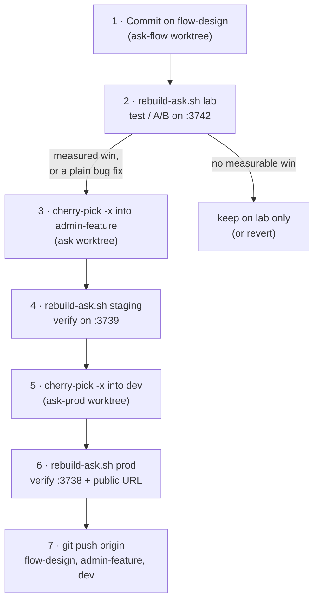

# Deploy

Every change follows the same path: **build and measure on the lab, port the isolated
result to staging and prod with `git cherry-pick -x`, rebuild each stack with
`fleet-boot/rebuild-ask.sh`, verify, push.** Worktrees, branches and ports are
explained in [Environments](/operations/environments).



## 1. Lab first

Architectural changes (anything that alters the retrieval pipeline, turn orchestration,
prompts, step budgets, streaming) are built on `flow-design` in
`/home/nightfury/selfhosted/ask-flow` and deployed to the lab first. The lab exists so one
variable moves at a time; prod carries real traffic and has no control arm. Only the
component that **measured** positive is ported, as its own commit — the surrounding
experiment stays on the lab. The `needsSources` gate is the canonical example: the
whole pipeline experiment ran on the lab and only the one piece that won was ported.

Plain bug fixes and non-architectural changes (a broken tool, a timeout, a model swap)
may skip the measurement step, but should still be committed on `flow-design` first so
the lab stays a superset of prod.

How to measure is covered in [Testing & QA](/operations/testing-qa#lab-a-b-methodology).

## 2. Port with `cherry-pick -x`

`dev` and `admin-feature` are **no longer fast-forward related** — they carry different
commit hashes for the same changes (e.g. the same fix is `2b321bf6` on `dev` and
`7e52dfe1` on `admin-feature`, both annotated "cherry picked from commit d863157e…",
the `flow-design` hash). So each branch receives the lab commit directly:

```bash
# staging
cd /home/nightfury/selfhosted/ask
git cherry-pick -x <flow-design-sha>

# prod
cd /home/nightfury/selfhosted/ask-prod
git cherry-pick -x <flow-design-sha>
```

`-x` appends `(cherry picked from commit …)` so the lab origin of every prod commit is
traceable (`git log --grep 'cherry picked from'`).

::: warning Do git work where the branch lives
`dev` is checked out in `ask-prod`, `admin-feature` in `ask`, `flow-design` in
`ask-flow`. A branch can be checked out in only one worktree, so `git checkout dev`
from `ask` fails. Also avoid `git push origin admin-feature:dev`-style refspec pushes:
they move the remote ref without moving local `dev`, which once left local `dev`
~100 commits behind `origin/dev` for weeks.
:::

Older notes describe "ff-merge `admin-feature` into `dev`". That stopped being possible
once the histories diverged (a 2026-07-26 merge reconciled a squashed `dev`; since then
changes are cherry-picked into each branch).

### Handling conflicts between drifted branches

The three branches drift because porting is one-directional (lab → staging/prod) and
because some commits are environment-specific by design. As of 2026-09-22,
`git cherry flow-design dev` lists 6 patches on `dev` whose content is not on
`flow-design` (e.g. prod/staging TTS host change, the weekly `fleet-update-ask` timer,
the per-env degoog relocation, overlay classifier changes), and
`git cherry dev admin-feature` lists 4 in the other direction.

When a cherry-pick conflicts:

| Conflict in… | Resolve by |
|---|---|
| Application code (`app/`, `lib/`, `components/`) | Keep the target branch's surrounding code and apply only the intent of the lab commit. If the target is *ahead* in that area (a fix authored directly on prod), take the target's version and re-apply the lab change on top. |
| An env overlay (`docker-compose.<env>.yaml`) or the base compose file | Each branch owns the overlay for its own environment. Keep the target branch's values; only port a compose change if it is meant for that environment. The lab's copies of other environments' overlays are not authoritative. |
| `fleet-boot/*` | Take the newest behaviour — these scripts run fleet-wide and are expected to be identical in all three worktrees (currently they are). |
| Tests | Resolve with the code; run `bun run test` on the target worktree and compare against the known-failure list. |

To stop the lab drifting behind prod, periodically **back-merge** `dev` into
`flow-design` (last done 2026-08-22, merge `dd7e0ca1`; pre-merge lab tip tagged
`lab-archive-2026-08-22`). Check with:

```bash
cd /home/nightfury/selfhosted/ask-flow
git cherry -v flow-design dev | grep '^+'     # prod patches missing from the lab
git rev-list --count dev ^flow-design         # commits (by hash) missing from the lab
```

## 3. Rebuild with `rebuild-ask.sh`

```bash
/home/nightfury/selfhosted/ask-prod/fleet-boot/rebuild-ask.sh staging
/home/nightfury/selfhosted/ask-prod/fleet-boot/rebuild-ask.sh prod
```

(The script is identical in all three worktrees and always builds from the correct
worktree regardless of where it is invoked from.) What it does
(`fleet-boot/rebuild-ask.sh`):

1. `cd` into the env's worktree and run
   `docker compose <env -f files> -p <project> up -d --build ask`.
2. If the build or `up` fails: print a message and exit **without** reclaiming (the
   build cache is kept for a faster retry).
3. Poll `http://localhost:<port>/` every 5 s for up to 6 minutes until it returns 200,
   then print `final :<port> -> <code>`.
4. If the final code is not 200: print `== FAILED ==` and exit 1 **without** reclaiming, so the
   previous image (now dangling) is still there for a rollback. Otherwise run
   `fleet-boot/reclaim-space.sh` and print `== done ==`.

::: danger Run rebuilds in the foreground, one at a time
A Next.js production build is memory-heavy. Rebuilds started in the background (or
several stacks at once) have been killed mid-build, and one concurrent rebuild left
`ask-lab` stuck in `Created` until its gluetun/searxng pair was recreated. Run one
`rebuild-ask.sh` at a time in a foreground terminal and wait for `== done ==`.
:::

::: warning A non-200 result fails the script
Since 2026-09-23 the script exits 1 when the app never returns 200 (before that it exited 0 and
reclaimed anyway). A `final :<port> -> 000` (or 5xx) means the container is crash-looping — go to
[reading logs](/operations/runbooks#reading-logs).
:::

Rebuild even when a commit touches only compose files or docs. The resulting image is
functionally the same, but the invariant "each stack's image was built from its own
tree at its branch tip" is what makes "what is prod running?" answerable.

### Reclaim space

`fleet-boot/reclaim-space.sh` runs `docker builder prune -f` (all unused build cache)
and `docker image prune -f` (**dangling** images only). It never uses `-a`, never removes
containers, volumes or networks, and never removes tagged images, so it is always safe
after a build. Each rebuild leaves the previous image dangling plus build cache; one busy
day once accumulated ~23 GB. The app host currently has ample disk, so this is hygiene —
but `rebuild-ask.sh` does it automatically so it cannot be forgotten. Do not deploy with a
bare `docker compose … up -d --build`.

The daily cron `fleet-boot/docker-maintenance.sh` (04:30) is the conservative
complement: dangling images plus build cache older than 7 days, and a warning to the
journal if `/` is above 85 %.

## Migrations at boot

The image's entrypoint runs `bun run migrate` and only then `next start`, under
`set -e` (`Dockerfile`, runtime stage). Migrations are the numbered SQL files in
`drizzle/`, applied by `lib/db/migrate.ts` with the **owner** `DATABASE_URL` (the app
runtime uses the restricted `app_user`). Consequences:

- A migration error means **the container never becomes healthy** — it exits and
  `restart: unless-stopped` loops it. The previous image is already gone from the
  container, so a broken migration is an outage.
- Migrations are forward-only; there are no down-migrations.

For a migration that is heavy or needs superuser rights, pre-apply it before deploying:

1. Create extensions/indexes by hand on each target DB as the owner, using
   `CREATE INDEX CONCURRENTLY IF NOT EXISTS …` on prod so writes are never locked, e.g.
   `docker exec -it ask-postgres psql -U morphic -d morphic`.
2. Confirm `indisvalid = true` for the new indexes (`pg_index`).
3. Deploy. The migration's own `IF NOT EXISTS` statements are then no-ops.

This was the procedure for `0021_pg_trgm_search_indexes.sql` (extension + two GIN
indexes) on 2026-08-18. Schema details: [Data layer](/infrastructure/data-layer).

## 4. Verify

After each stack's rebuild:

```bash
docker ps --filter name=^ask$ --format '{{.Names}} {{.Status}}'   # expect "(healthy)"
curl -s -o /dev/null -w '%{http_code}\n' http://localhost:3738/     # 200
curl -s -o /dev/null -w '%{http_code}\n' https://ask.hbqnexus.win/  # prod only
docker logs --since 5m ask 2>&1 | tail -50                          # migrations ran, no errors
docker exec ask printenv SOME_FLAG                                   # if the change is flag-gated
```

Then exercise the change in a browser (prod/staging with the test account). Keep live
test searches to a minimum — see [Testing & QA](/operations/testing-qa#no-live-search-probing).

## 5. Push

Push each branch from its own worktree:

```bash
cd /home/nightfury/selfhosted/ask-flow && git push origin flow-design
cd /home/nightfury/selfhosted/ask      && git push origin admin-feature
cd /home/nightfury/selfhosted/ask-prod && git push origin dev
```

## Commit authorship

All commits are authored by the maintainer, **Tin Tran `<hbq.dev@gmail.com>`**, as the
sole author (the last 200 commits on `dev` all carry that author and no trailers). Do not
add `Co-Authored-By:` or any AI-tool attribution lines to commits or PR descriptions.
Check before pushing:

```bash
git log origin/dev..dev --format='%an <%ae>%n%B' | grep -iE 'co-authored|generated with' && echo "FIX BEFORE PUSH"
```

## Env-only changes

Many behaviours are env flags (see [Env flags reference](/reference/env-flags)). Changing
one does not need a code commit, but it does need the container recreated.

| Where the value lives | How to change it |
|---|---|
| Prod `.env` (`/home/nightfury/selfhosted/ask-prod/.env`) | Preferably the **Model Manager** (below). By hand: edit, then `cd ask-prod && docker compose -p ask-stack -f docker-compose.yaml -f docker-compose.vpn.yaml up -d --force-recreate --no-deps ask`. |
| Staging / lab `.env` | Edit, then the same `up -d --force-recreate --no-deps ask` with that env's `-p` and `-f` set. |
| A compose `environment:` entry | That is a tracked file: commit it on the env's branch (lab first where relevant), then recreate. Because overlay `environment:` wins over `.env`, a value hardcoded in an overlay cannot be changed from `.env`. |
| A `NEXT_PUBLIC_*` variable | Build-time: edit `.env`, then `rebuild-ask.sh <env>`. |

`--force-recreate` guarantees the new `.env` is read; a plain `up -d` may leave the
container as it is. Env-only changes have no build, so no reclaim is needed.

::: warning Some values are set in more than one place
`CLASSIFIER_MODEL_ID` comes from `.env` on prod but is **hardcoded in the staging and
lab overlays**. Changing the classifier fleet-wide means the prod `.env` plus a commit to
each overlay. Check `docker exec <c> printenv <NAME>` on all three afterwards.
:::

### Ask Model Manager (prod `.env` UI)

A separate Next.js app, source in `selfhosted/model-manager/`, container `model-manager`,
listening on **`127.0.0.1:3939`** on the app host (reach it from another machine with
`ssh -L 3939:127.0.0.1:3939 nightfury@192.168.50.17`). It is password-gated and edits
**prod's** `.env`:

- Shows and validates settings, previews a diff, writes atomically with a timestamped
  backup (`.env.bak.*`, mode 0600), and can restore backups. Writes keep `.env`'s owner and
  mode (since 2026-09-25; an older build left prod's file `root:root 0644`, see
  [Model Manager › file ownership and mode](/infrastructure/model-manager#file-ownership-and-mode)).
- **Apply** runs `docker compose -p ask-stack -f <base> -f <vpn> up -d --force-recreate --no-deps --wait --wait-timeout 120 ask`
  (`selfhosted/model-manager/lib/apply.ts:81-93`) — the same command as a manual prod
  env change, gated on the healthcheck.
- The model picker list is the `OLLAMA_MODELS` comma list.
- Its wiring lives in the model-manager's own (gitignored) `.env`: `ASK_REPO_DIR`,
  `ASK_ENV_PATH`, `ASK_COMPOSE_FILES`, `ASK_COMPOSE_PROJECT=ask-stack`, `ASK_SERVICE=ask`,
  currently pointing at `/home/nightfury/selfhosted/ask-prod`.

::: danger History: the Model Manager once recreated prod from staging
Until 2026-08-09 it pointed at the staging worktree and ran a base-only
`docker compose up -d ask` with no `-p` and no overlays. Because the base file *is* the
prod project, every "apply" recreated **prod** from staging's `.env` without the VPN
overlay. If you re-deploy the Model Manager, verify its `ASK_*` wiring first, and after
an apply cross-check with
`docker inspect ask --format '{{index .Config.Labels "com.docker.compose.project.config_files"}}'`.
:::

The Model Manager has the Docker socket and read-write access to the repo — it is
effectively root on the host. Never expose it beyond loopback. Changes to its own code
need `docker compose up -d --build` in its directory (the running instance is built from
`/home/nightfury/selfhosted/ask/selfhosted/model-manager`).

## Rollback

Each stack has exactly one image tag (`ask-stack-ask:latest` etc.), and
`reclaim-space.sh` deletes the previous (now dangling) image, so there is no ready-made
old image to switch back to. Rollback is a code operation:

1. **Revert** the offending commit on the env's branch, in its worktree:
   `cd /home/nightfury/selfhosted/ask-prod && git revert <sha>` (for a multi-commit port,
   revert each, newest first). Prefer revert over `git reset --hard` so history stays
   linear and pushable.
2. `fleet-boot/rebuild-ask.sh prod`, verify, push.
3. Mirror the revert on `admin-feature` (and `flow-design` if the lab should drop it too).

For a flag-gated change, flipping the flag back (env-only change above) is faster than a
revert — this is one reason risky behaviour ships behind a flag. Commit messages and the
change log record the "rollback" commit for many shipped changes (the prod commit that
preceded the change); see [Changelog](/history/changelog).

::: tip Optional: keep an instant-rollback image
Before a risky prod deploy, tag the running image so reclaim will not delete it:
`docker tag ask-stack-ask:latest ask-stack-ask:pre-<date>`. To roll back without a
rebuild: `docker tag ask-stack-ask:pre-<date> ask-stack-ask:latest`, then
`up -d --no-build --force-recreate --no-deps ask` with prod's `-p`/`-f` set. Remove the
extra tag afterwards (`docker rmi ask-stack-ask:pre-<date>`). *(This procedure is standard
Compose behaviour but has not been exercised on this fleet.)*
:::

::: danger Migrations do not roll back
If the change included a migration, reverting the code does not undo the schema. Additive
migrations (new columns/indexes) are usually harmless to older code; anything
destructive needs a hand-written reverse SQL applied as the owner before the old code
boots.
:::

## Automated image updates (not app code)

`fleet-update-ask.timer` (Sundays 04:30, on .17) runs `fleet-boot/update-ask.sh`, which
pulls and recreates the **sidecar** images (postgres, redis, searxng, gluetun, kokoro) of
the lab (as a canary), then prod, then staging, through `update-images.sh` with the VPN
overlays, then health-checks. It never rebuilds the Ask app image. Since 2026-09-24 the unit
files and `update-ask.sh` are on `flow-design` as well; the lab step exists in the
`flow-design` copy and runs once ported to `dev`, since the timer runs the `ask-prod` copy. See
[fleet scripts](/operations/fleet-scripts#update-ask-sh-fleet-update-ask-service-timer).
