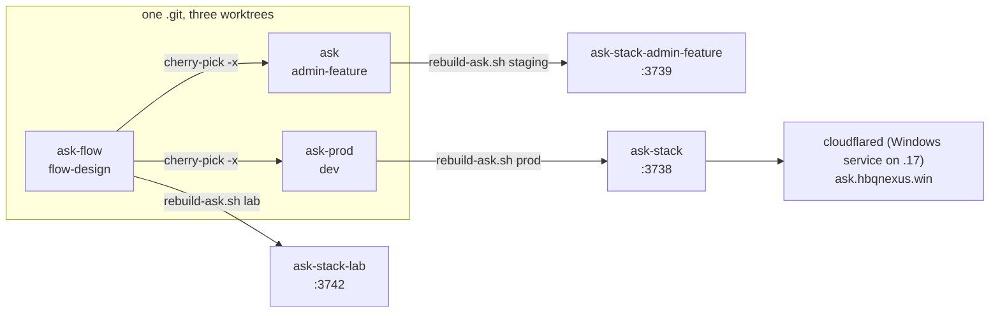

# Environments: lab, staging, prod

Ask runs as three independent Docker Compose stacks on one host, **NightFuryX
(192.168.50.17)**. Each stack is built from its own git **worktree**, pinned to its own
**branch**, with its own Postgres, Redis, SearXNG and VPN sidecar. All three share the
fleet's model services (Ollama, reranker, embedder, crawl4ai, TTS/STT).

| | **Lab** | **Staging** | **Prod** |
|---|---|---|---|
| Purpose | Experiments, architecture changes, A/B measurement | Pre-prod check of a ported change on real auth | Real users |
| Worktree | `/home/nightfury/selfhosted/ask-flow` | `/home/nightfury/selfhosted/ask` | `/home/nightfury/selfhosted/ask-prod` |
| Branch | `flow-design` | `admin-feature` | `dev` |
| Compose project | `ask-stack-lab` | `ask-stack-admin-feature` | `ask-stack` |
| App container | `ask-lab` | `ask-admin-feature` | `ask` |
| App port | **3742** | **3739** | **3738** |
| Auth | **Off** (`ENABLE_AUTH=false`, shared `ANONYMOUS_USER_ID=lab-harness`) | Supabase | Supabase |
| Public URL | none (LAN) | none (LAN) | `https://ask.hbqnexus.win` |
| Image tag | `ask-stack-lab-ask:latest` | `ask-stack-admin-feature-ask:latest` | `ask-stack-ask:latest` |

All three worktrees share one `.git` (`git worktree list` from any of them). A branch
can be checked out in only one worktree, so e.g. `git checkout dev` inside `ask` fails
with *"'dev' is already used by worktree at …/ask-prod"* — do prod git work in `ask-prod`.



## Why separate worktrees

Until 2026-08-01, prod and staging both built from `/home/nightfury/selfhosted/ask`, so
prod shipped whatever branch happened to be checked out there. A `git checkout` alone
does not fix that: the Dockerfile does `COPY . .`, and `.dockerignore` excludes only
`selfhosted/`, `.superpowers/`, `.claude/`, `.git/` and `docs-site/`, so untracked work
in progress and the worktree's `.env` enter the image regardless of branch. Separate
worktrees make "prod's image was built from prod's tree" structurally true.

Compose needed no changes for this: project, container, volume and network names are
all explicit in the compose files, so the same stack is adopted from any directory —
which is also why running compose from the *wrong* directory is dangerous (below).

## Compose projects

Each stack is the base `docker-compose.yaml` plus overlays. Overlays **merge**
`environment:` onto the base (the overlay wins for a given key) and use `!override`
to replace lists such as `ports:` and `volumes:`.

| Env | `-p` | `-f` files (in order) |
|---|---|---|
| Prod | `ask-stack` | `docker-compose.yaml` `docker-compose.vpn.yaml` |
| Staging | `ask-stack-admin-feature` | `docker-compose.yaml` `docker-compose.admin-feature.yaml` `docker-compose.vpn.yaml` `docker-compose.vpn.admin-feature.yaml` |
| Lab | `ask-stack-lab` | `docker-compose.yaml` `docker-compose.lab.yaml` `docker-compose.vpn.lab.yaml` |

These are exactly what `fleet-boot/rebuild-ask.sh` and `fleet-boot/ask-fleet-boot.sh`
use. To confirm what a running container was created from:

```bash
docker inspect ask --format '{{index .Config.Labels "com.docker.compose.project.config_files"}}'
docker inspect ask --format '{{index .Config.Labels "com.docker.compose.project.working_dir"}}'
```

::: danger The base file is prod
`docker-compose.yaml` begins with `name: ask-stack` and sets `container_name: ask`. Any
`docker compose` command that uses only the base file — from any worktree — acts on
**prod**. The Model Manager once did exactly this and recreated prod from the staging
worktree's `.env` (fixed 2026-08-09; see [Deploy](/operations/deploy#env-only-changes)).
:::

### Containers and ports per stack

| Service | Prod | Staging | Lab |
|---|---|---|---|
| App | `ask` `:3738` | `ask-admin-feature` `:3739` | `ask-lab` `:3742` |
| Postgres (pgvector pg17) | `ask-postgres` (no host port) | `ask-postgres-admin-feature` | `ask-postgres-lab` |
| Redis | `ask-redis` | `ask-redis-admin-feature` | `ask-redis-lab` |
| Gluetun VPN (publishes the SearXNG UI) | `ask-gluetun` `:3741` | `ask-gluetun-admin-feature` `:3740` | `ask-gluetun-lab` `:3743` |
| SearXNG (inside gluetun's netns) | `ask-searxng` | `ask-searxng-admin-feature` | `ask-searxng-lab` |
| TTS | shared `ask-tts` `:8890` (project `ask-tts`, `/home/nightfury/selfhosted/tts`) | shared `ask-tts` | own `ask-tts-lab` `:3744` |
| Ingest worker | `ingestor` | `ingestor-staging` | `ingestor-lab` (all from `/home/nightfury/selfhosted/ingestor`) |

Named volumes follow the same pattern: `ask-postgres-data`, `ask-postgres-data-admin-feature`,
`ask-postgres-data-lab`, and likewise for `-redis-data`, `-uploads`, `-model-cache`,
`-searxng-data`. They survive `up --force-recreate` and `down`; only `down -v` deletes them.

::: warning Uploads live in a volume, not the container
`UPLOADS_DIR` is `/app/uploads`, backed by the `ask-uploads*` volume. Never run
`docker compose down -v` on a stack unless you intend to delete its database **and**
every uploaded file.
:::

### VPN sidecar

The `vpn` overlays add a `gluetun` container (Mullvad WireGuard, `FIREWALL: 'on'`
kill-switch) and move SearXNG into its network namespace with
`network_mode: service:gluetun`. Consequences:

- The app reaches SearXNG as `http://ask-gluetun*:8080`, not `ask-searxng*`.
- Only SearXNG egresses through the VPN; the app's own outbound traffic (APIs, crawl4ai,
  Ollama Cloud) does not.
- Restarting or recreating gluetun leaves SearXNG "running" with a dead namespace —
  bring both up together (`up -d gluetun searxng`), or rotate the exit with
  `fleet-boot/rotate-mullvad.sh rotate <stack>` which reconnects in place.
- Without the VPN overlay a stack silently comes back on the residential IP, which
  engines rate-limit. Always include the `vpn` files.

## How the environments differ: env flags, not builds

The staging overlay has **no `build:` or `image:` key**; it inherits `build: context: .`
from the base. All three stacks build the same Dockerfile from their own tree, so the
only intended *behavioural* differences are env vars. Two consequences:

1. A change is "staging only" **only if it is behind an env var** set in the staging
   overlay. An unflagged code change on `dev` reaches prod at prod's next rebuild whether
   or not staging vetted it.
2. When comparing two stacks, check whether they differ in code or only in flags — the
   lab is a genuinely separate branch, so lab-vs-staging comparisons compare code.

Current notable differences (verified from the running containers with
`docker exec <c> printenv <NAME>` on 2026-09-22; the rows touched by the 2026-09-23 fixes were
re-checked on 2026-09-24). `CRAWL4AI_URL` (`http://192.168.50.231:11235`) is now the same in all
three envs; the staging overlay pinned an unresolvable `http://crawl4ai:11235` until 2026-09-23.

| Variable | Prod | Staging | Lab | Why |
|---|---|---|---|---|
| `ENABLE_AUTH` | `true` | `true` | `false` | Lab is driven by scripts without a browser session. |
| `SEARCH_QUALITY_FILTER` | `strict` | `relaxed` | `relaxed` | Prod's answering model is slow at prompt processing, so context size is the binding cost; prod stays conservative. |
| `SEARXNG_CRAWL_MULTIPLIER` | `2` | `4` | `4` | Same reason (candidate pool size). |
| `CLASSIFIER_OLLAMA_BASE_URL` | `.17:11434` | `.17:11434` | `.17:11434` | Same value everywhere; staging/lab overlays hardcode it (they pointed at `.231` until 2026-09-23), prod takes it from `.env`. |
| `FLARESOLVERR_URL` | `.231:8191` | `.231:8191` | `.231:8191` | From `.env`. Before 2026-09-23 it was `http://flaresolverr:8191`, which does not resolve on .17. |
| `TTS_SERVICE_URL` | `.17:8890` | `.17:8890` | `ask-tts-lab:8880` | Lab has its own TTS container. |
| `SEARXNG_FALLBACK_API_URL` | `http://192.168.50.231:8127` (public SearXNG) | same | empty | Lab refuses silent failover so an A/B arm is never measured on a different index. Before 2026-09-23 prod/staging had `http://searxng:8080`, which does not resolve on .17. |
| Lab-only knobs | — | — | `FLOW_VARIANT`, `FLOW_ARCH`, `PIPELINE_SOURCE_CHARS`, shell-overridable `SEARCH_*` toggles | A/B arms against one build. |

The full per-env flag table is on [Env flags reference](/reference/env-flags) and
[Compose services](/reference/compose-services).

::: warning Each env's config lives in its own worktree
The lab worktree also contains copies of `docker-compose.yaml` and
`docker-compose.admin-feature.yaml`, and they drift. They had drifted (the lab's base file
still said `TTS_SERVICE_URL` `.231:8890` and `DEGOOG_ENABLED: 'true'`) until 2026-09-24, when
both were synced to the committed prod (`dev`) and staging (`admin-feature`) versions. They
will drift again whenever a prod or staging compose change is not copied back. Always read or
edit an environment's config **in that environment's worktree**, and treat
`docker exec <container> printenv` as the final word.
:::

Where a value is set, in order of precedence:

1. Compose `environment:` in the overlay (wins),
2. Compose `environment:` in the base file,
3. The worktree's `.env` (`env_file: .env`),
4. The code default (`process.env.X ?? '…'`).

`${VAR:-default}` entries in compose are overridable from the shell or `.env` at
`up` time — the lab uses this so an A/B arm can be switched with
`SEARCH_ROUNDS_MAX=2 docker compose … up -d --force-recreate ask`.

## Hosts, public URL and tunnel

- **App host:** NightFuryX, `192.168.50.17` — Windows + WSL2 with **Docker Desktop**
  (not a native Docker engine). All three stacks, `ask-tts`, `ask-whisper`,
  `reranker-qwen`, the ingestors and `model-manager` run here. The stacks moved here from
  MiniNightFury (`.231`) on 2026-08-23.
- **Public URL:** `https://ask.hbqnexus.win` → a Cloudflare tunnel whose connector
  (`cloudflared`) runs **as a Windows service on .17** and routes to `localhost:3738`.
  The older cloudflared on `.231` still serves other hostnames (public search etc.)
  but no longer has an `ask` route.
- **Staging and lab** are reachable only on the LAN (`http://192.168.50.17:3739`,
  `:3742`). The lab has auth off — never expose it.
- **Model Manager** (`model-manager`) listens on `127.0.0.1:3939` only.

Other fleet hosts (`.160` embedder, `.171` local LLM, `.231` crawl4ai + public search)
are described in [Fleet](/infrastructure/fleet).

::: tip No Ask stacks on .231 any more
The pre-migration copies of all three stacks on MiniNightFury (`.231`, same container names and
ports) were retired on 2026-08-27, came back at that host's 2026-09-16 boot through a stale
`~/ask-fleet-boot.sh`, and were **removed** on 2026-09-23 (containers, networks) and 2026-09-24
(volumes, images and the old checkouts). `fleet-boot/deploy.sh` now syncs .231, whose boot case
reconciles only `crawl4ai` and `flaresolverr`. Every Ask environment runs on `.17`; when checking
one by port, use `192.168.50.17` (or `localhost` on .17). See
[Runbooks](/operations/runbooks#retired-stacks-on-231) and
[D35](/history/decisions#d35-retire-and-remove-the-231-ask-stacks).
:::

## Test account

Prod and staging need a Supabase login. A shared test account exists for QA on both;
its credentials are held by the maintainer and are deliberately not written here. The
lab needs no login.
