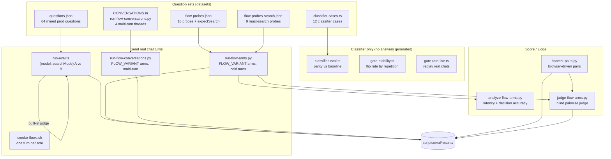
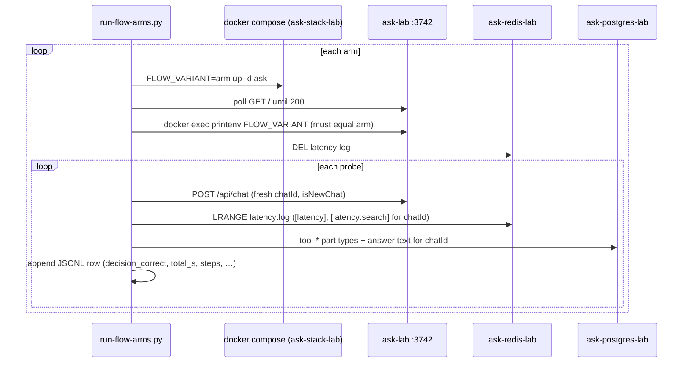

# Evaluation harnesses & scripts

The unit tests under `lib/**/__tests__` check **mechanics** (parsing, persistence, tool
wiring). None of them ask "was this a good answer?" or "did this turn make the right
retrieval decision?". The scripts in `scripts/eval/` exist to answer those two questions
with measurement instead of opinion, and the rest of `scripts/` holds one-shot data
maintenance and debugging tools.

This page is the **reference** for every script: what it measures, how to run it,
what it needs, and where its output lands. The **method** (how to design an A/B that
holds up: interleaving, cache flushes, validity filters, blind judging) is on
[Testing & QA › Lab A/B methodology](/operations/testing-qa#lab-a-b-methodology) and
[Telemetry › Running a lab A/B properly](/operations/telemetry#running-a-lab-a-b-properly).
Read those first, because the harnesses do not enforce the method on their own.

::: danger Live search budget
Every harness that sends real chat turns (`run-eval.ts`, `run-flow-arms.py`,
`run-flow-conversations.py`, `smoke-flows.sh`, `find-ddg-exit.sh`) fires real web
searches through the shared VPN egress. Rotating many distinct queries through the
search engines is the pattern that gets an exit IP flagged
([Testing & QA › No live search probing](/operations/testing-qa#no-live-search-probing)).
Use `--limit`, run on the lab, and prefer the classifier-only harnesses (which send no
turns) whenever the question can be answered without a full answer.
:::

## Map of the harnesses



## Summary table

| Script | Measures | Sends turns? | Target | Run | Output |
|---|---|---|---|---|---|
| `scripts/eval/run-eval.ts` | Answer **quality** of two `(model, searchMode)` configs: objective metrics + pairwise judge | Yes | `EVAL_API_URL` (default staging `:3739`, auth ON; point it at the lab `:3742`) | `bun run eval --config-a A --config-b B` | `scripts/eval/results/<ISO-timestamp>.json` |
| `scripts/eval/mine-questions.ts` | Builds the question set from real prod first messages | No (read-only prod DB) | `ask-postgres` | `bun run eval:mine` | `scripts/eval/questions.json` |
| `scripts/eval/run-flow-arms.py` | Retrieval **decision** + latency/mechanics per `FLOW_VARIANT` arm, cold single turns | Yes | lab (`ASK_LAB_URL`, default `http://localhost:3742`) | `python3 scripts/eval/run-flow-arms.py --arms baseline,adaptive` | `results/flows-<epoch>.jsonl` (or `--out`) |
| `scripts/eval/run-flow-conversations.py` | Same arms, **multi-turn** threads (follow-ups, context growth) | Yes | lab | `python3 scripts/eval/run-flow-conversations.py --arms baseline,adaptive` | `results/flow-conversations.jsonl` |
| `scripts/eval/smoke-flows.sh` | Each flow arm produces an answer at all | Yes (1 per arm) | lab | `scripts/eval/smoke-flows.sh ["question"]` | stdout |
| `scripts/eval/analyze-flow-arms.py` | Summarises a flow-arm JSONL: latency, decision accuracy split by direction, output contract | No | file | `python3 scripts/eval/analyze-flow-arms.py results/flow-arms-run1.jsonl` | stdout |
| `scripts/eval/judge-flow-arms.py` | Blind, side-swapped pairwise quality of each arm vs a baseline arm | No (judge LLM calls only) | Ollama (`JUDGE_OLLAMA_URL`, default `http://192.168.50.17:11434`) | `python3 scripts/eval/judge-flow-arms.py results/X.jsonl --baseline baseline` | stdout, optional `--out` |
| `scripts/eval/harvest-pairs.py` | Reads back telemetry + answers of **browser-driven** staging/lab chat pairs | No | staging + lab DB/Redis | `python3 scripts/eval/harvest-pairs.py --pairs pairs.json` | `results/browser-pairs.jsonl`, `results/browser-judgeinput.jsonl` |
| `scripts/eval/classifier-eval.ts` | Classifier decisions unchanged vs a captured baseline (regression gate) | No (classifier calls) | classifier | `bun scripts/eval/classifier-eval.ts --check` | stdout, exit code |
| `scripts/eval/gate-stability.ts` | How often the `needsSources` gate **flips** on repeated identical questions | No (classifier calls) | classifier | `bun scripts/eval/gate-stability.ts [reps]` | stdout |
| `scripts/eval/gate-rate-live.ts` | Gate rate on **real** chats replayed with their actual history | No (classifier calls) | staging DB (read) | `bun scripts/eval/gate-rate-live.ts [maxChats] [reps]` | stdout |
| `scripts/eval/find-ddg-exit.sh` | Rotates the lab Mullvad exit until DuckDuckGo returns results | 1 reused query per attempt | lab SearXNG (`http://localhost:3743`) | `scripts/eval/find-ddg-exit.sh [maxAttempts]` | stdout |
| `scripts/chat-cli.ts` | Manual one-off chat turn from a terminal (SSE printed live) | Yes | localhost/LAN only | `bun chat -m "…"` | stdout |
| `scripts/test-cache-performance.ts` | Legacy: timing of repeated/regenerated turns | Yes | `API_URL` | `bun scripts/test-cache-performance.ts` | stdout |
| `scripts/backfill-embeddings.ts` | Data migration: re-embed stored vectors | No | DB + embedder | `docker exec ask bun scripts/backfill-embeddings.ts [--apply]` | DB rows |
| `scripts/backfill-file-object-keys.ts` | Data migration: derive object keys from stored file URLs | No | DB | `bun run backfill:file-keys [--apply]` | DB rows |
| `scripts/clean-narration-preambles.ts` | Data cleanup: strip narration preambles from stored answers | No | DB | `bun run clean:narration [--apply]` | DB rows |

The `package.json` aliases are `eval`, `eval:mine`, `chat`, `backfill:file-keys` and
`clean:narration` (`package.json:15-21`). Everything else is invoked by path.

## Datasets

| File | Size | Shape | Purpose / why it exists |
|---|---|---|---|
| `scripts/eval/questions.json` | 64 (`q001`–`q064`) | `[{ id, text, tags? }]` | Real first messages from prod chats. Right for judging **answer quality**, since these are the questions users actually ask. Almost all of them warrant a search, so the set cannot test retrieval *decisions*. |
| `scripts/eval/flow-probes.json` | 16 probes (9 `expectSearch: true`, 7 `false`) | `{ _comment, probes: [{ id, text, expectSearch, why, mustMention? }] }` | A **discriminating** set for control-flow arms: questions a competent assistant should answer from knowledge next to ones that need fresh sources. The `_comment` states that `expectSearch` is a judgement call, not ground truth, and is the weakest part of the harness. |
| `scripts/eval/flow-probes-search.json` | 9 probes (`p07`…) | `{ probes: [...] }` | The must-search subset, used to rerun only the time-sensitive side via `--probes`. |
| `scripts/eval/classifier-cases.ts` | 12 cases | `CASES: { name, messages: UIMessage[] }[]` | Standalone questions, contextual follow-ups, new-entity follow-ups, etc. Exercises the classifier's `skipSearch` / `standaloneQuery` / `needsRecent` / `intent` outputs. |
| `scripts/eval/classifier-baseline.json` | 12 entries, one per case (complete) | `{ [caseName]: { skipSearch, standaloneQuery, needsRecent, intent } }` | The captured "known good" answers for `classifier-eval.ts --check`. |
| `CONVERSATIONS` in `scripts/eval/run-flow-conversations.py:53` | 4 threads (`c1-postgres`, `c2-espresso`, `c3-typescript`, `c4-current`) | turns tagged `fresh` / `followup` / `context` | Follow-ups and context accumulation only exist from turn 2 onward, so cold-start probes cannot exercise them. |
| `CASES` in `scripts/eval/gate-stability.ts` | inline | `{ name, text, kind: concept \| operational \| research }` | Borderline and clear-cut questions for flip-rate measurement. |

`scripts/eval/results/` is listed in `.gitignore:52`, but several historical runs are
force-committed as evidence (the July `run-eval` JSON files, `flow-arms-run1.jsonl`,
`flow-judge-run1.jsonl`, `flow-conversations.jsonl`, `baseline-fresh-*`, `budget-*`,
`firstturn-judge*.jsonl`, `minimax-probes.jsonl`, …). They can be re-analysed without
re-running turns: `analyze-flow-arms.py` and `judge-flow-arms.py` take a JSONL path,
and `run-eval.ts --judge-only` re-judges a saved JSON.

## `run-eval.ts`: quality A/B of two configs

The oldest and most complete harness. Full documentation lives next to it in
`scripts/eval/README.md`; this section summarises and records where the README has
drifted.

**What it does per `(question × config)`** (`scripts/eval/run-eval.ts`):

1. Generates a fresh `chatId` and POSTs a `submit-message` turn to `EVAL_API_URL`
   (default `http://localhost:3739/api/chat`, `run-eval.ts:90`). A fresh chat per run
   means no history leaks between configs.
2. Selects the model and mode the way the browser does: a `selectedModel` cookie
   (`providerId:modelId`, URI-encoded) and a `searchMode` cookie (`run-eval.ts:357`).
   The route normalises `quick`→`speed` and `adaptive`→`balanced` and defaults any
   unknown value to `balanced` (`app/api/chat/route.ts:135-146`).
3. Drains the SSE stream (so server-side persistence finishes), then polls Postgres in
   `EVAL_DB_CONTAINER` (default `ask-postgres-admin-feature`, `run-eval.ts:92`) for up
   to 30 s (`run-eval.ts:105`).
4. Extracts answer text, tool-call counts, latency (**DB timestamps**, never client
   wall-clock) and answer length.
5. **Rejects a mislabelled run**: if the persisted `metadata.modelId` does not match the
   config's model, the cookie did not take effect and the run is recorded as an error,
   not silently attributed to the wrong config.

**Configs** are the `CONFIGS` registry at `scripts/eval/run-eval.ts:58`: `kimi`,
`minimax`, `balanced-default` (deepseek-v4-pro), `kimi-speed`, `kimi-quality`. To compare
something new, add an entry there. Because the answering model is not the optimisation
target for Ask (it changes often; see [Decisions](/history/decisions)), a model A/B
here answers "is this model acceptable", while pipeline changes are better judged with
the flow harnesses on the lab.

**Scoring.**

- *Objective*: mean tool calls / searches / fetches, mean latency, mean answer length,
  and **citation validity**: every `[N](#toolCallId)` anchor (`CITATION_PATTERN`,
  `run-eval.ts:404`) must refer to a tool call the message actually made. This catches
  fabricated anchors. A run with zero citations scores `null`, not `0`.
- *Pairwise judge*: `EVAL_JUDGE_MODEL` (default `ollama:qwen3.5:397b:cloud`,
  `run-eval.ts:96`) built via the app's own `getModel()`. Answers are de-identified
  (`IDENTITY_TOKENS`, `run-eval.ts:698`), shown as "A"/"B", and judged **twice with the
  sides swapped**; only agreement across both orders counts as a win, and anything else
  is a tie. Structured output (`Output.object`) fails on the Ollama-cloud models
  available, so a plain `WINNER:/REASON:` fallback call is used and counted as
  `fallbackParsed`.

**Run.**

```bash
cd /home/nightfury/selfhosted/ask-flow
# Lab is the only instance with auth off; point the harness at it explicitly.
EVAL_API_URL=http://localhost:3742/api/chat EVAL_DB_CONTAINER=ask-postgres-lab \
  bun run eval --config-a kimi --config-b kimi-quality --limit 10 --concurrency 1

# Re-judge a saved results file in place (cheap: no turns re-run)
bun run eval --judge-only scripts/eval/results/2026-07-17T05-50-43-938Z.json
```

::: warning Staging has auth on; the lab is anonymous
The harness's defaults still point at staging (`:3739`, `ask-postgres-admin-feature`). Staging
runs with `ENABLE_AUTH=true`, so anonymous POSTs to it are rejected. Only the lab runs
`ENABLE_AUTH=false` (`docker-compose.lab.yaml`, "isolation" block), which makes
`getCurrentUserId()` return `ANONYMOUS_USER_ID` (`lab-harness`,
`lib/auth/get-current-user.ts:21-37`). Override `EVAL_API_URL` and `EVAL_DB_CONTAINER` as above.
`scripts/eval/README.md` now says the same (it used to describe staging as anonymous). The judge
model default names a model that may since have been removed from the roster; check the
[model list](/search/models-reasoning) and pass `--judge-model`.
:::

**Env vars** (names only): `EVAL_API_URL`, `EVAL_DB_CONTAINER`, `EVAL_DB_USER`,
`EVAL_DB_NAME`, `EVAL_JUDGE_MODEL`, `EVAL_MINE_DB_CONTAINER`. The judge loads `.env`
with `override: true` for its Ollama settings (see the README's "Pairwise judge"
section).

### `mine-questions.ts`

Rebuilds `questions.json` from the **first user message of every prod chat**, via
`docker exec ask-postgres psql` (the DB is not reachable from the host directly;
defaults at `scripts/eval/mine-questions.ts:65-67`). Filters: 20–300 characters, URLs
excluded unless `--include-urls` (a URL routes to the fetch path, a different code path
that should not be mixed into a quality comparison). IDs are assigned by chat
`created_at`, so re-running against an unchanged DB is byte-identical and new chats only
append. It is read-only against prod.

::: warning Privacy
The output is real user text from prod. Review it before committing.
:::

## Flow-arm harnesses (lab only)

These measure **control-flow variants**, the registry in `lib/agents/flows/variants.ts`
(`baseline`, `adaptive`, `react-gap`, `plan-execute`, `wide-once`, `router`;
default `baseline`, `variants.ts:352`). The running variant is chosen by the
`FLOW_VARIANT` env var (`lib/streaming/create-chat-stream-response.ts:824`), which the
lab overlay exposes as `${FLOW_VARIANT:-baseline}` (`docker-compose.lab.yaml:24`), and
it is written into every `[latency]` line as `variant`
(`lib/streaming/latency-tracker.ts:236`). An unknown value degrades to `baseline`
rather than erroring (`lib/agents/flows/__tests__/variants.test.ts:21`).

**Why a separate runner from `run-eval.ts`:** the arms differ first in the retrieval
*decision* (search or not), which `run-eval.ts` has no notion of. The flow runner
measures the decision and mechanics; the pairwise judge is then pointed at the
survivors to check quality (`scripts/eval/run-flow-arms.py:1-15`).



Design points, and why they matter:

- **Arms run strictly sequentially**, one container restart per arm. Concurrent turns
  would contend for the same SearXNG and crawler and corrupt the latency figures.
- **Avoid Sunday 04:30.** The weekly sidecar update recreates `ask-lab` without the shell's
  `FLOW_VARIANT` ([fleet scripts › update-ask.sh](/operations/fleet-scripts#update-ask-sh-fleet-update-ask-service-timer)),
  so a run that spans it silently switches arms. The arm check below runs only right after the
  runner's own recreate, so it does not catch this.
- **The arm is verified**, not trusted: after the recreate the runner reads
  `printenv FLOW_VARIANT` from `ask-lab` and aborts on mismatch
  (`run-flow-arms.py:76`). A silent fallback would mislabel a whole arm.
- **"Did it search" comes from persisted `tool-*` parts** in Postgres, not from the
  `[latency]` line, which counts tool calls but does not name them
  (`run-flow-arms.py` `tool_types()`).
- **Every compose call includes the VPN overlay.** Without
  `docker-compose.vpn.lab.yaml`, compose recreates `ask` pointing `SEARXNG_API_URL` at a
  hostname that no longer resolves (SearXNG lives in gluetun's network namespace); this
  once left `ask` stuck in `created` and aborted a run
  (`run-flow-conversations.py:36-42`).
- **Turn timeout 900 s in the conversation runner** (`run-flow-conversations.py:43-51`).
  A client timeout disconnects, the server aborts before persisting, and the harness
  then reads the *previous* turn's answer as this turn's. That silently corrupted a run
  once; slow turns must be measured, not vanish.
- **Model pinned** via `EVAL_MODEL` (default `kimi-k2.6:cloud`; `run-flow-arms.py:41`,
  `run-flow-conversations.py:54`, `smoke-flows.sh:20`) and `searchMode=balanced` in the cookie.
  All three runners read `EVAL_MODEL` (the conversation runner and the smoke test used to
  hardcode kimi), and the conversation runner records it as `model` on every row, so an arms run
  and a conversation run with the same `EVAL_MODEL` are comparable. Loop latency is dominated by model round
  trips, so the model is a first-class variable.

Each JSONL row carries: `arm`, `probe`, `question`, `expectSearch`, `http`, `wall_s`,
`total_s`, `steps`, `tool_calls`, `searched`, `n_search_lines`, `tools_used`,
`decision_correct`, `answer_chars`, `has_heading`, `mustMention_ok`, `answer`
(`run-flow-arms.py:165-180`).

**Args.** `run-flow-arms.py`: `--arms` (`all` or comma list), `--probes`
(default `scripts/eval/flow-probes.json`), `--limit N`, `--out PATH`.
`run-flow-conversations.py`: `--arms` (default `baseline,adaptive`), `--out`
(default `scripts/eval/results/flow-conversations.jsonl`), `--only <conversationId>`.

::: tip Where the runners point, and the worktree guard
The flow runners (`run-flow-arms.py`, `run-flow-conversations.py`, `smoke-flows.sh`) target the lab
on .17, where they run: the `ask-flow` worktree (`ASK_LAB_DIR`, default
`/home/nightfury/selfhosted/ask-flow`), `http://localhost:3742` (`ASK_LAB_URL`), compose project
`ask-stack-lab`, container `ask-lab`. `find-ddg-exit.sh` uses the same worktree and the lab
SearXNG at `http://localhost:3743` (`ASK_LAB_SEARXNG_URL`), and `judge-flow-arms.py` defaults
`JUDGE_OLLAMA_URL` to the .17 Ollama (`http://192.168.50.17:11434`). All of this was fixed
on 2026-09-24; before that the scripts still pointed at the retired .231 stacks and at the
**staging** worktree.

`ASK_LAB_DIR` matters beyond cosmetics: the runners call `docker compose -p ask-stack-lab` from
that directory, so compose reads the overlay files **and `env_file: .env`** from it
(`docker-compose.yaml:9`), and the probe file and output path are resolved relative to it.
Recreating the lab from another worktree boots `ask-lab` on **that** stack's `.env`. So before
any recreate each runner checks two things (`lab_guard()`, `run-flow-arms.py:51-60`; the same
check in `smoke-flows.sh:27-34`): the directory has a `docker-compose.lab.yaml`, and, if `ask-lab`
is running, its `com.docker.compose.project.working_dir` label is that same directory. If either
check fails the runner refuses to start. Set `ASK_LAB_DIR` if the lab ever moves.
:::

### `smoke-flows.sh`

One real turn per variant (`baseline adaptive react-gap plan-execute wide-once`;
`router` is not in its list) before any full benchmark. Unit tests show what a variant
*returns*, but not whether a live model refuses a forced `toolChoice`, deadlocks on a
stripped tool set, or never emits a `## ` heading. It prints one summary line per
variant from the `[latency]` telemetry. Optional arg: the question (default "What is the
difference between TCP and UDP?").

### `analyze-flow-arms.py`

Prints four blocks for one JSONL: **latency and mechanics** (median/mean/max, steps,
tools, errors), **decision accuracy split by direction** (over-search vs under-search),
**split by question type** (median seconds on should-not-search vs should-search
probes), **output contract** (answered, `## ` heading, `mustMention`), and per-probe
seconds.

The two decision errors are reported separately on purpose: over-searching costs
latency, but under-searching produces confidently stale answers the user cannot detect.
An arm that wins overall accuracy by under-searching is not better
(`scripts/eval/analyze-flow-arms.py:1-15`). Latency and quality are never merged into
one score; an arm that never searches would top every speed table.

### `judge-flow-arms.py`

Blind pairwise judging of each arm against `--baseline` (default `baseline`), per probe.

- **Pairwise, not 1–5 scores**, because absolute LLM ratings cluster around 4 and
  barely separate systems.
- **Position-bias controlled:** judged twice with sides swapped; a win only if the same
  answer wins both orders, otherwise a tie.
- **Different model from the one under test** (`JUDGE_MODEL`, default `glm-5.2:cloud`),
  because models prefer their own output.
- The rubric (`judge-flow-arms.py:33`) ranks correctness, then grounding (an honest
  "answering from general knowledge" beats fabricated citations), then completeness,
  then usefulness.

Output: per-arm W/L/T and net vs baseline on stdout; `--out` writes per-probe verdicts
as JSONL. Env: `JUDGE_OLLAMA_URL`, `JUDGE_MODEL`.

### `run-flow-conversations.py`

Same arm mechanics as `run-flow-arms.py`, but each conversation keeps **one `chatId`**
across turns (with `isNewChat` only on the first; the server loads history from
Postgres). This exists because all 96 turns of the first flow experiment were cold
starts, which never exercises the cases the arms should differ on most: the
follow-up exception to mandatory search, `skipSearch` on "summarise what we said"
turns, context growth (which dominated prod's latency tail), and whether grounding
holds when the model can lean on history (`run-flow-conversations.py:1-20`).

## Classifier harnesses (no answers generated)

These call `classifyQuery()` from `lib/agents/query-classifier.ts` directly, in-process
with Bun. They cost one classifier call per case and **send no chat turns and no web
searches**, so they are the cheapest way to check a prompt or classifier-model change.
They use whatever classifier configuration the environment resolves (Bun auto-loads
`.env`); see [Models & reasoning](/search/models-reasoning) for the classifier's role.

### `classifier-eval.ts`: regression gate

```bash
bun scripts/eval/classifier-eval.ts --capture   # write classifier-baseline.json from the current code
bun scripts/eval/classifier-eval.ts --check     # compare against it
```

`--check` passes a case when `skipSearch`, `needsRecent` and `intent` match the
baseline, and `standaloneQuery` matches **only when the turn searches** (on
`skipSearch` turns the query is unused, so drift there is ignored,
`classifier-eval.ts:52-60`). Exit codes: `0` all parity-clean, `1` one or more cases
drifted ("DO NOT SHIP"), `2` bad usage. Run `--capture` only from a known-good commit;
capturing from the change under test makes the check meaningless.

### `gate-stability.ts`: can this question be A/B'd at all?

Classifies each inline case `reps` times (default 5) and reports how often the
`needsSources` gate flips. **Why it runs before any A/B:** a question that flips
between runs measures the coin, not the arms, so only questions that classify
consistently are admissible evidence. It should be run against both arms' prompts; if
two prompts produce different gate rates on the same questions, the A/B is confounded
(`gate-stability.ts:1-25`).

### `gate-rate-live.ts`: gate rate on real threads

Replays chats that actually happened, longest first, rebuilding the message list for
each assistant turn exactly as the live path would, and classifies it. Reads from
`EVAL_PG` (default `ask-postgres-admin-feature`, staging) via `docker exec psql`. Args:
`[maxChats=12] [reps=1]`. Prints gate-fired totals split into first turn vs follow-up,
and the mode split (direct / stable-knowledge / research).

**Why it exists:** earlier gate rates (61 %, 75 %, 77 %) came from bare questions with no
history, the condition most favourable to the gate firing, and overstated the real rate
by roughly 4–5×. On real 11-turn threads the gate fired on 3 of 22 turns, because
`skipSearch` catches referential follow-ups first and accumulated context pushes the
classifier toward needing sources (`gate-rate-live.ts:1-22`). See also
[Decisions](/history/decisions) for how that result was used.

## Browser-driven comparisons: `harvest-pairs.py`

Staging requires a real session, so a like-for-like staging-vs-lab comparison of real
user experience is driven **through the browser** (see
[Testing & QA › Browser QA](/operations/testing-qa#browser-qa)), and this script only
reads back what each server recorded, keyed by chat id. Input `--pairs pairs.json`:
`[{"chat": 7, "staging": "<chatId>", "lab": "<chatId>"}]`. It reads Postgres and the
`latency:log` Redis list from `ask-postgres-admin-feature` / `ask-redis-admin-feature` and
`ask-postgres-lab` / `ask-redis-lab` (`harvest-pairs.py:27-30`).

It counts citations **two ways** and reports them separately: `[3](#anchor)` (the model
anchored it) and a bare `[3]` (the renderer's `processCitations` resolves it when a turn
has exactly one citation map). An earlier, uncommitted harness counted only the anchored
form over the raw `text_text` column and so scored correctly-cited pipeline answers as
uncited (`harvest-pairs.py:10-18`). Outputs: `--out` (default
`scripts/eval/results/browser-pairs.jsonl`) and `--judge-out` (default
`results/browser-judgeinput.jsonl`), the latter shaped for pairwise judging.

## `find-ddg-exit.sh`: recover DuckDuckGo on the lab

Rotates the lab's Mullvad exit (`ask-gluetun-lab`) until an isolated
`engines=duckduckgo` query returns actual result rows, up to `$1` attempts (default 8),
waiting `SETTLE` seconds (default 8) after each rotation.

- **Why it counts rows instead of reading `unresponsive_engines`:** SearXNG suspends an
  engine after a CAPTCHA and keeps reporting it on the *new* exit, so a rotation that
  fixed DDG still looks broken (and an engine missing from the list can still return
  nothing). SearXNG is restarted after every rotation to drop cached suspensions.
- **One query string, reused on every attempt.** Rotating queries from rotating IPs is
  exactly the pattern that gets an address flagged.

For the general VPN/search-down procedure see [Runbooks](/operations/runbooks) and
[Fleet scripts](/operations/fleet-scripts) (`rotate-mullvad.sh`).

## Other `scripts/`

### `chat-cli.ts` (`bun chat`)

Sends one turn from a terminal and prints the SSE stream. Documented in
`scripts/README.md`. Options: `-m/--message`, `-u/--url` (localhost and private LAN addresses only,
`chat-cli.ts:57-94`; default `http://localhost:3000/api/chat`), `-c/--chat-id`,
`-s/--search` (= `balanced`, the default), `--search-mode speed|balanced|quality` (legacy
`quick` and `adaptive` are still accepted and mapped by the route), `-t submit|regenerate`,
`--message-id`. Auth comes from `MORPHIC_COOKIES` in `.env.local`, a copied browser
cookie string (cookies expire, so refresh them when requests start failing auth). Against
the lab (auth off) no cookie is needed: `bun chat -u http://localhost:3742/api/chat -m "…"`.

**There is no search-off mode.** The route always offers search; whether a turn searches is
decided per turn by the classifier (`skipSearch`). `--no-search` used to send
`searchMode=disabled`, which the route does not recognise and silently ran as `balanced`,
with search. Since 2026-09-24 it exits with status 1 and an explanation instead. Use
`--search-mode speed` for the lightest search path.

### `test-cache-performance.ts`

Legacy upstream script: times a sequence of turns and a regenerate against `API_URL`
(default `http://localhost:3001/api/chat`). It sends triggers `submit-user-message` /
`regenerate-assistant-message` (`test-cache-performance.ts:13,31`), which the current
route does not recognise (it expects `submit-message` / `regenerate-message`,
`app/api/chat/route.ts:284`). Treat it as non-functional *(unverified whether the route
rejects or falls through on these values)*. Use `[latency]` telemetry instead
([Telemetry](/operations/telemetry)).

### Data-maintenance scripts

All three are **dry-run by default** and need `--apply` to write. They read
`DATABASE_URL` from the environment, falling back to `.env.local`.

| Script | What it changes | Notes |
|---|---|---|
| `backfill-embeddings.ts` | Re-embeds every row of `user_memories` and `conversation_chunks` (`backfill-embeddings.ts:78`) through the GPU embedding service, 32 per batch, asserting 1024 dims | Written for the mxbai → Qwen3-Embedding-0.6B migration (same dimension, so only values change). `--model=` overrides the model. Self-contained (no `lib/` imports) because it runs **inside** the app container: `docker exec ask bun scripts/backfill-embeddings.ts --apply`. Needs `EMBEDDING_SERVICE_URL` and `EMBEDDING_SERVICE_TOKEN`. Flip `EMBEDDING_MODEL` first so rows written during the run are already in the new space. See [Memory & recall](/knowledge/memory-recall) and why `EMBEDDING_MODEL` is locked in the [Model Manager](/infrastructure/model-manager). |
| `backfill-file-object-keys.ts` (`bun run backfill:file-keys`) | Derives object-storage keys from stored public file URLs | Base URL from `--base-url=`, `R2_PUBLIC_URL` or `LEGACY_R2_PUBLIC_URL`; `--allow-skipped` tolerates rows it cannot map. Inherited from upstream. |
| `clean-narration-preambles.ts` (`bun run clean:narration`) | Strips "thinking out loud" preambles from stored `parts.text_text` | Uses the same `stripNarrationPreamble` as the live stream transform (`lib/streaming/helpers/strip-narration-preamble`), so it is idempotent. See [Models & reasoning](/search/models-reasoning). |

Run data scripts against a single environment's database at a time, and take a
backup first ([Data layer](/infrastructure/data-layer)).

## How an A/B is carried out on the lab, end to end

The steps below chain the scripts together; the rules behind each step are in
[Testing & QA](/operations/testing-qa#lab-a-b-methodology).

1. **Put the change behind an env flag** in `docker-compose.lab.yaml` as
   `${VAR:-default}` so both arms run from one build
   ([Recipes](/getting-started/recipes) covers adding a flag).
2. **Pre-screen cheaply.** For anything touching the classifier or gate, run
   `classifier-eval.ts --check` and `gate-stability.ts` first. Drop flipping questions
   from the evidence set.
3. **Smoke** each arm once (`smoke-flows.sh` for `FLOW_VARIANT` arms, or one
   `bun chat -u http://localhost:3742/api/chat` turn per arm for other flags).
4. **Run** the arms: `run-flow-arms.py` / `run-flow-conversations.py` for flow variants,
   `run-eval.ts` for `(model, searchMode)` pairs. For other env knobs, the runners'
   `set_arm()` pattern (recreate with the variable set, verify with `printenv`, clear
   `latency:log`) is the template to copy. The runners do not flush the `search:*` cache
   or interleave arms turn by turn; do both by hand or in the script when retrieval is
   under test.
5. **Summarise** mechanics and latency with `analyze-flow-arms.py` (and the
   [telemetry](/operations/telemetry) fields relevant to the change).
6. **Judge** quality with `judge-flow-arms.py` (or `run-eval.ts`'s built-in judge), split
   by question class, and filter to the turns the change could touch.
7. **Record** the result, including null and negative ones, in
   [Decisions](/history/decisions), then port only the isolated win
   ([Deploy](/operations/deploy)).

::: tip Deterministic checks beat live A/Bs
Live-search answer comparisons are confounded by search non-determinism and by the
model's own choice to search. Where a property can be checked deterministically
(e.g. "a rejected URL never appears in any run's sources") or on shadow logs from real
traffic, prefer that. The rerank benchmark cited elsewhere as
`lib/embeddings/__bench__/` is not present in any current worktree or in git history
*(unverified where it lives now)*.
:::
