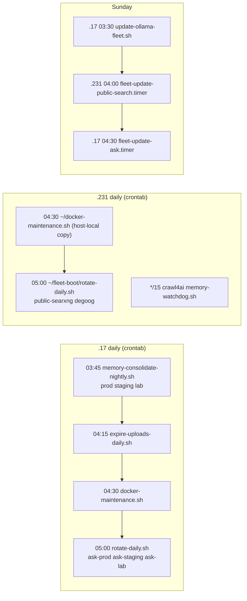

# Fleet scripts (`fleet-boot/`)

Every operational shell/Python script Ask ships lives in `fleet-boot/` at the repo root.
This page is the per-script reference: what each one does, **which host** it runs on,
**what triggers it**, its arguments and exit codes, and the traps it was written to avoid.

For *when to reach for* a script during an incident, see [Runbooks](/operations/runbooks)
(its "What automation already exists" table is the at-a-glance view). For the deploy flow
that wraps `rebuild-ask.sh`, see [Deploy](/operations/deploy). Hosts and IPs are described
in [Fleet](/infrastructure/fleet).

::: warning Three copies, one source of truth
`fleet-boot/` exists in all three worktrees (`ask-prod`, `ask`, `ask-flow`). **Cron and the
`.17` timers run the copy in `/home/nightfury/selfhosted/ask-prod/fleet-boot/`** (see
`crontab -l`), so a script change is not live on a schedule until it reaches the `dev`
branch checked out in `ask-prod`. The remote hosts run *deployed copies*
(`~/ask-fleet-boot.sh` everywhere, `~/fleet-boot/*` on `.231`) that only change when
`deploy.sh` is re-run. Scripts resolve siblings relative to their own path
(`fleet-boot/rotate-daily.sh:35`) precisely so a prod cron never reaches into a
development worktree.
:::

::: info Lab copy ahead of prod (2026-09-24)
`update-ask.sh`, `fleet-update-ask.service` and `fleet-update-ask.timer` were first committed on
`dev` (`b23e22f2`) and are now on `flow-design` too. The `flow-design` copies of `update-ask.sh`
and `update-images.sh` add the lab stack, and `memory-consolidate-nightly.sh` is new there. The
schedule runs the `ask-prod` copies, so these changes take effect once they are ported to `dev`.
:::

## Summary

| Script | Runs on | Trigger | Purpose |
|---|---|---|---|
| `ask-fleet-boot.sh` + `ask-fleet-boot.service` | .17, .160, .171, .231 (as `~/ask-fleet-boot.sh`) | systemd oneshot, once per boot | Reconcile compose stacks onto fresh networks, warm resident models |
| `deploy.sh` | .17 (manual) | manual | Push the boot script + unit to all hosts; sync `~/fleet-boot` on .231 |
| `rebuild-ask.sh` | .17 | manual (every deploy) | Build + recreate one Ask app stack, health-check, reclaim |
| `reclaim-space.sh` | .17 (also .231 copy) | called by `rebuild-ask.sh` / `update-images.sh`; manual | Prune all unused build cache + dangling images |
| `docker-maintenance.sh` | .17 | cron `30 4 * * *` | Conservative daily prune, disk warning, btree `amcheck` |
| `memory-consolidate-nightly.sh` | .17 | cron `45 3 * * *` | Drive the memory consolidation sweep on the named app stacks |
| `expire-uploads-daily.sh` | .17 | cron `15 4 * * *` | Drive the upload TTL sweep on all three app stacks |
| `rotate-daily.sh` | .17 and .231 | cron `0 5 * * *` | Nightly Mullvad exit-IP rotation via `rotate-mullvad.sh` |
| `rotate-mullvad.sh` | .17 / .231 | manual; called by `rotate-daily.sh` | Inspect / rotate / repin gluetun exits; clear engine health |
| `update-images.sh` | .17 / .231 | called by `update-ask.sh` / `update-public-search.sh`; manual | Pull sidecar images, recreate with VPN overlay, verify, reclaim |
| `update-ask.sh` + `fleet-update-ask.{service,timer}` | .17 | systemd timer, Sun 04:30 | Weekly sidecar image update for lab (canary), prod, staging |
| `update-public-search.sh` + `fleet-update-public-search.{service,timer}` | .231 (`~/fleet-boot`) | systemd timer, Sun 04:00 | Weekly update of public SearXNG + degoog |
| `check-crawl4ai-version.sh` | .231 (`~/fleet-boot`) | second `ExecStart` of the public-search service | Notify-only check for a newer crawl4ai release |
| `update-ollama-fleet.sh` / `update-ollama.sh` | driver on .17; worker on every host | cron `30 3 * * 0` on .17 | Weekly native-Ollama upgrade + re-pin resident models |
| `create-app-user.sh` | .17 | manual (once per stack) | Create the restricted `app_user` Postgres role for RLS |
| `keep-warm.sh` | .231 unit `ask-keep-warm.service` | **disabled** | Ping GPU services every 8 s to hold P0 clocks |
| `gpu-idle-log.sh` | anywhere with ssh to the GPU boxes | manual | Sample GPU power state every 5 min |
| `degoog-engine-watchdog.py` | .231 unit `degoog-engine-watchdog.service` | **disabled** | Suspend/restore degoog engines upstream is blocking |

Not in `fleet-boot/` but part of the same automation: the crawl4ai RAM watchdog
`~/selfhosted/crawl4ai/memory-watchdog.sh` (.231 cron `*/15`, see
[Runbooks → crawl4ai](/operations/runbooks#crawl4ai-memory-saturation-slow-retrieval)) and the
`lan_automation` units on .17/.231 (`fleet-boot.timer`, `fleet-sentinel.timer`,
`fleet-update.timer`), which live in a separate repository.

### Nightly / weekly schedule

The times are staggered on purpose: the memory sweep runs first, in quiet hours; the upload
sweep runs before the prune; and the Mullvad rotation runs after both (`fleet-boot/rotate-daily.sh:17`,
`fleet-boot/expire-uploads-daily.sh:11`).

---

## `ask-fleet-boot.sh` and `ask-fleet-boot.service`

**Purpose.** Reboot hardening. On the WSL2 hosts a reboot or Docker restart leaves two
things that `restart: unless-stopped` cannot fix (`fleet-boot/ask-fleet-boot.sh:5`):

1. a container pinned to a Docker network ID that no longer exists, so it never starts;
2. Ollama with no model resident (`OLLAMA_KEEP_ALIVE=-1` pins a model only *after* its
   first load), so the first real request pays a cold load.

**Where / trigger.** Deployed as `/home/nightfury/ask-fleet-boot.sh` on .17, .160, .171 and
.231 and run once per boot by the systemd oneshot `ask-fleet-boot.service`
(`fleet-boot/ask-fleet-boot.service`: `Type=oneshot`, `RemainAfterExit=yes`,
`User=nightfury`, `After=docker.service ollama.service network-online.target`). On .17 the
`lan_automation` `fleet-boot.service` declares `After=ask-fleet-boot.service` and defers Ask
recovery to it.

**Args / exit code.** None. Always exits `0` (`fleet-boot/ask-fleet-boot.sh:286`) — failures are
reported only as log lines (`needs a human`, `STILL UNHEALTHY`, `warm FAILED`). Read them with
`journalctl -u ask-fleet-boot.service -b -o cat`.

**Behaviour.** Host-aware: it branches on `hostname` (`fleet-boot/ask-fleet-boot.sh:220`).

| Host | Actions |
|---|---|
| `NightFuryX` (.17) | `reconcile` reranker-qwen, the three ingestors (prod / `docker-compose.staging.yaml` / `docker-compose.lab.yaml`), ask-whisper; `warm qwen3-vl:4b`; `warm_whisper`; then `reconcile_app_stack` for prod/staging/lab, `ensure_vpn_search` for each env's gluetun+searxng, and `reconcile` model-manager (`:221-261`). |
| `NightFuryS` (.160) | `reconcile` embedder (it preloads its own model). |
| `Serenity` (.171) | `warm granite4.2:8b` (`:267`). |
| `MiniNightFury` (.231) | `reconcile` crawl4ai and flaresolverr only — **never** the retired Ask stacks (`:269-280`). |

The helper functions, each escalating only when something is actually broken, so a healthy
service is never reloaded:

- `wait_docker` (`:24`) — polls `docker info` for up to 120 s. On .17 the oneshot can fire
  before Docker Desktop's engine and `/dev/net/tun` are ready.
- `reconcile <dir> <container> [file]` (`:39`) — `up -d`; if the container is not running
  3 s later, `down && up -d` onto a fresh network.
- `reconcile_app_stack` (`:79`) — gates on the app's **health**, not just running: `up -d` →
  (180 s) `up -d --force-recreate ask` → (180 s) full `down && up -d` → (240 s) log
  "needs a human". Step 2 is the automated fix for
  [prod crash-looping on ENOTFOUND after a reboot](/operations/runbooks#host-reboot-strands-prod-on-the-wrong-network).
- `ensure_vpn_search` (`:118`) — up to 6 attempts, 10 s apart, of `up -d gluetun searxng`.
  Needed because the app comes up healthy *without* gluetun, so `reconcile_app_stack` never
  notices a gluetun that lost the `/dev/net/tun` race (exit 127) and took searxng with it.
- `ensure_degoog` (`:151`) — same pattern for the per-env degoog stacks; its calls are
  commented out because degoog is disabled in every env (`:253-259`).
- `warm <model>` (`:178`) — waits for Ollama, then a `keep_alive=-1` generate.
- `warm_whisper` (`:201`) — `POST /v1/models/<model>` on `:8788`; speaches does not
  auto-download on a transcription request and ignores `PRELOAD_MODELS`.

**Gotchas.**
- A stale `~/ask-fleet-boot.sh` on .231 resurrected the retired Ask stacks at the
  2026-09-16 boot because `deploy.sh` did not target .231 then. After editing the script,
  **always run `deploy.sh`** — the repo copy is not what the hosts execute.
- The Serenity branch warms `granite4.2:8b`. `README.md` and `keep-warm.sh` named `granite4.1:8b`
  until 2026-09-24 and now agree with the script.
- Re-run by hand: `sudo systemctl start ask-fleet-boot.service` (or `~/ask-fleet-boot.sh`).

## `deploy.sh`

**Purpose.** Push `ask-fleet-boot.sh` and `ask-fleet-boot.service` to every host and enable
the unit. Also syncs the .231-only job scripts.

**Where / trigger.** Manual, from any worktree on .17. `HOSTS` is
`192.168.50.17 .160 .171 .231` (`fleet-boot/deploy.sh:15`). A host whose IP appears in
`hostname -I` is handled locally (`bash -c`) because .17 has no ssh key to itself
(`:19-26`); the rest go over ssh as `nightfury` with passwordless sudo.

**Args.** `./deploy.sh` pushes and enables; `./deploy.sh run` also starts the service on each
host and prints its last 10 journal lines (`:55-59`).

**Exit code.** `set -euo pipefail` — the first failing host aborts the loop non-zero; later
hosts are not updated.

**The .231 `~/fleet-boot` sync** (`:44-54`). .231 has no Ask worktree any more (the old
checkouts were deleted 2026-09-23), yet it still runs jobs for the public SearXNG and
degoog stacks. `deploy.sh` tars `rotate-daily.sh rotate-mullvad.sh update-public-search.sh
update-images.sh reclaim-space.sh check-crawl4ai-version.sh` plus
`fleet-update-public-search.{service,timer}` into `/home/nightfury/fleet-boot/`, copies the
two units into `/etc/systemd/system/`, and `enable --now`s the timer. .231's crontab
(`0 5 * * * /home/nightfury/fleet-boot/rotate-daily.sh public-searxng degoog`) points at
that copy. Editing any of those scripts therefore needs a `deploy.sh` re-run to reach .231.

## `rebuild-ask.sh`

**Purpose.** The only sanctioned way to rebuild an Ask app stack: build, recreate `ask`,
health-check, and **always** reclaim afterwards. Full walkthrough in
[Deploy → Rebuild](/operations/deploy#_3-rebuild-with-rebuild-ask-sh).

**Where / trigger.** .17, manual. `./rebuild-ask.sh {prod|staging|lab}`.

| Arg | Directory | Project | Port | Compose files |
|---|---|---|---|---|
| `prod` | `ask-prod` | `ask-stack` | 3738 | base + `vpn` |
| `staging` | `ask` | `ask-stack-admin-feature` | 3739 | base + `admin-feature` + `vpn` + `vpn.admin-feature` |
| `lab` | `ask-flow` | `ask-stack-lab` | 3742 | base + `lab` + `vpn.lab` |

(`fleet-boot/rebuild-ask.sh:13-39`)

**Exit codes.** `2` bad/missing arg; `1` build/`up` failed (no reclaim — keep the cache for a
retry, `:42-45`); `1` the port never returned 200 within ~6 min (72 × 5 s) — prints
`== FAILED ==` and skips reclaim so the previous (now dangling) image survives as the
fastest rollback (`:59-68`); `0` on `== done ==`.

**Gotchas.** Run it in the foreground, one env at a time. It builds only the `ask` service;
env-only changes need no rebuild (see [Deploy](/operations/deploy)).

## `reclaim-space.sh`

**Purpose.** After a rebuild, remove what the build left behind: `docker builder prune -f`
(**all** unused build cache) and `docker image prune -f` (dangling images only — never
`-a`, so tagged rollback images survive). Never touches containers, volumes or networks
(`fleet-boot/reclaim-space.sh:8-13`). Prints `df -h /` before and after.

**Where / trigger.** Called at the end of `rebuild-ask.sh` and `update-images.sh`; manual
otherwise. No args. Exit code is always that of the last `grep … || true`, i.e. `0`.

**Gotcha.** Because it deletes the previous dangling image, a deploy followed by reclaim has
no ready-made rollback image. Tag the running image before a risky prod deploy
([Deploy → Rollback](/operations/deploy)).

## `docker-maintenance.sh`

**Purpose.** Conservative daily hygiene for .17 (`fleet-boot/docker-maintenance.sh:6-11`):
dangling-image prune, build cache unused for 7+ days (`--filter until=168h`), a
`logger -t docker-maintenance` warning when `/` is ≥ 85 % after pruning, and a read-only
`bt_index_check` (amcheck) over every public btree index in `ask-postgres`,
`ask-postgres-admin-feature` and `ask-postgres-lab`.

**Why amcheck.** Postgres normally warns when the glibc collation version changes, but
`pg_database.datcollversion` is NULL on staging and cannot be set, so that alarm cannot fire;
`bt_index_check` detects the actual damage instead (`:40-51`). A hit logs
`WARNING: corrupt btree index in <container> — REINDEX required` to the journal.

**Trigger.** .17 cron `30 4 * * *`. .231 runs its own host-local `~/docker-maintenance.sh`
at the same time *(its contents are not in this repo; unverified whether it matches)*.
**Log:** `/home/nightfury/logs/docker-maintenance.log`, trimmed to 5000 lines. No args;
exits with the trim's status.

## `memory-consolidate-nightly.sh`

**Purpose.** There is **no in-app scheduler** for memory consolidation, so this cron is what runs
it (`fleet-boot/memory-consolidate-nightly.sh:2-10`). For each env it `POST`s
`/api/memory/consolidate`, which drops exact-duplicate confirmed memories and re-applies the
per-user cap (`MEMORY_MAX_PER_USER`). It makes no LLM calls; it is a cheap DB sweep. See
[memory & recall](/knowledge/memory-recall#how-to-schedule-memory-consolidation).

**Args.** `memory-consolidate-nightly.sh <prod|staging|lab>...` (at least one; no args → usage,
exit 2). Each name maps to its worktree and port (`:27-42`): prod → `ask-prod` / `:3738`,
staging → `ask` / `:3739`, lab → `ask-flow` / `:3742`. An unknown name is logged and skipped.

**Trigger.** .17 cron at 03:45. Once the script is on `dev` the line is
`45 3 * * * /home/nightfury/selfhosted/ask-prod/fleet-boot/memory-consolidate-nightly.sh prod staging lab`.

**Secret handling.** `MEMORY_CRON_SECRET` is read at run time from **that env's own** `.env`
(`:54`), never from another env's file, because the envs are meant to have distinct secrets.
The `Authorization` header is piped to `curl -H @-` on stdin (`:60-62`), so the value never
appears in `argv`, `ps` output, the crontab or the log. An env with no secret is logged as
"skipping".

**Log.** `~/.local/state/fleet-boot/memory-consolidate.log`, last 2000 lines: one
`===== <time> memory-consolidate (<envs>) =====` header per run and one
`<env> :<port> -> <code> <body>` line per env. **200** with `{"users":N,"merged":M}` is success;
**503** means the env has no `MEMORY_CRON_SECRET` (the route fails closed, `lib/auth/cron-auth.ts`);
**401** means the secret in `.env` does not match the running container's. The script's own exit
code is that of the log trim, so read the log rather than the exit status.

## `expire-uploads-daily.sh`

**Purpose.** There is **no in-app scheduler** for the upload TTL — this cron is what
actually expires idle uploads (`fleet-boot/expire-uploads-daily.sh:4-9`). It `POST`s
`/api/maintenance/expire-uploads` on `:3738`, `:3739` and `:3742` with a bearer token; the
route (gated by `checkIngestAuth`) unlinks bytes + `.chunks.json` of uploads whose chat has
been idle past `UPLOAD_TTL_DAYS` and tombstones the row `status='expired'`. See
[RAG & uploads](/knowledge/rag-uploads) and [Ingestor](/knowledge/ingestor).

**Trigger.** .17 cron `15 4 * * *`. **Log:**
`~/.local/state/fleet-boot/expire-uploads-daily.log` (last 2000 lines), one line per port
with the HTTP code and response body.

**Gotchas.** The token (`INGEST_API_TOKEN`) is read at runtime from
`/home/nightfury/selfhosted/ingestor/.env` (`:17`); if absent, the run logs "skipping" and
nothing expires. The same token must therefore be valid on all three stacks. The job was lost
once in the .231 → .17 migration (crontabs do not migrate), so check `crontab -l` after any
host move.

## `rotate-daily.sh`

**Purpose.** Unattended nightly Mullvad rotation: for each named stack, run
`rotate-mullvad.sh rotate <stack> --clear-health`.

**Why a fixed cadence rather than on a signal** (`fleet-boot/rotate-daily.sh:4-10`): SearXNG
logs per-engine CAPTCHA/suspension lines while search as a whole still works, so a
log-driven trigger would fire constantly; and many IPs from one ASN in quick succession is a
*stronger* bot signal than steady traffic from one address. `--clear-health` is mandatory
because Ask suspends engines by name for 30 minutes (`lib/search/engine-health.ts`); without
it the fresh IP inherits the old IP's suspensions.

**Trigger / args.** `rotate-daily.sh [stack ...]` (default `all`). Each host passes only the
stacks it runs, otherwise the others log "not running" and the job exits 1 nightly:

- .17: `0 5 * * * …/ask-prod/fleet-boot/rotate-daily.sh ask-prod ask-staging ask-lab`
- .231: `0 5 * * * /home/nightfury/fleet-boot/rotate-daily.sh public-searxng degoog`

**Exit / log.** A `flock` on `/tmp/fleet-boot-rotate.lock` makes a concurrent run log
"skipped" and exit 0. The script's own exit is that of the log trim; the rotation status is
written as `--- exit status: N ---` in `~/.local/state/fleet-boot/rotate-daily.log` (last
2000 lines). Logs live outside the repo so `git add -A` cannot commit them (`:44-45`).

## `rotate-mullvad.sh`

**Purpose.** Inspect and change the Mullvad exit of every gluetun-fronted stack.

**Targets** (`fleet-boot/rotate-mullvad.sh:78-93`): `ask-prod`, `ask-staging`, `ask-lab`,
`degoog`, `degoog-prod`, `degoog-staging`, `degoog-lab`, `public-searxng`, or `all`. Each row
names the gluetun container, the Redis holding engine health (Ask stacks only), the stack's
own directory and compose files, the dependent service and the env var that feeds
`SERVER_HOSTNAMES`.

| Verb | Effect |
|---|---|
| `status` (default) | Print the current exit IP of every target (`:208`). |
| `health <stack>` | List `enginehealth:*` keys (breaches, remaining suspension) — read-only (`:224`). |
| `servers [city]` | List Mullvad US cities / hostnames and hosting provider (`:251`). |
| `rotate <stack\|all>` | Stop/start the tunnel through gluetun's **control server** (`PUT /v1/vpn/status`), wait for a new non-residential egress (`:292`). |
| `pin <stack> <hostname>` / `city <stack> <prefix>` | Recreate gluetun with a new server env var, then force-recreate the dependent service (`:320`). |

Flags: `--clear-health` (drop `enginehealth:*` for that stack), `--dry-run`, `--isp NAME`
(pick a hosting provider within a city), `--count N` (pool size, default 6).

**Exit codes.** `2` unknown flag / stack / missing value; `1` any egress check failed or the
hostname is not in Mullvad's list; `0` otherwise.

**Gotchas.**
- **Never `docker restart gluetun`.** SearXNG/degoog use `network_mode: service:gluetun`;
  restarting gluetun leaves them "running" in a dead namespace (LAN UI returns 000) until
  force-recreated (`:4-12`). `rotate` avoids this by reconnecting in place; `pin`/`city`
  force-recreate the dependent for you.
- `pin`/`city` pass the new value only on that command line. To survive the next
  `up -d`, write it to the stack's `.env` or the compose default (`:354`).
- A rotate prints `control server refused (is gluetun-auth.toml mounted?)` if the control
  server auth file is missing from the gluetun container.
- The egress check treats the residential IP as failure; a 200 from the app alone does not
  prove the tunnel is up.

## `update-images.sh`

**Purpose.** Pull newer images for the *sidecars* of a stack, recreate with the VPN overlay,
verify, then reclaim. `--ignore-buildable` skips Ask's own image (built from source), so
this never updates the app code (`fleet-boot/update-images.sh:368-369`).

**Args.** `./update-images.sh [--dry-run] [ask-prod|ask-staging|ask-lab|degoog|public-searxng|all]`.
The `ask-lab` entry (added 2026-09-24, `fleet-boot/update-images.sh:52,64,74`) recreates the lab
from its own `ask-flow` worktree with project `ask-stack-lab` and the lab VPN overlay. It exists
so that lab experiments run on the same sidecar versions they will later be ported onto.

**Verification** (`:346-408`): after `up -d` and a 20 s wait, each stack's URLs must return
200 (prod `:3738` + its SearXNG UI `:3741`; staging `:3739` + `:3740`; lab `:3742` + `:3743`; degoog `:4444` +
`nogoog.hbqnexus.win`; public SearXNG `:8127` + `search.hbqnexus.win`), and if the stack has
a gluetun its egress must not be the residential IP.

**Exit codes.** `0` all verified (or dry run); `1` any `nodir` / `up` / URL / `tunnel`
failure, listed as `FAILED: …`.

**Does updating lose settings?** No — everything authored is on a bind mount or named
volume; only anonymous volumes holding regenerated config/cache are discarded
(`:291-311`).

**Gotcha.** `ask-prod` must be recreated from the `ask-prod` directory and `ask-staging` from
`ask`. The base compose is `name: ask-stack`, so running prod from the staging worktree
would bring prod up on **staging's `.env`** while still passing the :3738 health check
(`:323-328`).

## `update-ask.sh` + `fleet-update-ask.{service,timer}`

Weekly wrapper that runs `update-images.sh` for **`ask-lab`, then `ask-prod`, then
`ask-staging`** (`fleet-boot/update-ask.sh:29-31`), logging to
`/home/nightfury/selfhosted/logs/update-ask.log`. Driven on .17 by `fleet-update-ask.timer`
(`OnCalendar=Sun *-*-* 04:30:00`, `Persistent=true`, `RandomizedDelaySec=300`), whose service
`ExecStart`s `/home/nightfury/selfhosted/ask-prod/fleet-boot/update-ask.sh`. It refreshes
postgres/redis/searxng/gluetun/kokoro images only, never the app. Accepts `--dry-run`.

- **Lab first, as a canary.** A sidecar image that breaks shows up on the experimentation stack,
  earlier in the log than prod's result.
- **A failure does not stop the later stacks.** Each `update-images.sh` call is independent. The
  exit code is that of the `tee` pipeline, so a failed stack shows up only in the log (`FAILED: …`).
- **The weekly lab recreate drops any `FLOW_VARIANT` set from a shell** for an experiment. Re-set
  it after Sunday 04:30 if an A/B spans the weekend (see [evaluation](/operations/evaluation)).
- `update-images.sh` runs a local `docker compose`, which is why each host has its own wrapper.
- The lab entry was added on `flow-design` on 2026-09-24. Until it reaches `dev`, the timer runs
  prod's copy, which updates prod and staging only.

## `update-public-search.sh` + `fleet-update-public-search.{service,timer}`

**Purpose.** Weekly pull + recreate of the **public** search stacks on .231: degoog
(`:4444`, `nogoog.hbqnexus.win`) and public SearXNG (`search.hbqnexus.win`) via
`update-images.sh`. Both run upstream `:latest`. Both are attempted even if the first fails
(no `set -e`). Accepts `--dry-run`. Log:
`/home/nightfury/selfhosted/logs/update-public-search.log`.

**Trigger.** .231 `fleet-update-public-search.timer` (`OnCalendar=Sun *-*-* 04:00:00`,
`Persistent=true`, `RandomizedDelaySec=300`). The service runs as `nightfury` with two
`ExecStart`s: `update-public-search.sh`, then `-check-crawl4ai-version.sh` (the leading `-`
means a failure of the check does not fail the unit). Both point at
`/home/nightfury/fleet-boot/` — the copy synced by `deploy.sh`.

**Gotcha.** The public degoog on `:4444` has human users; it is not orphaned even though no
Ask env references it ([Runbooks → degoog](/operations/runbooks#degoog)).

## `check-crawl4ai-version.sh`

**Purpose.** **Notify-only** check for a newer `unclecode/crawl4ai` tag. crawl4ai is pinned,
not `:latest`, because minor/major bumps have broken the API before (0.9.0 required auth
tokens and removed request fields); patch bumps are low risk
(`fleet-boot/check-crawl4ai-version.sh:4-11`).

It reads the pin from `/home/nightfury/selfhosted/crawl4ai/docker-compose.yaml`, lists Docker
Hub tags, and appends one line to `update-public-search.log`: up to date, `PATCH (bug-fix,
low risk)`, or `MINOR/MAJOR (BREAKING RISK …)`. It never changes anything; applying a bump
is a reviewed manual edit of `crawl4ai/docker-compose*.yaml` followed by
`docker compose -p crawl4ai pull && up -d`. Exit code is that of `tee` (normally 0).

## `update-ollama-fleet.sh` and `update-ollama.sh`

**Purpose.** Weekly upgrade of the **native** Ollama (a systemd service, not a container) on
every host. `update-ollama.sh` is the per-host worker, deployed as `~/update-ollama.sh`: it
records resident models (`/api/ps`), runs the official `install.sh` (updates the binary and
restarts the service — needs passwordless sudo), waits for `/api/tags`, then re-pins each
previously resident model with a `keep_alive=-1` generate so the GPU is not left cold
(`fleet-boot/update-ollama.sh:13-31`). It prints `host: ollama A -> B | re-pinned: …`.

`update-ollama-fleet.sh` is the driver: runs `~/update-ollama.sh` locally on .17 and over ssh
(`BatchMode`) on .160, .171 and .231, printing `update FAILED` / `unreachable` per host but
continuing. **Trigger:** .17 cron `30 3 * * 0`. **Log:**
`~/.local/state/fleet-boot/update-ollama.log` (last 2000 lines).

**Gotchas.** `deploy.sh` does **not** distribute `update-ollama.sh`; a changed worker must be
copied to each host's home by hand *(the current per-host copies were not compared with the
repo; unverified)*. On .17 the restart briefly interrupts the Ollama cloud proxy and vision
model, which is why it runs at 03:30 on Sunday.

## `create-app-user.sh`

**Purpose.** Create (or re-create) the restricted `app_user` Postgres role for one stack and
print the `DATABASE_RESTRICTED_URL=` line to put in that stack's `.env`. RLS policies only
apply when the runtime connects as a non-superuser, non-`BYPASSRLS` role; connecting as the
owner silently disables every policy (`fleet-boot/create-app-user.sh:5-9`). See
[Data layer](/infrastructure/data-layer) and [Security](/infrastructure/security).

**Usage.** `./create-app-user.sh <postgres-container>` — `ask-postgres` (prod),
`ask-postgres-admin-feature` (staging), `ask-postgres-lab` (lab). Honours `POSTGRES_DB` /
`POSTGRES_USER` (default `morphic`).

**Exit codes.** Non-zero if `openssl` is missing, `psql` fails, or the created role's
`rolsuper/rolbypassrls/rolcanlogin` is not exactly `f f t` (`:41`).

**Gotcha.** It drops and re-creates the role with a **fresh random password** every run, so
the running app loses its DB connection until the printed URL is written to `.env` and the
app container is recreated. The printed line contains a secret — do not paste it anywhere
but the gitignored `.env`.

## `keep-warm.sh` (disabled)

**Purpose.** WSL2 cannot lock GPU clocks, so an idle GPU drops to P8 and the first request
runs slowly (measured: classify 7 s cold vs 1.6 s warm). The script sends a tiny request to
the local LLM (`LOCAL_LLM_BASE_URL`, model `MEMORY_EXTRACTOR_MODEL_ID`), the reranker and the
embedder every `KEEP_WARM_INTERVAL` seconds (default 8) (`fleet-boot/keep-warm.sh:4-15`).
URLs and tokens come from the `.env` next to the worktree, or `KEEP_WARM_ENV_FILE`.

**Status.** The unit `ask-keep-warm.service` on .231 is **disabled and inactive** — the fleet
now runs demand-warm only. Its `ExecStart` points at
`/home/nightfury/selfhosted/fleet-boot/keep-warm.sh`, a path that no longer exists on .231
after the worktrees there were removed *(verified the unit text; the missing path is
unverified)*, so re-enabling it needs a new unit on the right host. It deliberately never
pings `:cloud` models (billed calls with no GPU to wake).

## `gpu-idle-log.sh`

Measurement aid written when keep-warm was disabled: every 300 s it ssh's to .171, .160 and
.17 and appends `nvidia-smi` name / pstate / SM clock / power to
`/home/nightfury/logs/gpu-idle.log` (or `$1`), trimmed to 5000 lines. Sampling is sparse on
purpose — polling `nvidia-smi` often can itself keep a GPU out of P8. Manual, runs until
killed; no scheduled instance was found.

## `degoog-engine-watchdog.py` (disabled)

**Purpose.** degoog (a third-party image) has no per-engine backoff, so every search re-hits
engines that are already refusing it; on 2026-07-25, 23 searches produced 46 Brave 429s and
burnt the shared egress IP. The watchdog drives degoog's own settings API instead of patching
it (`fleet-boot/degoog-engine-watchdog.py:1-25`):

1. Read `DEGOOG_SETTINGS_PASSWORDS` from `/home/nightfury/selfhosted/degoog/.env`, log in.
2. Restore any engine *it* suspended whose cooldown expired.
3. Count breaches in `docker logs --since <LOOKBACK>m <container>`; suspend an engine with
   ≥ `DEGOOG_FAIL_THRESHOLD` (5) in `DEGOOG_LOOKBACK_MINUTES` (10) for
   `DEGOOG_COOLDOWN_MINUTES` (30).

Safety rules: only re-enable what it disabled (state in `DEGOOG_WATCHDOG_STATE`, default
`/home/nightfury/logs/degoog-watchdog.json`); never suspend the last healthy core engine
(`CORE_ENGINES`, `:55`); do nothing on any error. Other env: `DEGOOG_URL` (default
`http://localhost:4444`), `DEGOOG_CONTAINER` (default `degoog-degoog-1`).

**Args / exit.** `--dry-run`; `--loop SECONDS` to run forever. Single-shot exits `1` on error
or failed login, `0` otherwise.

**Status.** `degoog-engine-watchdog.service` on .231 (`--loop 300`, `Restart=always`) is
**disabled and inactive**, and like keep-warm its `ExecStart` points at the removed
`/home/nightfury/selfhosted/fleet-boot/` path.

---

## Changing a fleet script

1. Edit in the lab worktree, commit, and port to `dev` like any other change
   ([Deploy](/operations/deploy)); `fleet-boot/*` is expected to be identical in all worktrees.
2. Scheduled jobs on .17 pick up the change once `ask-prod` is on the new `dev` — no rebuild.
3. If you changed `ask-fleet-boot.sh`, its unit, or any file in the .231 sync list, run
   `./deploy.sh` (optionally `run`) so the hosts get the new copy.
4. New cron entries: keep them pointing at `…/ask-prod/fleet-boot/`, export a full `PATH`
   (cron's is near-empty — see `fleet-boot/rotate-daily.sh:28`), log under
   `~/.local/state/fleet-boot/`, and bound the log with a `tail -n` trim.
