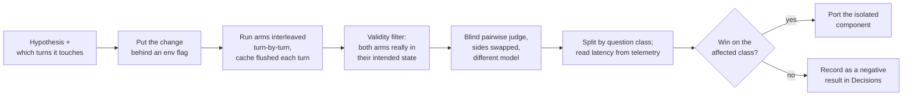

# Testing & QA

Ask has three layers of verification, and they answer different questions:

| Layer | Answers | Tools |
|---|---|---|
| Static + unit tests | "Does the mechanism work?" (parsing, persistence, tool wiring, UI state) | `bun run typecheck`, `bun run lint`, `bun run test` |
| Browser QA | "Does the product behave correctly for a user?" | A real browser on the lab/staging/prod; Playwright for mobile |
| Lab A/B | "Is the answer *better* (or faster at equal quality)?" | Lab toggles, `scripts/eval/`, blind pairwise judging |

No unit test measures answer quality. A green suite says nothing about whether a
retrieval or prompt change helped.

## Static checks and unit tests

```bash
cd /home/nightfury/selfhosted/ask-flow     # or the worktree you are changing
bun run typecheck     # tsc --noEmit — clean as of 2026-09-22
bun run lint          # ESLint — 0 errors, 5 warnings ( usage) as of 2026-09-22
bun run format:check  # Prettier
bun run test          # Vitest, NODE_ENV=test
```

::: warning Use `bun run test`, never `bun test`
`bun test` invokes bun's own test runner, which ignores `vitest.config.mts` (the `@/`
alias, jsdom environment, `vitest.setup.ts`, the `server-only` stub) and fails en masse.
:::

- Config: `vitest.config.mts` (jsdom, globals, aliases; excludes `.claude/**` worktree
  copies and `selfhosted/model-manager`, which has its own suite). Setup:
  `vitest.setup.ts` (dummy `DATABASE_URL`, `next/cache` mocks, jest-dom).
- Tests live next to code in `__tests__/` folders (`lib/**`, `components/**`, `app/**`,
  `hooks/**`). ~1 800 tests in ~220 files; a full run takes about a minute on the app host.
- `next build` does **not** run the tests, so a failing test never blocks a deploy — run
  the suite yourself. Since 2026-09-23 it is fully green, so **any** failure is new.
- The Model Manager has its own suite: `cd selfhosted/model-manager && bun run test`.

### Pre-existing failures

::: tip The suite is green
Since 2026-09-23 (lab `e36d5a5c`, prod `1ff09c73`, shipped to all three branches) `bun run test`
passes: 224 files / 1,844 tests, 1 skipped. The stale expectations were updated to current
behaviour, `chat-panel` mocks the Discover briefing and the canvas, and the SearXNG and
Brave-budget tests mock Redis so they no longer hang on `localhost:6379`. No runtime code
changed. The table below is the historical record of what was failing before.
:::

A full run on `flow-design` (2026-09-22) gave
**7 failed files / 26 failed tests** (1785 passed, 1 skipped). All were stale tests or
environment-dependent, not runtime bugs.

| File | Failing tests | Why |
|---|---|---|
| `lib/tools/search/providers/__tests__/searxng.test.ts` | 12 (two category/depth tests + all 10 "degoog merge" tests) | Each times out at 5 s. The provider now consults the engine-health store, whose Redis client defaults to `redis://localhost:6379` when `LOCAL_REDIS_URL` is unset (`lib/search/basic-search-cache.ts:79-82`); on the app host that connection attempt hangs rather than failing fast. *(Mechanism inferred from the code path and from a TCP connect to `127.0.0.1:6379` hanging on the host; not traced inside the test.)* |
| `lib/search/__tests__/brave-budget.test.ts` | 1 — "fails CLOSED when Redis is missing" | Same 5 s timeout: `brave-budget.ts:50` falls back to `redis://localhost:6379`. |
| `components/__tests__/source-selector.test.tsx` | 7 | The trigger became an icon button labelled "Select sources"; the tests still look for a button named `/web/i`. |
| `components/__tests__/chat-panel.test.tsx` | 3 — ingest status polling | `ChatPanel` now fetches `/api/discover?topic=mix&mode=preview` on mount (homepage Discover preview), so `expect(fetchMock).not.toHaveBeenCalled()` fails before polling is exercised. |
| `lib/utils/__tests__/model-selection.test.ts` | 1 — "defaults to thinking ON" | The answering-model reasoning default was changed to **off** on 2026-09-09 (`ANSWER_THINK`, `lib/utils/ollama-think.ts`). |
| `lib/agents/__tests__/title-generator.test.ts` | 1 | Expects `local:granite4.1:8b`; the code default was bumped to `granite4.2:8b` on 2026-08-28. |
| `app/api/voice/__tests__/speak.test.ts` | 1 — "400s on missing/oversized text" | Sends 5 001 characters expecting 400; the route's limit is now `MAX_TEXT = 20000` (`app/api/voice/speak/route.ts:9`). |

An August 2026 run had a different set, including `render-message`. See
[Known issues](/history/known-issues#pre-existing-test-failures). Keep the suite green: fix a
stale test in its own commit rather than letting failures accumulate again.

## Browser QA

Test Ask **through the browser**, the way a user does — not by `curl`-ing `/api/chat`.
Endpoint `curl`s are for checking a service is *up*, not that Ask *behaves*.

- **Use one chat and vary the questions.** Start a single conversation and ask a
  deliberate sequence of different, real questions in it. The second and third turns are
  where the interesting behaviour is: recall, the classifier's standalone-query rewrite,
  `skipSearch` on follow-ups, context carry-over. Re-running the same query in fresh
  chats exercises none of that and hammers the same query against the search engines.
- **Where:** the lab (`http://192.168.50.17:3742`, no login) for anything experimental;
  staging (`:3739`) and prod (`https://ask.hbqnexus.win`) need a Supabase login — use the
  shared test account (credentials held by the maintainer).
- **Prefer turns that don't search** when you are verifying non-search features
  (settings, sidebar, voice, uploads): a trivial question hits zero engines.
- **Check both themes and a narrow viewport** for any UI change.

### Mobile / responsive QA with Playwright

Resizing a normal desktop browser window does not reliably change the page's CSS
viewport (media queries and Tailwind breakpoints may not respond). Use real device
emulation. The method that works on the app host is **Playwright over the pipe
transport** driving the installed Chrome:

```js
// run with node from a directory that has playwright-core available, e.g.
//   NODE_PATH=/home/nightfury/selfhosted/worldmonitor/node_modules node mobile-check.mjs
import { chromium } from 'playwright-core'

const browser = await chromium.launch({
  executablePath: '/usr/bin/google-chrome-stable',
  headless: true
}) // launch() uses the pipe transport by default
const ctx = await browser.newContext({
  viewport: { width: 390, height: 844 },
  deviceScaleFactor: 3,
  isMobile: true,
  hasTouch: true,
  colorScheme: 'dark'
})
const page = await ctx.newPage()
await page.goto('http://localhost:3742/', { waitUntil: 'networkidle' })
// page-level horizontal overflow check (more reliable than per-element rects)
console.log(await page.evaluate(() =>
  document.documentElement.scrollWidth - document.documentElement.clientWidth))
await page.screenshot({ path: '/tmp/home-390.png', fullPage: true })
await browser.close()
```

Tips:
- Point it at the **lab** — no login needed.
- Check: horizontal overflow (`scrollWidth - clientWidth` should be 0), input
  font-size ≥ 16 px (iOS zoom), tap-target sizes, popovers staying inside the viewport.
  Use `page.tap()` for touch interactions.
- `getBoundingClientRect()` on Ask pages can mislead: hidden duplicate elements
  (inactive Discover tabs, collapsed states) report all-zero rects and match naive
  selectors. Trust screenshots and page-level measurements.
- The homepage autofocuses the composer, animates a canvas and cycles the headline, so
  a single viewport-height screenshot is flaky; capture `fullPage` or a tall viewport.
- Fallback without Playwright:
  `google-chrome-stable --headless=new --no-sandbox --disable-gpu --hide-scrollbars --user-data-dir=/tmp/chrome-$$ --window-size=390,844 --virtual-time-budget=9000 --screenshot=/tmp/out.png http://localhost:3742/`
  — `--virtual-time-budget` is required or you capture the un-hydrated page. Kill only
  your own instance (unique `--user-data-dir`); never `pkill -f chrome`.

## No live search probing

Do **not** diagnose search by firing test queries at SearXNG, degoog, the public
SearXNG, Google CSE, Brave, or Tavily — including via staging, which shares the real
search infrastructure. Each "one query" adds up: a burst of ~10 diagnostic probes once
rate-limited the shared Google CSE key, and repeated benchmark queries have triggered
Brave 429s on a quota shared with SearXNG.

Diagnose from evidence that already exists:
- the app's own logs (`docker logs ask 2>&1 | grep '\[latency'`, provider errors),
- SearXNG's `unresponsive_engines` in organic traffic and its container logs,
- Redis counters (budgets, engine-health keys),
- [Telemetry](/operations/telemetry) (`latency:log`).

If a probe is truly unavoidable: one query, reused, and announced to whoever else is
working on the system first.

## Lab A/B methodology

Retrieval, prompt and pipeline changes are judged on the lab before porting (see
[Deploy › Lab first](/operations/deploy#_1-lab-first)). The rules below come from
experiments that produced wrong conclusions when they were not followed.



1. **One build, arms as flags.** The lab overlay exposes toggles as `${VAR:-default}`
   (`SEARCH_QUALITY_FILTER`, `SEARCH_SNIPPET_GATE`, `SEARCH_ENRICH_MAX_CHARS`,
   `SEARCH_ROUNDS_MAX`, `ANSWER_THINK`, `FLOW_VARIANT`, …). Switch arms with
   `VAR=value docker compose -p ask-stack-lab -f docker-compose.yaml -f docker-compose.lab.yaml -f docker-compose.vpn.lab.yaml up -d --force-recreate ask`
   and **confirm** the arm with `docker exec ask-lab printenv VAR` — a silent fallback
   mislabels a whole arm.
2. **Interleave arms turn by turn**, not "all of A then all of B", so time-of-day
   engine behaviour and cache state affect both arms equally.
3. **Flush the search cache between turns** (`search:*` keys in `ask-redis-lab`, 1 h
   TTL), otherwise the second arm answers from the first arm's retrieval. Hold other
   variables fixed: pin the chat model, and disable recall if it is not under test.
4. **Measure only what the change can touch.** Identify the turns the change affects
   (e.g. only first turns that would have retrieved) and judge those; a pooled result
   dilutes or hides the effect.
5. **Validity filter.** Drop pairs where the arms did not actually end up in their
   contrasting states (e.g. both retrieved, or neither did).
6. **Judge answers, not counts.** Source counts, tool-call counts and gate rates
   describe what the system *did*, never whether the answer was better. A full day was
   once spent "fixing" a gate that appeared to suppress retrieval on 61–77 % of
   operational questions; when the answers were finally judged, forcing retrieval on
   those turns scored 1W-7L-3T. Use a **blind pairwise judge** on a **different model**
   than the one under test, with **sides swapped** (a pair counts only if the same
   answer wins both orderings) — `scripts/eval/judge-flow-arms.py`,
   `scripts/eval/run-eval.ts`.
7. **Split by question class** (operational, concept, news, follow-up…). A positive pooled
   net can hide a regression in the class the feature exists for.
8. **Small n resolves only large effects.** Run-to-run variance is high; with n≈2–6 per
   arm, a single "0 → 37 sources" is an anecdote. Prefer deterministic checks where
   possible (e.g. prove a rejected URL never appears in any run's sources).
9. **Latency from telemetry**, not stopwatch: `docker exec ask-redis-lab redis-cli lrange latency:log 0 -1`
   and the `[latency:*]` log lines ([Telemetry](/operations/telemetry)).
10. **Record the outcome** — including "no effect" and "worse" — in
    [Decisions](/history/decisions) so it is not re-run.

Live-search answer A/Bs are inherently confounded (search non-determinism, the agent's
choice to search or not). For rerank/crop changes, prefer deterministic benchmarks
(e.g. `lib/embeddings/__bench__/`) or shadow logging on real traffic.

### Harness scripts (`scripts/eval/`)

| Script | Purpose |
|---|---|
| `run-eval.ts` (`bun run eval`) | Runs `(model, searchMode)` configs over `questions.json`, scores objective metrics and a position-bias-controlled pairwise judge; `--judge-only` re-judges saved results. |
| `mine-questions.ts` (`bun run eval:mine`) | Regenerates `questions.json` from first messages of real prod chats (via `docker exec ask-postgres psql`). |
| `run-flow-arms.py`, `run-flow-conversations.py`, `smoke-flows.sh` | Drive the lab through flow arms (single turns / multi-turn conversations / one smoke turn per arm), reading `latency:log`. |
| `judge-flow-arms.py` | Blind, side-swapped pairwise judge (`JUDGE_MODEL`, default `glm-5.2:cloud`). |
| `classifier-eval.ts`, `gate-rate-live.ts`, `gate-stability.ts` | Classifier accuracy and gate-rate measurements. `classifier-eval.ts --check` compares the 12 cases in `classifier-cases.ts` with `classifier-baseline.json` (complete, 12 entries). |

::: tip Where the harness points (fixed 2026-09-24)
The flow runners (`run-flow-arms.py`, `run-flow-conversations.py`, `smoke-flows.sh`) target the lab
on .17: the `ask-flow` worktree (`ASK_LAB_DIR`) and `http://localhost:3742` (`ASK_LAB_URL`),
project `ask-stack-lab`. They refuse to recreate `ask-lab` from a different directory, because
compose would boot the lab on that worktree's `.env`. `find-ddg-exit.sh` uses the same worktree
and the lab SearXNG on `localhost:3743`; `judge-flow-arms.py` defaults `JUDGE_OLLAMA_URL` to the
.17 Ollama; all runners honour `EVAL_MODEL`. Before 2026-09-24 they still pointed at the retired
.231 stacks and the staging worktree.

**Staging is auth-ON; the lab is anonymous** (`ENABLE_AUTH=false`,
`ANONYMOUS_USER_ID=lab-harness`). `run-eval.ts` still defaults to staging, so point
`EVAL_API_URL` at `http://localhost:3742/api/chat` (and `EVAL_DB_CONTAINER=ask-postgres-lab`) for
unattended runs. `bun chat` has no `--no-search` any more (the route has no search-off mode);
use `--search-mode speed|balanced|quality`. Details: [Evaluation](/operations/evaluation).
:::
