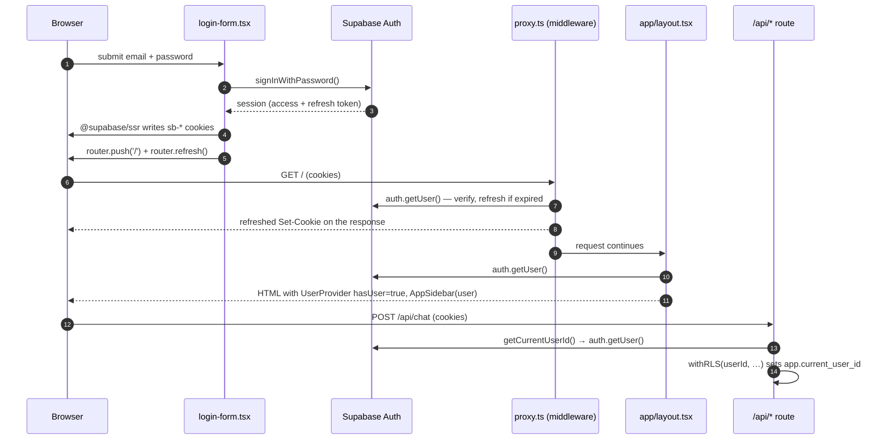

# Auth & accounts

This page explains how a person signs in to Ask, how the session travels with each request,
how server code turns that session into a user id, and which React contexts and hooks expose
user state to the UI. For the threat model, CSRF/open-redirect analysis and the machine-to-machine
tokens (ingest, cron), see [Security → Authentication](/infrastructure/security#authentication).
For how the user id scopes database rows, see [Data layer](/infrastructure/data-layer#row-level-security).

## Mental model

- **Identity provider:** Supabase Auth (email + password, and Google OAuth). Ask stores no
  passwords; it holds only the Supabase session cookies set by `@supabase/ssr`.
- **One server-side question:** "who is this?" is answered by `getCurrentUserId()`
  (`lib/auth/get-current-user.ts:16`). Every route, server action and page that needs a user
  calls it. Nothing accepts a user id from the request body or query string.
- **Three modes**, chosen by environment:

| Mode | Set by | Who you are | Used on |
|---|---|---|---|
| Supabase auth | `ENABLE_AUTH: 'true'` (`docker-compose.yaml:21`) + `NEXT_PUBLIC_SUPABASE_URL` / `NEXT_PUBLIC_SUPABASE_PUBLISHABLE_KEY` | The verified Supabase user | Prod, staging |
| Anonymous | `ENABLE_AUTH: 'false'`, `ANONYMOUS_USER_ID` (`docker-compose.lab.yaml:45-46`) | Everyone is the single id `lab-harness` | Lab |
| Guest | No session and `ENABLE_GUEST_CHAT=true` | `userId` is `undefined`; turns are not persisted | Nowhere (flag unset) |

## Pages under `app/auth/*`

All pages are thin shells around a client form component in `components/`; the forms call the
Supabase **browser** client (`lib/supabase/client.ts`) directly.

| Route | File | What it does |
|---|---|---|
| `/auth/login` | `app/auth/login/page.tsx` → `components/login-form.tsx` | `signInWithPassword` (`login-form.tsx:41`), then `router.push('/')` + `router.refresh()`. "Sign In with Google" calls `signInWithOAuth({ provider: 'google', redirectTo: <origin>/auth/oauth })` (`login-form.tsx:62-65`). |
| `/auth/sign-up` | `app/auth/sign-up/page.tsx` → `components/sign-up-form.tsx` | `signUp` with `emailRedirectTo: <origin>/` (`sign-up-form.tsx:46-50`), then pushes to `/auth/sign-up-success`. |
| `/auth/sign-up-success` | `app/auth/sign-up-success/page.tsx` | Static "check your email to confirm" card. |
| `/auth/forgot-password` | `app/auth/forgot-password/page.tsx` → `components/forgot-password-form.tsx` | `resetPasswordForEmail` with `redirectTo: <origin>/auth/update-password` (`forgot-password-form.tsx:37-38`). |
| `/auth/update-password` | `app/auth/update-password/page.tsx` → `components/update-password-form.tsx` | `updateUser({ password })` (`update-password-form.tsx:36`) for the user whose recovery link just created a session. |
| `/auth/confirm` | `app/auth/confirm/route.ts` (GET handler) | Email-link landing: `verifyOtp({ type, token_hash })` sets the session cookie, then redirects to `safeRelativePath(next)` (`confirm/route.ts:16-27`). |
| `/auth/oauth` | `app/auth/oauth/route.ts` (GET handler) | OAuth callback: `exchangeCodeForSession(code)`, then redirects to `next` resolved against the **configured** base URL (`oauth/route.ts:16-23`). |
| `/auth/error` | `app/auth/error/page.tsx` | Shows the `?error=` text. |

::: warning Redirect URLs live in two places
The forms build their callback URLs from `window.location.origin`. Supabase only honours a
`redirectTo` / `emailRedirectTo` that is on the project's redirect allowlist (Supabase dashboard →
Auth → URL configuration). A new hostname for Ask (new domain, new port) needs adding there,
otherwise sign-up confirmation and password-reset links fall back to the Site URL.
:::

**Why `safeRelativePath`:** `/auth/confirm` and `/auth/oauth` redirect *after* the session cookie
is set. An unvalidated `?next=https://evil…` would turn the trusted origin into an open redirect
and a login-fixation primitive. `lib/utils/safe-redirect.ts:12` accepts only a clean same-origin
path (rejects `//host`, `/\host`, absolute URLs and control characters) and falls back to `/`.
**Why the OAuth callback uses `getBaseUrl()`** rather than the request's `x-forwarded-host`: that
header is client-controllable, so the redirect host could be retargeted (`oauth/route.ts:18-21`).

## Sign-in flow

OAuth differs only in steps 1–4: the browser is sent to Google, returns to `/auth/oauth?code=…`,
and the route handler exchanges the code for a session server-side. Email confirmation and
password recovery land on `/auth/confirm` (OTP token hash) or directly on `/auth/update-password`.

## Session handling

### Middleware: `proxy.ts`

Next.js runs `proxy.ts` (this Next version's name for middleware) on every path except static
assets (`proxy.ts:39-49`). When Supabase is configured it calls `updateSession()`
(`lib/supabase/middleware.ts:38`), which creates a server client bound to the request cookies
and calls `supabase.auth.getUser()` (`middleware.ts:73-75`). That call is what **refreshes an
expired access token** and writes the new cookies onto the response. Two rules from the
upstream Supabase template are load-bearing:

- Nothing may run between `createServerClient` and `getUser()`, and the returned
  `supabaseResponse` must be returned as-is (`middleware.ts:39-44, 66-104`). Building a fresh
  `NextResponse` drops the refreshed cookies, and users get logged out at random.
- `proxy.ts` also stamps `x-url`, `x-host`, `x-protocol`, `x-base-url` response headers
  (`proxy.ts:31-34`) used elsewhere to build absolute URLs.

### The page gate (fixed 2026-09-24)

After `getUser()`, `updateSession` redirects a signed-out visitor to `/auth/login` when the path
is not public (`lib/supabase/middleware.ts:76-88`). `isPublicPath` (`:20-36`) allows:

| Rule | Paths | Why they are public |
|---|---|---|
| Exact | `/` | Homepage and guest entry |
| Whole-segment prefix | `/auth`, `/share`, `/api`, `/search`, `/discover`, `/library`, `/uploads` | Auth pages; shared/public chats (`/search/[id]` sends a private chat to login itself); Discover; the library (its data comes from self-authorising actions, so a signed-out visitor sees an empty list); uploads (capability URLs); and every API route, which authorises itself (the ingest and cron routes use bearer tokens, not cookies) |

A prefix matches only on a segment boundary: `/auth` covers `/auth/login` but not `/authx`.
With `ENABLE_AUTH=false` (the lab) the gate never redirects, because every request is the shared
anonymous user there. When Supabase is not configured at all, `proxy.ts` skips `updateSession`
entirely.

**Why it changed.** Until 2026-09-24 the public list held `'/'` and was checked with
`pathname.startsWith(path)`. Every path starts with `/`, so the redirect never fired. Every page
and route already checked auth itself, so the fix changes little that users can see: a
signed-out visitor who opens an unknown or newly added path is now sent to login instead of
getting the page (or a 404). Tests: `lib/supabase/__tests__/middleware.test.ts`.

::: warning The gate is defence in depth, not the access control
Keep doing access control per page and per route (below). A new page that must be public needs
an entry in `PUBLIC_PREFIXES` (`lib/supabase/middleware.ts:20-28`); a new page that needs sign-in
still calls `getCurrentUserId()` itself.
:::

### Server side: `getCurrentUser` / `getCurrentUserId`

`lib/auth/get-current-user.ts`:

- `getCurrentUser()` (`:6`) returns `null` when Supabase is not configured, else
  `supabase.auth.getUser()` via the cookie-bound server client (`lib/supabase/server.ts:7`).
  `getUser()` **validates the JWT with the Supabase server**; `getSession()` would only decode the
  cookie, which the client can forge. Server code must never use `getSession()` for identity.
- `getCurrentUserId()` (`:16`) short-circuits when `ENABLE_AUTH === 'false'`: it warns and returns
  `ANONYMOUS_USER_ID` or `'anonymous-user'` (`:21-37`). It refuses anonymous mode when
  `MORPHIC_CLOUD_DEPLOYMENT=true` (`:23-27`). Each call increments a perf counter
  (`incrementAuthCallCount`) because every call is a network round-trip to Supabase.

The server client's `setAll` swallows errors (`lib/supabase/server.ts:19-28`): Server Components
cannot set cookies, and that is safe only because the middleware already refreshed them.

### Browser side

`lib/supabase/client.ts:7` builds a browser client from the two `NEXT_PUBLIC_*` variables and
throws `'Supabase not configured'` when either is missing (logged once). `NEXT_PUBLIC_*` values are
inlined at `next build` time, so changing them needs an image rebuild, not just a restart
*(unverified: the Dockerfile has no build args; the values reach `next build` through the
`.env` file copied into the build context by `COPY . .`)*.

### Service-role client

`lib/supabase/admin.ts:3` creates a client with `SUPABASE_SECRET_KEY` (no session persistence).
It is used only by account server actions in `lib/actions/account.ts`:

- `deleteAccount()` (`:19`) — deletes chats, notes, library files, anonymises feedback, deletes the
  user's R2 objects, then `auth.admin.deleteUser`, and fires `trackAccountDeleted`.
- `updateEmail()` (`:99`) — service-role `updateUserById(..., { email_confirm: true })`,
  deliberately skipping the confirmation email (single-operator instance; same trust model as
  deletion). The session stays valid because the user id does not change.

Both refuse in anonymous mode and return a readable error when the secret key is absent.

### Sign-out

`components/sidebar-account-menu.tsx:61` calls the browser client's `signOut()` then
`router.push('/')` + `router.refresh()` so the server layout re-renders without a user.

## How pages and API routes check auth

**Root layout** (`app/layout.tsx:81-89`): calls `getUser()` itself (to pass the full `User` to
`AppSidebar` and `PostHogProvider`), then `userId = user?.id ?? getCurrentUserId()`. The fallback
is what makes lab's anonymous id count as "has a user", so the sidebar renders in lab. When
there is no user the sidebar is not rendered and the header shows `GuestMenu` (a Sign In link).

**Chat page** (`app/search/[id]/page.tsx`): loads the chat with the requesting user id; a missing
chat is `notFound()`, and a private chat viewed without a session redirects to `/auth/login`
(`:47-51`). Public chats are readable by anyone; the DB policies enforce the rest.

**API routes** follow one of three patterns:

| Pattern | Example | Behaviour |
|---|---|---|
| Session user | `app/api/chat/route.ts:103-120` | `getCurrentUserId()`; no id and guest chat off → `401 Authentication required`. With guest chat on, an IP-based guest limit applies and nothing is persisted. |
| Session user via server action | `app/api/chats/route.ts` → `getChatsPage()` (`lib/actions/chat.ts:54-62`) | The route itself has no check; the action returns an empty page when there is no user. |
| Bearer token | `/api/ingest/*`, `/api/advanced-search`, `/api/maintenance/*`, `/api/memory/*` | `checkIngestAuth` or `requireCronSecret` (`lib/auth/cron-auth.ts:26`, fails **closed** with 503 when the secret is unset). See [Security](/infrastructure/security). |

Truly public routes (no user needed): `health`, `quotes`, `weather`, `geocode`, `geolocate`,
`discover`.

After a user id is known, database access goes through `withRLS(userId, cb)`
(`lib/db/with-rls.ts:39`), which runs `set_config('app.current_user_id', userId, true)` inside a
transaction so Postgres RLS policies see the caller. Code that has no user (the ingest worker's
routes, recall backfill) uses the owner/admin client instead (`lib/db/index.ts:64-68`) — see [Data layer](/infrastructure/data-layer).

### Adaptive modes and guests

`lib/search-mode-availability.ts` holds `ADAPTIVE_MODE_AUTH_REQUIRED_MESSAGE` and
`isAdaptiveModeAuthBlocked()`: Balanced/Quality require sign-in only when the caller is a guest
**and** `MORPHIC_CLOUD_DEPLOYMENT=true`. On self-hosted Ask this is always false; the checks
remain in `components/chat.tsx` (`showAdaptiveModeAuthModal`, around `:152`) and in the chat
route as upstream code paths.

## React contexts

All three live in `lib/contexts/`.

| Context | Provider mounted in | Value | Consumers | Why it exists |
|---|---|---|---|---|
| `UserContext` (`user-context.tsx`) | `app/layout.tsx:123` `<UserProvider hasUser={!!userId}>` | a single boolean | `useHasUser()` in `components/artifact/chat-artifact-container.tsx:52` (shows the sidebar trigger) | Client components need "signed in?" without re-fetching the session; the server already knows. |
| `ChatHeaderContext` (`chat-header-context.tsx`) | `app/layout.tsx:142` | `{ info: { chatId, title } \| null, setInfo }` | `components/chat.tsx:85` publishes; `components/header.tsx:25` reads | The app header is rendered in the layout, outside the chat tree; the open chat pushes its title/id up so the title and options menu can sit in the full-width fixed header (`chat-header-context.tsx:20-26`). |
| `ChatContext` (`chat-context.tsx`) | `components/chat.tsx:919` `<ChatProvider>` | `sendMessage` (the guarded `safeSendMessage`) and `isStreamingRef` | `components/spec-block.tsx:23` (generative-UI actions such as related-question buttons) | Lets rendered specs send a follow-up. `isStreamingRef` is a **ref, not state**, because `@json-render/react`'s `ActionProvider` freezes its handlers on first render; state read through that closure would be stale (`chat-context.tsx:11-18`). See [Generative UI](/request-lifecycle/generative-ui). |

`useChatHeaderInfo()` and `useChatContext()` throw when used outside their provider, so a
misplaced component fails loudly in development.

## Hooks

| Hook | File | Source of truth | Notes |
|---|---|---|---|
| `useCurrentUserName()` | `hooks/use-current-user-name.ts` | `session.user.user_metadata.full_name` | `'?'` when unknown, `'Anonymous'` when Supabase is not configured. |
| `useCurrentUserImage()` | `hooks/use-current-user-image.ts` | `user_metadata.avatar_url` (set by Google OAuth) | `null` when absent. |

The last two feed `components/current-user-avatar.tsx`, used next to user messages in
`components/collapsible-message.tsx`. The chat's auth prompts go through the error-modal path
(`setErrorModal({ type: 'auth' })`, see [Client state](/request-lifecycle/client-state)). Two
unreferenced upstream leftovers, the `useAuthCheck()` hook (`hooks/use-auth-check.tsx`) and the
Sign Up / Sign In dialog `components/auth-modal.tsx`, were deleted on 2026-09-24.

Analytics identity: `PostHogProvider` receives `user?.id` from the layout and calls `identify`
(`components/posthog-provider.tsx:27`). See [Analytics](/operations/analytics).

## Test account convention

Prod (`:3738`) and staging (`:3739`) require a real Supabase login. A single shared QA account,
`hbqstuff@hotmail.com`, works on both (the two environments share a Supabase user pool *(unverified)*). Its password is
held by the maintainer and must never be written into the repo, these docs, scripts or commit
messages. The lab (`:3742`) needs no login: every visitor is `lab-harness`, which is also why
harnesses can POST to lab without cookies (see [Evaluation](/operations/evaluation)).

Rules of thumb:

- Test UI changes on the lab first; use the test account on staging/prod only to confirm a port.
- Do not create extra accounts for testing; they land in the production Supabase user pool.
- Lab data is effectively LAN-public (anonymous mode), so do not upload anything private there.

## How to…

**Add a page that requires sign-in.** In the Server Component call `getCurrentUserId()`; if it is
falsy, `redirect('/auth/login')` (pattern: `app/search/[id]/page.tsx:50-51`). The middleware
gate also redirects signed-out visitors from any non-public path, but treat it as a backstop
(see [the page gate](#the-page-gate-fixed-2026-09-24)).

**Add an API route for signed-in users.** Call `getCurrentUserId()` first, return `401` when
empty, and do all reads/writes through `withRLS(userId, …)` or a `lib/actions/*` helper that does.
Never take a user id from the request. See [Recipes](/getting-started/recipes).

**Add a machine-called route.** Use `requireCronSecret` (new secret) or `checkIngestAuth`, keep it
under `/api`, and make "secret unset" mean "disabled".

**Add another OAuth provider.** Enable it in the Supabase dashboard, add a button calling
`signInWithOAuth({ provider, options: { redirectTo: <origin>/auth/oauth } })` in
`components/login-form.tsx`; the existing `/auth/oauth` callback handles any provider.

**Run with auth off locally.** Set `ENABLE_AUTH=false` (optionally `ANONYMOUS_USER_ID`). Account
deletion and email change are then disabled by design.
