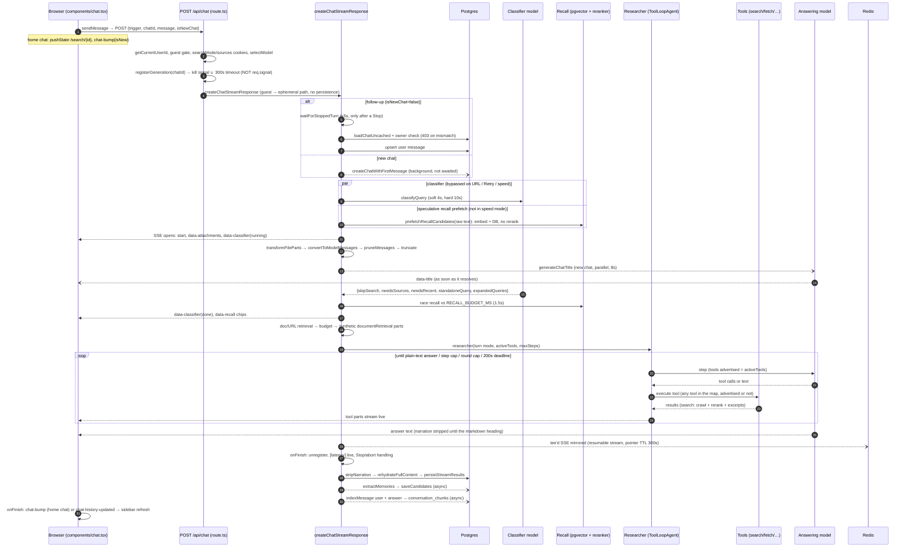

# One chat turn, end to end

This page follows a single prompt from the moment the user presses Enter until the
answer is saved and indexed. It is the backbone of Ask: almost every other page
(search pipeline, streaming, memory, uploads) plugs into one of the stages below.

Step through it interactively first, then read the detail per stage.

<TurnWalkthrough />

::: tip Where the time goes
A turn is a **serial** pipeline with a few deliberately parallel branches. The
answering model dominates wall-clock time; the pipeline stages in front of it are
each timeboxed so a slow dependency degrades a feature instead of the turn. Every
turn emits one `[latency]` line with per-stage fields (`prepare_ms`, `classify_ms`,
`recall_ms`, `recall_wait_ms`, `search_ms`, `crawl_ms`, `rerank_ms`, `ttft_ms`,
`gen_ms`, `total_ms`, …) — see [Telemetry](/operations/telemetry).
:::

## The whole turn as a sequence

## 1. Browser submit {#_1-browser-submit}

`components/chat.tsx` owns the conversation via the AI SDK's `useChat`
(`components/chat.tsx:212`). The composer (`chat-panel.tsx`) calls `onSubmit`
(`chat.tsx:842`), which builds a user message from the text plus any uploaded file
parts and sends it through `safeSendMessage` (`chat.tsx:491`). The transport's
`prepareSendMessagesRequest` (`chat.tsx:232`) shapes the body:

| Field | Meaning |
|---|---|
| `trigger` | `submit-message` or `regenerate-message` (Edit / Retry) |
| `chatId` | Client-generated id (`generateId()` on the homepage) or the route id |
| `message` | Only the new/edited message — authenticated turns never send history; the server reloads it |
| `messages` | Guests only: the full client-side history (they have nothing persisted) |
| `isNewChat` | `true` when this is the first message and nothing was loaded from the server |
| `systemInstructions` | From `localStorage.systemInstructions` (Settings) |
| `voice` | `true` only when voice is built in and the read-aloud toggle is on |

For a chat started on the homepage the URL is then `pushState`d to `/search/<id>` —
the Next.js route stays `/`. See [Client state → new-chat flow](/request-lifecycle/client-state#new-chat-flow)
for why that matters.

## 2. Route entry: auth, gates, model {#_2-route-entry-auth-gates-model}

`app/api/chat/route.ts:38`:

1. Validate the trigger (`regenerate-message` needs `messageId`; `submit-message` needs `message`).
2. `getCurrentUserId()` (`lib/auth/get-current-user.ts:16`). With `ENABLE_AUTH=false`
   (the lab) everyone is one fixed anonymous user id, so every turn takes the
   authenticated, persisting path. Requests with a `/share/` referer get 403.
3. No user and `ENABLE_GUEST_CHAT!=='true'` → 401. Guests get an IP-based daily limit,
   but **all three rate limiters (`guest-limit`, `chat-limits`, `adaptive-limit`)
   return "allowed" unless `MORPHIC_CLOUD_DEPLOYMENT=true`** — on self-hosted Ask they
   are inert (`lib/rate-limit/guest-limit.ts:34`).
4. `searchMode` cookie → `speed | balanced | quality` (legacy `quick`→`speed`,
   `adaptive`→`balanced`; default `balanced`). `sources` cookie → default `['web']`.
5. `selectModel` (`lib/utils/model-selection.ts:118`): an authenticated user's saved
   model preference wins over `DEFAULT_CHAT_MODEL`; the `selectedModel` cookie is
   used only for guests. 503 if no enabled model.
6. Abort wiring — see [Streaming → disconnect survival](/request-lifecycle/streaming#disconnect-survival).
   Authenticated: `registerGeneration(chatId)` + 300s timeout. Guest: `req.signal` + 300s timeout.
7. Dispatch: guest → `createEphemeralChatStreamResponse` (no DB, no recall, no
   narration strip, word-level `smoothStream`); authenticated → `createChatStreamResponse`.
8. Fire-and-forget PostHog analytics, then `revalidateTag('chat-<id>', 'max')`.

## 3. Load chat and ownership {#_3-load-chat-and-ownership}

`lib/streaming/create-chat-stream-response.ts:165`. Only for follow-ups:

- `waitForStoppedTurn(chatId)` — if the previous turn in this chat was just Stopped,
  wait (bounded, 5s) for its partial to be saved, so the new turn's history contains
  it. Without this the model sees two consecutive user messages and re-answers the
  earlier one.
- `loadChatUncached(chatId, userId)` — **always uncached** (`lib/actions/chat.ts:156`).
  The cached `loadChat` uses `unstable_cache` with `revalidate: 60` and a tag
  revalidated with the `'max'` profile, i.e. stale-while-revalidate; it has served
  transcripts missing the previous answer, which caused the long-standing "it answers
  my previous question again" bug.
- **Fail closed:** no chat, or `chat.userId !== userId` → 403.

New chats skip the read entirely.

## 4. Prepare messages {#_4-prepare-messages}

`lib/streaming/helpers/prepare-messages.ts:21`:

| Case | What happens |
|---|---|
| New chat | File-part URLs are signed, then `createChatWithFirstMessage` is **started in the background** (chat row titled "Untitled" + first user message). The promise is stored on the context; `persistStreamResults` and the Stop path await it later. |
| Follow-up | The user message is upserted synchronously and appended to the loaded history. |
| Regenerate an answer | Delete from the target assistant message onward; history = everything before it (in memory — the cached read would be stale). |
| Edit a user message | Upsert the edited message, delete everything after it. |

## 5. Classifier {#_5-classifier}

Kicked off **before** the stream opens and awaited only just before the agent is
built (`create-chat-stream-response.ts:271-295`), so it overlaps message prep.

`classifyQuery` (`lib/agents/query-classifier.ts:245`) runs a fixed model (not the
user's chat model) on the last ~20 messages and returns:

| Output | Used for |
|---|---|
| `skipSearch` | "the conversation already answers this" → `direct` turn mode, recall gated off |
| `needsSources`, `needsRecent` | both false → `stable-knowledge` mode (no search advertised) |
| `intent` | search tuning |
| `standaloneQuery` | follow-up rewritten to stand alone; scope hint in the system prompt, recall query, doc-retrieval query |
| `expandedQueries` | query expansion **fused into the same call** (a separate expander call used to cost 6.6–12.3s serially); the standalone `query-expander.ts` is only a fallback when the model returns none |

**Bypass** (default classification: search, `needsSources:true`, raw text as the
query, no expansions) when:

- the message contains a URL (the page must be fetched; stable-knowledge mode would not advertise `fetch`),
- the trigger is regenerate (Retry is the user's override for a wrongly-skipped turn; the classifier is deterministic and would repeat the mistake),
- `searchMode === 'speed'` (speed searches the raw query anyway; the researcher rewrites its own follow-ups).

**Cost & knobs.** `CLASSIFIER_MODEL_ID` (code default `granite4.2:8b`; the lab compose
pins `deepseek-v4-pro:cloud`; check each env's compose/.env for its value),
`CLASSIFIER_OLLAMA_BASE_URL` (falls back to `OLLAMA_BASE_URL`), `CLASSIFIER_BUDGET_MS`
(soft cap, default 4000 — on expiry the turn continues with the default
classification and logs `outcome:'budget'`), hard HTTP timeout 10s (constant). Measured
(2026-09): ~1.1–1.3s on a plain turn with deepseek; real balanced follow-ups that also
generate the fused expansions ran a ~4.6s median before the soft budget existed.

## 6. Inside the stream: attachments, pruning, truncation {#_6-inside-the-stream-attachments-pruning-truncation}

From here on everything runs inside `createUIMessageStream({ execute })`
(`create-chat-stream-response.ts:334`). That is a deliberate UX choice: the browser
receives a `start` chunk immediately and the pre-answer waits are rendered as
steps instead of dead air.

1. `start` chunk with `messageMetadata {traceId, searchMode, modelId}`.
2. Strip spec blocks from history; for OpenAI models also strip reasoning parts.
3. **Attachments** — if any user message has file parts, emit `data-attachments`
   (running → done) around `transformFileParts` (`helpers/transform-file-parts.ts:356`):
   PDFs/docs become ranked chunks (collected into `documentSources` for citation),
   images become data URIs for vision models, worker-path files may wait for the
   ingestor (`INGEST_WAIT_TIMEOUT_MS`, code default 30s). Vision capability is only
   probed when there is an attachment. Details: [RAG & uploads](/knowledge/rag-uploads).
4. `data-classifier` (running) is written unless the classifier was bypassed.
5. `convertToModelMessages` → `pruneMessages({ reasoning: 'before-last-message',
   toolCalls: 'before-last-2-messages', emptyMessages: 'remove' })` — earlier turns'
   bulky search results leave the live prompt as early as the next turn.
6. Truncate to the model's **probed** context window (`resolveContextWindow`,
   `getMaxAllowedTokens` reserves output + a 10% buffer). Unknown window → no truncation.
7. **Title** (new chats only): `generateChatTitle` starts in parallel (`TITLE_MODEL_ID`,
   code default `granite4.2:8b`, 8s timeout, falls back to "Untitled";
   `TITLE_USE_CHAT_MODEL=true` uses the chat model). When it resolves it is streamed as
   `data-title`; it is persisted in `onFinish`.

## 7. Recall race {#_7-recall-race}

`create-chat-stream-response.ts:482-561`. After `await classificationPromise`:

- `chooseRecall` (`helpers/choose-recall.ts`): `gated` if `skipSearch` (no rerank);
  `speculative` if the effective query equals the raw text (rerank the candidates
  prefetched in step 5); otherwise `refetch` (embed, DB and rerank on the standalone
  query). The rerank is deliberately not speculative: a discarded one held the reranker
  GPU and delayed the refetch (see
  [recall latency](/knowledge/memory-recall#recall-latency)).
- The recall work is raced against **`RECALL_BUDGET_MS`** (default 1500). If it loses,
  the turn continues with no recall block; the work still finishes in the background.
- Telemetry: `recall_ms` = true cost (stamped when the work resolves),
  `recall_wait_ms` = critical-path wait, `recall_budget_hit`.
- Hits are streamed as a `data-recall` part (attribution chips). That part is
  **live-only**: it is stripped before persistence (see
  [Streaming → persistence](/request-lifecycle/streaming#persistence)).

Measured (2026-09-07, lab): recall 3–6s uncapped; capping at 1.5s roughly halved
time-to-first-token (7.7s → 3.6s). But the cap then dropped recall on most turns. Since
2026-09-23 recall itself takes about 1.3s (rerank pool 10 × 384 tokens, no speculative
rerank), so it fits the cap. Speed mode skips recall entirely.

Then expansion is resolved: fused `expandedQueries` if present, else the fallback
expander — never awaited here; the first search awaits it (bounded). `data-classifier`
is rewritten as `done` with the decision and duration.

## 8. Attached documents and pasted URLs {#_8-attached-documents-and-pasted-urls}

`create-chat-stream-response.ts:614-770`. Document chunks from step 6 and **this turn's**
pasted URLs (`data-sourceUrl` parts, fetched + ranked by `retrieveUrlChunks`, top 10)
are merged, deduped by a deterministic `sourceId`, relative URLs dropped, capped at
`MAX_INJECTED_DOC_SOURCES = 8` (newest kept), then **token-budgeted**
(`budgetDocumentSources`) against the window left after truncation, so injection can
never push the prompt into a provider 400. `DOC_INJECT_MAX_TOKENS` caps lower; `0`
disables the clip.

Each surviving source becomes a synthetic `documentRetrieval` tool call: two UI
chunks streamed to the browser (so the client can build citation maps) and an
assistant tool-call + tool-result pair appended to the model messages **after**
prune/truncate (so they cannot be pruned). The researcher prompt then lists the
toolCallIds and permits citing them as `[1](#<id>)`. `documentRetrieval` is not a
tool the model can call — it only ever appears this way. Details:
[RAG & uploads](/knowledge/rag-uploads).

## 9. Turn mode and tools {#_9-turn-mode-and-tools}

`researcher()` = `createResearcher` (`lib/agents/researcher.ts`) builds a
`ToolLoopAgent` (`researcher.ts:822`). `resolveTurnMode` (`researcher.ts:142`):

| Turn mode | When | Prompt | Advertised tools (`activeTools`) | maxSteps |
|---|---|---|---|---|
| `direct` | `skipSearch` | `DIRECT_ANSWER_PROMPT` (answer from the conversation) | search, fetch, calculate, get_weather, remember, recall | 10 |
| `stable-knowledge` | `!needsSources && !needsRecent` | `STABLE_KNOWLEDGE_PROMPT` (answer from knowledge, don't search) | calculate, get_weather, remember, recall | 10 |
| `research` / speed | otherwise | speed prompt | search, fetch, calculate, get_weather, remember, recall | 20 |
| `research` / balanced | | adaptive prompt | + todoWrite | 50 |
| `research` / quality | | quality prompt | + todoWrite | 100 |

`generateImage` is added in every mode when image generation is configured **and**
there is a user id. `askQuestion` is in the tools map but never advertised.

The tools map (`researcher.ts:770`) always contains **every** tool:
`search, fetch, askQuestion, calculate, get_weather, remember, recall,
[generateImage], todoWrite`.

::: danger activeTools is advertising, not enforcement
In AI SDK v6, `activeTools` only filters which tool *definitions* are sent to the
provider. Execution looks up `tools[toolName]` in the **full** map. A model that
calls a tool it was not offered still gets it executed. Ask relies on this on
purpose (the `search` escape hatch in `stable-knowledge` mode). If a turn must
**not** call a tool, remove it from the `tools` map — an unknown tool name does not
crash the turn (the SDK marks the call invalid and continues). `toolChoice` is not
an alternative either: the Ollama provider ignores it.
:::

Other per-turn wiring:

- System prompt += source addendum, an untrusted-content rule (web text is data, not
  instructions), the resolved `standaloneQuery` as the **entire scope of the turn**,
  image-tool guidance, and the current date/time.
- `remember` writes are candidate-only on research turns (a retrieved page could have
  induced them) and immediate on direct/stable-knowledge turns.
- Search tool wrappers: per-turn URL dedup and repeated-query short-circuit, source
  forcing, speed quick-mode; the first search of balanced/quality runs `advanced`
  depth, later ones `basic`.
- `FLOW_VARIANT` (default `baseline`, a no-op) can reshape the loop — lab experiment knob.
- The answering model's reasoning is controlled by `ANSWER_THINK` (code default off);
  see [Models & reasoning](/search/models-reasoning).

## 10. The tool loop and its caps {#_10-the-tool-loop-and-its-caps}

`researchAgent.stream(...)` (`create-chat-stream-response.ts:858`). No forced
`toolChoice` and no "done" tool: the loop ends when the model replies with plain
text. Three independent limits keep it bounded:

| Cap | Where | Default | Effect |
|---|---|---|---|
| Step cap | `stopWhen: stepCountIs(maxSteps)` | 10 / 20 / 50 / 100 | hard stop (can end on a tool step — rarely reached in practice) |
| Search-round cap | `lib/tools/search.ts:306` | `SEARCH_ROUNDS_MAX`=3, `SEARCH_ROUNDS_MAX_QUALITY`=5 | further `search` calls return an empty result with a notice "answer now, begin with the `## ` heading"; dedup short-circuits don't count |
| Answer deadline | `prepareStep` → `applyAnswerDeadline` (`lib/agents/answer-deadline.ts:40`) | 200s | tools no longer advertised + a "TIME TO ANSWER" note appended to the system prompt, and every tool's `execute` refuses with an "answer now" result (`enforceAnswerDeadline`), so the model writes before the 300s abort (which would persist nothing) |
| Generation timeout | `route.ts:36` | 300s | aborts the turn; nothing persisted |

What a search call does (providers, crawl, rerank, excerpting, prefetch vs crawl per
mode) is covered in [Search pipeline](/search/pipeline). Each call reports its stage
timings through `onToolTiming` into the turn's `[latency]` line, and deposits full
crawled text into `fullContentSink` (used at persistence).

Server-generated progress lines for the research panel come from
`createFlowProgressEmitter` (`lib/streaming/flow-progress.ts`) via `onStepFinish`.

## 11. The answer stream {#_11-the-answer-stream}

The agent's UI stream is merged into the response (`writer.merge(result.toUIMessageStream({ sendStart: false }))`)
through two timers (first chunk → `ttft_ms`; per-part-type first-seen offsets). The
`smoothAndStripNarration()` transform removes "thinking out loud" preambles before the
`## ` heading. On voice turns the final text is condensed into a `data-spokenGist`
part inside `execute` (the only scope where the writer is still open). All of this
is detailed in [Streaming](/request-lifecycle/streaming).

## 12. onFinish: persist, then learn {#_12-onfinish-persist-then-learn}

`create-chat-stream-response.ts:931`, in order:

1. `unregisterGeneration` (only removes the entry if it is still this turn's controller).
2. Wait ≤1s for token usage; audit citations (own vs unresolved anchors); emit the `[latency]` line.
3. Abort handling: aborted and not a user Stop → **discard**. User Stop → sanitize +
   newer-turn guard (see [Streaming → Stop](/request-lifecycle/streaming#stop)).
4. `stripNarrationFromMessage` → `rehydrateFullContent` (swap excerpts back to full
   crawled text so the next turn can answer follow-ups from history) → `persistStreamResults`.
5. **Memory extraction** (async, `MEMORY_ENABLED!=='off'` and the user's memory
   setting on): `extractMemories` on the user text + standalone query →
   `saveCandidates`. One `[memory]` log line per turn with outcome
   `disabled | no_user_text | no_candidates | saved | failed`.
6. **Recall indexing** (async, `RECALL_ENABLED!=='off'`): `indexMessage` for the user
   question and for the answer's final text only (`extractIndexableText` drops
   inter-step narration and citation markers).
7. `finally`: release anyone waiting on a stopped turn; flush Langfuse if tracing is on.

## Stage cost summary

Figures are from the lab/prod measurements recorded in the change log; treat them as
orders of magnitude, not SLOs. Re-measure with the `[latency]` line.

| Stage | Critical path? | Typical cost | Bound / knob |
|---|---|---|---|
| Auth + cookies + model select | yes | small (not separately measured) | — |
| Wait for stopped turn | only right after a Stop | ≤5s | `STOPPED_TURN_SETTLE_TIMEOUT_MS` (constant) |
| Load chat + upsert user msg | yes (follow-ups) | one indexed query each | — |
| Attachments / ingest wait | only with files | seconds; ingest wait up to the timeout | `INGEST_WAIT_TIMEOUT_MS` |
| Classifier | yes (overlaps prep) | ~1–5s | `CLASSIFIER_BUDGET_MS` 4000, hard 10s; bypassed in speed |
| Recall | capped | 3–6s true, ≤1.5s waited | `RECALL_BUDGET_MS` 1500; off in speed |
| Title | no (parallel) | ≤8s | `TITLE_MODEL_ID` |
| Doc/URL injection | only with docs/URLs | URL fetch + embed per URL | `DOC_INJECT_MAX_TOKENS` |
| Search stage (per round) | yes | speed ~7s total turn; balanced ~8s; quality 26–48s | `SEARCH_ROUNDS_MAX(_QUALITY)`, see search pipeline |
| Answering model | yes | dominates: 13–60s on fast models, minutes on loopy ones | model choice; `ANSWER_THINK`; 200s deadline |
| Persist | after the stream | small | retry on failure |
| Memory + recall indexing | no (async) | seconds | `MEMORY_ENABLED`, `RECALL_ENABLED` |

## How to change things safely

- **Add a pre-answer stage:** put it inside `execute` and surface it as a `data-*`
  part with `running`/`done` states (same id to replace in place), like
  `data-classifier`. Timebox it with a race like recall, and add a `latency.mark`.
- **Add a tool:** register it in the `tools` map *and* the relevant `activeTools`
  lists; add a `ToolSection` case or it renders as a generic dynamic tool. Remember a
  tool in the map is callable even when not advertised.
- **Block a tool on some turns:** remove it from `tools`, not just `activeTools`.
- **Touch persistence:** keep `persistStreamResults` the single write path — it is
  the choke point that strips `data-recall` (RLS leak) and narration.
- **Read chat history on the server:** always `loadChatUncached`.
