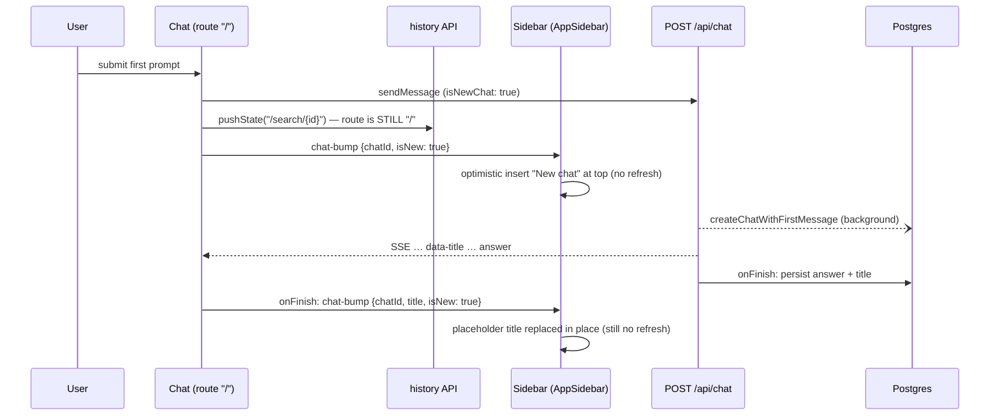

# Client state: useChat, the new-chat flow, the sidebar and the refresh invariants

The browser side of a turn is small in code but full of traps. Most of the bugs fixed
in September 2026 (404 flash, mid-stream blank, vanished first answer, duplicated
parts after resume) came from the interaction of three things:

1. a chat started on the homepage lives on a **fake URL** (`pushState`) while the
   real Next.js route is still `/`;
2. the sidebar is **server-rendered data** refreshed with `router.refresh()`;
3. the cached `loadChat` is **stale-while-revalidate**.

Read the [refresh invariants](#refresh-invariants) before touching `chat.tsx`,
`app-sidebar.tsx`, `lib/actions/chat.ts` or `app/search/[id]/page.tsx`.

## useChat wiring in `components/chat.tsx` {#usechat}

`Chat` is mounted by two routes:

| Route | File | Props |
|---|---|---|
| `/` (homepage, new chat) | `app/page.tsx` | no `id`, no saved messages, optional `?q=` query |
| `/search/[id]` (existing chat) | `app/search/[id]/page.tsx` | `id`, `savedMessages` (from `loadChatUncached`), `title`, `key={id}` |

Inside (`components/chat.tsx:65`):

- `chatId` state = `providedId || generateId()`. `handleNewChat` mints a fresh id and
  clears input/files/quotes/errors — Next.js 16 component caching keeps the component
  alive across navigation, so state must be reset by hand (the sidebar's "New chat"
  dispatches the same keyboard-shortcut event to trigger this).
- `useChat({ id: chatId, messages: savedMessages, transport, resume, onFinish, onError,
  experimental_throttle: 100, generateId })` (`chat.tsx:212`).
- `transport` = `ResumableChatTransport` against `/api/chat`; its
  `prepareSendMessagesRequest` sends only the new message for authenticated users (the
  server reloads history) and the whole `messages` array for guests. `isNewChat` =
  first submit with nothing loaded from the server.
- `resume: !isGuest && Boolean(providedId)` — reconnect to a live stream on mount.
- `onError` maps public error payloads to the rate-limit / auth / forbidden modal or a toast.
- Refs (`messagesRef`, `statusRef`, `setMessagesRef`, `isStreamingRef`) let callbacks
  that outlive a render (transport hooks, shortcuts, related-question buttons) read
  live values.

### Sections model {#sections}

`messages` is converted to `sections` (`chat.tsx:567`): each user message opens a
section `{ id, userMessage, assistantMessages[] }`; following assistant messages attach
to it. Messages are **deduplicated by id** — `useChat` can briefly surface the same
assistant message twice during stream finalisation, which would otherwise produce React
duplicate-key warnings. `ChatMessages` renders one block per section (`section-<id>`),
gives the last section a min-height so a new question scrolls to the top of the
viewport, and scrolls to a section when its user message is sent.

### Header title {#header-title}

The app header is a sibling in `app/layout.tsx`, so `Chat` publishes
`{ chatId, title }` to `ChatHeaderContext`. The `title` prop is whatever the server
rendered ("Untitled" for a new chat); the streamed `data-title` part overrides it as
soon as it arrives. Only the instance matching the current URL owns the header
(duplicate cached instances are ignored).

## New-chat flow {#new-chat-flow}

Key facts (`chat.tsx:851-894`, `chat.tsx:277-308`):

- The URL change is `window.history.pushState({}, '', '/search/<id>')` — **not** a
  navigation. The page component, route params and RSC payload are still the
  homepage's. `providedId` stays `undefined` for the life of this `Chat` instance.
- The chat row and first user message are created by the server in the background at
  the start of the turn (`createChatWithFirstMessage`, not awaited); the assistant answer
  and the generated title are written in `onFinish`, seconds to minutes later.
- The sidebar learns about the chat purely optimistically (two `chat-bump`s). It is
  reconciled with the server list the next time some other event triggers a refresh.
- Guests never `pushState` (they have nothing persisted to link to).
- Stop, resume-on-refocus and delete all work without `providedId`: Stop always hits
  `/api/chat/<chatId>/stop`; resume is keyed by `chatId`; deleting the on-screen chat
  dispatches `current-chat-deleted`, and the `Chat` that owns that id resets itself and
  `replaceState`s back to `/` (a `router.push` would be a no-op on a fake URL).

## Sidebar optimistic layer {#sidebar}

The sidebar Recent list (`components/app-sidebar.tsx`,
`components/sidebar/recent-chats-section.tsx`) is **server data**: `app/layout.tsx`
calls `getRecentChats(10)` and `countChats()` and passes them as props. Fresh data
arrives only through `router.refresh()`, and that data can lag (the revalidation is
issued after the stream's response is committed, and reads are stale-while-revalidate).

So the sidebar layers client-side overrides on top (`components/sidebar/recent-optimistic.ts`):

| Event | Dispatched by | Sidebar reaction |
|---|---|---|
| `chat-bump {chatId}` | `safeSendMessage` for an existing chat: one on its real route, or a homepage-started chat's follow-ups (`chat.tsx:514`) | optimistic `lastViewedAt = Date.now()` → jumps to top. **No refresh.** |
| `chat-bump {chatId, isNew}` | homepage submit (`chat.tsx:890`) | insert placeholder "New chat" row; footer count +1 via `countPendingNewChats` |
| `chat-bump {chatId, title, isNew}` | `onFinish` of a homepage-started chat (`chat.tsx:298`) | placeholder title replaced |
| `chat-history-updated` | `onFinish` of a chat on its real route (not on Stop); deletes; clear-history; library actions | debounced (400ms) `router.refresh()` |
| `current-chat-deleted {chatId}` | chat header / sidebar item / library delete | tombstone (row disappears instantly) + refresh; the owning `Chat` resets |

`applyOptimisticRecent(server, overrides)`:

- **max-merge** per chat: `lastViewedAt = max(server, optimistic)` compared as **epoch
  ms** (`toEpochMs`, which reads offset-less DB strings as UTC). A stale refresh can
  never undo a fresher bump; genuinely newer server data still wins.
- tombstoned chats are dropped; override ids the server hasn't returned yet are inserted
  (placeholder title);
- the result is re-sorted with the server's own comparator
  (`lastViewedAt DESC NULLS LAST, createdAt DESC`), so with no overrides the server order
  is reproduced exactly.

`pruneReconciledOverrides` runs during render when a new server prop arrives (the
React "adjust state on prop change" pattern, not an effect) and drops overrides the
server has caught up with, so the map can't grow without bound.

## Refresh invariants {#refresh-invariants}

These are rules, each paid for by a production bug. They are enforced in code comments
and in `lib/streaming/stream-activity.ts`; keep them.

### 1. Never `router.refresh()` while a turn is streaming

**Bug — mid-stream blank (2026-09-21).** On a follow-up, the send path fired
`chat-bump` and a background `touchChat().then(dispatch 'chat-history-updated')`; both
were sidebar refresh triggers, so a debounced `router.refresh()` ran ~400ms into the
stream. The refetched `/search/<id>` RSC payload did not contain the still-generating
(unpersisted) assistant message, so the messages, footer and progress indicator blanked
until the stream re-asserted itself — often surfacing when the user clicked something.

**Fix / rule:**

- `chat-bump` is **not** in `REFRESH_EVENTS` (`app-sidebar.tsx:79`) — it only drives the
  optimistic reorder. The only refresh triggers are `chat-history-updated` and
  `current-chat-deleted`.
- The send path persists `touchChat` but dispatches nothing (`chat.tsx:512-522`). This
  holds for homepage-started follow-ups too, which call `touchChat` since 2026-09-23.
- `chat-history-updated` from a turn fires only at `onFinish`, after persistence.
- **Stream-activity registry** (`lib/streaming/stream-activity.ts`): every mounted `Chat`
  reports `submitted|streaming` under a per-instance `useId()` key. The sidebar's
  `fire()` checks `isAnyStreamActive()`; if a stream is live it marks the refresh
  pending and re-schedules it when activity drops to zero. This covers refresh triggers
  that don't come from the streaming chat itself — a previous chat's turn finishing in
  the background after "New chat", or deleting a different chat mid-answer.

### 2. Never refresh a `pushState`'d homepage chat

**Bug — 404 flash on the first prompt (2026-09-19).** The new-chat `chat-bump` used to
schedule a refresh. `router.refresh()` re-resolves the *current URL* — the fake
`/search/<id>` — against the server. That raced the background creation of the chat
row, and the cached `loadChat` could cache the miss, so `app/search/[id]/page.tsx`
called `notFound()` → "This page could not be found", recovering only on a later
refresh.

**Bug — vanished first answer (2026-09-22, critical).** The follow-up fix kept a
`chat-history-updated` at `onFinish` for every chat. For a homepage-started chat that
refresh re-resolved `/search/<id>` and **remounted** the chat on the real route; that
page read the conversation through the stale-while-revalidate `loadChat` and got the
previous snapshot (a cached miss, or the user message only) — the just-finished first
answer disappeared about a second after completing, or the page 404'd. The remount also
cut off read-aloud playback and threw away a stopped answer's partial.

**Fix / rule:** a chat whose `Chat` has no `providedId` (homepage-started) never
triggers a refresh. Its `onFinish` sends an optimistic `chat-bump {title, isNew}`
instead (`chat.tsx:286-301`). Anything that needs server truth for such a chat (resume
after a disconnect) fetches it explicitly from `GET /api/chat/<id>/messages` and calls
`setMessages` — no route involvement.

### 3. The conversation view reads `loadChatUncached`

`loadChat` (`lib/actions/chat.ts:111`) is `unstable_cache` with `revalidate: 60` and
tags revalidated via `revalidateTag(tag, 'max')` — stale-while-revalidate: the first
read after a write can still return the old value. `app/search/[id]/page.tsx:44` and
every stream-path read use `loadChatUncached` (one indexed query). Only
`generateMetadata` (tab title) keeps the cached read, where staleness is harmless. A
stale read on the page produced: a reload right after an answer losing that turn, a
mid-stream reload resuming the live stream on top of the wrong last message, and 404s
for chats that exist.

### 4. Don't start a second request while a turn is in flight

**Bug — corrupted history.** Edit and Retry stay clickable on earlier turns while an
answer streams. Regenerating then ran a second request on the same chat: the first
stream kept writing into the truncated conversation (its answer reappeared) and its
settle flipped the status to `ready` while the new answer was still streaming.

**Fix / rule:** `handleUpdateAndReloadMessage` and `handleReloadFrom` refuse with a
toast ("Wait for the current answer to finish, or stop it first.") when
`status` is `submitted` or `streaming` (`chat.tsx:55, 765, 809`). Related-question
buttons use `isStreamingRef` from `ChatContext` for the same purpose.

### 5. Resume must replace, not append

After a real disconnect the resumed stream replays the whole turn from its first chunk,
and `useChat` builds it on top of the last assistant message — every part appeared
twice. `ResumableChatTransport` reports the replayed message id before the replay is
applied and `Chat` drops its partial copy (`chat.tsx:192-200`). When nothing is live
(204) the saved conversation is loaded instead. See
[Streaming → resumable streams](/request-lifecycle/streaming#resumable-streams).

::: warning Checklist before adding a `router.refresh()` or a refresh event
- Could it fire while any chat is `submitted`/`streaming`? Route it through the sidebar's
  deferred `scheduleRefresh`, never call `router.refresh()` directly.
- Could the current URL be a `pushState`'d `/search/<id>`? Then don't refresh at all.
- Does the page you refresh read `loadChat`? It must read `loadChatUncached`.
:::

## Stop, retry and error handling from the client {#stop-retry}

- **Stop** (`handleStop`, `chat.tsx:462`): SDK `stop()` + `POST /api/chat/<id>/stop` for
  every non-guest chat. On an aborted turn `onFinish` skips `chat-history-updated` (the
  partial is saved asynchronously after the stop request lands; a refresh could race it).
- **Retry** (answer action) → `regenerate({ messageId })` with trigger
  `regenerate-message`; the server bypasses the classifier (always research).
- **Edit** a user message → local text replaced (file/URL/pasted parts kept) →
  `regenerate({ messageId })`.
- **Delete section** → `deleteMessages` server action, then local filter.
- **Error modal retry** re-sends the last user message via `safeSendMessage`.

## Timezone handling in the sidebar {#timezone}

`chats.created_at` / `last_viewed_at` are `timestamp WITHOUT time zone` columns holding
UTC wall-clock values. The app container runs in UTC.

**Bug (2026-09-22).** Row times were formatted during SSR (in UTC) inside
`suppressHydrationWarning`; React does not patch a mismatched text node on hydration,
so a PDT user saw "07:24 PM" for a 12:24 PM chat, and Today/Yesterday were grouped on
UTC days.

**Fix** (`components/sidebar/recent-time.ts`):

- `useHydrated()` (`useSyncExternalStore`: false on the server and during hydration,
  true after). Row dates render as a non-breaking space until hydrated, then
  `formatDateWithTime` in the viewer's zone (`chat-menu-item.tsx:127`).
- `groupRecentChats` groups by **UTC** days for SSR + hydration (identical markup), then
  by local days once hydrated (`recent-chats-section.tsx:119`).
- `toEpochMs` reads naive date strings as UTC, and the optimistic max-merge compares epoch
  ms — a raw string parsed as local time would be future-dated west of UTC and make a
  fresh bump lose the merge.
- The Recent section's collapsed state (`ask:recent-collapsed` in localStorage) is also
  read only after hydration.

## Legacy code to ignore {#legacy}

`components/sidebar/chat-history-client.tsx` / `chat-history-section.tsx` still listen
for `chat-history-updated` and `chat-bump`, but `ChatHistorySection` is not rendered
anywhere — the live sidebar is `AppSidebar` + `RecentChatsSection`. Don't fix bugs there.

## Known gaps {#known-gaps}

- ~~**Follow-ups in a homepage-started chat don't touch `lastViewedAt`.**~~ **Fixed
  2026-09-23.** `safeSendMessage` now treats a homepage-started chat as existing once it
  has messages (checked before the send), so its follow-ups fire the `chat-bump` and a
  background `touchChat(chatId)`, still with no refresh event. The very first send is
  skipped, because `createChat` stamps `last_viewed_at` and the row may not exist yet.
- **The server Recent list is not reconciled after a homepage-started chat** until some
  other refresh trigger fires (a chat on its real route finishing, a delete). The
  optimistic override covers the gap in the current tab only.
- `metadata.stopped` on a stopped answer is persisted but not rendered.
