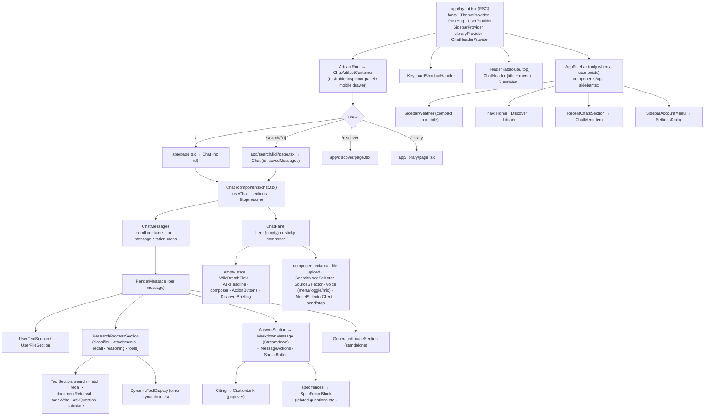

# Frontend: component map, rendering, mobile layout

Ask's UI is a Next.js 16 App Router app (React 19, Tailwind v4, shadcn/ui primitives,
Tabler icons). Almost everything interactive is a client component under
`components/`. This page maps the tree, explains how an answer is rendered (markdown,
citations, research steps), and records the mobile layout decisions and why they
exist — several of them are fixes for real phone bugs that are easy to regress.

State and the refresh rules live in [Client state](/request-lifecycle/client-state);
streaming in [Streaming](/request-lifecycle/streaming).

## Component tree



### Main components

| Component | File | Responsibility |
|---|---|---|
| Root layout | `app/layout.tsx` | Fonts (Hanken Grotesk body, Instrument Serif headline via `next/font`, self-hosted), providers, server-loads the sidebar's Recent list + chat count; `body` is `fixed inset-0 overflow-hidden` |
| Sidebar | `components/app-sidebar.tsx` | Brand, weather, New chat, nav, Recent (optimistic layer), chat count, account menu; `collapsible="icon"` rail on desktop, drawer on mobile |
| Header | `components/header.tsx` | Absolute top bar; shows `ChatHeader` (title + share/delete menu) for the chat that owns the header context; left padding reserves room for the sidebar toggle |
| Chat | `components/chat.tsx` | `useChat`, sections, submit/pushState, Stop, resume, edit/retry guards |
| Messages | `components/chat-messages.tsx` | Scroll container (`pt-14` under the header), sections, latest-section min-height, per-message citation maps, footer glyph |
| RenderMessage | `components/render-message.tsx` | Splits an assistant message into research-process segments, answer text and standalone image cards |
| Research process | `components/research-process-section.tsx` | Collapsible "Working on it… / Completed N steps" accordion, `WaitingQuote` while live |
| Tool sections | `components/tool-section.tsx` (+ `search-section`, `fetch-section`, `recall-tool-section`, `tool-todo-display`, `question-confirmation`) | One renderer per typed tool part |
| Reasoning | `components/reasoning-section.tsx` | Compact "Thinking…/Thought" pill; raw chain-of-thought hidden unless `NEXT_PUBLIC_SHOW_REASONING=true` (build-time) |
| Answer | `components/answer-section.tsx` → `components/message.tsx` | Markdown rendering, message actions, a text-selection toolbar (Save / quote into the composer), read-aloud |
| Composer | `components/chat-panel.tsx` | Hero + composer + toolbar + Discover (empty state) or sticky composer (chat) |
| Inspector | `components/artifact/*`, `components/inspector/*` | Side panel for a clicked tool/search result; resizable (width stored in `localStorage.artifactPanelWidth`), drawer on small screens |
| Discover | `app/discover/page.tsx`, `components/discover-briefing.tsx` | Topic news page; homepage 4-card briefing (pool of 12, random per load, auto-advance every 20s), `/api/discover` |
| Library | `app/library/page.tsx`, `components/library/*` | Full chat manager (search, delete); dispatches the same sidebar events |

## How an assistant message is rendered {#render-message}

`RenderMessage` walks `message.parts` in order and buffers non-text parts
(`reasoning`, `data-classifier`, `data-attachments`, non-empty `data-recall`, every
`tool-*` except `tool-generateImage`, every `dynamic-tool` except generateImage) into a
`ResearchProcessSection`. It flushes the buffer when answer text or an image arrives.

- **Which text is the answer?** After the stream: only the **last** non-empty text part
  (earlier ones are inter-step narration and are hidden). While this message is
  streaming: a text part renders only if it **starts with a markdown heading** — the
  "first-token rule" every mode's prompt enforces — so narration never flashes before a
  tool call replaces it. Streaming state is scoped to the latest message only; keying
  it off the global status used to make earlier answers re-enter streaming rendering
  and light up as "Working on it" on every new turn.
- **Research section liveness:** a section is "in progress" only if it is the trailing
  element of the message; anything after it (answer, image, another section) settles it.
- **Generated images** render as a standalone card, never inside the accordion (live they
  arrive as `tool-generateImage`, reloaded they can come back as `dynamic-tool`).
- **Dynamic tools** (calculate, get_weather, remember, recall, MCP tools) buffer into the
  accordion like typed tools; `ToolSection` has an explicit `tool-calculate` case so a
  live calculation shows `expr = result` instead of an empty step.
- `endsInActiveResearch` lets `ChatMessages` show a single animated Wild Breath mark:
  the footer glyph hides while the research indicator is live.

## Markdown and the Streamdown sanitize pipeline {#markdown}

`MarkdownMessage` (`components/message.tsx:56`):

```text
answer text
  → processCitations(text, citationMaps)      [n](#toolCallId) → [domain](encodeURI(url)), invalid → ''
  → collapseCitationArtifacts                 tidy spaces/punctuation left by dropped anchors
  → <Streamdown mode="streaming"
        rehypePlugins = defaultRehypePlugins  raw → sanitize → harden
        plugins = math (KaTeX) + ```spec renderer
        components = { a: Citing, img: AnswerImage }>
```

- `streamdown` 2.5's default rehype chain is `rehype-raw` (parse inline HTML), then
  `rehype-sanitize` with the default GitHub-style schema plus `tel:` links (strips scripts,
  event handlers and `href` schemes outside http/https/mailto/…), then
  `rehype-harden` configured permissively (all prefixes/protocols allowed — the sanitizer
  is what actually protects).
- **Images in answers never auto-load.** `AnswerImage` renders a markdown image as a
  click-through link: injected web content could otherwise make the model emit
  ``, a zero-click exfiltration channel.
  All legitimate images (generated images, search image results, news cards) render
  through their own components.
- `mode: 'streaming'` lets Streamdown render incomplete markdown (unclosed fences,
  tables) gracefully while text is still arriving.
- ```` ```spec ```` fenced blocks are rendered by `SpecFenceBlock` (json-render). This is
  how the model emits structured UI such as **related questions**
  (`getRelatedQuestionsSpecPrompt` in the researcher prompt); clicking one calls
  `sendMessage` from `ChatContext`, throttled by `isStreamingRef` so it can't overlap a
  running turn.

## Citations {#citations}

Pipeline: the researcher cites `[N](#<toolCallId>)` → `ChatMessages` builds **per-message**
citation maps (`extractCitationMaps`: `toolCallId → {N → result}` from that message's
`tool-search` / `tool-fetch` / `tool-documentRetrieval` outputs) → `processCitations`
rewrites anchors to real URLs → `Citing` resolves the URL back to its result for the
preview.

- **Per-message scope is load-bearing.** A conversation-wide map let an anchor carried
  over from an earlier turn resolve cleanly to the wrong source (measured: 120 of 2,975
  anchors in prod history). Scoped per message, an out-of-turn anchor resolves to nothing
  and is dropped; `citations_unresolved` on the `[latency]` line counts it.
- Tool-call ids a model prefixed (`toolu_`, `call_`, `search-`) are normalised before lookup.
- **URL-match invariant.** `Citing` (`components/custom-link.tsx`) finds the preview data by
  comparing `decodeURI(href)` to each stored `result.url` — not by number. The rewritten
  href is `encodeURI(url)`, so the round trip must reproduce the stored URL exactly. If you
  change how URLs are stored, encoded or normalised (tracking-param stripping, trailing
  slashes), the citation still links correctly but silently loses its hover/tap preview.
- Only link text that looks like a domain label (`isCitationLabel`: `[\w-]+(\.[\w-]+)*`) is
  treated as a citation chip; other links render as normal links.

**Touch vs hover** (`components/citation-link.tsx`): desktop mouse = hover opens the
preview, click navigates. Touch/pen has no hover, so the **first tap opens the preview**
(`preventDefault` on the click), a second tap or the "Open source ↗" link inside navigates;
an outside tap closes it. The pointer type is tracked per gesture, so a mouse on a
touchscreen laptop keeps hover behaviour. The chip gets a larger hit area on coarse
pointers (`pointer-coarse:before:-inset-y-3`, ~40px). Preview titles/snippets pass through
`snippetText` (strips provider highlight markup like `<strong>` and decodes entities).

## Composer and toolbar {#composer}

The composer is one `<form>` inside `ChatPanel` (`components/chat-panel.tsx`), reused in
the homepage hero and at the bottom of a chat:

- `react-textarea-autosize` input; large pastes become a pasted-content card (by
  character count); pasted URLs become `data-sourceUrl` chips (fetched + cited server-side);
  quoted text from answers becomes `data-quotedContext`.
- **Toolbar, left group** (`shrink-0`, never shrinks): file upload (not for guests),
  `SearchModeSelector` (speed / balanced / quality → `searchMode` cookie), `SourceSelector`
  (`sources` cookie), voice controls, `MicButton` (dictation: tap = toggle recording, hold
  ≥250ms = push-to-talk; transcript lands in the composer for manual send).
- **Toolbar, right group** (`min-w-0`, absorbs the squeeze): `ModelSelectorClient`
  (hidden on cloud deployments), new-chat button (in a chat), send / Stop.
- **Voice**: desktop shows a read-aloud toggle + `VoiceSettingsPopover`; mobile collapses
  both into `ComposerVoiceMenu`. All voice UI requires the build-time
  `NEXT_PUBLIC_VOICE_ENABLED=true`. Dictation needs a secure context (HTTPS) and the
  `Permissions-Policy` header must keep `microphone=(self)` (and `geolocation=(self)` for
  weather) in `next.config.mjs` — a hardening pass once set them to `()` and silently broke
  both. Details: [Media](/knowledge/media).
- Model selection is persisted per account (server-side preference) for signed-in users;
  the `selectedModel` cookie is only used for guests.

## Homepage hero {#homepage}

Empty state (`messages.length === 0`), `chat-panel.tsx:1024-1080`: full-bleed
`WildBreathField` canvas (a softened 3-body simulation, theme-aware), a radial scrim for
legibility, the auto-cycling `AskHeadline` ("Ask ___."), the wide glass composer
(`md:max-w-[880px]`, homepage only), prompt-starter `ActionButtons` (desktop only), and
the `DiscoverBriefing` below (toggle: Settings → `showNewsWidget`).

## Mobile layout decisions {#mobile}

Each rule below fixed a reproduced phone bug. Verify changes at 360–390px wide with a
real mobile emulation (Playwright), not a resized desktop window — see
[Testing & QA](/operations/testing-qa).

| Rule | Where | Why |
|---|---|---|
| Empty-state container is `items-center justify-start overflow-y-auto md:justify-center` | `components/chat.tsx:921` | On a phone the Discover feed is one tall column, so hero + feed exceed the viewport. A **non-scrolling `justify-center`** flex container clips *both* ends — it pushed the composer off the top and users saw only news with nowhere to type (2026-09-12). Two earlier fixes shrank the hero; the real cause was the parent container. |
| Hero is focus-anchored: `min-h-[68vh]`, `justify-center` idle, `justify-start pt-6` while the textarea is focused on mobile | `chat-panel.tsx:1036-1041` | The on-screen keyboard shrinks the viewport and the textarea grows; `justify-center` kept re-centring the block and the line being typed drifted out of view (2026-09-20). Desktop always stays centred. |
| Toolbar: left group `shrink-0`, right group `min-w-0`; model pill shows the short name and goes icon-only below 380px (in a chat) / 340px (homepage) | `chat-panel.tsx:880-941`, `model-selector-client.tsx:126` | An earlier `min-w-0` on the left let the model pill cover the dictation mic at 360–390px, making it untappable (2026-09-22). |
| Popovers default to `collisionPadding={8}`; model list `max-h-[min(280px, available − 56px)]` | `components/ui/popover.tsx:23`, `model-selector-client.tsx:168` | Popovers were clipped at the screen edge / ran under the keyboard. |
| Use `dvh`, not `vh`, for full-height surfaces (sidebar `h-[100dvh]`, settings dialog `max-h-[calc(100dvh-…)]`, latest-section min-height) | `components/ui/sidebar.tsx:162`, `settings-dialog.tsx:612`, `chat-messages.tsx:111` | `100vh` on mobile includes the area behind the browser chrome; the settings dialog overflowed. `vh` is kept as a fallback declaration. |
| Sidebar weather is a one-line tap-to-expand summary on mobile | `app-sidebar.tsx:249` (`compact={isMobile}`) | The full card pushed the Recent list below the fold (284 → 39px). |
| Delete buttons (library rows, memory tab) are always visible on touch | library / `settings/memory-tab.tsx` | They were hover-only, i.e. unreachable on phones. |
| Citation previews open on first tap | `citation-link.tsx` | Hover-only previews were unreachable on touch. |
| Discover header compacted on mobile (smaller icon/title, horizontally scrolling topic chips) | `app/discover/page.tsx:279-294` | The sticky header took 247px of a 640px-tall screen (now ~155px). |
| Tapping a sidebar link closes the mobile drawer | `app-sidebar.tsx:216` | The drawer otherwise covered the destination. |
| Viewport `minimumScale: 1, maximumScale: 1` | `app/layout.tsx:67` | Disables pinch/auto-zoom (commonly to stop iOS zooming on input focus; the rationale is not documented in code). |

Note: the composer textarea has no `autoFocus`; auto-focusing on a phone would pop the
keyboard and scroll the page on load.

## Client settings {#settings}

Client preferences live in `localStorage` (per browser, not per account) and are read with
`useClientSettingEnabled` / `useClientSettingValue` (`hooks/use-client-setting.ts`), which
re-read when `SettingsDialog` dispatches `client-config-changed`.

| Key | Values (default) | Used by |
|---|---|---|
| `showNewsWidget` | `"true"`/`"false"` (on) | homepage Discover briefing |
| `showWeatherWidget` | `"true"`/`"false"` (on) | sidebar weather card |
| `measureUnit` | `metric` / `imperial` (metric) | weather units |
| `systemInstructions` | free text (empty) | sent with every turn as `systemInstructions` |
| `voiceMode` | `"true"`/`"false"` (off) | read-aloud; sent as `voice` |
| `voiceTtsVoice` | voice id | TTS voice |
| `ask:recent-collapsed` | `"true"`/`"false"` | Recent section fold (read after hydration) |
| `ask:weather-location` | JSON location | manual weather location override |
| `ask:weather-auto` | JSON coords + timestamp (6h TTL) | cached auto-geolocation (avoids re-prompting) |
| `artifactPanelWidth` | px | Inspector panel width |

Cookies (server-readable): `searchMode`, `sources`, `selectedModel` (guests only).
Settings → Memory and Account tabs talk to the server, not localStorage.

## Theming {#theming}

`next-themes` via `components/theme-provider.tsx`: `attribute="class"`,
`defaultTheme="system"`, transitions disabled on change; users pick System / Light /
Dark in Settings → Preferences or the account menu. Tokens are CSS variables in
`app/globals.css` (`:root` light, `.dark` retinted to a cosmic indigo palette — hue ≈289 in
OKLCH); `--font-sans` is Hanken Grotesk. Canvas visuals (`WildBreathField`) and the hero
scrim have separate light/dark treatments (additive glow on dark, saturated orbs on light).
Timezone-sensitive text is rendered only after hydration (see
[Client state → timezone](/request-lifecycle/client-state#timezone)); `<html>` carries
`suppressHydrationWarning` for the theme class.
