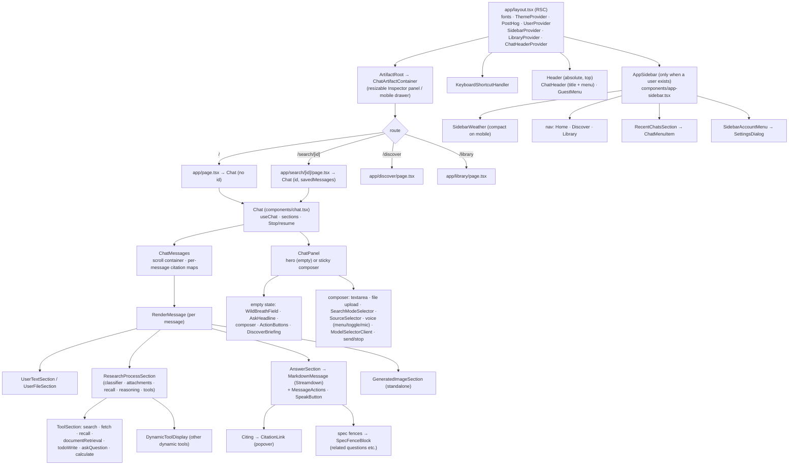

# Frontend: component map, rendering, mobile layout

Ask's UI is a Next.js 16 App Router app (React 19, Tailwind v4, shadcn/ui primitives,
Tabler icons). Almost everything interactive is a client component under
`components/`. This page maps the tree, explains how an answer is rendered (markdown,
citations, research steps), and records the mobile layout decisions and why they
exist — several of them are fixes for real phone bugs that are easy to regress.

State and the refresh rules live in [Client state](/request-lifecycle/client-state);
streaming in [Streaming](/request-lifecycle/streaming).

## Component tree


```mermaid
flowchart TD
  L["app/layout.tsx (RSC)<br/>fonts · ThemeProvider · PostHog · UserProvider<br/>SidebarProvider · LibraryProvider · ChatHeaderProvider"]
  L --> SB["AppSidebar (only when a user exists)<br/>components/app-sidebar.tsx"]
  L --> KS["KeyboardShortcutHandler"]
  L --> HD["Header (absolute, top)<br/>ChatHeader (title + menu) · GuestMenu"]
  L --> AR["ArtifactRoot → ChatArtifactContainer<br/>(resizable Inspector panel / mobile drawer)"]
  AR --> PG{"route"}
  PG -->|"/"| HOME["app/page.tsx → Chat (no id)"]
  PG -->|"/search/[id]"| SEARCH["app/search/[id]/page.tsx → Chat (id, savedMessages)"]
  PG -->|"/discover"| DISC["app/discover/page.tsx"]
  PG -->|"/library"| LIB["app/library/page.tsx"]
  SB --> SBW["SidebarWeather (compact on mobile)"]
  SB --> SBN["nav: Home · Discover · Library"]
  SB --> SBR["RecentChatsSection → ChatMenuItem"]
  SB --> SBA["SidebarAccountMenu → SettingsDialog"]
  HOME --> CHAT
  SEARCH --> CHAT["Chat (components/chat.tsx)<br/>useChat · sections · Stop/resume"]
  CHAT --> CM["ChatMessages<br/>scroll container · per-message citation maps"]
  CHAT --> CP["ChatPanel<br/>hero (empty) or sticky composer"]
  CM --> RM["RenderMessage (per message)"]
  RM --> UTS["UserTextSection / UserFileSection"]
  RM --> RPS["ResearchProcessSection<br/>(classifier · attachments · recall · reasoning · tools)"]
  RM --> ANS["AnswerSection → MarkdownMessage (Streamdown)<br/>+ MessageActions · SpeakButton"]
  RM --> GIS["GeneratedImageSection (standalone)"]
  RPS --> TS["ToolSection: search · fetch · recall ·<br/>documentRetrieval · todoWrite · askQuestion · calculate"]
  RPS --> DTD["DynamicToolDisplay (other dynamic tools)"]
  ANS --> CIT["Citing → CitationLink (popover)"]
  ANS --> SPEC["spec fences → SpecFenceBlock<br/>(related questions etc.)"]
  CP --> HERO["empty state: WildBreathField · AskHeadline ·<br/>composer · ActionButtons · DiscoverBriefing"]
  CP --> COMP["composer: textarea · file upload · SearchModeSelector ·<br/>SourceSelector · voice (menu/toggle/mic) · ModelSelectorClient · send/stop"]
```

### Main components

| Component | File | Responsibility |
|---|---|---|
| Root layout | `app/layout.tsx` | Fonts (Hanken Grotesk body, Instrument Serif headline via `next/font`, self-hosted), providers, server-loads the sidebar's Recent list + chat count; `body` is `fixed inset-0 overflow-hidden` |
| Sidebar | `components/app-sidebar.tsx` | Brand, weather, New chat, nav, Recent (optimistic layer), chat count, account menu; `collapsible="icon"` rail on desktop, drawer on mobile |
| Header | `components/header.tsx` | Absolute top bar (`z-20`; translucent below 1024px, transparent at `lg+`); shows `ChatHeader` (title + share/delete menu) for the chat that owns the header context; left padding reserves room for the sidebar toggle. See [header backdrop](#header-backdrop) |
| Chat | `components/chat.tsx` | `useChat`, sections, submit/pushState, Stop, resume, edit/retry guards |
| Messages | `components/chat-messages.tsx` | Scroll container (`pt-14` under the header) with an opaque sticky strip behind the header band, sections, latest-section min-height, per-message citation maps, footer glyph |
| RenderMessage | `components/render-message.tsx` | Splits an assistant message into research-process segments, answer text and standalone image cards |
| Research process | `components/research-process-section.tsx` | Collapsible "Working on it… / Completed N steps" accordion, `WaitingQuote` while live; refused search/fetch calls fold into one "skipped" row (`components/skipped-tool-calls-section.tsx`, [below](#refused-calls-fold-into-one-line)) |
| Tool sections | `components/tool-section.tsx` (+ `search-section`, `fetch-section`, `recall-tool-section`, `tool-todo-display`, `question-confirmation`) | One renderer per typed tool part |
| Reasoning | `components/reasoning-section.tsx` | Compact "Thinking…/Thought" pill; raw chain-of-thought hidden unless `NEXT_PUBLIC_SHOW_REASONING=true` (build-time) |
| Answer | `components/answer-section.tsx` → `components/message.tsx` | Markdown rendering, message actions, a text-selection toolbar (Save / quote into the composer), read-aloud |
| Composer | `components/chat-panel.tsx` | Hero + composer + toolbar + Discover (empty state) or sticky composer (chat) |
| Inspector | `components/artifact/*`, `components/inspector/*` | Side panel for a clicked tool/search result; resizable (width stored in `localStorage.artifactPanelWidth`), drawer on small screens |
| Discover | `app/discover/page.tsx`, `components/discover-briefing.tsx` | Topic news page; homepage 4-card briefing (pool of 12, random per load, auto-advance every 20s), `/api/discover` |
| Library | `app/library/page.tsx`, `components/library/*` | Full chat manager (search, delete); dispatches the same sidebar events |

### Header backdrop {#header-backdrop}

The app `Header` is rendered in `app/layout.tsx:144`, outside the chat's scroll container, and
floats over it: `absolute top-0 … z-20 … bg-background/80 lg:bg-transparent`
(`components/header.tsx:30`). The scroller (`components/chat-messages.tsx:235`) reserves the
band with `pt-14`. Below 1024px the header's own translucent, blurred background hides the text
under it. At `lg+` the header is fully transparent, so until 2026-09-25 (prod `6aa6b047`, lab
`5a1e0e59`) scrolled answer text showed straight through behind the chat title.

The fix is an opaque strip **inside** the scroller, rendered only when there are messages
(`components/chat-messages.tsx:239-255`, `data-testid="chat-header-backdrop"`):

```text
<div aria-hidden class="sticky -top-14 z-[15] -mt-14 h-14 bg-background" />
```

- **`-top-14`, not `top-0`.** Chrome measures a sticky offset from the scroller's **padding**
  edge. With `pt-14` on the scroller, `top-0` pins the strip 56px down, over the content.
  `-top-14` pins it to the top of the scrollport, exactly behind the header.
- **`-mt-14`** cancels the strip's own 56px in the flow, so the layout is unchanged.
- **`z-[15]`** sits above in-content UI and below the header (`z-20`; the header was `z-10`
  before this change).
- **Why inside the scroller, not a background on the header.** The strip is as wide as the
  scroller's content box, so it does not cover the scrollbar, and it does not reach the
  artifact/library panel beside the chat. A background on the header itself would cover both.

## How an assistant message is rendered {#render-message}

`RenderMessage` first takes the **narration-free view** of the message,
`narrationCleanView(message)` (`components/render-message.tsx:158`): the same cleanup that
runs before an answer is saved, memoized per message object. Status notes written before a
tool call are dropped and a preamble glued to the answer's `## ` heading is cut, in any
language ([rules](/search/models-reasoning#narration-structural-rules)).
Because it runs at render time, an answer saved before a rule existed displays clean without
a database rewrite. It then walks the view's parts in order and buffers non-text parts
(`reasoning`, `data-classifier`, `data-attachments`, non-empty `data-recall`, every
`tool-*` except `tool-generateImage`, every `dynamic-tool` except generateImage) into a
`ResearchProcessSection`. It flushes the buffer when answer text or an image arrives.

- **Which text is the answer?** After the stream: only the **last** non-empty text part
  (earlier ones are inter-step narration and are hidden). While this message is
  streaming: a text part renders only if it **starts with a markdown heading** — the
  "first-token rule" every mode's prompt enforces (`components/render-message.tsx:237`) —
  so narration never flashes before a tool call replaces it. An answer whose heading is
  glued to a preamble (`…câu trả lời.## `) is hidden until the text after the seam is longer
  than the preamble, then appears from its heading. Streaming state is scoped to the latest
  message only; keying it off the global status used to make earlier answers re-enter
  streaming rendering and light up as "Working on it" on every new turn.
- **Research section liveness:** a section is "in progress" only if it is the trailing
  element of the message; anything after it (answer, image, another section) settles it.
- **Generated images** render as a standalone card, never inside the accordion (live they
  arrive as `tool-generateImage`, reloaded they can come back as `dynamic-tool`).
- **Dynamic tools** (calculate, get_weather, remember, recall, MCP tools) buffer into the
  accordion like typed tools; `ToolSection` has an explicit `tool-calculate` case so a
  live calculation shows `expr = result` instead of an empty step.
- `endsInActiveResearch` (`components/render-message.tsx:50`) lets `ChatMessages` show a
  single animated Wild Breath mark: the footer glyph hides while the research indicator is
  live. It reads the same narration-free view, so an answer whose heading appears only after
  a cut preamble ends the research phase too.
- **Copy.** The action row copies the rendered (cleaned) answer text; the copy shortcut
  (Mod+Shift+C) copies the text parts of the same view (`components/chat.tsx:686`).

### Refused calls fold into one line {#refused-calls-fold-into-one-line}

Since 2026-10-07 (lab and staging; prod pending), `search` and `fetch` calls that were refused
without running no longer render as ordinary steps. In each research-process segment they fold
into **one** muted row, placed where the first refusal was:
"Search limit reached — 12 extra searches skipped", or "… — 4 extra searches and 2 page reads
skipped" (`skippedToolCallsLabel`, `lib/utils/skipped-tool-calls.ts:166-182`). The lead is
"Research limit reached" when no search was refused by the round cap itself (only answer-now or
fetch-cap refusals). The row has nothing to expand and a tooltip saying no search or page read
was done for these calls (`components/skipped-tool-calls-section.tsx`).

- **Why.** The pipeline refuses calls past the search round cap, past the fetch cap and on
  answer-only steps ([pipeline › round cap](/search/pipeline#round-cap)) with an empty,
  non-error result, and each one rendered as one more search row. On a prod turn the user
  counted 18 "searches" where 5 ran and 12 were refused.
- **What counts as refused** (`collapseSkippedToolCalls`, `skipped-tool-calls.ts:109-151`). A
  finished `tool-search` / `tool-fetch` part whose output carries the flag its refusal sets,
  never the notice text: `searchLimitReached: true` (round cap), `fetchLimitReached: true`
  (fetch cap) or `answerNow: true` (the answer-deadline wrapper, which also serves the search
  cap's answer-only steps). Also an `output-error` part whose error is "Invalid input for tool
  search" (or `fetch`), a model inventing arguments for a tool it no longer sees, but only after
  a flagged refusal earlier in the same segment; without one it is an ordinary failed call and
  renders as the error it is. A near-duplicate or exact-repeat search, a provider error and a
  call still in flight are never folded.
- **Live and on reload.** It is a pure function recomputed on every render
  (`research-process-section.tsx:440`), so a live call shows as usual until its refused result
  arrives and then joins the row; the row is keyed per segment (`:464-467`), so only its count
  changes and nothing below it jumps. The flags are stored in the tool output, so a reloaded
  chat folds the same way. When nothing was refused the parts come back unchanged (same array),
  and such turns render exactly as before.
- **The step count is unchanged.** "Working on it — N steps so far" / "Completed N steps" still
  counts every part of the segment, refused calls included (`totalParts = seg.length`,
  `research-process-section.tsx:447`): it counts steps, not searches.
- **Where.** `RenderPart` dispatches the folded entry to `SkippedToolCallsSection`
  (`research-process-section.tsx:254-256`). Tests: `lib/utils/__tests__/skipped-tool-calls.test.ts`,
  `components/__tests__/research-process-skipped-calls.test.tsx` and
  `research-process-section.test.tsx`. Checked in the lab UI on a capped turn: 5 search rows,
  then "Search limit reached — 4 extra searches skipped".

## Message actions and the "Stopped" label {#message-actions}

`MessageActions` (`components/message-actions.tsx`) is the row under each answer: retry,
read-aloud, copy, share, delete on the left, and a right-hand cluster with **Save** (to the
library). Since 2026-09-24 the right-hand cluster also holds a muted, text-only **"Stopped"**
pill when the answer was cut short with Stop (`StoppedBadge`, `:415`). `AnswerSection` passes
`stopped={metadata?.stopped === true}`.

- **Text only, no icon.** A square glyph next to the answer read as a second Stop button.
- **Live and after reload.** The flag is set on the client when the Stop lands and is persisted
  by the server, so the pill appears at once and survives a reload. See
  [streaming → Stop](/request-lifecycle/streaming#stop) for both paths.
- **The row wraps.** It is `flex-wrap` with `gap-y-1`, and the right cluster is `ml-auto`
  (`:249`, `:313`). On a narrow phone an authed answer with every action plus Save and the pill
  would overflow, so the right cluster drops to its own line and stays right-aligned.
- A Stop before any answer text is written saves nothing, so there is no answer and no row.

## Markdown and the Streamdown sanitize pipeline {#markdown}

`MarkdownMessage` (`components/message.tsx:67`):

```text
answer text
  → stripIncompleteCitationTail(text)         drop a citation anchor still streaming at the
                                              very end ("[1](#call_ab…"), see below
  → processCitations(text, citationMaps)      [N](#toolCallId) → [domain](encodeURI(url)),
                                              resolved by resolveCitationAnchor; unresolved → ''
  → collapseCitationArtifacts                 tidy spaces/punctuation left by dropped anchors
  → <Streamdown mode="streaming"
        remend = { linkMode: 'text-only' }    how an unclosed tail link is completed
        rehypePlugins = defaultRehypePlugins  raw → sanitize → harden
        plugins = math (KaTeX) + ```spec renderer
        components = { a: Citing, img: AnswerImage }>
```

- `streamdown` 2.5's default rehype chain is `rehype-raw` (parse inline HTML), then
  `rehype-sanitize` with the default GitHub-style schema plus `tel:` links (strips scripts,
  event handlers and `href` schemes outside http/https/mailto/…), then
  `rehype-harden` configured permissively (all prefixes/protocols allowed — the sanitizer
  is what actually protects).
- **Images in answers never auto-load.** `AnswerImage` renders a markdown image as a
  click-through link: injected web content could otherwise make the model emit
  ``, a zero-click exfiltration channel.
  All legitimate images (generated images, search image results, news cards) render
  through their own components.
- `mode: 'streaming'` lets Streamdown render incomplete markdown (unclosed fences,
  tables) gracefully while text is still arriving. It is set unconditionally
  (`components/message.tsx:88-94`), so a **reloaded** answer goes through the same
  incomplete-markdown repair as a live one. A message that was saved half-way (Stop) keeps
  whatever the repair does to its tail.
- ```` ```spec ```` fenced blocks are rendered by `SpecFenceBlock` (json-render). This is
  how the model emits structured UI such as **related questions**
  (`getRelatedQuestionsSpecPrompt` in the researcher prompt); clicking one calls
  `sendMessage` from `ChatContext`, throttled by `isStreamingRef` so it can't overlap a
  running turn.

### Half-streamed links and the "[blocked]" flash {#blocked-flash}

**Symptom (fixed 2026-09-25, prod `a9ad0ce8`, lab `e658ef71`).** While an answer streamed,
each citation briefly rendered as **"1 [blocked]"** until its anchor finished. An answer
stopped in the middle of an anchor showed the marker **permanently**, including after a
reload.

**Cause.** The stream tail often ends inside a citation anchor: `[1](#call_ab` with no
closing `)` yet.

1. Streamdown repairs incomplete markdown before parsing (its `remend` step). With the default
   `linkMode: 'protocol'` it completes an unclosed link as
   `[1](streamdown:incomplete-link)`.
2. `rehype-sanitize` drops that `href`: `streamdown:` is not an allowed scheme (the default
   schema allows `http`, `https`, `mailto`, `irc`, `ircs` and `xmpp`; Streamdown adds `tel`).
3. `rehype-harden` then sees an `<a>` with no `href` and appends its " [blocked]" indicator.

Because reloaded answers also render in streaming mode (above), a message persisted
mid-anchor went through the same repair on every load.

**Fix.** Two independent parts:

- `stripIncompleteCitationTail()` (`lib/utils/citation.ts:895`) removes an unfinished
  citation anchor from the very end of the text before anything else runs. Its pattern
  (`INCOMPLETE_CITATION_TAIL_RE`, `:877-878`) matches `[`, `[1`, `[1](`, `[1](#` and
  `[1](#<partial id>` at the end of the string (up to three digits). A complete bracket with
  no link part (`[1]`) is left alone, because a finished answer may legitimately end with it;
  so are a named link (`[Python docs`) and an external one (`[1](https://…`), which the
  `remend` setting below handles. The tail is not touched when it sits inside an open fenced
  code block (odd number of fence lines before it) or an open inline code span (odd number of
  backticks on its line), where `[` is code, not a citation. The anchor carries nothing
  displayable until its `)` arrives, and `processCitations` turns it into a source chip at
  that point.
- Streamdown gets the `remend` option `{ linkMode: 'text-only' }`
  (`components/message.tsx:36,107`, and the reasoning view
  `components/artifact/reasoning-content.tsx:10,16`). An ordinary link still streaming
  (`[text](https://exa`) now shows only its text until it completes, instead of the
  placeholder `href`.

**What did not change.** Sanitize and harden run exactly as before on every completed link,
so `javascript:`, `data:` and `file:` hrefs are still blocked. Do not "fix" a future
`[blocked]` report by loosening the sanitize schema or harden's prefixes; find which step
produced the unsafe or empty `href` first.

Tests: `components/__tests__/markdown-message-streaming-links.test.tsx` (renders
`MarkdownMessage` with half-streamed anchors and links, and checks that unsafe links are still
blocked) and `lib/utils/__tests__/citation.test.ts` (`stripIncompleteCitationTail` cases).

## Citations {#citations}

Pipeline: the researcher cites `[N](#<toolCallId>)`, since 2026-09-27 by copying the ready-made
`cite` string each result carries in its tool output → `ChatMessages` builds **per-message**
citation maps (`extractCitationMaps`: `toolCallId → {N → result}` from that message's
`tool-search` / `tool-fetch` / `tool-documentRetrieval` outputs) → `processCitations`
rewrites each anchor to its real URL → `Citing` resolves the URL back to its result for the
preview.

**What N means.** N is the 1-based position of the cited result in **that tool call's**
`results`: `extractCitationMaps` maps N to `results[N-1]` (`lib/utils/citation.ts:531-536`).
Numbering restarts at 1 for every call, so each call has its own `[1]`, and a fetch of one page
is always `[1]`. It is **not** a running count across the answer.

**The model copies N; it does not compute it** (since 2026-09-27, `CITATION_HANDLES`, default
on). Every search result, fetched page and attached-document excerpt in the model-facing tool
output carries `"cite":"[N](#<toolCallId>)"`, built by `addCitationHandles`
(`lib/utils/citation-handles.ts:62-90`) from the same `results` array `extractCitationMaps`
indexes, so a copied handle always resolves to the result it was attached to. The shared
`getCitationFormatGuidance()` (`lib/agents/prompts/search-mode-prompts.ts:107-124`) tells the
model to copy it exactly and never compute, renumber or edit a citation. The handles exist only
in what the model is shown: stored parts, the browser and history carry none
([D38](/history/decisions#d38-ready-made-citation-handles)). Before that, models counted: the
speed prompt first taught "one number per toolCallId, assigned sequentially", and even the
unified within-call rule of 2026-09-26 (now the `CITATION_HANDLES=off` text) kept failing. Models
that counted sources across the answer produced numbers that were either out of range (dropped)
or in range but pointing at a different result of the same search
([known issue](/history/known-issues#running-count-citation-numbers-can-point-at-the-wrong-result)).

**One resolver.** `resolveCitationAnchor(N, id, maps)` (`lib/utils/citation.ts:376-411`)
decides every anchor. Rendering (`processCitations`, `citation.ts:845-869`), the telemetry
audit (`auditCitations`, `citation.ts:450-475`) and the cited-URL list
(`extractCitedSourceUrls`, `citation.ts:557-571`) all call it, so `citations_unresolved`
counts exactly the anchors a reader loses. The copy and save-note text of an answer goes
through `processCitations` too (`components/message-actions.tsx:103-110`). The result is `own`,
`recovered` (with the repair used) or `unresolved`:

| Anchor | Result |
|---|---|
| id of a citable call of this message, N in range (and the result has a valid URL) | `own`: result N of that call |
| same id with a model-added `toolu_` / `call_` / `search-` prefix | normalised, then as above |
| one of this message's ids wrapped as `<id-UUID>`, `<UUID>` or `id-UUID` | `recovered` (`wrapped-id`): unwrapped, then looked up |
| a shortened id: after trimming whitespace, one trailing `...` / `…` and trailing dashes, at least 8 hex/dash characters that start **exactly one** of this message's citable call ids (`[1](#71cee5ba...)`, `[3](#17d98f5d)`); since 2026-10-06, lab, staging and prod | `recovered` (`id-prefix`): that call, then N as for its full id. Shorter, ambiguous or another turn's prefix: dropped |
| a full-length id one character substituted, added or dropped from **exactly one** of this message's UUID-shaped call ids; since 2026-10-06, lab, staging and prod | `recovered` (`id-typo`): that call, then N as for its full id. Two characters off, or one off two calls or another turn's id: dropped |
| a placeholder: `<token>`, `id-X`, `toolCallId`, or any example id the prompts have used | `recovered` (`placeholder`) only if the message made **exactly one** citable call and N is in range for it (or it is a one-page fetch); otherwise dropped |
| a real id, N past the end, and the call is a fetch whose output holds exactly one page that is not `Fetch failed:` | `recovered` (`fetch-out-of-range`): that page |
| a real id, N past the end of a search or of a fetch with several pages | dropped |
| an id that is a URL fragment of exactly one of this message's sources | `recovered` (`url-fragment`) |
| anything else (another turn's id, an invented id), or N outside 1–100 | dropped |

A dropped anchor renders as nothing and `collapseCitationArtifacts` tidies the spacing it
leaves. Repairs apply only where the intended source is unambiguous; a wrong number on a
multi-result call is never guessed. An **in-range** wrong number cannot be detected at all: it
is a well-formed anchor for another result. That is why the fix sits upstream, in the handles the
model copies, and why the order of a call's `results` must never change after the model has
seen it, including at save time
([known issue](/history/known-issues#reloaded-speed-mode-answers-cited-a-different-page)).
An id copied with one character missing or wrong (seen with kimi-k2.6), or cut to its first 8
characters (glm-5.3-flash), was dropped until 2026-10-06; builds with
[D44](/history/decisions#d44-shortened-and-one-character-off-citation-ids-resolve) (lab,
staging and prod) resolve it when it names exactly one call of the message
(`findMapByIdPrefix`, `citation.ts:256-276`; `findMapByIdTypo`, `:300-315`).

- **Per-message scope is load-bearing.** A conversation-wide map let an anchor carried
  over from an earlier turn resolve cleanly to the wrong source (measured: 120 of 2,975
  anchors in prod history). Scoped per message, an out-of-turn anchor resolves to nothing
  and is dropped; `citations_unresolved` on the `[latency]` line counts it. Anchors are
  deliberately **not** resolved across turns, and no repair looks at another message's calls
  ([D36](/history/decisions#d36-strip-historical-citation-anchors-resolve-citations-per-turn-only)).
- **The fetch rule needs the map object itself.** `extractCitationMaps` records each map's tool
  type in a `WeakMap` keyed by the map (`CITATION_MAP_TOOL_TYPE`, `citation.ts:163`, set at
  `:541`), so
  the map shape did not change. `ChatMessages` builds the maps once per message in a `useMemo`
  (`components/chat-messages.tsx:131-140`) and components pass them through by reference. A
  cloned or hand-built map (`{ ...map }`) has no tool type, and the one-page-fetch repair then
  silently stops applying to it.
- **Placeholders and example ids.** The prompts' worked example uses two realistic ids,
  `PROMPT_EXAMPLE_SEARCH_ID` and `PROMPT_EXAMPLE_FETCH_ID`, defined in
  `lib/utils/citation.ts:92-93` (not in the prompt module, so the client bundle does not import
  the prompts). `PLACEHOLDER_ANCHOR_IDS` (`:101-119`) lists every example id the prompts have
  ever shown, so a verbatim copy is recognised. To change an example, change it there and keep
  the retired id in the list.
- **URL-fragment fallback** (2026-09-24). Models write a piece of the cited page's own URL as
  the "id" when they cannot see a real one (`[1](#example.com/how-to-x)`, a zhihu post number,
  a YouTube video id). `resolveByUrlFragment` (`lib/utils/citation.ts:66`) resolves it only if
  the fragment (lower-cased, scheme, `www.` and trailing `/` removed) is at least 6 characters,
  is not UUID-shaped, and is contained in **exactly one** distinct source URL of this message.
  Otherwise it is dropped: an invented citation is never guessed.
- **Where valid ids come from.** Search results always echoed their `toolCallId`. Fetch results
  do too since 2026-09-24 (`lib/tools/fetch.ts:760`); before that a fetched page could not be
  cited correctly. Since 2026-09-27 each citable result also carries the whole anchor in `cite`,
  built from the `toolCallId` the AI SDK passes to `toModelOutput`. Earlier answers' anchors are
  removed from the history sent to the model
  (`stripCitationAnchorsFromHistory`), because their tool calls are pruned from that history
  and the model copied the dead ids. The stored and displayed text is unchanged. See
  [known issues › Unresolved citations](/history/known-issues#unresolved-citations).
- **URL-match invariant.** `Citing` (`components/custom-link.tsx`) finds the preview data by
  comparing `decodeURI(href)` to each stored `result.url` — not by number. The rewritten
  href is `encodeURI(url)`, so the round trip must reproduce the stored URL exactly. If you
  change how URLs are stored, encoded or normalised (tracking-param stripping, trailing
  slashes), the citation still links correctly but silently loses its hover/tap preview.
- Only link text that looks like a domain label (`isCitationLabel`: `[\w-]+(\.[\w-]+)*`) is
  treated as a citation chip; other links render as normal links.

**Touch vs hover** (`components/citation-link.tsx`): desktop mouse = hover opens the
preview, click navigates. Touch/pen has no hover, so the **first tap opens the preview**
(`preventDefault` on the click), a second tap or the "Open source ↗" link inside navigates;
an outside tap closes it. The pointer type is tracked per gesture, so a mouse on a
touchscreen laptop keeps hover behaviour. The chip gets a larger hit area on coarse
pointers (`pointer-coarse:before:-inset-y-3`, ~40px). Preview titles/snippets pass through
`snippetText` (strips provider highlight markup like `<strong>` and decodes entities).

### Citation evidence (telemetry only) {#citation-evidence}

Since 2026-10-01 `lib/utils/citation.ts` can also say **what each rendered citation rests on**:
a page the turn read, or only a search snippet. These helpers change nothing a reader or the
model sees. The chip still links the cited result's own URL and its hover still shows that
result's text; no prompt or tool output changed. They exist so that the share of citations
the stored evidence cannot vouch for can be measured on prod.

- **`SNIPPET_MAX_CHARS` = 1000** (`citation.ts:582`). A search result whose text is at most this
  long counts as a provider snippet, not page text. Basic-tier results (SearXNG and degoog
  snippets, Ollama web cut to 400 characters in `lib/tools/search/providers/searxng.ts:47`)
  are 150–401 characters; crawled advanced results and fetched pages run to thousands. 1000 is
  the split the 2026-09-30 quality re-test judged support by.
- **`samePageKey(url)`** (`:605-634`): one key for every spelling of the same page. It ignores
  the scheme, a `www.` or `m.` host prefix, letter case, a trailing slash, the fragment,
  tracker parameters (`utm_*`, `fbclid`, `gclid`, `ref`, `rss` and a few more) and empty
  parameters, and parameter order. On GitHub the repository page, its `?tab=…` views and
  `/blob/<branch>/README(.md)` share a key, because the repository page renders the README.
  Every other parameter is kept, so `watch?v=a` and `watch?v=b` stay different pages. Null for
  anything that is not http(s).
- **`findPageTextForUrl(url, message)`** (`:701-715`): the longest page text **this message**
  read for that page, from a fetch or a crawled copy in another search. Message-scoped like
  every resolution here: another turn's fetch is never consulted. Rendering does not call it;
  it is the text an offline support judge should read for a snippet citation.
- **`auditCitationEvidence(message)`** (`:751-811`): classifies every **rendered** anchor, with
  the resolver rendering uses (unresolved anchors are skipped), as `page` (the cited result is
  page text: a fetched page, an attached-document excerpt, or a search result longer than
  1000 characters), `snippetRead` (a snippet whose page this message read in full under a
  same-page URL) or `snippet` (nothing in the message read past it). It also counts
  `fetchedPagesUncited`: successful fetches of pages that no rendered anchor points to,
  directly or through a same-page snippet citation. `onFinish` calls it next to
  `auditCitations` (`lib/streaming/create-chat-stream-response.ts:999-1002`), and the counts
  become `citations_snippet`, `citations_snippet_read` and `fetch_pages_uncited` on the
  `[latency]` line ([telemetry](/operations/telemetry#tokens-citations-and-totals)). An
  anchor whose result cannot be matched to a tool part is counted as `page`.

*Why measure instead of fix:* the obvious repair, crediting the fetched page instead of the
snippet of the same URL, would almost never apply (on prod 1 of 133 snippet citations had its
own URL fetched that turn). Re-judged one by one, unsupported snippet citations were mostly the
wrong page or a number the model assembled; repeated cite markers inside page text and
automatic re-pointing were both measured and rejected
([D43](/history/decisions#d43-snippet-citations-measured-not-re-pointed),
[known issue](/history/known-issues#citations-point-at-a-snippet-instead-of-the-fetched-page)).
Tests: `lib/utils/__tests__/citation-evidence.test.ts`,
`lib/streaming/__tests__/latency-tracker.test.ts`.

## Composer and toolbar {#composer}

The composer is one `<form>` inside `ChatPanel` (`components/chat-panel.tsx`), reused in
the homepage hero and at the bottom of a chat:

- `react-textarea-autosize` input; large pastes become a pasted-content card (by
  character count); pasted URLs become `data-sourceUrl` chips (fetched + cited server-side);
  quoted text from answers becomes `data-quotedContext`.
- **Toolbar, left group** (`shrink-0`, never shrinks): file upload (not for guests),
  `SearchModeSelector` (speed / balanced / quality → `searchMode` cookie), `SourceSelector`
  (`sources` cookie), voice controls, `MicButton` (dictation: tap = toggle recording, hold
  ≥250ms = push-to-talk; transcript lands in the composer for manual send).
- **Toolbar, right group** (`min-w-0`, absorbs the squeeze): `ModelSelectorClient`
  (hidden on cloud deployments), new-chat button (in a chat), send / Stop.
- **Voice**: desktop shows a read-aloud toggle + `VoiceSettingsPopover`; mobile collapses
  both into `ComposerVoiceMenu`. All voice UI requires the build-time
  `NEXT_PUBLIC_VOICE_ENABLED=true`. Dictation needs a secure context (HTTPS) and the
  `Permissions-Policy` header must keep `microphone=(self)` (and `geolocation=(self)` for
  weather) in `next.config.mjs` — a hardening pass once set them to `()` and silently broke
  both. Details: [Media](/knowledge/media).
- Model selection is persisted per account (server-side preference) for signed-in users;
  the `selectedModel` cookie is only used for guests.

## Homepage hero {#homepage}

Empty state (`messages.length === 0`), `chat-panel.tsx:1024-1080`: full-bleed
`WildBreathField` canvas (a softened 3-body simulation, theme-aware), a radial scrim for
legibility, the auto-cycling `AskHeadline` ("Ask ___."), the wide glass composer
(`md:max-w-[880px]`, homepage only), prompt-starter `ActionButtons` (desktop only), and
the `DiscoverBriefing` below (toggle: Settings → `showNewsWidget`).

## Mobile layout decisions {#mobile}

Each rule below fixed a reproduced phone bug. Verify changes at 360–390px wide with a
real mobile emulation (Playwright), not a resized desktop window — see
[Testing & QA](/operations/testing-qa).

| Rule | Where | Why |
|---|---|---|
| Empty-state container is `items-center justify-start overflow-y-auto md:justify-center` | `components/chat.tsx:930` | On a phone the Discover feed is one tall column, so hero + feed exceed the viewport. A **non-scrolling `justify-center`** flex container clips *both* ends — it pushed the composer off the top and users saw only news with nowhere to type (2026-09-12). Two earlier fixes shrank the hero; the real cause was the parent container. |
| Hero is focus-anchored: `min-h-[68vh]`, `justify-center` idle, `justify-start pt-6` while the textarea is focused on mobile | `chat-panel.tsx:1036-1041` | The on-screen keyboard shrinks the viewport and the textarea grows; `justify-center` kept re-centring the block and the line being typed drifted out of view (2026-09-20). Desktop always stays centred. |
| Toolbar: left group `shrink-0`, right group `min-w-0`; model pill shows the short name and goes icon-only below 380px (in a chat) / 340px (homepage) | `chat-panel.tsx:880-941`, `model-selector-client.tsx:126` | An earlier `min-w-0` on the left let the model pill cover the dictation mic at 360–390px, making it untappable (2026-09-22). |
| Popovers default to `collisionPadding={8}`; model list `max-h-[min(280px, available − 56px)]` | `components/ui/popover.tsx:23`, `model-selector-client.tsx:168` | Popovers were clipped at the screen edge / ran under the keyboard. |
| Use `dvh`, not `vh`, for full-height surfaces (sidebar `h-[100dvh]`, settings dialog `max-h-[calc(100dvh-…)]`, latest-section min-height) | `components/ui/sidebar.tsx:162`, `settings-dialog.tsx:612`, `chat-messages.tsx:111` | `100vh` on mobile includes the area behind the browser chrome; the settings dialog overflowed. `vh` is kept as a fallback declaration. |
| Sidebar weather is a one-line tap-to-expand summary on mobile | `app-sidebar.tsx:249` (`compact={isMobile}`) | The full card pushed the Recent list below the fold (284 → 39px). |
| Delete buttons (library rows, memory tab) are always visible on touch | library / `settings/memory-tab.tsx` | They were hover-only, i.e. unreachable on phones. |
| Citation previews open on first tap | `citation-link.tsx` | Hover-only previews were unreachable on touch. |
| Answer action row wraps (`flex-wrap`, right cluster `ml-auto`) | `components/message-actions.tsx:249,313` | With the "Stopped" pill added (2026-09-24), an authed answer's full action set could run past a 360px screen. |
| Discover header compacted on mobile (smaller icon/title, horizontally scrolling topic chips) | `app/discover/page.tsx:279-294` | The sticky header took 247px of a 640px-tall screen (now ~155px). |
| Tapping a sidebar link closes the mobile drawer | `app-sidebar.tsx:216` | The drawer otherwise covered the destination. |
| Viewport `minimumScale: 1, maximumScale: 1` | `app/layout.tsx:67` | Disables pinch/auto-zoom (commonly to stop iOS zooming on input focus; the rationale is not documented in code). |

Note: the composer textarea has no `autoFocus`; auto-focusing on a phone would pop the
keyboard and scroll the page on load.

## Client settings {#settings}

Client preferences live in `localStorage` (per browser, not per account) and are read with
`useClientSettingEnabled` / `useClientSettingValue` (`hooks/use-client-setting.ts`), which
re-read when `SettingsDialog` dispatches `client-config-changed`.

| Key | Values (default) | Used by |
|---|---|---|
| `showNewsWidget` | `"true"`/`"false"` (on) | homepage Discover briefing |
| `showWeatherWidget` | `"true"`/`"false"` (on) | sidebar weather card |
| `measureUnit` | `metric` / `imperial` (metric) | weather units |
| `systemInstructions` | free text (empty) | sent with every turn as `systemInstructions` |
| `voiceMode` | `"true"`/`"false"` (off) | read-aloud; sent as `voice` |
| `voiceTtsVoice` | voice id | TTS voice |
| `ask:recent-collapsed` | `"true"`/`"false"` | Recent section fold (read after hydration) |
| `ask:weather-location` | JSON location | manual weather location override |
| `ask:weather-auto` | JSON coords + timestamp (6h TTL) | cached auto-geolocation (avoids re-prompting) |
| `artifactPanelWidth` | px | Inspector panel width |

Cookies (server-readable): `searchMode`, `sources`, `selectedModel` (guests only).
Settings → Memory and Account tabs talk to the server, not localStorage.

## Theming {#theming}

`next-themes` via `components/theme-provider.tsx`: `attribute="class"`,
`defaultTheme="system"`, transitions disabled on change; users pick System / Light /
Dark in Settings → Preferences or the account menu. Tokens are CSS variables in
`app/globals.css` (`:root` light, `.dark` retinted to a cosmic indigo palette — hue ≈289 in
OKLCH); `--font-sans` is Hanken Grotesk. Canvas visuals (`WildBreathField`) and the hero
scrim have separate light/dark treatments (additive glow on dark, saturated orbs on light).
Timezone-sensitive text is rendered only after hydration (see
[Client state → timezone](/request-lifecycle/client-state#timezone)); `<html>` carries
`suppressHydrationWarning` for the theme class.
