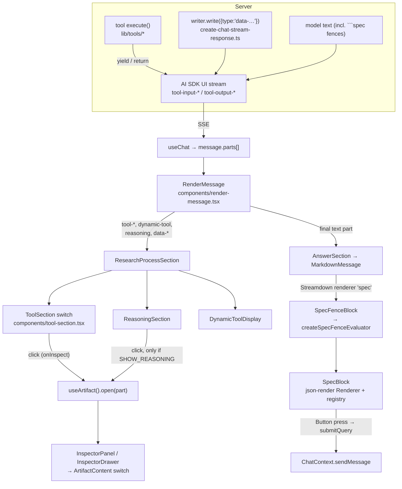
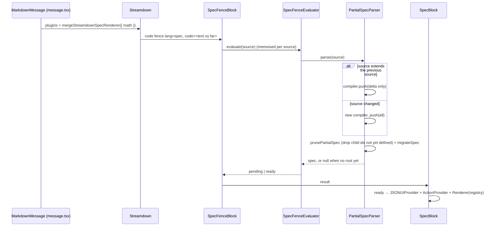

# Generative UI: tool parts, spec fences and the Inspector

Ask turns three kinds of model output into interface elements:

1. **Tool parts.** Every tool call streams as a typed message part (`tool-search`,
   `tool-fetch`, `tool-todoWrite`, …). A per-tool React component renders it inside the
   research-process accordion.
2. **Spec fences.** The model writes a fenced code block tagged `spec` that holds
   JSON-Patch lines. The client compiles those lines into a small, whitelisted component
   tree (related-question buttons, inline image grids). This is the "generative UI"
   (GenUI) system in `lib/render/*`.
3. **The Inspector (artifact panel).** Clicking a search step or todo list (or a
   reasoning header, when raw reasoning display is enabled) opens a detail view in a
   resizable right-hand panel, or a bottom drawer on phones. This lives in
   `components/artifact/*` and `components/inspector/*`.

This page covers all three in depth. Material that is covered elsewhere is linked
rather than repeated: how `RenderMessage` splits a message into segments, and how
Markdown is sanitised, are in [Frontend](/request-lifecycle/frontend#render-message).
The server side of a turn (tool loop, caps, persistence) is in
[Chat turn](/request-lifecycle/chat-turn) and [Streaming](/request-lifecycle/streaming).

## The big picture



## How a tool result becomes UI {#tool-to-ui}

### 1. The tool streams typed states

Tools are AI SDK tools defined under `lib/tools/`. A tool's `execute` may be an async
generator; each `yield` is streamed to the client as a new output for the same
`toolCallId`. The search tool uses this to show progress: it first yields
`{ state: 'searching' }` (`lib/tools/search.ts:430`) and later
`{ state: 'complete', …results }` (`lib/tools/search.ts:401`, `lib/tools/search.ts:469`).

Separately from the UI, `toModelOutput` trims what the *model* sees. The `images` array
must survive that trim because the image-spec prompt tells the model to copy image URLs
verbatim from it (`lib/tools/search.ts:1189`); removing it once made inline images
impossible.

Non-tool progress uses **data parts** written directly to the stream with
`writer.write({ type: 'data-…' })` (for example `data-attachments` and
`data-classifier`, `lib/streaming/create-chat-stream-response.ts:375`,
`lib/streaming/create-chat-stream-response.ts:417`). Their payload types are declared in
`UIDataTypes` (`lib/types/ai.ts:28`).

### 2. The client sees parts with a lifecycle state

On the client, `useChat` turns each tool call into a part of type `tool-<name>` whose
`state` moves through `input-streaming` → `input-available` → `output-available` (or
`output-error`). Only four tools are statically typed in `UITools`
(`lib/types/ai.ts:71`): `search`, `fetch`, `askQuestion`, `todoWrite`. Everything else
(calculate, weather, remember, recall, MCP tools, and `generateImage` after a reload) can
arrive as a `dynamic-tool` part.

### 3. RenderMessage routes the part

`RenderMessage` (`components/render-message.tsx:201`) walks the parts in order:

- `tool-generateImage` (or a `dynamic-tool` named `generateImage`) becomes a standalone
  `GeneratedImageSection` card (`components/render-message.tsx:268`).
- Every other `tool-*`, `dynamic-tool`, `reasoning`, `data-classifier`,
  `data-attachments` and non-empty `data-recall` part is buffered into a
  `ResearchProcessSection` (`components/render-message.tsx:286`).
- Text parts become the answer (rules in [Frontend](/request-lifecycle/frontend#render-message)).

Inside the research section each step is dispatched by kind
(`components/research-process-section.tsx:245` onward): classifier, attachments,
recall, dynamic tools (`DynamicToolDisplay`), reasoning (`ReasoningSection`) and typed
tools (`ToolSection`).

### 4. ToolSection picks a component per tool

`ToolSection` (`components/tool-section.tsx:27`) is the switch that maps a typed tool
part to its component:

| Part type | Renders | Notes |
|---|---|---|
| `tool-askQuestion` | `QuestionConfirmation` | While input is pending, the user's answer is sent back with `addToolResult`; after output it renders read-only |
| `tool-calculate` | inline `expr = result` | Explicit case because `calculate` is not in `UITools`; without it a live calculation would render an empty step |
| `tool-search` | `SearchSection` | Has an inspect action that opens the Inspector (`components/search-section.tsx:79`) |
| `tool-fetch` | `FetchSection` | |
| `tool-recall` | `RecallToolSection` | |
| `tool-documentRetrieval` | "Sources" grid (`SearchResults`) | Synthetic part for attached docs and pasted URLs; same `{ results }` shape as search so citations work unchanged (see [RAG & uploads](/knowledge/rag-uploads)) |
| `tool-todoWrite` | `ToolTodoDisplay` | Opens the Inspector on click (`components/tool-todo-display.tsx:79`) |
| anything else | `null` | Silently renders nothing — add a case when adding a tool |

::: warning Unknown tools render nothing
The `default` branch of `ToolSection` returns `null`
(`components/tool-section.tsx:170`). A new typed tool without a case shows as an empty
step in the accordion. A new *dynamic* tool is rendered generically by
`DynamicToolDisplay`.
:::

## The Inspector (artifact panel) {#inspector}

The directory is called `artifact`; the visible UI is called the Inspector. Both names
refer to the same thing.

### Mounting and state

`ArtifactRoot` (`components/artifact/artifact-root.tsx:8`) wraps every page in
`app/layout.tsx:146`. It provides `ArtifactProvider` and renders
`ChatArtifactContainer` around the page content.

`ArtifactProvider` (`components/artifact/artifact-context.tsx:61`) holds a tiny reducer
state: `{ part, isOpen }`. It exposes `useArtifact()` with `open(part)` and `close()`.

- `open(part)` closes the Library panel, stores the part and collapses the left sidebar
  (`components/artifact/artifact-context.tsx:86`). The right panel and the sidebar would
  otherwise squeeze the chat column below a readable width.
- `close()` flips `isOpen` first and clears the part **260 ms later**
  (`ANIMATION_DURATION`, `components/artifact/artifact-context.tsx:18`). The content has
  to stay mounted while the panel's width/opacity transition runs; clearing it
  immediately would make the panel go blank before it animates out. The constant must
  match the transition duration in `chat-artifact-container.tsx`.
- Opening the sidebar or the Library closes the Inspector, and vice versa: only one of
  the three is visible at a time.
- Starting a new chat closes it (`components/chat-panel.tsx:214`).

### Layout: one chat instance, desktop panel, mobile drawer

`ChatArtifactContainer` (`components/artifact/chat-artifact-container.tsx:41`) lays the
chat and the right panel out as flex siblings:

- Width defaults to 500 px, clamped to 320–800 px, and never allowed to push the chat
  below 360 px (`components/artifact/chat-artifact-container.tsx:17`). The user's drag
  width persists in `localStorage.artifactPanelWidth` and is re-clamped on load and on
  window resize.
- A full-screen transparent overlay is shown while dragging so text under the cursor
  isn't selected.
- **The chat is rendered once.** An earlier version rendered `children` twice (a desktop
  copy and a mobile copy hidden by CSS), which mounted two `useChat` instances with two
  sets of stream listeners. The comment at
  `components/artifact/chat-artifact-container.tsx:143` records why this must not come
  back.
- The right panel is `hidden md:block`. On small screens `InspectorDrawer`
  (`components/inspector/inspector-drawer.tsx:196`) renders a Vaul bottom drawer
  instead; it self-gates with `useMediaQuery('(max-width: 767px)')` and returns `null`
  on desktop, so it is safe to render unconditionally.

The panel also hosts the Library (`LibraryPanel`) when the Library is open; the
Inspector wins if both flags are somehow set.

### Content dispatch

`InspectorPanel` (`components/inspector/inspector-panel.tsx:112`) draws the header
(icon and title chosen by part type) and delegates the body to `ArtifactContent`
(`components/artifact/artifact-content.tsx:14`):

| Part type | Body |
|---|---|
| `tool-search`, `tool-fetch`, `tool-askQuestion` | `ToolInvocationContent` → only `tool-search` has a view (`SearchArtifactContent`: images, videos, sources); the others show "Details for this tool are not available" (`components/artifact/tool-invocation-content.tsx:7`) |
| `tool-todoWrite` | `TodoInvocationContent` (`components/artifact/todo-invocation-content.tsx:11`) |
| `reasoning` | `ReasoningContent` — the raw thoughts through `Streamdown` (`components/artifact/reasoning-content.tsx:7`) |
| other | "Details for this part type are not available" |

In practice only three components call `open()`: `SearchSection`, `ToolTodoDisplay`
and `ReasoningSection`.

## Reasoning display {#reasoning}

Reasoning (the model's native thinking) is always **persisted** as separate
`reasoning` parts, but it is **hidden** from the transcript by default. The long
explanation is in the header comment of `components/reasoning-section.tsx`; the short
version:

- `NEXT_PUBLIC_SHOW_REASONING` is read at `components/reasoning-section.tsx:310`. Any
  value other than `true` (including unset) takes the hidden branch
  (`components/reasoning-section.tsx:382`): a compact, non-expandable
  "Thinking…/Thought" line with a pulsing dot. It has no disclosure and no inspect
  action, so raw thoughts are not reachable from the chat view.
- With `NEXT_PUBLIC_SHOW_REASONING=true`, the legacy view returns: a collapsible
  section whose header shows a 120-character sanitised preview of the first line, and
  whose inspect action opens the full reasoning in the Inspector
  (`components/reasoning-section.tsx:364`).
- The flag is `NEXT_PUBLIC_*`, so `next build` inlines it from the build context's
  `.env`. Changing it requires a **rebuild**, not a restart.

**Why hidden:** a reasoning model can emit tens of thousands of characters of thinking.
Shown inline it dominates the message and reads as if the answer contains its own
working. See [Models & reasoning](/search/models-reasoning) for how reasoning is
requested (`ANSWER_THINK`) and how narration is stripped from answers.

## Spec fences: the GenUI system {#specs}

### Why a spec format at all

The model cannot be trusted to emit arbitrary HTML or JSX, and free-form Markdown cannot
express "a button that submits this follow-up query". Ask therefore uses
[json-render](https://www.npmjs.com/package/@json-render/core) (`@json-render/core` and
`@json-render/react`, `package.json:33`): the model emits a declarative spec that can
only reference components and actions from a fixed **catalog**, validated by Zod. Anything
outside the catalog fails validation and is not rendered. The spec is embedded in the
normal Markdown answer as a fenced block, so it streams, persists and reloads with the
message text with no extra storage.

### Anatomy of a spec block

A spec block is JSONL: one [RFC 6902](https://datatracker.ietf.org/doc/html/rfc6902)
JSON-Patch operation per line, building a `{ root, elements }` object.

````text
```spec
{"op":"add","path":"/root","value":"grid"}
{"op":"add","path":"/elements/grid","value":{"type":"Grid","props":{"columns":2},"children":["a","b"]}}
{"op":"add","path":"/elements/a","value":{"type":"Image","props":{"src":"https://…","aspectRatio":"4:3"},"children":[]}}
{"op":"add","path":"/elements/b","value":{"type":"Image","props":{"src":"https://…","aspectRatio":"4:3"},"children":[]}}
```
````

- `root` names the top element; `elements` is a flat map keyed by id; `children` are ids.
- `on` binds events to catalog actions, e.g.
  `"on":{"press":{"action":"submitQuery","params":{"query":"…"}}}`.

JSONL patches (rather than one JSON object) are what make **streaming** work: every
complete line is a valid incremental update, so a grid can appear and fill in while the
model is still typing the block.

### The files in `lib/render/`

| File | Role |
|---|---|
| `schema.ts` | `defineSchema` — the shape of a spec (`root`, `elements` with `type`/`props`/`children`/`on`) and of a catalog. `type` is a reference into `catalog.components`, so an unknown type is a validation error (`lib/render/schema.ts:4`) |
| `catalog.ts` | **The whitelist.** Components `Heading`, `Stack`, `Button`, `Grid`, `Image` with Zod prop schemas, and the single action `submitQuery` (`lib/render/catalog.ts:7`) |
| `registry.tsx` | Binds each catalog component name to a React implementation (`lib/render/registry.tsx:12`). The `submitQuery` entry is a no-op placeholder — the real handler is supplied at render time by `ActionProvider` |
| `components/*.tsx` | The React implementations. `shared.ts` holds the curated `iconMap` (`related`, `arrow-right`) and the gap scale |
| `prompt.ts` | The prompt sections that teach the model the format: `getRelatedQuestionsSpecPrompt()` (`lib/render/prompt.ts:7`) and `getImageSpecPrompt()` (`lib/render/prompt.ts:69`) |
| `parse-spec-block.ts` | Two parsers: an incremental `createPartialSpecParser()` for streaming (`lib/render/parse-spec-block.ts:53`) and a strict `parseSpecBlock()` that validates against the catalog and throws (`lib/render/parse-spec-block.ts:94`) |
| `spec-fence.ts` | `createSpecFenceEvaluator()` — wraps the partial parser and returns `{status:'pending'}` or `{status:'ready', spec}`; any parse error maps to `pending` (`lib/render/spec-fence.ts:21`) |
| `migrations.ts` | Parse-time rename table for element types in historical messages (`typeMigrations`, empty today, `lib/render/migrations.ts:31`) |
| `streamdown-spec.tsx` | Registers a Streamdown custom renderer for the `spec` language (`lib/render/streamdown-spec.tsx:7`) and merges it into the plugin config, replacing any other `spec` renderer (`lib/render/streamdown-spec.tsx:16`) |
| `strip-spec-blocks.ts` | Regex removal of every spec fence (`lib/render/strip-spec-blocks.ts:5`) |

### Where the prompts are included

| Prompt | Included by |
|---|---|
| Image spec + related questions | Quick/speed mode (`lib/agents/prompts/search-mode-prompts.ts:230`, `:232`), adaptive/balanced mode (`:430`, `:432`); quality mode starts from the adaptive prompt (`lib/agents/prompts/search-mode-prompts.ts:436`) |
| Related questions only | The direct-answer and stable-knowledge turn prompts (`lib/agents/researcher.ts:95`, `lib/agents/researcher.ts:132`) — no search ran, so there are no images to embed |

The related-questions prompt is deliberately restrictive ("When in doubt, skip"):
follow-ups are omitted for greetings, trivial lookups and refusals, and the three
questions must have distinct intents (deepen / act / broaden). The image prompt forbids
fabricated URLs and requires every image group to be wrapped in a `Grid` with `columns`
equal to the image count, so cell widths are reserved up front and streaming images do
not reflow the page.

### Render path, streaming and final



- `MarkdownMessage` registers the renderer at `components/message.tsx:75`.
- `SpecFenceBlock` keeps one evaluator per block instance
  (`components/spec-fence-block.tsx:9`), so each new chunk is pushed as a delta instead
  of re-parsing the whole block.
- The evaluator **always** uses the partial parser, even for a finished message.
  Streamdown's "incomplete block" flag requires `isAnimating`, which Ask does not use, so
  there is no reliable signal that a block is complete (`lib/render/spec-fence.ts:27`).
- `prunePartialSpec` (`lib/render/parse-spec-block.ts:19`) removes child ids that have
  not been defined yet, so a half-streamed `Stack` never references a missing element.
- A malformed block never throws into React: the evaluator catches and returns
  `pending`, and `SpecBlock` renders nothing for `pending`. The worst case of bad model
  output is a missing widget, not a crashed message.

### Actions: how a related-question click works

`SpecBlock` (`components/spec-block.tsx:22`) supplies the real `submitQuery` handler:

1. It ignores empty queries.
2. It **refuses clicks while a response is streaming**
   (`components/spec-block.tsx:36`) and shows a toast instead. A second `sendMessage`
   mid-stream corrupts `useChat` state and leaves the composer stuck disabled. The flag
   is read through `isStreamingRef` from `ChatContext` because json-render's
   `ActionProvider` stores handlers once (`useState(initialHandlers)`), so a plain
   value captured in the closure would be stale.
3. It records `related_question_clicked` in analytics
   (`components/spec-block.tsx:41`) and sends the query as a new user message.

`ChatContext` (`lib/contexts/chat-context.tsx`) exists largely for this: it carries
`sendMessage` and `isStreamingRef` from `components/chat.tsx:919` down to spec
components rendered deep inside Markdown.

### Where spec fences are removed

The raw fence text stays in the stored message (that is how it reloads), so it must be
removed wherever the text leaves the renderer:

| Where | Why | Code |
|---|---|---|
| Before prior turns are sent back to the model | Old spec JSON would waste context on every subsequent turn | `stripSpecFromMessages` (`lib/streaming/helpers/strip-spec-from-messages.ts:11`), called at `lib/streaming/create-chat-stream-response.ts:357` and `lib/streaming/create-ephemeral-chat-stream-response.ts:121` |
| Copy / share from message actions | Users should not paste JSONL | `components/message-actions.tsx:119`, `components/message-actions.tsx:137` |
| Copy shortcut in the chat | Same | `components/chat.tsx:677` |

### Analytics

When a turn finishes, `summarizeGenui` (`lib/analytics/genui-summary.ts:52`) parses every
spec fence strictly and emits `genui_component_shown` (`components/chat.tsx:312`) with
block counts, image count and component types. A block that contains any `Button` is
classed as the related-questions block and excluded from content metrics. Opening an
inline image fires `genui_component_clicked` (`lib/render/components/image.tsx:43`). See
[Analytics](/operations/analytics) for the destination and the full event list.

### Security notes

- Only catalog components render; there is no HTML escape hatch in the spec format.
- The `Image` spec component is the one place an answer-embedded image auto-loads.
  Markdown `` images do **not** auto-load (see
  [Frontend](/request-lifecycle/frontend#markdown)), because that would be a zero-click
  exfiltration channel. The `Image` component is constrained by the prompt to URLs taken
  from the search tool's `images` array; the catalog itself validates only that `src` is
  a string *(no URL allow-list is enforced in code — prompt-level constraint only)*. A
  broken image hides itself via `onError`.

## Recipes {#recipes}

### Add a new spec component

Example: a `Callout` with a `tone` and `text`.

1. **Catalog** — add an entry to `components` in `lib/render/catalog.ts` with a Zod
   `props` schema and a `description`. Keep props enums tight; the schema is the only
   thing standing between model output and the DOM.
2. **Implementation** — create `lib/render/components/callout.tsx` exporting
   `export const Callout: ComponentFn<CatalogType, 'Callout'> = ({ props, children }) => …`
   (see `stack.tsx` for a container, `heading.tsx` for a leaf).
3. **Registry** — import it and add it to `components` in `lib/render/registry.tsx`.
   `defineRegistry(catalog, …)` is typed against the catalog, so a missing
   implementation should surface as a type error *(unverified — not exercised)*.
4. **Prompt** — describe the component and when to use it in `lib/render/prompt.ts`
   (either extend an existing section or add a new `get…SpecPrompt()` and include it in
   the relevant mode prompts in `lib/agents/prompts/search-mode-prompts.ts` and/or
   `lib/agents/researcher.ts`). The model only uses what the prompt teaches it.
5. **Analytics** — if the new block contains a `Button`, `summarizeGenui` will classify
   it as related questions; adjust `lib/analytics/genui-summary.ts` if that is wrong.
6. **Tests** — add parse cases to `lib/render/__tests__/parse-spec-block.test.ts` and
   `spec-fence.test.ts`; `prompt.test.ts` pins prompt contents. Run
   `bun run test lib/render`.
7. **Try it on the lab** (`ask-flow`, see [Environments](/operations/environments))
   before porting; prompt changes affect every model differently.

Adding a component or a new optional prop is purely additive: old messages still
validate, and no migration is needed.

### Add a new action

Add it to `actions` in `lib/render/catalog.ts`, add a placeholder in
`lib/render/registry.tsx`, and add the real handler to the `handlers` object in
`components/spec-block.tsx`. Any handler that sends a message must keep the
`isStreamingRef` guard.

### Rename or remove a component

Historical messages keep their spec text forever. When a component is renamed, add an
entry to `typeMigrations` in `lib/render/migrations.ts`
(`{ OldName: { to: 'NewName', defaultProps: { … } } }`). `migrateSpec` resolves chains
(`A → B → C`), never overrides existing props, and is idempotent, so it is safe on every
incremental parse. Treat each entry as a permanent compatibility promise. Removing a
component without a migration makes old blocks fail validation and silently disappear.

### Show a new tool's result in the chat and the Inspector

1. Build the tool in `lib/tools/` and register it (see
   [Recipes](/getting-started/recipes) for the full "add an agent tool" checklist,
   including the rule that tools must be withheld from the `tools` map, not just from
   `activeTools`, to be blocked).
2. If it needs a typed part on the client, add it to `UITools` in `lib/types/ai.ts:71`.
   Otherwise it arrives as a `dynamic-tool` and `DynamicToolDisplay`
   (`components/dynamic-tool-display.tsx:44`) renders it generically as pretty-printed
   input/output JSON.
3. Add a `case 'tool-<name>'` to `ToolSection` (`components/tool-section.tsx`) — without
   it the step renders empty.
4. For a detail view, call `useArtifact().open(part)` from the step component, add a
   case to `ArtifactContent` (`components/artifact/artifact-content.tsx`) and, for tools,
   to `ToolInvocationContent`; add an icon/title case to `InspectorPanel` and a title to
   `InspectorDrawer`'s `getTitle`.
5. Add a test next to `components/__tests__/tool-section.test.tsx`.

## Related pages

- [Frontend](/request-lifecycle/frontend) — component tree, Markdown pipeline, citations
- [Client state](/request-lifecycle/client-state) — `useChat`, sidebar events
- [Chat turn](/request-lifecycle/chat-turn) — the server side of a turn
- [Models & reasoning](/search/models-reasoning) — reasoning control, narration stripping
- [Analytics](/operations/analytics) — GenUI events
