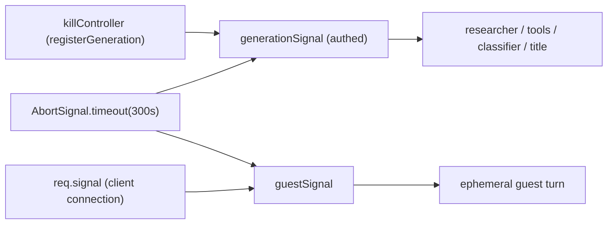
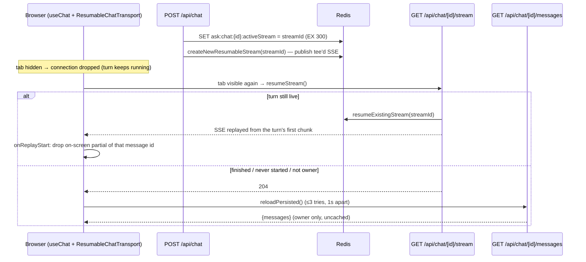
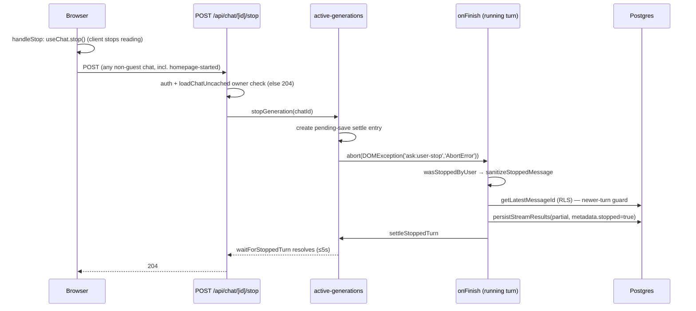

# Streaming, resume, Stop and persistence

This page covers everything between "the server has an answer stream" and "the answer
is safely in Postgres": the SSE response, narration stripping, resumable streams,
the Stop button, disconnect survival, timeouts and the persistence choke point.

For where these sit in the turn, see [Chat turn](/request-lifecycle/chat-turn).

## Moving parts

| Piece | File | Role |
|---|---|---|
| Response builder | `lib/streaming/create-chat-stream-response.ts` | `createUIMessageStream` + `createUIMessageStreamResponse`, `onFinish` persistence |
| Guest variant | `lib/streaming/create-ephemeral-chat-stream-response.ts` | same stream shape, nothing persisted, no resume |
| Stop registry | `lib/streaming/active-generations.ts` | in-memory `Map<chatId, AbortController>` + abort reasons + stopped-save settle |
| Resume context | `lib/streaming/resumable-stream-context.ts` | `resumable-stream` over Redis pub/sub + the active-stream pointer |
| Client transport | `lib/streaming/resumable-chat-transport.ts` | `DefaultChatTransport` whose reconnect reports "replay started" / "nothing to resume" |
| Client activity registry | `lib/streaming/stream-activity.ts` | which chats are mid-turn (defers sidebar refreshes) |
| Narration (stream) | `lib/streaming/helpers/smooth-and-strip-narration.ts` | transform on the live text stream |
| Narration (persist) | `lib/streaming/helpers/strip-narration-from-message.ts` | cleans the assembled message |
| Stop sanitizer | `lib/streaming/helpers/sanitize-stopped-message.ts` | keeps only settled parts of a stopped answer |
| Persist | `lib/streaming/helpers/persist-stream-results.ts` | the single DB write path for answers |
| Endpoints | `app/api/chat/[chatId]/{stream,stop,messages}/route.ts` | resume, Stop, reload persisted |

Ask runs **one long-lived Node process per container** (not serverless), which is
why an in-memory Stop registry is sufficient: the Stop request and the generation
always share a process.

## The SSE response {#sse-response}

`createUIMessageStreamResponse` (`create-chat-stream-response.ts:1169`) returns the AI
SDK UI-message stream as Server-Sent Events. Headers: `Cache-Control: no-cache,
no-transform` — `no-transform` stops Cloudflare-style proxies from buffering the body
to minify it (which made progress appear only at the end); `no-cache` is restated
because supplying any header replaces the SDK default for that key.

Chunk types a turn produces, roughly in order:

| Chunk / part | Emitted by | Persisted? |
|---|---|---|
| `start` (+ `messageMetadata {traceId, searchMode, modelId}`) | `execute`, first thing | metadata yes |
| `data-attachments` running → done | attachment transform | yes (running states dropped on Stop) |
| `data-classifier` running → done | classifier wait | yes |
| `data-title` | title generator, mid-stream | stored as a generic data part; the title is also written to the chat row |
| `data-recall` | recall hits | **never** (stripped) |
| `tool-documentRetrieval` | synthetic doc/URL sources | yes |
| `step-start`, `reasoning`, `tool-*`, `dynamic-tool`, `text` | the researcher agent | yes |
| server progress lines (as `reasoning` parts) | `createFlowProgressEmitter` via `onStepFinish` — only when the `FLOW_VARIANT` defines status lines | yes |
| `data-spokenGist` | voice turns only, after the final step | yes |

Parts with the same `id` replace each other in place — that is how `running` becomes
`done` without duplicate steps.

### Smoothing {#smoothing}

- **Authenticated path:** there is **no server-side token smoothing**. Despite its
  name, `smoothAndStripNarration()` only strips narration (below). Visual smoothness
  comes from the client: `useChat({ experimental_throttle: 100 })` (`components/chat.tsx:342`)
  batches re-renders to at most one per 100ms.
- **Guest path:** `smoothStream({ chunking: 'word' })` and no narration stripping.

### Narration stripping: stream path vs persist path {#narration}

Reasoning-capable models sometimes "think out loud" in the answer text ("I have
comprehensive data now. Let me search…", or a multi-KB chain-of-thought dump after
hitting the round cap). Every mode's prompt requires the final answer to start with a
`## ` heading ("first-token rule"); both strippers anchor on that.

**Stream path** — `smoothAndStripNarration()` (`helpers/smooth-and-strip-narration.ts:57`),
passed as `experimental_transform` to the agent stream. Per text part:

- buffer `text-delta`s until a heading appears;
- heading at offset 0 → flush as-is; heading later → strip the preamble if
  `shouldStripPreamble` judges it narration (known starter phrases, or a structural
  backstop: long preamble + strong reasoning signal such as a stray `</think>` or several
  first-person research sentences), else flush it unchanged;
- no heading yet → keep holding only while the buffer still looks like narration and is
  under 16,000 chars (`NARRATION_HARD_MAX`); a clean heading-less answer is released
  after ~64 chars (`NARRATION_SNIFF_LIMIT`);
- on `text-end` with a held buffer, flush it as a synthetic `text-delta` (extra fields on
  `text-end` are dropped downstream).

**Render path** — `components/render-message.tsx:225`: while streaming, a text part is
shown as the answer only if it starts with a heading; after the stream ends, only the
last text part is the answer. Inter-step narration therefore never flashes on screen.

**Persist path** — `stripNarrationFromMessage` (`helpers/strip-narration-from-message.ts:51`),
applied in `onFinish` and again inside `persistStreamResults`:

1. fused preamble in front of a heading, per text part (`stripNarrationPreamble`);
2. inter-step narration: a non-final text part that looks like narration and is followed
   by a later tool/text part is dropped.

Residual by design: a final answer with fused narration but **no** heading is kept
(dropping it risks losing real content). The strippers clean **new** answers at persist
time; an already-saved leaked message stays until regenerated. Background:
[Models & reasoning](/search/models-reasoning).

## Disconnect survival {#disconnect-survival}

`app/api/chat/route.ts:40-51, 220-226`.



- An **authenticated** turn is bounded only by the kill controller (Stop / superseded)
  and the 300s timeout. `req.signal` is deliberately **not** part of it: on mobile a
  backgrounded tab drops the connection, and the turn must still finish, persist, and be
  visible on return.
- The stream is drained server-side regardless of the browser: `result.consumeStream()`
  drives the agent, and `consumeSseStream` drains the tee'd SSE copy (into Redis, or via
  a plain `consumeStream` when Redis pub/sub is unavailable).
- A **guest** turn aborts on disconnect — there is nothing to persist.
- These signals stop the agent loop between steps; an already in-flight provider HTTP
  request is bounded separately by `createTimeoutFetch(300_000)` in `lib/utils/registry.ts`.

`maxDuration = 300` in the route is inert off Vercel; `GENERATION_TIMEOUT_MS` is the
real ceiling. The researcher's answer deadline (200s) exists so a turn is forced to
write *before* that ceiling — a timeout abort persists nothing.

## Resumable streams {#resumable-streams}



**Producer** (`create-chat-stream-response.ts:1186`): `consumeSseStream` gets a tee'd
copy of the SSE. With a resumable context it generates a `streamId`, **first** writes
the pointer `ask:chat:{chatId}:activeStream` (TTL 300s = the generation timeout, so a
crashed server never leaves a dangling pointer), then `rsc.createNewResumableStream`.
If publishing fails it clears the pointer and drains plainly.

**Context** (`resumable-stream-context.ts`): lazily built from `LOCAL_REDIS_URL` with a
publisher and a duplicated subscriber connection (a subscribed node-redis connection
can't run normal commands). Key prefix `ask:resumable`. Returns `null` when
`LOCAL_REDIS_URL` is unset or connection fails (Upstash REST has no pub/sub) — resume is
then disabled, but background completion and persistence still work.

**Resume endpoint** `GET /api/chat/[chatId]/stream`: 401 without a user; **204** if the
chat is missing or not owned (hides existence), if no pointer exists, or if
`resumeExistingStream` returns `null`.

::: warning Finished streams are NOT replayable
`resumable-stream` returns `null` once a stream has completed; it does not keep a
buffer to replay. The pointer is intentionally not cleared in `onFinish`, but that does
not make a finished turn resumable. A client returning after the turn ended gets
**204** and must load the persisted conversation instead. (An older design note
claiming "the TTL lets a late returner replay" was wrong.)
:::

**Client side** (`components/chat.tsx:175-210, 353-426`,
`lib/streaming/resumable-chat-transport.ts`):

- `useChat({ resume: !isGuest && Boolean(providedId) })` reconnects on mount for chats
  opened on their real route.
- A `visibilitychange`/`focus` listener remembers whether a turn was in flight when the
  tab was hidden and calls `resumeStream()` on return. It is **not** gated on
  `providedId`, so chats started from the homepage resume too, and it only acts in the
  visible `Chat` instance (`offsetParent` guard — Next.js may keep duplicate instances
  mounted).
- `ResumableChatTransport.reconnectToStream` peeks the first chunk (`start`, carrying the
  message id) and calls `onReplayStart(id)` **before** the SDK applies the replay. The
  replay starts at the turn's first chunk and `useChat` appends a resumed turn on top of
  the last assistant message, so the partial copy must be removed first or every
  text/reasoning part appears twice.
- On 204 (`onNothingToResume`) the client reloads from `GET /api/chat/[chatId]/messages`
  if it was resuming an in-flight turn or the last message on screen is the user's.
  `reloadPersisted` retries up to 3 times (the stream can report done a moment before
  `onFinish` has saved), only applies a saved copy that ends in an assistant message, and
  gives up if the user started something new meanwhile.

**`GET /api/chat/[chatId]/messages`**: 401 without a user; 404 for missing **and**
foreign chats; returns `{messages}` from `loadChatUncached` with `Cache-Control:
no-store`. It exists so the client can swap in the saved answer **without a route
refresh** (a refresh would remount a homepage-started chat — see
[Client state](/request-lifecycle/client-state#refresh-invariants)).

## Stop {#stop}



**Client** (`components/chat.tsx:462`): `handleStop` calls the SDK `stop()` **and**
`POST /api/chat/<id>/stop` for every non-guest chat. The server call is essential:
since authenticated turns ignore `req.signal`, closing the connection no longer halts
generation. (Earlier the POST was skipped for homepage-started chats, so a "stopped"
first answer kept generating and was persisted in full.)

**Abort reasons** (`active-generations.ts:15-17`): aborts carry an `AbortError`
`DOMException` whose message is `ask:user-stop` or `ask:superseded`. They must be
`DOMException`s — the AI SDK recognises an abort only by the error name; a bare string
reason surfaces as a stream error.

| Cause | Reason | onFinish outcome |
|---|---|---|
| User Stop | `ask:user-stop` | partial kept (sanitized) |
| Newer turn on the same chat (`registerGeneration`) | `ask:superseded` | discarded |
| 300s generation timeout | timeout | discarded |
| Client disconnect (authenticated) | — no abort — | turn completes normally |

**Saving the partial** (`create-chat-stream-response.ts:985-1016`):

1. `wasStoppedByUser(stopController)` is checked independently of `isAborted` — a Stop
   during the classifier/recall phase fails `execute` instead of emitting an abort chunk,
   and must not persist `running` steps either.
2. `sanitizeStoppedMessage`: keep non-empty text/reasoning (mark `streaming` → `done`),
   keep only **settled** tool parts (`output-available` / `output-error` — an unfinished
   tool call would render a forever-spinner and hand the next turn a call without a
   result, which providers reject), drop `running` data parts, collapse orphan
   `step-start`s, set `metadata.stopped = true`. Returns `null` if nothing meaningful
   remains (no text, no settled tool) → nothing saved (`[stop] nothing_to_save`).
3. **Newer-turn guard:** await the new chat's initial save if pending, then
   `getLatestMessageId` (RLS-scoped). If the newest row is neither this turn's user
   message nor this assistant message, skip (`[stop] stale_skipped`) — never insert a late
   answer after a newer question.
4. Normal clean + persist (`[stop] partial_saved`).
5. `finally` → `settleStoppedTurn`, releasing the Stop endpoint and any follow-up turn
   blocked in `waitForStoppedTurn` (both bounded at 5s; the settle entry self-expires at
   10s).

Why the partial is kept: without it, a follow-up after Stop left two consecutive user
messages in history and the model re-answered the stopped question.

::: tip Not built
`metadata.stopped` is set but nothing renders a "Stopped" label yet.
:::

## Persistence {#persistence}

The authenticated `onFinish` (`create-chat-stream-response.ts:931`) ends in:

```text
stripNarrationFromMessage → rehydrateFullContent → persistStreamResults
```

**`rehydrateFullContent`** (`lib/search/rehydrate-full-content.ts`): search tool calls
showed the model *excerpts*; the full crawled text collected in `fullContentSink` is
swapped back into the `tool-search` outputs before saving, so history is deep enough to
answer follow-ups without re-searching while the live prompt stayed small. Consequence:
**the persisted message is not byte-identical to what the model saw** (toolCallIds and
URLs are unchanged, so citations still resolve).

**`persistStreamResults`** (`helpers/persist-stream-results.ts:14`) is the single write
path for assistant answers:

1. `stripRecallFromMessage(stripNarrationFromMessage(msg))` — both idempotent.
2. Merge `traceId`, `searchMode`, `modelId` into metadata.
3. Await the title promise (new chats).
4. Await the background `createChatWithFirstMessage`; on failure retry it once with
   "Untitled" (a duplicate-key error means the row exists — continue).
5. `upsertMessage`, retried via `retryDatabaseOperation`; failures are logged, never
   thrown into the stream.
6. `updateChatTitle` if a real title was generated.

::: danger RLS-leak choke point
`data-recall` parts name *other* chats (id + title) that recall drew from. The generic
`data-*` persistence stores parts verbatim, and a public (shared) chat's RLS policy
exposes every part to anonymous visitors — so a persisted recall chip would leak a
private chat's title/id through a shared one. `persistStreamResults` strips them
unconditionally. Keep every answer write going through it.
:::

After persistence, memory extraction and recall indexing run fire-and-forget (see
[Chat turn § 12](/request-lifecycle/chat-turn#_12-onfinish-persist-then-learn)).

## Reading chats back {#reading}

| Reader | Function | Why |
|---|---|---|
| Stream path (history for the model) | `loadChatUncached` | a stale read drops the previous answer → "answers my previous question again" |
| `/search/[id]` page | `loadChatUncached` | the cached read served the previous snapshot right after a turn (vanished answer, 404) |
| Stop / stream / messages endpoints | `loadChatUncached` | ownership must reflect the DB |
| `generateMetadata` (tab title) | `loadChat` (cached) | a stale title is harmless |
| Analytics turn counter in the route | `loadChat` (cached) | best-effort |

`loadChat` = `unstable_cache` keyed by chat id + user, tags `chat-<id>` and `chat`,
`revalidate: 60`; the route calls `revalidateTag('chat-<id>', 'max')` — the `'max'`
profile is stale-while-revalidate, so the next read may still be the old value. Both
readers re-sign upload URLs at read time.

## Knobs

| Knob | Default | Effect |
|---|---|---|
| `LOCAL_REDIS_URL` | unset → resume disabled | Redis for resumable streams (needs real pub/sub) |
| `GENERATION_TIMEOUT_MS` (constant, `route.ts:36`) | 300,000 | hard ceiling; pointer TTL mirrors it |
| `ANSWER_DEADLINE_MS` (constant) | 200,000 | tools removed, forced answer |
| `STOPPED_TURN_SETTLE_TIMEOUT_MS` (constant) | 5,000 | max wait for a stopped partial save |
| `experimental_throttle` (`chat.tsx`) | 100 ms | client render batching |
| `NARRATION_HARD_MAX` / `NARRATION_SNIFF_LIMIT` (constants) | 16,000 / 64 chars | narration buffering |
| `ENABLE_GUEST_CHAT` | off | enables the ephemeral guest path |
