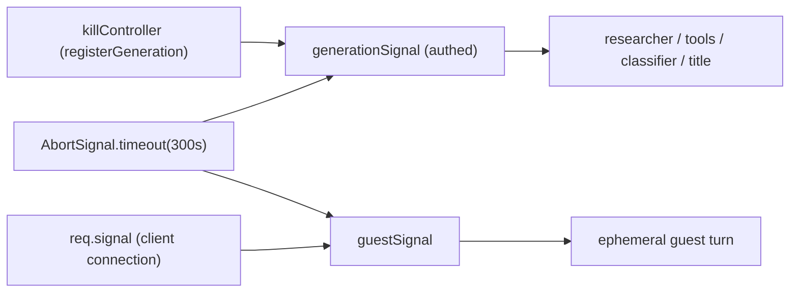
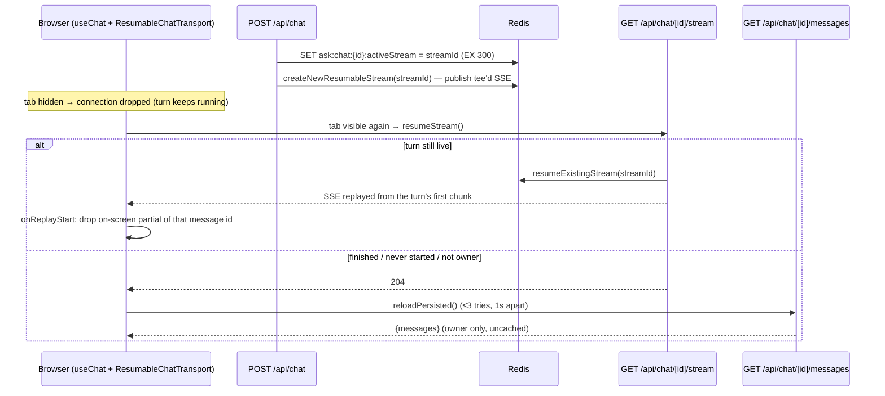
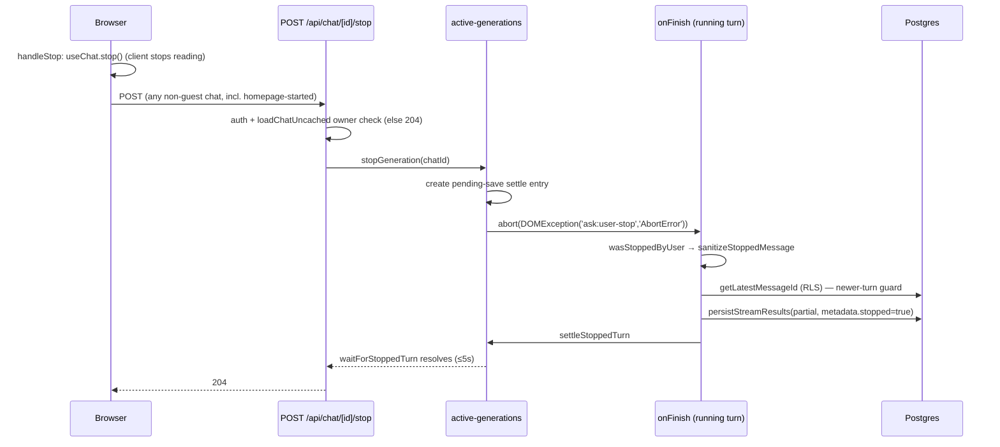

# Streaming, resume, Stop and persistence

This page covers everything between "the server has an answer stream" and "the answer
is safely in Postgres": the SSE response, narration stripping, resumable streams,
the Stop button, disconnect survival, timeouts and the persistence choke point.

For where these sit in the turn, see [Chat turn](/request-lifecycle/chat-turn).

## Moving parts

| Piece | File | Role |
|---|---|---|
| Response builder | `lib/streaming/create-chat-stream-response.ts` | `createUIMessageStream` + `createUIMessageStreamResponse`, `onFinish` persistence |
| Guest variant | `lib/streaming/create-ephemeral-chat-stream-response.ts` | same stream shape, nothing persisted, no resume |
| Stop registry | `lib/streaming/active-generations.ts` | in-memory `Map<chatId, AbortController>` + abort reasons + stopped-save settle |
| Resume context | `lib/streaming/resumable-stream-context.ts` | `resumable-stream` over Redis pub/sub + the active-stream pointer |
| Client transport | `lib/streaming/resumable-chat-transport.ts` | `DefaultChatTransport` whose reconnect reports "replay started" / "nothing to resume" |
| Client activity registry | `lib/streaming/stream-activity.ts` | which chats are mid-turn (defers sidebar refreshes) |
| Narration (stream) | `lib/streaming/helpers/smooth-and-strip-narration.ts` | transform on the live text stream |
| Narration (persist + read) | `lib/streaming/helpers/strip-narration-from-message.ts` | cleans the assembled message; `narrationCleanView` applies the same cleanup when a message is rendered |
| Stop sanitizer | `lib/streaming/helpers/sanitize-stopped-message.ts` | keeps only settled parts of a stopped answer |
| Persist | `lib/streaming/helpers/persist-stream-results.ts` | the single DB write path for answers |
| Endpoints | `app/api/chat/[chatId]/{stream,stop,messages}/route.ts` | resume, Stop, reload persisted |

Ask runs **one long-lived Node process per container** (not serverless), which is
why an in-memory Stop registry is sufficient: the Stop request and the generation
always share a process.

## The SSE response {#sse-response}

`createUIMessageStreamResponse` (`create-chat-stream-response.ts:1226`) returns the AI
SDK UI-message stream as Server-Sent Events. Headers: `Cache-Control: no-cache,
no-transform` — `no-transform` stops Cloudflare-style proxies from buffering the body
to minify it (which made progress appear only at the end); `no-cache` is restated
because supplying any header replaces the SDK default for that key.

Chunk types a turn produces, roughly in order:

| Chunk / part | Emitted by | Persisted? |
|---|---|---|
| `start` (+ `messageMetadata {traceId, searchMode, modelId}`) | `execute`, first thing | metadata yes |
| `data-attachments` running → done | attachment transform | yes (running states dropped on Stop) |
| `data-classifier` running → done | classifier wait | yes |
| `data-title` | title generator, mid-stream | stored as a generic data part; the title is also written to the chat row |
| `data-recall` | recall hits | **never** (stripped) |
| `tool-documentRetrieval` | synthetic doc/URL sources | yes |
| `step-start`, `reasoning`, `tool-*`, `dynamic-tool`, `text` | the researcher agent | yes |
| server progress lines (as `reasoning` parts) | `createFlowProgressEmitter` via `onStepFinish` — only when the `FLOW_VARIANT` defines status lines | yes |
| `data-spokenGist` | voice turns only, after the final step | yes |

Parts with the same `id` replace each other in place — that is how `running` becomes
`done` without duplicate steps.

### Smoothing {#smoothing}

- **Authenticated path:** there is **no server-side token smoothing**. Despite its
  name, `smoothAndStripNarration()` only strips narration (below). Visual smoothness
  comes from the client: `useChat({ experimental_throttle: 100 })` (`components/chat.tsx:356`)
  batches re-renders to at most one per 100ms.
- **Guest path:** `smoothStream({ chunking: 'word' })` and no narration stripping on the
  stream. The browser renders the cleaned view, and the guest's history is cleaned before
  the classifier and the model see it (`create-ephemeral-chat-stream-response.ts:62`).

### Narration stripping: stream, render and persist paths {#narration}

Reasoning-capable models sometimes "think out loud" in the answer text ("I have
comprehensive data now. Let me search…", "Tôi cần đọc trang này…", or a multi-KB
chain-of-thought dump after hitting the round cap). Every mode's prompt requires the final
answer to start with a `## ` heading ("first-token rule"); all three paths anchor on that.
The rules themselves, their thresholds and their limits are in
[Models & reasoning › Narration](/search/models-reasoning#narration-and-chain-of-thought-leak-handling).

**Stream path** — `smoothAndStripNarration()` (`helpers/smooth-and-strip-narration.ts:75`),
passed as `experimental_transform` to the agent stream (`create-chat-stream-response.ts:905`).
Per text part:

- buffer `text-delta`s until the answer's heading appears;
- **glued seam first** (`:98-127`, since 2026-09-28): a `## ` glued to the text before it on
  the same line (`…breakdown.## Title`, any language) that passes the persist rule's own prefix
  guards (`findGluedPreambleSeam`: no heading or citation marker in the prefix, at most 2,000
  characters) and comes before any heading the next bullet would match (so a later `\n## `
  cannot cut through the glued first section; `</think>## ` and `<channel|>## ` stay on the
  next bullet, whose heading is that same `##`). As soon as the text after the seam is
  longer than the prefix (`gluedAnswerOutweighsPreamble`), emit the buffer from the `##` and
  pass later deltas through 1:1. This is exactly the cut persist makes: the answer only grows,
  so persist's guard cannot fail later. If a backtick precedes the seam on its line, also wait
  for the line to end (a closing backtick would make the `##` inline code). Until then keep
  holding, within the same ceiling;
- heading at offset 0 → flush as-is; heading later (line start, `<channel|>`, closing think
  tag) → strip the preamble if `shouldStripPreamble` judges it narration (known English
  starter phrases, or a structural backstop: long preamble + strong reasoning signal such as a
  stray `</think>` or several first-person research sentences), else flush it unchanged. The
  stripped flush starts at the `##` and is not trimmed (`:136-143`), so the heading line keeps
  its newline;
- no heading yet → keep holding only while the buffer still looks like narration and is
  under 16,000 chars (`NARRATION_HARD_MAX`, `:24`); a clean heading-less answer is released
  after ~64 chars (`NARRATION_SNIFF_LIMIT`, `:15`);
- on `text-end` with a held buffer, flush it as a synthetic `text-delta` (extra fields on
  `text-end` are dropped downstream).

Apart from the glued seam, the stream path only knows English phrasing, and the seam cut
fires only while the part is still buffered when the seam arrives: the preamble reads as
English narration, or the seam comes within the first ~64 characters. A longer non-English
preamble is released before that; if it is glued to the heading, the next two paths cut it
(before a proper `\n\n## ` heading it is kept by design, see below).

**Render path** — `RenderMessage` draws `narrationCleanView(message)`
(`components/render-message.tsx:158`), the persist-time cleanup below, memoized per message
object. It is applied to stored messages and to the message still streaming, so an answer
saved before a rule existed displays clean without a database rewrite, and a streaming
message drops a status note as soon as the next tool call arrives. On that view, while
streaming, a text part is shown as the answer only if it starts with a heading
(`:237`); after the stream ends, only the last text part is the answer. Inter-step narration
therefore never flashes on screen. A preamble glued to the heading is cut once the text after
the seam is longer than the preamble; until then the part does not start with a heading, so
the answer appears a moment later instead of showing the preamble. (When the stream path has
already cut the seam, the part arrives starting with its heading.) A planning draft that opens
with its own `## ` outline is the exception: it starts with a heading, so it **is** shown while
streaming, until the answer after its glued seam has 400 prose characters and a heading that
restates the outline; then the view drops it ([known issue](/history/known-issues#a-planning-draft-shows-while-the-answer-streams)).

**Persist path** — `stripNarrationFromMessage` (`helpers/strip-narration-from-message.ts:76`),
applied in `onFinish` (`create-chat-stream-response.ts:1079`) and again inside
`persistStreamResults`:

1. per text part, `stripNarrationPreamble`: stray think-tag reasoning first; then (since
   2026-10-06, lab and staging; prod pending) a **planning draft** in front of an answer that
   restarts at a glued `## ` (`stripDraftBeforeRestart`: an outline plus notes in the prompt's
   own vocabulary, cut only when the answer after the seam has 400 prose characters and
   restates the outline, or the heading-less notes use two vocabulary families and cite
   nothing; see
   [D20 › Decision 7](/history/decisions#decision-7-a-planning-draft-in-front-of-a-glued-restart-is-cut));
   then, when a qualifying **glued seam** (a `## ` directly after a non-space character) comes before the
   first line-start heading, the glued rule alone decides (since 2026-09-29, the same
   precedence as the stream path); otherwise the English phrase rules for a preamble in front
   of a heading, then the language-agnostic glued-seam cut on what remains;
2. inter-step narration: a non-final text part is dropped when it starts with an English
   narration phrase and a later tool or text part follows, or, in any language, when a tool
   call follows it directly and it is short, unstructured prose no longer than the final
   answer.

The same cleanup is used for the history sent back to the classifier and the model
(`create-chat-stream-response.ts:262`, and `create-ephemeral-chat-stream-response.ts:62` for
guests), the spoken gist (`create-chat-stream-response.ts:963`), copy, recall indexing and search snippets
([full list](/search/models-reasoning#narration-read-time)).

Residual by design: a final answer with fused narration but **no** heading is kept
(dropping it risks losing real content), and so is non-English narration before a proper
`\n\n## ` heading. Stored rows written before a rule existed keep what was saved until the
narration backfill runs; on staging and prod it ran on 2026-09-28/29 and re-indexed the
affected recall chunks
([D20 › Backfill](/history/decisions#backfill-2026-09-28-29),
[runbook](/operations/runbooks#re-run-the-narration-backfill)).

## Disconnect survival {#disconnect-survival}

`app/api/chat/route.ts:40-51, 220-226`.


```mermaid
flowchart LR
  T["AbortSignal.timeout(300s)"] --> G
  K["killController (registerGeneration)"] --> G["generationSignal (authed)"]
  RS["req.signal (client connection)"] --> GS["guestSignal"]
  T --> GS
  G --> A["researcher / tools / classifier / title"]
  GS --> E["ephemeral guest turn"]
```

- An **authenticated** turn is bounded only by the kill controller (Stop / superseded)
  and the 300s timeout. `req.signal` is deliberately **not** part of it: on mobile a
  backgrounded tab drops the connection, and the turn must still finish, persist, and be
  visible on return.
- The stream is drained server-side regardless of the browser: `result.consumeStream()`
  drives the agent, and `consumeSseStream` drains the tee'd SSE copy (into Redis, or via
  a plain `consumeStream` when Redis pub/sub is unavailable).
- A **guest** turn aborts on disconnect — there is nothing to persist.
- These signals stop the agent loop between steps; an already in-flight provider HTTP
  request is bounded separately by `createTimeoutFetch(300_000)` in `lib/utils/registry.ts`.

`maxDuration = 300` in the route is inert off Vercel; `GENERATION_TIMEOUT_MS` is the
real ceiling. The researcher's answer deadline (200s) exists so a turn is forced to
write *before* that ceiling — a timeout abort persists nothing.

## Resumable streams {#resumable-streams}


```mermaid
sequenceDiagram
    participant B as Browser (useChat + ResumableChatTransport)
    participant P as POST /api/chat
    participant RD as Redis
    participant G as GET /api/chat/[id]/stream
    participant M as GET /api/chat/[id]/messages
    P->>RD: SET ask:chat:{id}:activeStream = streamId (EX 300)
    P->>RD: createNewResumableStream(streamId) — publish tee'd SSE
    Note over B: tab hidden → connection dropped (turn keeps running)
    B->>G: tab visible again → resumeStream()
    alt turn still live
        G->>RD: resumeExistingStream(streamId)
        G-->>B: SSE replayed from the turn's first chunk
        B->>B: onReplayStart: drop on-screen partial of that message id
    else finished / never started / not owner
        G-->>B: 204
        B->>M: reloadPersisted() (≤3 tries, 1s apart)
        M-->>B: {messages} (owner only, uncached)
    end
```

**Producer** (`create-chat-stream-response.ts:1243`): `consumeSseStream` gets a tee'd
copy of the SSE. With a resumable context it generates a `streamId`, **first** writes
the pointer `ask:chat:{chatId}:activeStream` (TTL 300s = the generation timeout, so a
crashed server never leaves a dangling pointer), then `rsc.createNewResumableStream`.
If publishing fails it clears the pointer and drains plainly.

**Context** (`resumable-stream-context.ts`): lazily built from `LOCAL_REDIS_URL` with a
publisher and a duplicated subscriber connection (a subscribed node-redis connection
can't run normal commands). Key prefix `ask:resumable`. Returns `null` when
`LOCAL_REDIS_URL` is unset or connection fails (Upstash REST has no pub/sub) — resume is
then disabled, but background completion and persistence still work.

**Resume endpoint** `GET /api/chat/[chatId]/stream`: 401 without a user; **204** if the
chat is missing or not owned (hides existence), if no pointer exists, or if
`resumeExistingStream` returns `null`.

::: warning Finished streams are NOT replayable
`resumable-stream` returns `null` once a stream has completed; it does not keep a
buffer to replay. The pointer is intentionally not cleared in `onFinish`, but that does
not make a finished turn resumable. A client returning after the turn ended gets
**204** and must load the persisted conversation instead. (An older design note
claiming "the TTL lets a late returner replay" was wrong.)
:::

**Client side** (`components/chat.tsx:192-216, 404-440`,
`lib/streaming/resumable-chat-transport.ts`):

- `useChat({ resume: !isGuest && Boolean(providedId) })` reconnects on mount for chats
  opened on their real route.
- A `visibilitychange`/`focus` listener remembers whether a turn was in flight when the
  tab was hidden and calls `resumeStream()` on return. It is **not** gated on
  `providedId`, so chats started from the homepage resume too, and it only acts in the
  visible `Chat` instance (`offsetParent` guard — Next.js may keep duplicate instances
  mounted).
- `ResumableChatTransport.reconnectToStream` peeks the first chunk (`start`, carrying the
  message id) and calls `onReplayStart(id)` **before** the SDK applies the replay. The
  replay starts at the turn's first chunk and `useChat` appends a resumed turn on top of
  the last assistant message, so the partial copy must be removed first or every
  text/reasoning part appears twice.
- On 204 (`onNothingToResume`) the client reloads from `GET /api/chat/[chatId]/messages`
  if it was resuming an in-flight turn or the last message on screen is the user's.
  `reloadPersisted` retries up to 3 times (the stream can report done a moment before
  `onFinish` has saved), only applies a saved copy that ends in an assistant message, and
  gives up if the user started something new meanwhile.

**`GET /api/chat/[chatId]/messages`**: 401 without a user; 404 for missing **and**
foreign chats; returns `{messages}` from `loadChatUncached` with `Cache-Control:
no-store`. It exists so the client can swap in the saved answer **without a route
refresh** (a refresh would remount a homepage-started chat — see
[Client state](/request-lifecycle/client-state#refresh-invariants)).

## Stop {#stop}


```mermaid
sequenceDiagram
    participant B as Browser
    participant S as POST /api/chat/[id]/stop
    participant AG as active-generations
    participant F as onFinish (running turn)
    participant PG as Postgres
    B->>B: handleStop: useChat.stop() (client stops reading)
    B->>S: POST (any non-guest chat, incl. homepage-started)
    S->>S: auth + loadChatUncached owner check (else 204)
    S->>AG: stopGeneration(chatId)
    AG->>AG: create pending-save settle entry
    AG->>F: abort(DOMException('ask:user-stop','AbortError'))
    F->>F: wasStoppedByUser → sanitizeStoppedMessage
    F->>PG: getLatestMessageId (RLS) — newer-turn guard
    F->>PG: persistStreamResults(partial, metadata.stopped=true)
    F->>AG: settleStoppedTurn
    AG-->>S: waitForStoppedTurn resolves (≤5s)
    S-->>B: 204
```

**Client** (`components/chat.tsx:476`): `handleStop` calls the SDK `stop()` **and**
`POST /api/chat/<id>/stop` for every non-guest chat. The server call is essential:
since authenticated turns ignore `req.signal`, closing the connection no longer halts
generation. (Earlier the POST was skipped for homepage-started chats, so a "stopped"
first answer kept generating and was persisted in full.)

**Abort reasons** (`active-generations.ts:15-17`): aborts carry an `AbortError`
`DOMException` whose message is `ask:user-stop` or `ask:superseded`. They must be
`DOMException`s — the AI SDK recognises an abort only by the error name; a bare string
reason surfaces as a stream error.

| Cause | Reason | onFinish outcome |
|---|---|---|
| User Stop | `ask:user-stop` | partial kept (sanitized) |
| Newer turn on the same chat (`registerGeneration`) | `ask:superseded` | discarded |
| 300s generation timeout | timeout | discarded |
| Client disconnect (authenticated) | — no abort — | turn completes normally |

**Saving the partial** (`create-chat-stream-response.ts:1039-1099`):

1. `wasStoppedByUser(stopController)` is checked independently of `isAborted` — a Stop
   during the classifier/recall phase fails `execute` instead of emitting an abort chunk,
   and must not persist `running` steps either.
2. `sanitizeStoppedMessage`: keep non-empty text/reasoning (mark `streaming` → `done`),
   keep only **settled** tool parts (`output-available` / `output-error` — an unfinished
   tool call would render a forever-spinner and hand the next turn a call without a
   result, which providers reject), drop `running` data parts, collapse orphan
   `step-start`s, set `metadata.stopped = true`. Returns `null` if nothing meaningful
   remains (no text, no settled tool) → nothing saved (`[stop] nothing_to_save`).
3. **Newer-turn guard:** await the new chat's initial save if pending, then
   `getLatestMessageId` (RLS-scoped). If the newest row is neither this turn's user
   message nor this assistant message, skip (`[stop] stale_skipped`) — never insert a late
   answer after a newer question.
4. Normal clean + persist (`[stop] partial_saved`).
5. `finally` → `settleStoppedTurn`, releasing the Stop endpoint and any follow-up turn
   blocked in `waitForStoppedTurn` (both bounded at 5s; the settle entry self-expires at
   10s).

Why the partial is kept: without it, a follow-up after Stop left two consecutive user
messages in history and the model re-answered the stopped question.

**The "Stopped" label** (fixed 2026-09-24). A stopped answer shows a muted "Stopped" pill in
its action row, so a partial answer does not pass for a complete one. There are two sources for
the flag, one for each moment the user can see the answer:

- **Live.** `handleStop` sets `userStopRequestedRef` (`components/chat.tsx:477`). When `useChat`'s
  `onFinish` then reports an abort for the current chat and that ref is set, it calls
  `markMessageStopped` (`lib/streaming/helpers/sanitize-stopped-message.ts:115`), which adds
  `metadata.stopped = true` to that assistant message in client state
  (`components/chat.tsx:292-298`). The ref is what separates a user Stop from an abort caused by
  leaving the chat mid-answer, which must not be labelled.
- **After a reload.** The label comes from the `metadata.stopped` that `sanitizeStoppedMessage`
  persisted in step 2 above.

`AnswerSection` passes `stopped={metadata?.stopped === true}` to `MessageActions`, which renders
the pill (`components/message-actions.tsx:314,415`). A Stop before any answer text and before
any settled tool result saves nothing (`nothing_to_save`), so there is no answer section and no
label. See [frontend](/request-lifecycle/frontend#message-actions) for the layout.

## Persistence {#persistence}

The authenticated `onFinish` (`create-chat-stream-response.ts:977`) ends in:

```text
stripNarrationFromMessage → rehydrateFullContent → persistStreamResults
```

**`rehydrateFullContent`** (`lib/search/rehydrate-full-content.ts`): search tool calls
showed the model *excerpts*; the full crawled text collected in `fullContentSink` is
swapped back into the `tool-search` outputs before saving, so history is deep enough to
answer follow-ups without re-searching while the live prompt stayed small. In practice only the
speed fast path records full text (the advanced route's `fullResults` needs
`SEARCH_EXCERPTS_ENABLED`, off everywhere). Consequence: **the persisted message is not
byte-identical to what the model saw.** Its toolCallIds, URLs and result **order** are
unchanged, so citations still resolve to the same pages. The order matters because a citation
is a position: since 2026-09-27 the text is swapped in by URL, keeping the live results' order
and length (`:44-57`). Before that the recorded list replaced `results` whole; on the speed path
it predates the per-turn URL dedup, so a reloaded answer could cite a different page
([known issue](/history/known-issues#reloaded-speed-mode-answers-cited-a-different-page)).
The model-only `cite` handles ([D38](/history/decisions#d38-ready-made-citation-handles)) are
never part of the saved output.

**`persistStreamResults`** (`helpers/persist-stream-results.ts:14`) is the single write
path for assistant answers:

1. `stripRecallFromMessage(stripNarrationFromMessage(msg))` — both idempotent.
2. Merge `traceId`, `searchMode`, `modelId` into metadata.
3. Await the title promise (new chats).
4. Await the background `createChatWithFirstMessage`; on failure retry it once with
   "Untitled" (a duplicate-key error means the row exists — continue).
5. `upsertMessage`, retried via `retryDatabaseOperation`; failures are logged, never
   thrown into the stream.
6. `updateChatTitle` if a real title was generated.

::: danger RLS-leak choke point
`data-recall` parts name *other* chats (id + title) that recall drew from. The generic
`data-*` persistence stores parts verbatim, and a public (shared) chat's RLS policy
exposes every part to anonymous visitors — so a persisted recall chip would leak a
private chat's title/id through a shared one. `persistStreamResults` strips them
unconditionally. Keep every answer write going through it.
:::

After persistence, memory extraction and recall indexing run fire-and-forget (see
[Chat turn § 12](/request-lifecycle/chat-turn#_12-onfinish-persist-then-learn)).

## Reading chats back {#reading}

| Reader | Function | Why |
|---|---|---|
| Stream path (history for the model) | `loadChatUncached` | a stale read drops the previous answer → "answers my previous question again" |
| `/search/[id]` page | `loadChatUncached` | the cached read served the previous snapshot right after a turn (vanished answer, 404) |
| Stop / stream / messages endpoints | `loadChatUncached` | ownership must reflect the DB |
| `generateMetadata` (tab title) | `loadChat` (cached) | a stale title is harmless |
| Analytics turn counter in the route | `loadChat` (cached) | best-effort |

`loadChat` = `unstable_cache` keyed by chat id + user, tags `chat-<id>` and `chat`,
`revalidate: 60`; the route calls `revalidateTag('chat-<id>', 'max')` — the `'max'`
profile is stale-while-revalidate, so the next read may still be the old value. Both
readers re-sign upload URLs at read time.

## Knobs

| Knob | Default | Effect |
|---|---|---|
| `LOCAL_REDIS_URL` | unset → resume disabled | Redis for resumable streams (needs real pub/sub) |
| `GENERATION_TIMEOUT_MS` (constant, `route.ts:36`) | 300,000 | hard ceiling; pointer TTL mirrors it |
| `ANSWER_DEADLINE_MS` (constant) | 200,000 | tools removed, forced answer |
| `STOPPED_TURN_SETTLE_TIMEOUT_MS` (constant) | 5,000 | max wait for a stopped partial save |
| `experimental_throttle` (`chat.tsx`) | 100 ms | client render batching |
| `NARRATION_HARD_MAX` / `NARRATION_SNIFF_LIMIT` (constants, `smooth-and-strip-narration.ts:24,15`) | 16,000 / 64 chars | narration buffering |
| `INTER_STEP_CHATTER_MAX` / `GLUED_PREAMBLE_MAX` (constants, `strip-narration-preamble.ts:585,282`) | 600 / 2,000 chars | language-agnostic narration rules (persist + read time; `GLUED_PREAMBLE_MAX` also bounds the live glued-seam cut) |
| `DRAFT_ANSWER_MIN` / `HEADING_RESTATED_MIN` / `HEADING_COMPARE_MIN_CHARS` / `NO_OUTLINE_MIN_FAMILIES` (constants, `strip-narration-preamble.ts:433,440,441,425`) | 400 non-space prose chars / Dice 0.8 / 8 chars / 2 families | planning-draft cut at a glued restart (persist + read time only; since 2026-10-06, lab and staging, prod pending): the kept answer's minimum size, the heading similarity that counts as restating the outline, the shortest heading compared, and the vocabulary families (`SCRATCH_TOKEN_FAMILIES`, `:408-419`) a heading-less draft must use ([D20 › Decision 7](/history/decisions#decision-7-a-planning-draft-in-front-of-a-glued-restart-is-cut)) |
| `ENABLE_GUEST_CHAT` | off | enables the ephemeral guest path |
