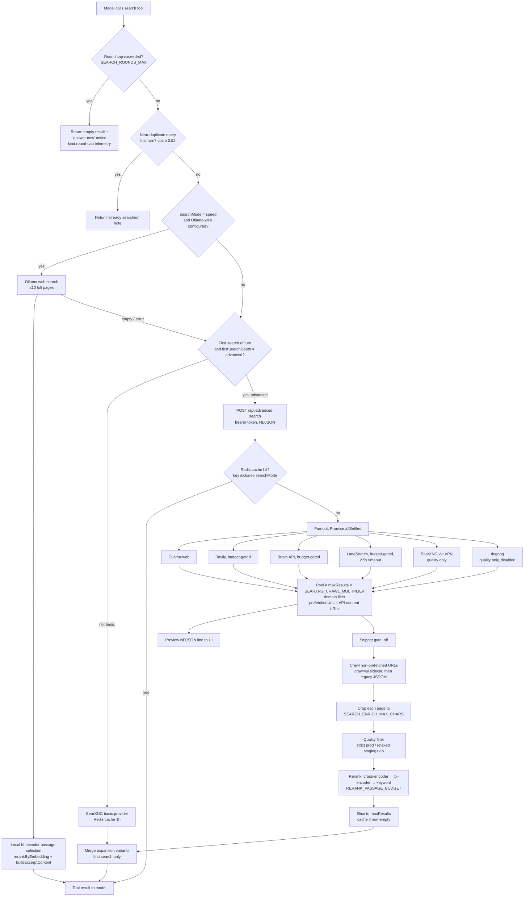

# Search pipeline

This page follows a web search from the moment the answering model calls the
`search` tool until source text lands in its prompt. It covers the three
search modes, how each mode picks its sources, crawling, reranking,
excerpting, the per-turn caps, and caching. It ends with a table of the
environment variables that control it.

What happens *before* the tool is called (the query classifier, recall, and
which turn mode is chosen) is covered in [Models & reasoning](/search/models-reasoning)
and [Chat turn](/request-lifecycle/chat-turn). To measure any of this, see
[Telemetry](/operations/telemetry).

::: tip Where the code lives
| Concern | File |
|---|---|
| Mode labels + UI time hints | `lib/config/search-modes.ts` |
| Mode → prompt, tools, `maxSteps`, first-search depth | `lib/agents/researcher.ts` (`createResearcher`, `resolveTurnMode`) |
| The `search` tool (round cap, dedup, speed fast path, expansion, depth tiering, provider routing) | `lib/tools/search.ts` |
| Advanced pipeline (fan-out, pool, crawl, quality filter, rerank, crop) | `app/api/advanced-search/route.ts` |
| Provider clients | `lib/utils/{ollama-search,tavily-search,brave-search,langsearch,searxng,degoog}-client.ts`, `lib/tools/search/providers/*` |
| Crawl sidecar client | `lib/utils/crawl4ai.ts` |
| Rerank | `lib/embeddings/rerank.ts`, `lib/embeddings/passage-budget.ts`, `lib/utils/cross-encoder.ts` |
| Quality filter / snippet gate | `lib/search/quality-content.ts`, `lib/search/snippet-gate.ts` |
| `fetch` tool + SSRF guard | `lib/tools/fetch.ts`, `lib/utils/ssrf-guard.ts` |
:::

## The three search modes

The user picks a mode in the composer. It is stored in the `searchMode` cookie
(default `balanced`) and passed to the researcher agent. In code the type is
`'speed' | 'balanced' | 'quality'` (`lib/types/search.ts`). There is **no
separate "deep research" mode**: the Quality mode *is* the deep-research
protocol (`QUALITY MODE — DEEP RESEARCH PROTOCOL` in
`lib/agents/prompts/search-mode-prompts.ts`).

| | **Speed** | **Balanced** (default) | **Quality** |
|---|---|---|---|
| UI hint (`search-modes.ts`) | "usually ~5–10s" | "usually ~15–30s" | "usually ~45s or more" |
| Query classifier | **bypassed** (always searches the raw message) | runs (classify + fused query expansion) | runs |
| Past-conversation recall | **skipped** | runs, capped at `RECALL_BUDGET_MS` | runs, capped |
| Query-expansion variants | none | up to 3, first search only | up to 3, first search only |
| First search | basic depth → **Ollama-web fast path**, no crawl | **advanced** (`/api/advanced-search`) | **advanced** |
| Sources in the advanced call | — | Ollama-web, Tavily, Brave, LangSearch | the same **+ SearXNG + degoog** (degoog currently disabled) |
| Crawl in the advanced call | none | only Brave's top `BRAVE_CRAWL_MAX` (3) URLs | Brave's top 3 + every SearXNG/degoog URL |
| Rerank | local bi-encoder (passage selection only) | remote cross-encoder, with fallbacks | remote cross-encoder, with fallbacks |
| Follow-up searches in the turn | basic | basic (SearXNG basic) | basic (SearXNG basic) |
| Search-round cap | `SEARCH_ROUNDS_MAX` (3) | `SEARCH_ROUNDS_MAX` (3) | `SEARCH_ROUNDS_MAX_QUALITY` (5) |
| Agent `maxSteps` | 20 | 50 | 100 |
| Prompt | `SPEED_MODE_PROMPT` | `getAdaptiveModePrompt()` | `getQualityModePrompt()` (≥15 searches, todo list, report) |

These are the *research* configurations. If the classifier decides the turn
needs no search (`direct`), or that it is stable knowledge (`stable-knowledge`),
the mode's research configuration does not apply (see
[Models & reasoning](/search/models-reasoning#turn-modes)).

**Measured on prod** (`latency:log`, 46 turns on current code, mid-September
2026, almost all balanced): research turns had a median total of **~19.5s**
(time to first streamed part ~4.2s); stable-knowledge turns ~10.3s; direct
turns ~6.8s. The one speed turn in that sample took 9.0s. A balanced advanced
search (cache miss) took a median **~9.9s** inside the route: fan-out ~1.9s,
crawl ~2.9s, rerank ~2.7s, with ~29 candidates and 10 returned. Quality mode
had no recent prod traffic; lab measurements when the tiers were built
(2026-09-04) put its advanced stage at **26–48s** (crawl-heavy by design).

::: warning "Balanced skips SearXNG" applies to ONE call per turn
The source tiering lives in `/api/advanced-search`, and a turn makes at most
one advanced search. Query-expansion variants and every later search in the
turn are **basic** searches that go straight to the SearXNG provider
(`lib/tools/search.ts` → `createSearchProvider('searxng')`), in every mode.
Prod telemetry confirms it: most `[latency:search]` lines on balanced turns are
`provider:"searxng", depth:"basic"`. So SearXNG (behind the VPN) is still on the
path for balanced turns. Only the first, expensive, crawl-and-rerank call
is tiered.
:::

## Pipeline at a glance

## Stage by stage

### 1. The `search` tool entry: round cap and dedup

`createSearchTool` (`lib/tools/search.ts:325`) is built **once per turn** by
`createResearcher`, so the counters in its closure are per-turn state.

- **Round cap** (`lib/tools/search.ts:381-412`). Every executing search
  increments `searchRounds`. When it exceeds `resolveSearchRoundsBudget(searchMode)`
  (3, or 5 for quality), the tool returns a *valid, non-error* result with
  `results: []`, `searchLimitReached: true`, and a `notice` telling the model
  to answer now from what it already has and to start its reply with the `## `
  heading. No fan-out and no crawl happen. It emits
  `[latency:search] {kind:"round-cap", search_round, search_round_budget, search_round_capped:true}`
  and a plain `[search] round cap reached (4 > 3, mode=balanced) …` log line.

  *Why inside the tool:* in AI SDK v6, `activeTools` only controls which tool
  definitions are *advertised* to the model. Execution resolves against the
  full `tools` map, so a withheld tool can still run. Only code inside
  `execute` can actually enforce a budget. *Why it exists:* on prod, balanced
  turns looped up to 7 search calls (≈15s of fan-out plus ≈57s of the model
  reasoning between calls). On the lab, capping a looping turn cut
  `prompt_tokens` 93k→53k (−43%) and held the answer. The legacy module-level
  `searchTool` singleton (url-rag) passes no `toolOptions` and is exempt.
- **Query dedup** (`:446-501`). Each query is embedded. A later query in the
  same turn and same `search_mode` whose cosine similarity with an earlier one is
  ≥ `SEARCH_DEDUP_THRESHOLD` (0.92) returns a short "already searched" note
  instead of searching. A query is recorded only after its search *succeeds*,
  so a failed search can be retried. The researcher's
  `wrapSearchToolWithDedup` short-circuits exact repeats and already-seen URLs
  before this point, and those short-circuits are not counted against the
  round cap.

### 2. Speed fast path (Ollama web search)

When `shouldUseOllamaWebSpeed` holds (`searchMode === 'speed'`, an
`OLLAMA_SEARCH_API_KEY` is configured, and `OLLAMA_SEARCH_ENABLED !== 'off'`),
the tool (`:528-678`):

1. Calls Ollama's web-search API for ≤10 results (the API clamps at 10;
   `OLLAMA_SEARCH_MAX_RESULTS` can only lower it). Each result is a **full page
   body**, typically 6–40k characters.
2. Runs **local bi-encoder passage selection** (`rerankByEmbedding` with
   all-MiniLM-L6-v2, in-process) and replaces each body with its top passages
   (`buildExcerptContent`). It keeps every source, so each one stays citable.
   The full bodies are stored for conversation history (`fullContentSink`).
3. Returns directly. No SearXNG, no crawl, no remote cross-encoder.

If Ollama returns nothing or throws, the tool falls through to the basic SearXNG path.

*Why:* before this path existed, speed mode sent basic SearXNG snippets and
sometimes got zero usable results. Sending whole Ollama bodies grew the prompt
to 73–89k tokens. With passage selection, a lab turn went from 24.7s (broken)
to ~6.9s, and the prompt from 89k to ~16k tokens. The remote cross-encoder was
deliberately left out: it adds 5–7s, and Ollama's results are already ranked.
Speed also **bypasses the classifier and recall** (`create-chat-stream-response.ts:271-313`),
because the researcher agent rewrites its own follow-up queries into
standalone form, so the classifier's rewrite is redundant.

### 3. Expansion variants

The classifier returns up to 3 alternative phrasings (`expandedQueries`) in the
same call that classifies the turn. See [Models & reasoning](/search/models-reasoning#the-query-classifier).
On the **first real search of the turn only**, the tool runs those variants as
concurrent **basic** SearXNG searches, cached in Redis. It waits at most 12s
(`EXPANSION_MERGE_WAIT_MS`) for the variant list to arrive, then appends the
results whose URL is not already present (keyed by `normalizeUrl`) after the
main results. Expansion is skipped for speed and skipped turns.
`QUERY_EXPANSION_ENABLED=false` turns it off (`lib/agents/classifier-expansion.ts`).
Telemetry: `[latency:search] {kind:"expansion", variants, cache_misses, failed, returned}`.

### 4. Depth tiering: one advanced search per turn

`resolveEffectiveDepth` (`:126`) decides the depth for each search. With
tiering on (`SEARCH_DEPTH_TIERING !== 'off'`, the default) and
`SEARCH_API=searxng`, the first search uses the researcher's `firstSearchDepth`
(`advanced` for balanced/quality, `basic` for speed, skip, and academic- or
social-only turns), and **every later search is basic**. Later searches are
meant to deep-read specific pages with the `fetch` tool, not to run another
crawl.

`routeEmitsSearchTelemetry(searchAPI, depth)` (`lib/tools/search/basic-telemetry.ts`)
is the **single predicate** that decides three things at once: whether the
call goes to `/api/advanced-search`, whether it uses up the turn's advanced
slot, and which side emits the telemetry line. Because all three read the same
value, they cannot disagree.

A `type:"general"` search goes to Brave+SearXNG, merged in parallel
(`mergeGeneralSearchResults`). It does **not** use up the advanced slot.

### 5. `/api/advanced-search`: auth and cache

The route is internal-only. It requires `Authorization: Bearer $INGEST_API_TOKEN`
(`checkIngestAuth`, `route.ts:542`), the same token the ingest routes use.
Before this check existed, anyone who could reach the public tunnel could
drive crawls and spend the metered API quotas. The search tool is the only caller.

**Cache key** (`route.ts:578`):
`search:{query}:{maxResults}:{searchDepth}:{searchMode}:{include}:{exclude}:{timeRange}:{intent}:{ollNN}`.
`searchMode` is part of the key because balanced and quality both send
`searchDepth: 'advanced'` but query different sources, so without it one
mode could be served the other's results. TTL is 1h (`CACHE_TTL`), and an
**empty result set is never cached**, so a transient outage is not stored for
an hour. A cache hit still answers in NDJSON when the caller streams. That path
was once broken: every warm hit became a tool failure.

**Streaming preview.** With `SEARCH_STREAM_PREVIEW` not set to `false` (the
default), the route sends a `preview` NDJSON line as soon as the fan-out
resolves (~2s, `preview_ms`) and a `final` line after crawl and rerank. The
preview only reaches the UI (source cards render early). The model only ever
sees the `final` line.

### 6. Fan-out and source tiers

All sources are fired concurrently with `Promise.allSettled` (`route.ts:827-885`).
The tier switch is a single line:
`includeSearxngDegoog = searchMode !== 'balanced'`. An undefined mode
(legacy or url-rag callers) behaves like quality.

| Provider | Fires in | Content? | Crawled? | Limits / guards |
|---|---|---|---|---|
| **Ollama web search** | balanced, quality (when `useOllama`) | full page bodies | no (prefetched) | ≤10 results; 10s timeout (`OLLAMA_SEARCH_TIMEOUT_MS`); 30s circuit breaker |
| **Tavily** | advanced depth | relevance paragraphs | no (prefetched) | `TAVILY_MONTHLY_BUDGET` (code 1000; 950 set in env), Redis key `tavily:budget:YYYY-MM`; 5 results; 10s timeout; 30s breaker |
| **Brave Search API** | advanced depth | 1–2-sentence descriptions | **top `BRAVE_CRAWL_MAX` (3) only**; the rest prefetched | `BRAVE_MONTHLY_BUDGET` 2000, key `brave:budget:YYYY-MM`; 10 results; 10s timeout; 30s breaker |
| **LangSearch** | advanced depth | lossy (lowercased) summaries | no (prefetched) | `LANGSEARCH_DAILY_BUDGET` 900/day, key `langsearch:budget:YYYY-MM-DD`; **`LANGSEARCH_TIMEOUT_MS` 2500**; 30s breaker |
| **SearXNG** | quality only | link + snippet | **yes** | engines `bing,duckduckgo,google cse` (`SEARXNG_ENGINES_ADVANCED`); page 1 only; runs behind the Mullvad VPN |
| **degoog** (web, +news on news intent) | quality only, when `DEGOOG_ENABLED` | link + snippet | yes | **`DEGOOG_ENABLED=false` in all three envs** since 2026-09-07 |

Details that explain the design:

- **Budget gates fail CLOSED.** Each metered source reads its Redis counter
  first and skips the call if Redis cannot be read. The counter is incremented
  only after a successful call, so an outage does not spend quota
  (`maybeFetchTavily/Brave/LangSearch`). Prod and staging share the API keys,
  and each instance only counts its own calls. That is why the LangSearch
  budget defaults to 900 instead of the provider's 1000.
- **Circuit breakers.** Each provider client stops calling for 30s
  after a failure (`BREAKER_COOLDOWN_MS`), so a dead provider does not add its
  full timeout to every search.
- **LangSearch's timeout undercuts its own latency.** Its real response time is
  ~2.8s, above the 2500ms timeout, so it often drops out. This is intentional:
  it used to hold the whole concurrent fan-out at ~4.7s. It stays in the
  fan-out as a source that contributes when it happens to be fast.
- **SearXNG via VPN.** The VPN overlays (`docker-compose.vpn*.yaml`) put the
  per-env SearXNG inside a gluetun (Mullvad WireGuard) network namespace, so
  engine traffic leaves through the VPN instead of the flagged residential IP.
  The app reaches it as `SEARXNG_API_URL=http://ask-gluetun[-<env>]:8080`, and
  `fetchSearxngJson` fails over to `SEARXNG_FALLBACK_API_URL`. Always request
  **page 1** (`SEARXNG_PAGENO`): the inherited `ceil(maxResults/10)` asked for
  page 2+, threw away the best results, and looked like a paginating bot.
- **SearXNG is one provider among several.** If SearXNG (and its fallback)
  rejects, is unconfigured, or returns a malformed body,
  `resolveSearxngContribution` (`app/api/advanced-search/searxng-contribution.ts`)
  turns it into an empty SearXNG share, logs `[searxng] advanced search failed,
  continuing with the other providers`, and the search continues on
  Tavily/Brave/LangSearch/Ollama/degoog. The `[latency:search]` line carries
  `searxng=ok|failed`. Such a degraded result is returned but **not cached**, so
  the SearXNG-less set is not pinned for the hour-long TTL. (Before 2026-09-23 a
  SearXNG failure threw and the whole search came back empty, discarding the API
  sources.) Balanced never calls SearXNG in this route.
- **Images** come from the same SearXNG request (`categories=general,images`).
  A separate degoog image fetch exists but is off (`DEGOOG_IMAGES_ENABLED`).
  Basic searches no longer request the `images` category, because image
  engines are rate-limited and added ~3.5s per query.

### 7. Pool assembly and `prefetchedUrls`

Results are merged into one candidate pool in this order: SearXNG, degoog,
Tavily, Brave, LangSearch, Ollama (`merge-*.ts`). Each merge is capped at
`maxResults × SEARXNG_CRAWL_MULTIPLIER`. `maxResults` is the model's request,
at least 10 (the tool default is 20) and at most `SEARXNG_MAX_RESULTS` (50).
The multiplier is **2 on prod** and 4 on staging and lab.

`prefetchedUrls` (`route.ts:985`) is the set of URLs that already carry usable
text and must **not** be crawled: all Ollama, Tavily, and LangSearch URLs, plus
Brave URLs beyond the top `BRAVE_CRAWL_MAX`. The include/exclude domain filter
is applied a **second time across the full pool** (`:1084`), because the
provider merges run without the domain arguments, and some of them prepend
their results.

*Why Brave is partly crawled:* its descriptions are too short to pass prod's
strict quality filter (>50 words), so uncrawled Brave results were dropped and
could not be cited. Crawling all ~10 Brave URLs cost ~17s on balanced
(`crawled=10 crawl_ms=17307`). Capping the crawl at the top 3 brought that to
~1–5s, and the answers stayed grounded.

### 8. Snippet gate (off)

`runSnippetGate` (`lib/search/snippet-gate.ts`) can score each candidate's
title+snippet with the cross-encoder and crawl only the top `SEARCH_SNIPPET_GATE_TOP_N`.
Modes are `off` / `shadow` / `on`, and it is **off in every env**. Shadow mode
logs `returned_ranks`, which shows where the sources that were finally returned
had ranked before the crawl. That is the data needed to choose a `TOP_N`. The
gate fails open to the unfiltered pool.

### 9. Crawl

Candidates not in `prefetchedUrls` go to the **crawl4ai** sidecar
(`crawl4aiScrapeMany`, `route.ts:1166-1200`):

- Up to `MAX_ENRICH_URLS` (100) URLs, in chunks of `CRAWL4AI_CHUNK_SIZE` (8),
  with at most `CRAWL4AI_MAX_CONCURRENT_CHUNKS` (6) chunks in flight. That is
  up to 48 concurrent pages. Pages load with `waitUntil: 'domcontentloaded'`
  (4.7s vs 26.4s for `networkidle` on a 16-URL benchmark, with more usable results).
- Per-chunk budget `CRAWL4AI_CHUNK_TIMEOUT_MS` (120s). An aborted chunk throws
  away all 8 of its rendered pages, so the budget is generous on purpose.
- The sidecar runs on MiniNightFury (`192.168.50.231:11235`, `CRAWL4AI_URL`).
  See [Services](/infrastructure/services).

Anything crawl4ai did not return falls through to the **legacy in-process
crawler** (`crawlPage`): an HTTP GET, then Readability, then a JSDOM
walk as a fallback. It has a 20s deadline per page (`LEGACY_CRAWL_BUDGET_MS`),
refuses content types that are not pages, and caps the size
(`MAX_PARSEABLE_BYTES`). JSDOM parses **on the Node event loop**, so it stalls
every other request the server handles. This is why pages are pushed to the
sidecar whenever possible. If crawl4ai returns *nothing at all* (an outage),
the legacy path is limited to 8 pages to keep the app responsive.

::: danger Crawl parallelism: measured ceiling, do not raise
A benchmark against the live sidecar (2026-08-04) found throughput peaks at
**~24–32 concurrent pages (~2.2 pages/s)** and *drops* at 40 (wall time
15s→23s). Memory stayed under the 8GB cap and `/dev/shm` stayed at 0. The limit
is single-thread page rendering plus slow remote sites, not RAM. Ask's fan-out
(6 × 8 = 48) is already at or past that point. Raising workers, memory, shm, or
concurrency buys nothing. The only lever left is a second crawler host.
Lowering `MAX_ENRICH_URLS` 100→40 was also A/B'd (2026-09-01): candidate pools
are only ~36–43 pages, so the cap never applies, and the change gave zero
speedup.
:::

### 10. Crop

Every page's text (crawled or prefetched) is cut to
**`SEARCH_ENRICH_MAX_CHARS`** characters (`ENRICH_CONTENT_MAX_CHARS`,
`route.ts:124`). The code default is 10000. **Prod, staging, and lab all run
20000.** Query terms are wrapped in `<mark>` for the UI, and the tags are
stripped again before scoring.

The 20k crop has run on real traffic since 2026-08-06 together with a
measurement-only shadow (`SEARCH_CROP_POSITION_SHADOW=true`). After the rerank,
`measureCropPositions` (run via `after()`, so it never affects the response)
logs where each source's best passage sits in the **uncropped** page, as
`[crop-pos] {chatId, detail:[{u,o,t}]}`. `[cite-urls] {chatId, cited}` records
which URLs the answer cited. Joining the two on `chatId` gives the fraction of
cited sources whose best passage lies past the crop. On the lab, 20k recovered
about 22% of sources' best content with no visible change in time to first
token. To revert: `SEARCH_ENRICH_MAX_CHARS=10000`.

### 11. Quality filter

`isQualityContent` (`lib/search/quality-content.ts`) drops pages that are error
pages or too thin. **Strict** (the default, and prod): >50 words, >3 sentences, and
5–30 words per sentence on average. **Relaxed** (`SEARCH_QUALITY_FILTER=relaxed`,
staging and lab): length only, >25 words. This is the largest cut in the
pipeline (on the order of 42→18 candidates on a measured turn). Prod keeps
strict on purpose to hold prompt size down.

### 12. Rerank

Tiers are tried from best to worst, and each one falls back to the next on
failure (`route.ts:1313-1452`):

| Tier | Function | Scorer | Score floor | Telemetry `rerank_tier` |
|---|---|---|---|---|
| Cross-encoder | `rerankByCrossEncoder` | remote `/rerank` on NightFuryX `:8787` (`RERANKER_URL` + `RERANKER_API_TOKEN`) | 0.1 | `cross-encoder` |
| Bi-encoder | `rerankByEmbedding` | local all-MiniLM-L6-v2, cosine | 0.2 | `embedding` |
| Keyword | inline `calculateRelevanceScore` | term counts, title and recency boosts | ≥10 | `keyword` |

If a floor filters out *every* result, the next tier runs instead of returning
no sources. The cross-encoder floor is 0.1, not 0.3: the service truncates
input at `max_length=128` tokens, so genuinely relevant passages can score
0.1–0.4. At 0.3, about 15–20% of queries were pushed down to the bi-encoder.

**How a document is scored.** Each page is split into 256-token passages
(overlap 32, at most 12 per document). Every passage is scored once, and the
document's score is its **best** passage. The top `PASSAGES_PER_SOURCE` (3)
passages are kept in document order.

**Passage budget** (`lib/embeddings/passage-budget.ts`):
`passagesPerDoc = max(1, min(12, floor(RERANK_PASSAGE_BUDGET / docCount)))`.
It limits passages per document and never drops documents. The code
default is 320 (~40ms per passage ≈ 13s, inside the reranker's 20s timeout).
**All three envs set 160** (since 2026-09-01). A lab A/B that judged answer
quality, not source counts, found it −40% / ~5s faster on rerank with no loss.

Balanced **does** rerank: rerank is tied to effective depth `advanced`, not to
the mode label. Speed never uses the cross-encoder.

### 13. Excerpts (off)

With `SEARCH_EXCERPTS_ENABLED=true`, each kept source would be cut down to its
top passages (`buildExcerptContent`) and the full page stored separately
(`fullResults`) for history. **It is off in every env.** The excerpts A/B lost:
citations appeared without supporting text on 2 of 2 probed turns, and turns
took +142% more steps. With it off, the model reads the full cropped page text.

### 14. Return

The pool is sliced to `maxResults`, cached (if non-empty), and returned with a
`timings` object. The search tool adds those timings to the turn's
`[latency]` line. The tool output keeps `toolCallId` (the model cites as
`[n](#toolCallId)`) and `images`, and drops `state`/`citationMap` before the
result is shown to the model (`toModelOutput`).

## The `fetch` tool and the SSRF guard

Follow-up searches are basic, so to read a page in depth the model calls
`fetch` (`lib/tools/fetch.ts`). It tries a chain of methods in order (plain
fetch, crawl4ai, FlareSolverr, Tavily extract, Firecrawl, with Jina in the
chain as well), fetches transcripts for YouTube URLs, and has an overall caller
deadline of `FETCH_TOTAL_DEADLINE_MS` (40s). Its wall time is reported as
`fetch_ms` on the turn line.

Before any request, `assertUrlAllowed` (`lib/utils/ssrf-guard.ts`, called at
`fetch.ts:607`) rejects non-http(s) schemes, literal loopback, private,
link-local, and reserved IPs (v4, v6, and v4-mapped), the `localhost` family,
and cloud metadata hostnames. Where DNS resolves, it also rejects public names
that resolve to private addresses. **Documented gaps:** redirect-based SSRF
(a public URL that 302s to a private one), and DNS rebinding in the window
between the check and the connection. See [Security](/infrastructure/security).

::: info The advanced route's legacy crawler is behind the SSRF guard
`crawlPage` → `fetchHtml` (`lib/utils/legacy-fetch-html.ts`) runs `assertUrlAllowed`
on the start URL **and on every redirect target before following it**, and caps
chains at 5 redirects (`LEGACY_FETCH_MAX_REDIRECTS`). A search result that points
at, or redirects to, a LAN or metadata address is refused; the crawler records
the error and the page is dropped like any other failed fetch. Residual: DNS
rebinding between the check and the connect. The crawl4ai sidecar still receives
the same URLs unchecked. (Fixed 2026-09-23; before that it used a raw
`http(s).get` with unbounded recursive redirects and no guard.)
:::

## Caching summary

| Cache | Key | TTL | Notes |
|---|---|---|---|
| Advanced search result | `search:…:{searchMode}:…` (see §5) | 1h | never caches empty; hourly sweep of expired `search:*` keys |
| Basic SearXNG search | `basicSearchCacheKey(query\|mode\|domains\|intent\|content_types, max, timeRange)` | 1h | `lib/search/basic-search-cache.ts`; also used by expansion variants (the classifier runs at temperature 0, so the same question produces the same variants) |
| Metered budgets | `tavily:budget:YYYY-MM`, `brave:budget:YYYY-MM`, `langsearch:budget:YYYY-MM-DD` | 35 days / 48h | counters, not caches |

All live in the per-env Redis (`LOCAL_REDIS_URL`, `noeviction`). See
[Data layer](/infrastructure/data-layer).

## Knobs

Values below are **code defaults**. Where the running envs differ, it says so.
The full generated list is at [Environment flags](/reference/env-flags).
Most of these are read at request time, so changing one needs only
`up -d --force-recreate ask`, not a rebuild. `NEXT_PUBLIC_*` values are
inlined at build time and do need a rebuild.

| Env var | Effect | Default (code) | Running value if different |
|---|---|---|---|
| `SEARCH_API` | Provider for basic searches and the advanced route | `DEFAULT_PROVIDER` | `searxng` (all envs) |
| `SEARCH_ROUNDS_MAX` | Max `search` calls per turn (speed/balanced) | 3 | |
| `SEARCH_ROUNDS_MAX_QUALITY` | Same, quality | 5 | |
| `SEARCH_DEPTH_TIERING` | `off` disables one-advanced-per-turn | on | |
| `SEARXNG_DEFAULT_DEPTH` | `advanced` forces advanced depth when tiering is off | `basic` | |
| `SEARCH_DEDUP_ENABLED` / `SEARCH_DEDUP_THRESHOLD` | In-turn near-duplicate query skip | on / 0.92 | |
| `QUERY_EXPANSION_ENABLED` | `false` disables expansion variants | on | |
| `SEARCH_STREAM_PREVIEW` | `false` disables the NDJSON preview line | on | |
| `OLLAMA_SEARCH_ENABLED` | `off` disables Ollama web search (and the speed fast path) | on if `OLLAMA_SEARCH_API_KEY` set | |
| `OLLAMA_SEARCH_MAX_RESULTS` | Ollama results per call (clamped to 10) | 10 | |
| `OLLAMA_SEARCH_TIMEOUT_MS` | Ollama web-search timeout | 10000 | |
| `TAVILY_MERGE_ENABLED` / `TAVILY_MONTHLY_BUDGET` / `TAVILY_MERGE_MAX_RESULTS` / `TAVILY_MERGE_TIMEOUT_MS` | Tavily in the advanced fan-out | on / 1000 / 5 / 10000 | budget 950 |
| `BRAVE_MERGE_ENABLED` / `BRAVE_MONTHLY_BUDGET` / `BRAVE_MERGE_MAX_RESULTS` / `BRAVE_MERGE_TIMEOUT_MS` | Brave API in the fan-out | on / 2000 / 10 / 10000 | |
| `BRAVE_CRAWL_MAX` | How many top Brave URLs are crawled; 0 = crawl none | 3 | |
| `LANGSEARCH_MERGE_ENABLED` / `LANGSEARCH_DAILY_BUDGET` / `LANGSEARCH_TIMEOUT_MS` | LangSearch in the fan-out | on / 900 / 2500 | |
| `DEGOOG_ENABLED` / `DEGOOG_IMAGES_ENABLED` | degoog web/news; extra image fetch | on / off | **`false` in all envs** |
| `SEARXNG_ENGINES` | Engines for the advanced SearXNG call | `bing,duckduckgo,google cse` | |
| `SEARXNG_MAX_RESULTS` / `SEARXNG_PAGENO` | Upper bound on `maxResults`; results page | 50 / 1 | |
| `SEARXNG_CRAWL_MULTIPLIER` | Pool size = maxResults × this | 4 | **prod 2** |
| `SEARCH_SNIPPET_GATE` / `_TOP_N` / `_TIMEOUT_MS` | Pre-crawl cross-encoder gate | off / 20 / 4500 | staging+lab `TOP_N=40` |
| `MAX_ENRICH_URLS` | Max URLs sent to crawl4ai | 100 | |
| `CRAWL4AI_CHUNK_SIZE` / `CRAWL4AI_MAX_CONCURRENT_CHUNKS` / `CRAWL4AI_CHUNK_TIMEOUT_MS` | Sidecar batching | 8 / 6 / 120000 | |
| `MAX_LEGACY_CRAWL_URLS` / `LEGACY_CRAWL_BUDGET_MS` | Legacy JSDOM crawler cap and per-page deadline | 999 / 20000 | |
| `SEARCH_ENRICH_MAX_CHARS` | Per-page crop | 10000 | **20000 in all envs** |
| `SEARCH_CROP_POSITION_SHADOW` | `[crop-pos]`/`[cite-urls]` measurement | off | **true in all envs** |
| `SEARCH_QUALITY_FILTER` | `relaxed` = length-only filter | strict | **staging+lab `relaxed`** |
| `RERANK_PASSAGE_BUDGET` | Passages per rerank call | 320 | **160 in all envs** |
| `PASSAGES_PER_SOURCE` | Top passages kept per source | 3 | |
| `SEARCH_EXCERPTS_ENABLED` | Model reads excerpts instead of the full crop | off | |
| `SEARCH_FULL_CONTENT_RERANK` | Two-stage whole-page rerank (experiment) | off | |
| `FETCH_TOTAL_DEADLINE_MS` | `fetch` tool caller deadline | 40000 | |

## What not to retry (negative results)

These were built and measured, and they lost. Reopen one only with a better
measurement plan than last time. Full records are in [Decisions](/history/decisions).

- **Single-pass search** (2026-09-10): replacing the agentic re-search loop
  with one wide fan-out (4/6/8 parallel expansions) plus a "search once" prompt.
  In an interleaved lab A/B (n=6, cache flushed each turn, model pinned),
  balanced was **not** faster (8.16s vs 8.62s), because the stage is bound by
  crawl and rerank, not by the number of rounds. It also **regressed multi-hop
  grounding**: a chained question got its final hop wrong. The loop plus the
  round cap was kept.
- **Two-stage full-content rerank** (`SEARCH_FULL_CONTENT_RERANK`, 2026-08-05):
  a modest, unreliable win (recovered ~3 of 6 mid- and tail-of-page cases,
  with one ranking regression) at a real cost. Not shipped. Do not re-run it
  as a live-browser A/B: search non-determinism and the ceiling on mainstream
  queries drown out the signal. Use the deterministic benchmark
  (`lib/embeddings/__bench__/full-content-bench.ts`) or prod crop-position logs.
- **Excerpts** (`SEARCH_EXCERPTS_ENABLED`): citations without supporting text, +142% steps.
- **`MAX_ENRICH_URLS` 100→40**, **legacy crawl cap 8**, and **tighter legacy
  deadline (6s)**: each cut sources with no reliable latency gain.
- **Raising crawl parallelism**: see the ceiling above.

## How to change things

**Add a content-bearing search provider.** Write a client in `lib/utils/` with
a timeout and a circuit breaker, following `tavily-search-client.ts`. Add a
budget-gated `maybeFetchX` in the route if the provider is metered. Add the
call to the `Promise.allSettled` array. Add a `merge-x.ts` in
`lib/tools/search/providers/`. If it returns usable text, add its URLs to
`prefetchedUrls` so they are not crawled. Decide which tier it belongs to
(balanced and quality, or quality only). Then measure it on the lab. Compare
the returned URLs and the answers, not source counts.

**Move a source between tiers.** Everything hangs off `includeSearxngDegoog`
(`route.ts:823`). Because `searchMode` is in the cache key, no cache flush is
needed.

**Tune the round cap.** Set `SEARCH_ROUNDS_MAX` / `SEARCH_ROUNDS_MAX_QUALITY`
and recreate the container. Check the effect with the `kind:"round-cap"` lines
and `prompt_tokens` in [Telemetry](/operations/telemetry).
