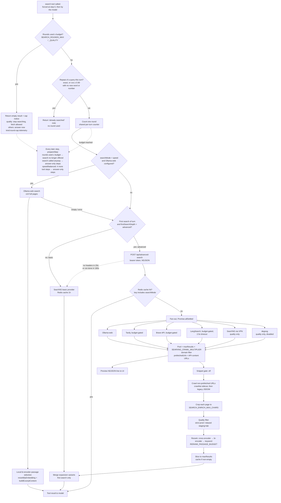

# Search pipeline

This page follows a web search from the moment the answering model calls the
`search` tool until source text lands in its prompt. It covers the three
search modes, how each mode picks its sources, crawling, reranking,
excerpting, the per-turn caps, and caching. It ends with a table of the
environment variables that control it.

What happens *before* the tool is called (the query classifier, recall, and
which turn mode is chosen) is covered in [Models & reasoning](/search/models-reasoning)
and [Chat turn](/request-lifecycle/chat-turn). To measure any of this, see
[Telemetry](/operations/telemetry).

::: tip Every question searches (since 2026-09-26)
With `ALWAYS_SEARCH` on (the default), the first `search` call of every
research turn is **forced**: it is issued at step 0 by a synthetic model on the
classifier's `standaloneQuery`, not by the answering model. From the tool's point
of view nothing differs, so everything on this page applies to it: it is the
turn's first search, it takes the advanced slot on balanced/quality, it gets the
expansion variants, and it counts as round 1. Only non-questions (greetings,
thanks, pure transforms, arithmetic, image requests, explicit remember/forget
instructions) skip search. A research turn is not forced when the user supplied
the source: a pasted URL (read with `fetch` or the attached-source path), or an
attachment the message only points at. See
[D37](/history/decisions#d37-always-search-every-question).
:::

::: tip Where the code lives
| Concern | File |
|---|---|
| Mode labels + UI time hints | `lib/config/search-modes.ts` |
| Mode → prompt, tools, `maxSteps`, first-search depth | `lib/agents/researcher.ts` (`createResearcher`, `resolveTurnMode`) |
| The `search` tool (round cap, dedup, speed fast path, expansion, depth tiering, provider routing) | `lib/tools/search.ts` |
| The in-turn repeat-query rule (exact / near repeat, word check) | `lib/tools/search/query-dedup.ts` |
| After the round cap: stop offering `search`, then force the answer | `lib/agents/search-cap.ts` (applied in the researcher's `prepareStep`) |
| Advanced pipeline (fan-out, pool, crawl, quality filter, rerank, crop) | `app/api/advanced-search/route.ts` |
| Provider clients | `lib/utils/{ollama-search,tavily-search,brave-search,langsearch,searxng,degoog}-client.ts`, `lib/tools/search/providers/*` |
| Crawl sidecar client | `lib/utils/crawl4ai.ts` |
| Rerank | `lib/embeddings/rerank.ts`, `lib/embeddings/passage-budget.ts`, `lib/utils/cross-encoder.ts` |
| Quality filter / snippet gate | `lib/search/quality-content.ts`, `lib/search/snippet-gate.ts` |
| `fetch` tool + SSRF guard | `lib/tools/fetch.ts`, `lib/utils/ssrf-guard.ts` |
:::

## The three search modes

The user picks a mode in the composer. It is stored in the `searchMode` cookie
(default `balanced`) and passed to the researcher agent. In code the type is
`'speed' | 'balanced' | 'quality'` (`lib/types/search.ts`). There is **no
separate "deep research" mode**: the Quality mode *is* the deep-research
protocol (`QUALITY MODE — DEEP RESEARCH PROTOCOL` in
`lib/agents/prompts/search-mode-prompts.ts`).

| | **Speed** | **Balanced** (default) | **Quality** |
|---|---|---|---|
| UI hint (`search-modes.ts`) | "usually ~5–10s" | "usually ~15–30s" | "usually ~45s or more" |
| Query classifier | **bypassed** (the forced first search runs on the raw message) | runs (classify + fused query expansion) | runs |
| Past-conversation recall | **skipped** | runs, capped at `RECALL_BUDGET_MS` | runs, capped |
| Query-expansion variants | none | up to 3, first search only | up to 3, first search only |
| First search | basic depth → **Ollama-web fast path**, no crawl | **advanced** (`/api/advanced-search`) | **advanced** |
| Sources in the advanced call | — | Ollama-web, Tavily, Brave, LangSearch | the same **+ SearXNG + degoog** (degoog currently disabled) |
| Crawl in the advanced call | none | only Brave's top `BRAVE_CRAWL_MAX` (3) URLs | Brave's top 3 + every SearXNG/degoog URL |
| Rerank | local bi-encoder (passage selection only) | remote cross-encoder, with fallbacks | remote cross-encoder, with fallbacks |
| Follow-up searches in the turn | basic | basic (SearXNG basic) | basic (SearXNG basic) |
| Search-round cap | `SEARCH_ROUNDS_MAX` (3) | `SEARCH_ROUNDS_MAX` (3) | `SEARCH_ROUNDS_MAX_QUALITY` (10; 5 before 2026-09-30) |
| `fetch` calls per turn | no cap (`FETCH_ROUNDS_MAX` unset) | no cap (`FETCH_ROUNDS_MAX` unset) | `FETCH_ROUNDS_MAX_QUALITY` (8, since 2026-09-30) |
| After the search cap | answer now; `search` no longer offered; an answer-only step after 4 more tool steps | answer now; `search` no longer offered; an answer-only step after 4 more tool steps | no more searches (`search` no longer offered); `fetch` of this turn's URLs still allowed |
| Agent `maxSteps` | 20 | 50 | 100 |
| Prompt | `getQuickModePrompt()` | `getAdaptiveModePrompt()` | `getQualityModePrompt()` (≥15 searches, todo list, report) |

The quality prompt still asks for "minimum 15 searches, target 20-30"
(`lib/agents/prompts/search-mode-prompts.ts:500,518`), more than the cap allows. The cap wins:
once 10 searches have run, every further `search` call returns the cap notice instead of results
([round cap](#round-cap)).

These are the *research* configurations. If the classifier decides the message
is not a question (`skipSearch`, turn mode `direct`), the mode's research
configuration does not apply. With `ALWAYS_SEARCH=off` a third mode,
`stable-knowledge`, also skips it (see
[Models & reasoning](/search/models-reasoning#turn-modes)).

**Measured on prod** (`latency:log`, 46 turns on the code of mid-September
2026, almost all balanced, **before** every question searched): research turns
had a median total of **~19.5s** (time to first streamed part ~4.2s);
stable-knowledge turns ~10.3s; direct turns ~6.8s. The one speed turn in that
sample took 9.0s. Since 2026-09-26 the former stable-knowledge questions are
research turns: on the lab their first prose arrives about 7–20s later than it
did without a search (median ~3s → ~21s in the A/B that accompanied the change).

::: warning `ttft_ms` on forced turns
The forced step 0 emits its tool call instantly, so on a forced turn `ttft_ms`
(and `first_step_ms`) measure only the pre-work, about 2s. They no longer include
the model round trip that decided to search. Time to first prose is
`stream["text-start"]` on the `[latency]` line; compare that across versions,
not `ttft_ms`. See [Telemetry](/operations/telemetry#time-to-first-output-and-the-step-structure).
::: A balanced advanced
search (cache miss) took a median **~9.9s** inside the route: fan-out ~1.9s,
crawl ~2.9s, rerank ~2.7s, with ~29 candidates and 10 returned. Quality mode
had no recent prod traffic; lab measurements when the tiers were built
(2026-09-04) put its advanced stage at **26–48s** (crawl-heavy by design).

::: warning "Balanced skips SearXNG" applies to ONE call per turn
The source tiering lives in `/api/advanced-search`, and a turn makes at most
one advanced search. Query-expansion variants and every later search in the
turn are **basic** searches that go straight to the SearXNG provider
(`lib/tools/search.ts` → `createSearchProvider('searxng')`), in every mode.
Prod telemetry confirms it: most `[latency:search]` lines on balanced turns are
`provider:"searxng", depth:"basic"`. So SearXNG (behind the VPN) is still on the
path for balanced turns. Only the first, expensive, crawl-and-rerank call
is tiered.
:::

## Pipeline at a glance

```mermaid
flowchart TD
  A[search tool called:<br/>forced at step 0, then by the model] --> B{Rounds used ≥ budget?<br/>SEARCH_ROUNDS_MAX / _QUALITY}
  B -- yes --> B1[Return empty result + cap notice<br/>quality: stop searching, fetch allowed<br/>others: answer now<br/>kind:round-cap telemetry]
  B1 -.-> B2[Every later step, prepareStep:<br/>rounds used ≥ budget → search no longer offered<br/>search called anyway → answer-only steps<br/>speed/balanced: 4 more tool steps → answer-only steps]
  B -- no --> C{Repeat of a query this turn?<br/>exact, or cos ≥ 0.90<br/>with no new word or number}
  C -- yes --> C1[Return 'already searched' note<br/>no round used]
  C -- no --> C2[Count one round<br/>shared per-turn counter] --> D{searchMode = speed<br/>and Ollama-web configured?}
  C2 -. budget reached .-> B2
  D -- yes --> S1[Ollama web search<br/>≤10 full pages]
  S1 --> S2[Local bi-encoder passage selection<br/>rerankByEmbedding + buildExcerptContent]
  S2 --> OUT[Tool result to model]
  S1 -- empty / error --> E
  D -- no --> E{First search of turn<br/>and firstSearchDepth = advanced?}
  E -- no: basic --> F[SearXNG basic provider<br/>Redis cache 1h]
  F --> V[Merge expansion variants<br/>first search only]
  V --> OUT
  E -- yes: advanced --> G[POST /api/advanced-search<br/>bearer token, NDJSON]
  G -. no headers in 20s<br/>or not done in 180s .-> F
  G --> H{Redis cache hit?<br/>key includes searchMode}
  H -- yes --> OUT
  H -- no --> I[Fan-out, Promise.allSettled]
  I --> I1[Ollama-web]
  I --> I2[Tavily, budget-gated]
  I --> I3[Brave API, budget-gated]
  I --> I4[LangSearch, budget-gated,<br/>2.5s timeout]
  I --> I5[SearXNG via VPN<br/>quality only]
  I --> I6[degoog<br/>quality only, disabled]
  I1 & I2 & I3 & I4 & I5 & I6 --> J[Pool = maxResults × SEARXNG_CRAWL_MULTIPLIER<br/>domain filter<br/>prefetchedUrls = API-content URLs]
  J --> P[Preview NDJSON line to UI]
  J --> K[Snippet gate: off]
  K --> L[Crawl non-prefetched URLs<br/>crawl4ai sidecar, then legacy JSDOM]
  L --> M[Crop each page to<br/>SEARCH_ENRICH_MAX_CHARS]
  M --> N[Quality filter<br/>strict prod / relaxed staging+lab]
  N --> R[Rerank: cross-encoder → bi-encoder → keyword<br/>RERANK_PASSAGE_BUDGET]
  R --> X[Slice to maxResults<br/>cache if non-empty]
  X --> V
```

## Stage by stage

### 1. The `search` tool entry: round cap and dedup {#round-cap}

`createSearchTool` (`lib/tools/search.ts:315`) is built **once per turn** by
`createResearcher`, so the counters in its closure are per-turn state.

- **Round cap** (`lib/tools/search.ts:381-415`). Before anything else, the tool compares
  the rounds already used (`searchRounds.used`) with `resolveSearchRoundsBudget(searchMode)`
  (`lib/tools/search-rounds.ts:35-49`: `SEARCH_ROUNDS_MAX`, default 3, or
  `SEARCH_ROUNDS_MAX_QUALITY`, default **10** since 2026-09-30, 5 before). When the budget is
  used up it returns a *valid, non-error* result with `results: []`, `searchLimitReached: true`
  and a `notice` (`buildSearchRoundCapNotice`, `search-rounds.ts:83-91`). No fan-out and no
  crawl happen. It emits
  `[latency:search] {kind:"round-cap", search_round, search_round_budget, search_round_capped:true, fetch_allowed}`
  and a plain `[search] round cap reached (11 > 10, mode=quality) — …` log line.
  - **Which notice.** In a mode with a fetch cap (`resolveFetchRoundsBudget` is not null:
    quality by default) the notice ends only the **searching**: further searches are
    refused, but the model may still `fetch` URLs that appeared in this turn's earlier
    results when a claim needs the full page, several URLs per call, and must otherwise
    answer now. In a mode without a fetch cap (speed and balanced unless `FETCH_ROUNDS_MAX`
    is set) the notice still says to answer now, because a fetch that nothing bounds except
    the answer deadline is not offered. Both wordings forbid narrating the limit and require
    the reply to start with its `## ` heading.
  - **Where the budget and the counter live** (since 2026-10-07). The budget, the counter type
    (`SearchRoundCounter`, `{ used: number }`), the cap notice and the withdrawal note are in
    `lib/tools/search-rounds.ts`; `search.ts` re-exports `resolveSearchRoundsBudget` and
    `buildSearchRoundCapNotice` for existing importers (`search.ts:310`). They are kept apart so
    the researcher and `lib/agents/search-cap.ts` can read the budget without importing the
    search tool's module (providers, crawler client, embedder). The researcher creates one
    counter per turn (`lib/agents/researcher.ts:652`) and hands it to `createSearchTool` as
    `searchRounds` (`search.ts:120-125`); the tool counts into it (`:334-336`) and is its only
    writer, and the researcher reads `used` before every step to decide when to stop offering
    `search` (stage 1 below). Without the option (the module-level singleton) the tool
    keeps a private counter.
  - **What counts as a round.** Only a search that actually runs. The counter is
    incremented **after** the near-duplicate check below (`search.ts:519-521`), so a dedup-skipped
    reformulation does not use a round. Before 2026-09-30 it was incremented first, and a
    false-positive skip cost a quality turn one of its 5 rounds. The researcher's exact-repeat
    and seen-URL short-circuits (`wrapSearchToolWithDedup`) return before this `execute` runs
    at all.
  - **Parallel calls can overshoot it.** The budget is checked at the top of `execute`
    (`search.ts:383`) but the counter is incremented only at `:521`, after the first `yield`
    (`:432`) and the dedup embedding (`:462`). The AI SDK starts the parallel tool calls of one
    step concurrently, so every call that starts before the first increment passes the check. In
    prod chat `cznh8gc1gz41vq2lwjb560br` (balanced, budget 3) 5 searches ran. Not fixed
    ([known issue](/history/known-issues#parallel-search-calls-can-overshoot-the-round-cap)).
    The researcher reads the same counter, so the withdrawal line can show more rounds than the
    budget (`rounds 5/3`).

  *Why inside the tool:* in AI SDK v6, `activeTools` only controls which tool
  definitions are *advertised* to the model. Execution resolves against the
  full `tools` map, so a withheld tool can still run. Only code inside
  `execute` can actually enforce a budget. *Why it exists:* on prod, balanced
  turns looped up to 7 search calls (≈15s of fan-out plus ≈57s of the model
  reasoning between calls). On the lab, capping a looping turn cut
  `prompt_tokens` 93k→53k (−43%) and held the answer. The legacy module-level
  `searchTool` singleton (url-rag) passes no `toolOptions` and is exempt.

  *Why quality allows fetching past the cap (2026-09-30):* in a lab A/B the cap-5 arm hit
  the cap on all 3 quality questions, then made 1 fetch across the 3 turns and answered
  from snippets (it reported a trial result as null from a 401-character snippet); the
  cap-15 arm fetched 34 pages and won on that page text. With fetching allowed past the cap,
  cap 10 and cap 5 measured the same, and cap 10 tied the stored cap-15 answers
  ([D40](/history/decisions#d40-quality-mode-read-pages-past-the-search-cap)).
- **When the budget is spent: `search` withdrawn, then answer-only steps** (since 2026-10-07;
  `lib/agents/search-cap.ts`, applied in the researcher's `prepareStep` at
  `lib/agents/researcher.ts:1118-1190`). The cap's refusal is an ordinary tool result whose
  only stop signal is the notice text. In stored history every model stopped searching after at
  most 5 refusals in a turn, except one: prod chat `cznh8gc1gz41vq2lwjb560br` (mistral-large-4,
  balanced, cap 3) ran 5 real searches, then had **80** more `search` calls refused over about 30
  steps, with `search` still advertised on every step: 36 steps, 89 tool calls, 2,066,500 prompt
  tokens, 259 s. The answer itself was fine (77 citations, 0 unresolved); the turn was the
  problem. Three stages now follow, applied in this order (lab, staging and prod):
  1. **Stop offering `search`** (`withdrawSearchAfterCap`, `search-cap.ts:126-144`). Before
     every step the researcher asks `searchBudgetSpent` (`:101-106`) whether another search
     could still run: true once the search tool's own counter has reached the mode's budget
     (`searchRounds.used >= resolveSearchRoundsBudget(mode)`), or, as a fallback, once an
     earlier step holds a `search` result with `searchLimitReached: true`
     (`searchCapReached`, `:79-90`). The first step that starts with the budget spent is
     recorded once as the withdrawal step (`searchWithdrawnAt`, `researcher.ts:946`, set at
     `:1124-1136`). From that step on, the step's tool list no longer contains `search`: the
     flow variant's own `activeTools` when it set one, otherwise the mode's list. Empty search
     results that are not the cap (a near-duplicate skip, an exact repeat, a URL sent as a
     query, an answer-deadline refusal) never count as rounds and do not trigger it. Every
     other tool stays offered, `fetch` included, which quality's notice still allows. Logged
     once per turn: `[search-cap] search withdrawn at step N after the round cap (rounds U/B,
     chat=…)`, where U can exceed B after a parallel overshoot.
     - **Proactive, not after a refusal** (lab `c306b08f`, staging `8eba5e5f`, prod `7cadcf03`).
       Stage 1 first fired only from the step after a refused search, so every capped turn
       spent one step calling `search` just to discover the cap. Prod chat
       `cznh8gc1gz41vq2lwjb560br`, a later turn (mistral-large-4, balanced, with all three
       stages shipped): 5 searches ran in steps 0–1 (overshoot); step 2 was still offered
       `search` and made 4 calls, all refused; step 3, withdrawn, 4 more (refused); step 4,
       answer-only with no tools offered, 4 more that the `execute` wrapper refused; step 5
       answered. 6 steps, 17 `search` calls, 148k prompt tokens, 104 s, 19 citations, 0
       unresolved. With the counter shared, `search` is gone from step 2. A lab replay of 60
       stored capped turns: 49 would withdraw `search` a step earlier, and that step held 72 of
       their 115 refused calls. This assumes the model behaves the same on a step without
       `search`; that is plausible, not measured.
     - **The withdrawal note.** A model can now lose `search` without ever having had a search
       refused, so without reading the cap notice. A withdrawn step that is **not** answer-only
       gets `buildSearchWithdrawnNote` (`lib/tools/search-rounds.ts:104-113`) appended once to
       its system prompt (`withSearchWithdrawnNote`, `search-cap.ts:329-353`, applied last in
       `prepareStep`, `researcher.ts:1182-1190`). It is worded like the mode's cap notice
       (`resolveSearchWithdrawnNote`, `search-cap.ts:308-316`): it says the search limit was
       reached and `search` is no longer available this turn, then, without a fetch budget
       (speed, balanced), to answer the question directly now from the sources gathered, or,
       with one (quality), that `fetch` may still be called on URLs from this turn's earlier
       search results. An answer-only step carries only `ANSWER_NOW_NOTE`, since "you may still
       fetch" would contradict "no tools"; a step whose tool list had no `search` to remove gets
       no note.
  2. **Answer-only if `search` is called anyway** (`answerNowOnSearchEvasion`, `:185-200`;
     every mode). Withdrawing a tool only stops advertising it
     ([`activeTools` does not block a tool](/search/models-reasoning#activetools-does-not-block-a-tool)).
     If the withdrawal step or any later one contains a `search` call
     (`searchCalledAfterWithdrawal`, `:166-174`; refused, failed input validation, or any
     other), every remaining step of the turn offers no tools and carries the answer deadline's
     `ANSWER_NOW_NOTE` (`answerNowOverrides`, `lib/agents/answer-deadline.ts:80-95`; the note
     is added once even when the time deadline fires too). Calls on earlier steps, a step whose
     parallel calls ran past the budget included, were made while `search` was still offered
     and do not count. The deadline's `execute` wrapper refuses any call the model still makes
     (`researcher.ts:988-1001`). Logged:
     `[search-cap] model kept calling search after withdrawal at step N — tools withdrawn,
     answering now (chat=…)`.
  3. **Answer-only after `POST_CAP_TOOL_STEPS_MAX` tool steps** (`answerNowAfterPostCapToolSteps`,
     `search-cap.ts:277-301`; only modes without a fetch budget). Where
     `resolveFetchRoundsBudget(mode)` is null (speed and balanced unless `FETCH_ROUNDS_MAX` is
     set, exactly the modes whose cap notice says "answer now"), a turn may take at most
     `POST_CAP_TOOL_STEPS_MAX` (default 4; an invalid or non-positive value falls back to 4,
     `resolvePostCapToolStepsLimit`, `:245-253`) tool-using steps from the withdrawal step on
     (`toolStepsAfterWithdrawal`, `:260-268`: the steps that ran without `search`). The next
     step is answer-only, with the same override and refusal as stage 2. Logged:
     `[search-cap] N tool steps after the round cap — tools withdrawn, answering now (chat=…)`.
     Quality has a fetch budget and is not limited: there, reading pages past the cap is the
     point.

  The 200 s answer deadline (`applyAnswerDeadline`) is applied after the three stages, and its
  `[deadline]` line still means the time deadline only; only the withdrawal note comes after it.
  A step made answer-only by stage 2 or 3 counts as the answer step for the citation reminder
  (off by default). The cap's own refusal in `lib/tools/search.ts` stays the backstop. Tests:
  `lib/agents/__tests__/search-cap.test.ts` (the pure stages and the note),
  `researcher-search-cap.test.ts` through the real researcher loop (including the prod turn's
  shape and the refusal fallback when the counter is not shared), and
  `lib/tools/__tests__/search-round-cap-execute.test.ts` (the tool counting into the shared
  counter).

  *Evidence* (mistral-large-4, balanced; one turn after each change, mostly on the lab, so
  these are single runs on different questions, not an A/B):

  | Build | Steps | Prompt tokens | Time | What the model did after the cap |
  |---|---|---|---|---|
  | Before (the prod chat) | 36 | 2.07M | 259 s | 80 refused `search` calls over about 30 steps |
  | Stage 1 | 9 | 0.40M | 163 s | still called `search` on 4 later steps: 12 calls refused, 3 failed input validation (it guessed the arguments of a tool it no longer saw: `search_mode`, `recent`, `type`) |
  | Stages 1–2 | 17 | 1.21M | 268 s | no `search` call after the withdrawal, but 13 single `fetch` calls, several of them 404s on URLs it had constructed |
  | Stages 1–3 | 5 | 0.22M | 162 s | answered on its own at step 4, after the withdrawal (13 tool calls, 50 citations, 0 unresolved) |
  | Stages 1–3, prod (a later turn of the same chat) | 6 | 0.15M | 104 s | still offered `search` at step 2: 4 refused calls; 4 more on the withdrawn step and 4 on the answer-only step, all refused; answered at step 5 (17 `search` calls, 19 citations, 0 unresolved) |
  | Stages 1–3, proactive stage 1 (lab chat `jcckydan2uqv7l4qelyjq1ob`) | 4 | 0.14M | 121 s | withdrawn at step 2 (`rounds 5/3`), called `search` anyway (4 refused), so stage 2 made step 3 answer-only and it answered there (9 tool calls) |

  A direct replay against Ollama explains stage 2: offered only `fetch`, the model still emitted
  `search` calls (1 of 2 runs); offered no tools plus the answer-now note, it wrote the answer (2
  of 2). Stage 3's default comes from stored history, counting the tool-using steps after the cap
  in balanced turns: deepseek-v4.1-flash 0 in all 11 turns, glm-5.3-flash 0 in all 5, kimi-k2.6
  0 in all 5, deepseek-v4-pro at most 1, the delisted deepseek-v4-flash p90 4 and max 6, and
  mistral-large-4 32, 13 and 5. Replayed, the three mistral turns switch to answer-only at step 4
  (stage 2) or 7; no stored turn of a currently listed model changes, and quality is unchanged
  ([D45](/history/decisions#d45-search-withdrawn-after-the-round-cap-then-answer-only-steps)).
- **Fetch cap** (`lib/tools/fetch-budget.ts`, enforced in `lib/tools/fetch.ts:691-713`).
  Quality turns may make at most `FETCH_ROUNDS_MAX_QUALITY` (default **8**) `fetch`
  **calls**; each call can read up to 5 URLs. Other modes have no fetch cap unless
  `FETCH_ROUNDS_MAX` is set. A call past the budget returns a non-error result with
  `fetchLimitReached: true` and a notice to answer from what was gathered, logs
  `[fetch] fetch cap reached (9 > 8, mode=quality, chatId=…) — refusing N url(s)` and
  reports no `fetch_ms`. Only the per-turn instance the researcher builds is capped; the
  shared default instance (url-rag) never is, because a counter on it would trip
  permanently. *Why 8:* the cap-15 arm made 6, 3 and 7 fetch calls per quality turn, so 8
  restricted none of them. Before this cap nothing bounded fetches per turn except
  `FETCH_MAX_URLS` (5) per call, the 40 s per-URL deadline, the step ceiling (100 in quality)
  and the 200 s answer deadline, and every page can add up to 50,000 characters of context.
- **"URLs found this turn" is advisory.** Nothing checks that a fetched URL appeared in
  the turn's results: the limit is only the notice's wording. In one lab test the model
  fetched GitHub URLs it had constructed itself
  ([known issue](/history/known-issues#the-fetch-past-the-cap-url-limit-is-advisory)).
- **Query dedup** (`lib/tools/search.ts:437-517`; the rule is `findDuplicateQuery` in
  `lib/tools/search/query-dedup.ts:248-288`). A later search is skipped only when it repeats
  one this turn already ran **in the same `search_mode`**. The skipped call returns
  `results: []` and a note ("Skipped: this search is a near-duplicate of an earlier search
  this turn … reuse them, or search a materially different angle"), with no fan-out, no
  crawl and no round used. Since 2026-10-01 a skip needs one of two things:
  1. **Exact repeat.** The queries are equal once case, punctuation, quotes and spacing are
     ignored; word order is kept (`normalizeQueryText`, `query-dedup.ts:154-156`). No
     embedding is needed, so this still works while the embedding service is down.
  2. **Near repeat.** Cosine similarity ≥ `SEARCH_DEDUP_THRESHOLD` (default **0.90**,
     `DEFAULT_DEDUP_THRESHOLD`, `query-dedup.ts:65`; embeddings from `EMBEDDING_MODEL`,
     Qwen3-Embedding-0.6B in every env) **and** nothing in the words makes it a different
     search (`distinguishingDifference`, `:231-240`):
     - it **adds no content word** the earlier query lacks. Content words are what is left
       after English stopwords are removed (`STOPWORDS`, `:86-97`) and plurals and
       possessives are folded (`stem`, `:138-147`). Han and kana text is compared as
       overlapping character bigrams (`:124-128`). A version (`14.0`), a domain or `node.js`
       stays one word; hyphens split words (`WORD`, `:134`). A short list of generic search
       words may be added without counting (`GENERIC_SEARCH_WORDS`, `:102-109`: best, top,
       latest, new, current, recent, review, guide, tutorial, explained, overview, compare,
       comparison, difference, vs, list, official, documentation, info, example, summary
       and a few more). Facet words such as price, specs, features, benchmark, license and
       reddit are deliberately **not** on it: "`<product>` price warranty" after
       "`<product>` specs" is a different search. A new year counts as a new word. The list is
       stored in the same folded form as query tokens, so `versus`, `docs` and `basics` match;
       `news` is exempt from folding (`NO_FOLD`), so "`<topic>` news" is never a repeat of
       "`<topic>`" (fixed 2026-10-02 — earlier it folded to the generic `new`).
     - it **drops no number** other than a year (`YEAR`, `:135`). Dropping a model number
       or a version broadens the question.
     - it does not **reverse the word order** around to, from, into, than, before, after or
       over (`DIRECTIONAL_WORDS`, `:114-122`): "USD to EUR" is not "EUR to USD".

  Dropping ordinary words is allowed: "`<product> 2` features" after "`<product> 2` new
  features release notes" is covered by the earlier results. The cosine gate is what keeps a
  bare generalisation (fewer words, cosine below 0.90) running.

  Logs (stdout only): a skip ends with its reason,
  `[search-dedup] skipping "<query>" — near-duplicate of "<earlier query>" (exact)` or
  `… (near, cos=0.934)` (`search.ts:496-498`). Every search that is **kept** although its
  cosine to an earlier query is ≥ 0.92, the old cut-off, gets
  `[search-dedup] kept "<query>" — cos=0.958 to "<earlier query>" but adds: <words>` (or
  `but drops: <numbers>`, or `but reverses word order`) (`search.ts:512-514`), so everything
  the old rule would have skipped stays visible. One line per search, for the closest such
  earlier query, giving the first reason found in that order. An embedding failure logs
  `[search-dedup] embedding failed, exact-repeat check only:` and the search runs.

  A query is recorded only after its search *succeeds* (`search.ts:1259-1265`, and
  `:665-671` on the speed path), with or without an embedding, so a failed search can be
  retried and an exact repeat is still caught without one. Before this check runs, the
  researcher's `wrapSearchToolWithDedup` (`lib/agents/researcher.ts:287`, unchanged)
  short-circuits an exact repeat by lowercase and collapsed spaces (`normalizeQuery`,
  `researcher.ts:261-263`; logs `[search] duplicate query short-circuited`) and routes a bare
  URL to `fetch`; after the search it removes URLs the turn already returned. None of these
  skips count against the round cap.

  *Why words and not a higher threshold:* cosine alone cannot tell a rephrasing from a
  templated query about something else. On 446 real query pairs labelled blind, the old rule
  (cosine ≥ 0.92 alone) made 332 skips, 137 of which were not repeats; the new rule makes 61,
  all of them true repeats. Of the 76 skips stored in lab, staging and prod before the change,
  34 had dropped a real search (two different projects' "GitHub features" queries, a spec
  query against a price-and-warranty query). The cost: more true repeats now run, and each
  uses a search round. `SEARCH_DEDUP_TOKEN_GUARD=off` restores the old rule exactly
  ([D42](/history/decisions#d42-near-duplicate-search-skip-only-for-true-repeats)).

### 2. Speed fast path (Ollama web search)

When `shouldUseOllamaWebSpeed` holds (`searchMode === 'speed'`, an
`OLLAMA_SEARCH_API_KEY` is configured, and `OLLAMA_SEARCH_ENABLED !== 'off'`),
the tool (`lib/tools/search.ts:548-701`):

1. Calls Ollama's web-search API for ≤10 results (the API clamps at 10;
   `OLLAMA_SEARCH_MAX_RESULTS` can only lower it). Each result is a **full page
   body**, typically 6–40k characters.
2. Runs **local bi-encoder passage selection** (`rerankByEmbedding` with
   all-MiniLM-L6-v2, in-process) and replaces each body with its top passages
   (`buildExcerptContent`). It keeps every source, so each one stays citable.
   The full bodies are stored for conversation history (`fullContentSink`). Since 2026-09-27
   they are swapped into the saved message **by URL**, keeping the live order: the recorded
   list predates the per-turn URL dedup, and swapping it in whole shifted citation positions
   after a reload
   ([known issue](/history/known-issues#reloaded-speed-mode-answers-cited-a-different-page)).
3. Returns directly. No SearXNG, no crawl, no remote cross-encoder.

If Ollama returns nothing or throws, the tool falls through to the basic SearXNG path.

*Why:* before this path existed, speed mode sent basic SearXNG snippets and
sometimes got zero usable results. Sending whole Ollama bodies grew the prompt
to 73–89k tokens. With passage selection, a lab turn went from 24.7s (broken)
to ~6.9s, and the prompt from 89k to ~16k tokens. The remote cross-encoder was
deliberately left out: it adds 5–7s, and Ollama's results are already ranked.
Speed also **bypasses the classifier and recall** (`create-chat-stream-response.ts:297-339`),
because the researcher agent rewrites its own follow-up queries into
standalone form, so the classifier's rewrite is redundant. One consequence since
2026-09-26: the forced first search of a speed turn runs on the **raw** message,
so a contextual follow-up ("which one should I pick?") is searched unresolved
first. The model can then search again with a better query, which uses a round.
A speed turn with a URL, or with an attachment it only points at, is not forced.

### 3. Expansion variants

The classifier returns up to 3 alternative phrasings (`expandedQueries`) in the
same call that classifies the turn. See [Models & reasoning](/search/models-reasoning#the-query-classifier).
On the **first real search of the turn only**, the tool runs those variants as
concurrent **basic** SearXNG searches, cached in Redis. It waits at most 12s
(`EXPANSION_MERGE_WAIT_MS`) for the variant list to arrive, then appends the
results whose URL is not already present (keyed by `normalizeUrl`) after the
main results. Expansion is skipped for speed and skipped turns.
`QUERY_EXPANSION_ENABLED=false` turns it off (`lib/agents/classifier-expansion.ts`).
Telemetry: `[latency:search] {kind:"expansion", variants, cache_misses, failed, returned}`.

The variants run **inside** that first `search` call (`lib/tools/search.ts:716-734`, merged at
`:1151-1193`), so the UI shows a single search entry and the turn's `tool_calls` counts one call,
although up to four queries ran. On a forced turn ([D37](/history/decisions#d37-always-search-every-question))
that one entry is the forced search. It is only the first of the turn's searches: the forced-search
prompt tells the model to go on searching with different queries as its mode's protocol
describes ([D37 addendum](/history/decisions#addendum-2026-09-27-the-forced-search-is-the-first-search)).

### 4. Depth tiering: one advanced search per turn

`resolveEffectiveDepth` (`lib/tools/search.ts:140`) decides the depth for each search. With
tiering on (`SEARCH_DEPTH_TIERING !== 'off'`, the default) and
`SEARCH_API=searxng`, the first search uses the researcher's `firstSearchDepth`
(`advanced` for balanced/quality, `basic` for speed, skip, and academic- or
social-only turns), and **every later search is basic**. Later searches are
meant to deep-read specific pages with the `fetch` tool, not to run another
crawl. The forced first search also writes `firstSearchDepth` into its own
`search_depth` (`buildForcedSearchInput`, `lib/agents/always-search.ts:204-218`),
so it is exactly the call the model would have made.

`routeEmitsSearchTelemetry(searchAPI, depth)` (`lib/tools/search/basic-telemetry.ts`)
is the **single predicate** that decides three things at once: whether the
call goes to `/api/advanced-search`, whether it uses up the turn's advanced
slot, and which side emits the telemetry line. Because all three read the same
value, they cannot disagree.

A `type:"general"` search goes to Brave+SearXNG, merged in parallel
(`mergeGeneralSearchResults`). It does **not** use up the advanced slot.

### 5. `/api/advanced-search`: auth and cache

The route is internal-only. It requires `Authorization: Bearer $INGEST_API_TOKEN`
(`checkIngestAuth`, `route.ts:586`), the same token the ingest routes use.
Before this check existed, anyone who could reach the public tunnel could
drive crawls and spend the metered API quotas. The search tool is the only caller.

**Cache key** (`route.ts:622`):
`search:{query}:{maxResults}:{searchDepth}:{searchMode}:{include}:{exclude}:{timeRange}:{intent}:{ollNN}`.
`searchMode` is part of the key because balanced and quality both send
`searchDepth: 'advanced'` but query different sources, so without it one
mode could be served the other's results. TTL is 1h (`CACHE_TTL`), and an
**empty result set is never cached**, so a transient outage is not stored for
an hour. A cache hit still answers in NDJSON when the caller streams. That path
was once broken: every warm hit became a tool failure.

**Streaming preview.** With `SEARCH_STREAM_PREVIEW` not set to `false` (the
default), the route sends a `preview` NDJSON line as soon as the fan-out
resolves (~2s, `preview_ms`) and a `final` line after crawl and rerank. The
preview only reaches the UI (source cards render early). The model only ever
sees the `final` line.

**The route's Redis client** (cache and the three budget helpers) comes from
`createLocalRedisConnector('advanced-search')` (`route.ts:186`). While Redis is unreachable it
returns `null` or rejects within 1 s, so the cache misses and the metered providers are skipped
(fail closed) instead of the route waiting. Before 2026-09-27 a bare client held the cache
`GET` forever after a Redis restart, which is why the route never sent headers
([runbook](/operations/runbooks#search-hangs-after-a-redis-restart),
[D39](/history/decisions#d39-every-local-redis-client-goes-through-local-redis-ts)).

**Redis probe: `GET /api/advanced-search`** (`route.ts:542-577`). Same bearer gate as POST. It
PINGs Redis through this route's own client and fires no search, so it spends no engine quota.
It answers `200 {"redis":"ok","backend":"local","ms":…}`, or 503 with `redis:"unavailable"`
(no ready client) or `redis:"error"` (PING failed or timed out), always with
`Cache-Control: no-store`. `fleet-boot/update-images.sh` runs it from inside the app container
after every sidecar update; builds older than the fix answer 405.

#### Caller-side deadline and basic fallback {#advanced-search-deadline-and-fallback}

The search tool's `fetch` to this route had **no timeout** until 2026-09-27, so a route that
never answered held the turn until undici's 300 s headers timeout. It is now bounded by
`createAdvancedSearchDeadline` (`lib/tools/search/advanced-search-deadline.ts:93-141`, used at
`lib/tools/search.ts:927-932`), with two limits because the route has two very different phases:

| Limit | Env var | Default | Applies | Why this value |
|---|---|---|---|---|
| Headers | `ADVANCED_SEARCH_HEADERS_TIMEOUT_MS` | 20 000 ms | stream mode only (the default); stops when response headers arrive | In stream mode the route returns its NDJSON response right after auth and the cache lookup, normally within milliseconds. No headers in 20 s means it is stuck before doing any search work, which was exactly the 2026-09-27 failure. Non-stream mode sends headers only with the final result, so the clock is off there. |
| Total | `ADVANCED_SEARCH_TIMEOUT_MS` | 180 000 ms | the whole call, including the streamed body | Deliberately loose: the slowest healthy advanced searches in `latency:log` took 69 s and 91 s (quality, crawl about 50 s plus legacy enrich about 20 s), and the route's own internal limits (120 s Crawl4AI chunk, 20 s legacy crawl, 20 s cross-encoder) allow more. A 60 s cap would have cut real searches. 180 s still ends inside the 300 s generation budget. |

Both are read per call; a non-numeric or non-positive value falls back to the default. The
turn's own abort signal is combined in, so Stop still cancels the call at once and surfaces as
a normal abort, not a timeout.

On **either** timeout the tool (`lib/tools/search.ts:1018-1045`, `runBasicSearxng` at `:859-912`):

1. logs `[search] advanced-search timed out (phase=headers|total, limit=<ms>ms, waited=<ms>ms, mode=<searchMode>) — falling back to basic SearXNG for "<query>"`;
2. runs the same cached **basic** SearXNG search a follow-up search would run (SearXNG
   snippets, plus Ollama web search when it is enabled; no crawl, no rerank, no
   Tavily/Brave/LangSearch), so the turn still gets citable sources;
3. writes its own `[latency:search]` line with `depth:"basic"`, `provider`,
   `kind:"advanced-fallback"`, `advanced_timeout` (the phase) and `advanced_wait_ms`, because the
   route never reports this search ([telemetry](/operations/telemetry#emitted-by-the-search-tool)).

Anything else (an HTTP error status, a stream with no `final` line, the turn's own abort) still
throws and reaches the model as a tool error, as before. Expansion variants still merge into the
fallback's results. A fallback is a symptom: several in a row mean the route or its
dependencies are sick, so read the route's log and run the probe
([runbook](/operations/runbooks#search-hangs-after-a-redis-restart)).

### 6. Fan-out and source tiers

All sources are fired concurrently with `Promise.allSettled` (`route.ts:873-931`).
The tier switch is a single line:
`includeSearxngDegoog = searchMode !== 'balanced'`. An undefined mode
(legacy or url-rag callers) behaves like quality.

| Provider | Fires in | Content? | Crawled? | Limits / guards |
|---|---|---|---|---|
| **Ollama web search** | balanced, quality (when `useOllama`) | full page bodies | no (prefetched) | ≤10 results; 10s timeout (`OLLAMA_SEARCH_TIMEOUT_MS`); 30s circuit breaker |
| **Tavily** | advanced depth | relevance paragraphs | no (prefetched) | `TAVILY_MONTHLY_BUDGET` (code 1000; 950 set in env), Redis key `tavily:budget:YYYY-MM`; 5 results; 10s timeout; 30s breaker |
| **Brave Search API** | advanced depth | 1–2-sentence descriptions | **top `BRAVE_CRAWL_MAX` (3) only**; the rest prefetched | `BRAVE_MONTHLY_BUDGET` 2000, key `brave:budget:YYYY-MM`; 10 results; 10s timeout; 30s breaker |
| **LangSearch** | advanced depth | lossy (lowercased) summaries | no (prefetched) | `LANGSEARCH_DAILY_BUDGET` 900/day, key `langsearch:budget:YYYY-MM-DD`; **`LANGSEARCH_TIMEOUT_MS` 2500**; 30s breaker |
| **SearXNG** | quality only | link + snippet | **yes** | engines `bing,duckduckgo,google cse` (`SEARXNG_ENGINES_ADVANCED`); page 1 only; runs behind the Mullvad VPN |
| **degoog** (web, +news on news intent) | quality only, when `DEGOOG_ENABLED` | link + snippet | yes | **`DEGOOG_ENABLED=false` in all three envs** since 2026-09-07 |

Details that explain the design:

- **Budget gates fail CLOSED.** Each metered source reads its Redis counter
  first and skips the call if Redis cannot be read. The counter is incremented
  only after a successful call, so an outage does not spend quota
  (`maybeFetchTavily/Brave/LangSearch`). Prod and staging share the API keys,
  and each instance only counts its own calls. That is why the LangSearch
  budget defaults to 900 instead of the provider's 1000.
- **Circuit breakers.** Each provider client stops calling for 30s
  after a failure (`BREAKER_COOLDOWN_MS`), so a dead provider does not add its
  full timeout to every search.
- **LangSearch's timeout undercuts its own latency.** Its real response time is
  ~2.8s, above the 2500ms timeout, so it often drops out. This is intentional:
  it used to hold the whole concurrent fan-out at ~4.7s. It stays in the
  fan-out as a source that contributes when it happens to be fast.
- **SearXNG via VPN.** The VPN overlays (`docker-compose.vpn*.yaml`) put the
  per-env SearXNG inside a gluetun (Mullvad WireGuard) network namespace, so
  engine traffic leaves through the VPN instead of the flagged residential IP.
  The app reaches it as `SEARXNG_API_URL=http://ask-gluetun[-<env>]:8080`, and
  `fetchSearxngJson` fails over to `SEARXNG_FALLBACK_API_URL`. Always request
  **page 1** (`SEARXNG_PAGENO`): the inherited `ceil(maxResults/10)` asked for
  page 2+, threw away the best results, and looked like a paginating bot.
- **SearXNG is one provider among several.** If SearXNG (and its fallback)
  rejects, is unconfigured, or returns a malformed body,
  `resolveSearxngContribution` (`app/api/advanced-search/searxng-contribution.ts`)
  turns it into an empty SearXNG share, logs `[searxng] advanced search failed,
  continuing with the other providers`, and the search continues on
  Tavily/Brave/LangSearch/Ollama/degoog. The `[latency:search]` line carries
  `searxng=ok|failed`. Such a degraded result is returned but **not cached**, so
  the SearXNG-less set is not pinned for the hour-long TTL. (Before 2026-09-23 a
  SearXNG failure threw and the whole search came back empty, discarding the API
  sources.) Balanced never calls SearXNG in this route.
- **Images** come from the same SearXNG request (`categories=general,images`).
  A separate degoog image fetch exists but is off (`DEGOOG_IMAGES_ENABLED`).
  Basic searches no longer request the `images` category, because image
  engines are rate-limited and added ~3.5s per query.

### 7. Pool assembly and `prefetchedUrls`

Results are merged into one candidate pool in this order: SearXNG, degoog,
Tavily, Brave, LangSearch, Ollama (`merge-*.ts`). Each merge is capped at
`maxResults × SEARXNG_CRAWL_MULTIPLIER`. `maxResults` is the model's request,
at least 10 (the tool default is 20) and at most `SEARXNG_MAX_RESULTS` (50).
The multiplier is **2 on prod** and 4 on staging and lab.

`prefetchedUrls` (`route.ts:1038`) is the set of URLs that already carry usable
text and must **not** be crawled: all Ollama, Tavily, and LangSearch URLs, plus
Brave URLs beyond the top `BRAVE_CRAWL_MAX`. The include/exclude domain filter
is applied a **second time across the full pool** (`:1132`), because the
provider merges run without the domain arguments, and some of them prepend
their results.

*Why Brave is partly crawled:* its descriptions are too short to pass prod's
strict quality filter (>50 words), so uncrawled Brave results were dropped and
could not be cited. Crawling all ~10 Brave URLs cost ~17s on balanced
(`crawled=10 crawl_ms=17307`). Capping the crawl at the top 3 brought that to
~1–5s, and the answers stayed grounded.

### 8. Snippet gate (off)

`runSnippetGate` (`lib/search/snippet-gate.ts`) can score each candidate's
title+snippet with the cross-encoder and crawl only the top `SEARCH_SNIPPET_GATE_TOP_N`.
Modes are `off` / `shadow` / `on`, and it is **off in every env**. Shadow mode
logs `returned_ranks`, which shows where the sources that were finally returned
had ranked before the crawl. That is the data needed to choose a `TOP_N`. The
gate fails open to the unfiltered pool.

### 9. Crawl

Candidates not in `prefetchedUrls` go to the **crawl4ai** sidecar
(`crawl4aiScrapeMany`, `route.ts:1212-1246`):

- Up to `MAX_ENRICH_URLS` (100) URLs, in chunks of `CRAWL4AI_CHUNK_SIZE` (8),
  with at most `CRAWL4AI_MAX_CONCURRENT_CHUNKS` (6) chunks in flight. That is
  up to 48 concurrent pages. Pages load with `waitUntil: 'domcontentloaded'`
  (4.7s vs 26.4s for `networkidle` on a 16-URL benchmark, with more usable results).
- Per-chunk budget `CRAWL4AI_CHUNK_TIMEOUT_MS` (120s). An aborted chunk throws
  away all 8 of its rendered pages, so the budget is generous on purpose.
- The sidecar runs on MiniNightFury (`192.168.50.231:11235`, `CRAWL4AI_URL`).
  See [Services](/infrastructure/services).

Anything crawl4ai did not return falls through to the **legacy in-process
crawler** (`crawlPage`): an HTTP GET, then Readability, then a JSDOM
walk as a fallback. It has a 20s deadline per page (`LEGACY_CRAWL_BUDGET_MS`),
refuses content types that are not pages, and caps the size
(`MAX_PARSEABLE_BYTES`). JSDOM parses **on the Node event loop**, so it stalls
every other request the server handles. This is why pages are pushed to the
sidecar whenever possible. If crawl4ai returns *nothing at all* (an outage),
the legacy path is limited to 8 pages to keep the app responsive.

::: danger Crawl parallelism: measured ceiling, do not raise
A benchmark against the live sidecar (2026-08-04) found throughput peaks at
**~24–32 concurrent pages (~2.2 pages/s)** and *drops* at 40 (wall time
15s→23s). Memory stayed under the 8GB cap and `/dev/shm` stayed at 0. The limit
is single-thread page rendering plus slow remote sites, not RAM. Ask's fan-out
(6 × 8 = 48) is already at or past that point. Raising workers, memory, shm, or
concurrency buys nothing. The only lever left is a second crawler host.
Lowering `MAX_ENRICH_URLS` 100→40 was also A/B'd (2026-09-01): candidate pools
are only ~36–43 pages, so the cap never applies, and the change gave zero
speedup.
:::

### 10. Crop

Every page's text (crawled or prefetched) is cut to
**`SEARCH_ENRICH_MAX_CHARS`** characters (`ENRICH_CONTENT_MAX_CHARS`,
`route.ts:121`). The code default is 10000. **Prod, staging, and lab all run
20000.** Query terms are wrapped in `<mark>` for the UI, and the tags are
stripped again before scoring.

The 20k crop has run on real traffic since 2026-08-06 together with a
measurement-only shadow (`SEARCH_CROP_POSITION_SHADOW=true`). After the rerank,
`measureCropPositions` (run via `after()`, so it never affects the response)
logs where each source's best passage sits in the **uncropped** page, as
`[crop-pos] {chatId, detail:[{u,o,t}]}`. `[cite-urls] {chatId, cited}` records
which URLs the answer cited (`extractCitedSourceUrls`, which uses the same resolver as
rendering, so since 2026-09-26 it also includes anchors rendered through a repair). Joining the two on `chatId` gives the fraction of
cited sources whose best passage lies past the crop. On the lab, 20k recovered
about 22% of sources' best content with no visible change in time to first
token. To revert: `SEARCH_ENRICH_MAX_CHARS=10000`.

### 11. Quality filter

`isQualityContent` (`lib/search/quality-content.ts`) drops pages that are error
pages or too thin. **Strict** (the default, and prod): >50 words, >3 sentences, and
5–30 words per sentence on average. **Relaxed** (`SEARCH_QUALITY_FILTER=relaxed`,
staging and lab): length only, >25 words. This is the largest cut in the
pipeline (on the order of 42→18 candidates on a measured turn). Prod keeps
strict on purpose to hold prompt size down.

### 12. Rerank

Tiers are tried from best to worst, and each one falls back to the next on
failure (`route.ts:1359-1498`):

| Tier | Function | Scorer | Score floor | Telemetry `rerank_tier` |
|---|---|---|---|---|
| Cross-encoder | `rerankByCrossEncoder` | remote `/rerank` on NightFuryX `:8787` (`RERANKER_URL` + `RERANKER_API_TOKEN`) | 0.1 | `cross-encoder` |
| Bi-encoder | `rerankByEmbedding` | local all-MiniLM-L6-v2, cosine | 0.2 | `embedding` |
| Keyword | inline `calculateRelevanceScore` | term counts, title and recency boosts | ≥10 | `keyword` |

If a floor filters out *every* result, the next tier runs instead of returning
no sources. The cross-encoder floor is 0.1, not 0.3: the service truncates
input at `max_length=128` tokens, so genuinely relevant passages can score
0.1–0.4. At 0.3, about 15–20% of queries were pushed down to the bi-encoder.

**How a document is scored.** Each page is split into 256-token passages
(overlap 32, at most 12 per document). Every passage is scored once, and the
document's score is its **best** passage. The top `PASSAGES_PER_SOURCE` (3)
passages are kept in document order.

**Passage budget** (`lib/embeddings/passage-budget.ts`):
`passagesPerDoc = max(1, min(12, floor(RERANK_PASSAGE_BUDGET / docCount)))`.
It limits passages per document and never drops documents. The code
default is 320 (~40ms per passage ≈ 13s, inside the reranker's 20s timeout).
**All three envs set 160** (since 2026-09-01). A lab A/B that judged answer
quality, not source counts, found it −40% / ~5s faster on rerank with no loss.

Balanced **does** rerank: rerank is tied to effective depth `advanced`, not to
the mode label. Speed never uses the cross-encoder.

### 13. Excerpts (off)

With `SEARCH_EXCERPTS_ENABLED=true`, each kept source would be cut down to its
top passages (`buildExcerptContent`) and the full page stored separately
(`fullResults`) for history. **It is off in every env.** The excerpts A/B lost:
citations appeared without supporting text on 2 of 2 probed turns, and turns
took +142% more steps. With it off, the model reads the full cropped page text.

### 14. Return {#return}

The pool is sliced to `maxResults`, cached (if non-empty), and returned with a
`timings` object. The search tool adds those timings to the turn's
`[latency]` line. The tool output keeps `toolCallId` and `images`, and drops
`state`/`citationMap` before the result is shown to the model (`toModelOutput`,
`lib/tools/search.ts:1285-1298`).

**The citation contract.** A citation `[N](#toolCallId)` means result N of this call, where N is
the result's 1-based position in this output's `results`, restarting at 1 for every call. The
renderer reads it that way ([frontend › Citations](/request-lifecycle/frontend#citations)).
Since 2026-09-27 the model does not apply that rule itself: with `CITATION_HANDLES` on (the
default), `toModelOutput` puts the finished citation on each result as its first key,
`"cite":"[N](#<toolCallId>)"`, and the prompts say to copy it exactly
([D38](/history/decisions#d38-ready-made-citation-handles)). The numbering therefore lives in
the handles, computed from the same array the renderer indexes. The results it numbers are the
ones the model actually receives, after the researcher's per-turn URL dedup removed pages an
earlier search of the turn already returned. Handles are never stored. Two consequences:

- The order of `results` is part of the contract. Reordering or re-inserting results after the
  model has seen them makes every in-range citation point at a different page; the save-time
  full-content swap therefore works by URL and keeps the live order
  (`lib/search/rehydrate-full-content.ts:44-57`).
- A handle costs about 52 characters (about 29 tokens) per result, about +783 tokens on a
  27-result search; the shorter citation guidance saves about 400, so a balanced call nets about
  +370 tokens. `CITATION_HANDLES=off` restores the old model-facing output byte for byte.

## The `fetch` tool and the SSRF guard

Follow-up searches are basic, so to read a page in depth the model calls
`fetch` (`lib/tools/fetch.ts`). It tries a chain of methods in order (plain
fetch, crawl4ai, FlareSolverr, Tavily extract, Firecrawl, with Jina in the
chain as well), fetches transcripts for YouTube URLs, and bounds each URL with
`FETCH_TOTAL_DEADLINE_MS` (40s; up to 5 URLs per call run concurrently). Its wall time is
reported as `fetch_ms` on the turn line. Quality turns may make at most 8 fetch calls
([fetch cap](#round-cap)).

Fetched page text is what grounds a claim; a search result the model saw only as a snippet
often is not. In the 2026-09-30 quality re-test, citations of a search snippet (at most 1,000
characters, `SNIPPET_MAX_CHARS`) were judged unsupported by that text 71 % of the time, against
23 % for citations of page text. The obvious explanation, a fact read on a fetched page and
credited to the snippet of the same URL, is rare: on prod 1 of 133 snippet citations had its
own URL fetched in the same turn. Re-judged one by one, the unsupported snippet citations were
mostly the **wrong page** (another page of the turn holds the fact) or a **number the model
assembled** that no retrieved text fully states
([known issue](/history/known-issues#citations-point-at-a-snippet-instead-of-the-fetched-page),
[D43](/history/decisions#d43-snippet-citations-measured-not-re-pointed)). Since 2026-10-01
the `[latency]` line counts them (`citations_snippet`, `citations_snippet_read`,
`fetch_pages_uncited`; [telemetry](/operations/telemetry#tokens-citations-and-totals)). The
helpers behind those counters are evidence only: nothing the model sees or the reader is shown
changed ([frontend › Citations](/request-lifecycle/frontend#citation-evidence)).

A successful fetch result carries the call's `toolCallId` (`fetch.ts:687,760`), like a search
result does, because the model cites `[N](#toolCallId)` and can only copy an id it can see.
A fetch of one URL returns one result, so it is always cited as `[1]`; a fetch of several URLs
numbers its pages in the order of its `results`. Since 2026-09-27 the fetch tool has its own
`toModelOutput` (`fetch.ts:800-806`) that puts that ready-made citation on each fetched page
(`cite`, [D38](/history/decisions#d38-ready-made-citation-handles)). Pages are numbered by
their position in the merged `results`, from which URLs that failed in a multi-URL fetch are
already left out; a `Fetch failed:` placeholder gets no handle. With `CITATION_HANDLES=off` the
fetch output the model sees is exactly what the SDK sent before. Since 2026-09-26 a too-high
number on a fetch
whose output holds exactly one page resolves to that page, because the id alone names it.
The Ollama wire format carries no tool-call id on a tool result, so before 2026-09-24 a fetched
page was structurally uncitable: no anchor in prod history ever named a fetch call, and models
invented ids for fetched pages instead. A failed fetch gets no id, since it has nothing to cite.
See [frontend › Citations](/request-lifecycle/frontend#citations).

Before any request, `assertUrlAllowed` (`lib/utils/ssrf-guard.ts`, called at
`fetch.ts:614`) rejects non-http(s) schemes, literal loopback, private,
link-local, and reserved IPs (v4, v6, and v4-mapped), the `localhost` family,
and cloud metadata hostnames. Where DNS resolves, it also rejects public names
that resolve to private addresses. **Documented gaps:** redirect-based SSRF
(a public URL that 302s to a private one), and DNS rebinding in the window
between the check and the connection. See [Security](/infrastructure/security).

::: info The advanced route's legacy crawler is behind the SSRF guard
`crawlPage` → `fetchHtml` (`lib/utils/legacy-fetch-html.ts`) runs `assertUrlAllowed`
on the start URL **and on every redirect target before following it**, and caps
chains at 5 redirects (`LEGACY_FETCH_MAX_REDIRECTS`). A search result that points
at, or redirects to, a LAN or metadata address is refused; the crawler records
the error and the page is dropped like any other failed fetch. Residual: DNS
rebinding between the check and the connect. The crawl4ai sidecar still receives
the same URLs unchecked. (Fixed 2026-09-23; before that it used a raw
`http(s).get` with unbounded recursive redirects and no guard.)
:::

## Caching summary

| Cache | Key | TTL | Notes |
|---|---|---|---|
| Advanced search result | `search:…:{searchMode}:…` (see §5) | 1h | never caches empty; hourly sweep of expired `search:*` keys |
| Basic SearXNG search | `basicSearchCacheKey(query\|mode\|domains\|intent\|content_types, max, timeRange)` | 1h | `lib/search/basic-search-cache.ts`; also used by expansion variants (the classifier runs at temperature 0, so the same question produces the same variants) |
| Metered budgets | `tavily:budget:YYYY-MM`, `brave:budget:YYYY-MM`, `langsearch:budget:YYYY-MM-DD` | 35 days / 48h | counters, not caches |

All live in the per-env Redis (`LOCAL_REDIS_URL`, `noeviction`), reached through the
self-healing clients of `lib/redis/local-redis.ts`: while Redis is down, every cache misses and
every budget fails closed within about a second instead of blocking the search. See
[Data layer](/infrastructure/data-layer#redis-clients).

## Knobs

Values below are **code defaults**. Where the running envs differ, it says so.
The full generated list is at [Environment flags](/reference/env-flags).
Most of these are read at request time, so changing one needs only
`up -d --force-recreate ask`, not a rebuild. `NEXT_PUBLIC_*` values are
inlined at build time and do need a rebuild.

| Env var | Effect | Default (code) | Running value if different |
|---|---|---|---|
| `ALWAYS_SEARCH` | Every question gets a forced first search (not when the user supplied a URL or an attachment the text only points at); only the literal `off` restores the legacy classifier prompt and the `stable-knowledge` gate ([D37](/history/decisions#d37-always-search-every-question)). Editable in the Model Manager (Search tab) | on | unset (on) in all envs |
| `CITATION_HANDLES` | Each citable search result, fetched page and attached-document excerpt the model sees carries a ready-made `cite` string, and the prompts say to copy it; only the literal `off` restores model-computed numbers ([D38](/history/decisions#d38-ready-made-citation-handles)). Editable in the Model Manager (Search tab) | on | unset (on) in all envs |
| `SEARCH_API` | Provider for basic searches and the advanced route | `DEFAULT_PROVIDER` | `searxng` (all envs) |
| `SEARCH_ROUNDS_MAX` | Max `search` calls per turn (speed/balanced) | 3 | |
| `SEARCH_ROUNDS_MAX_QUALITY` | Same, quality ([D40](/history/decisions#d40-quality-mode-read-pages-past-the-search-cap)) | 10 (5 before 2026-09-30) | unset on prod and staging; lab compose pins `${SEARCH_ROUNDS_MAX_QUALITY:-10}` |
| `FETCH_ROUNDS_MAX_QUALITY` | Max `fetch` calls per quality turn; past the search cap, a quality turn may still fetch ([fetch cap](#round-cap)) | 8 | unset in all envs |
| `FETCH_ROUNDS_MAX` | Same, for speed and balanced; setting it also switches their round-cap notice to the "fetch still allowed" wording (and lifts the post-cap tool-step limit below) | unset = no cap | unset in all envs |
| `POST_CAP_TOOL_STEPS_MAX` | In a mode without a fetch budget (speed and balanced by default), the tool-using steps a turn may take once `search` is withdrawn before every remaining step is answer-only ([after the cap](#round-cap)); an invalid or non-positive value falls back to the default (`lib/agents/search-cap.ts:245-253`) | 4 | unset in all envs |
| `CITATION_REMINDER` / `CITATION_REMINDER_MIN_TOOL_CALLS` | Experiment: re-run the answer step of a long loop with a citation reminder ([D40](/history/decisions#d40-quality-mode-read-pages-past-the-search-cap)); only the literal `on` enables it | off / 8 | unset in all envs (off) |
| `SEARCH_DEPTH_TIERING` | `off` disables one-advanced-per-turn | on | |
| `SEARXNG_DEFAULT_DEPTH` | `advanced` forces advanced depth when tiering is off | `basic` | |
| `SEARCH_DEDUP_ENABLED` | In-turn repeat-query skip ([dedup](#round-cap)); only the literal `off` disables it (and its embedding call) | on | unset in all envs |
| `SEARCH_DEDUP_THRESHOLD` | Cosine gate of the near-repeat rule; a value outside (0, 1] falls back to the default (`resolveDedupThreshold`, `lib/tools/search/query-dedup.ts:74-82`) | 0.90 (0.92 with `SEARCH_DEDUP_TOKEN_GUARD=off`; 0.92 for everyone before 2026-10-01) | unset in all envs |
| `SEARCH_DEDUP_TOKEN_GUARD` | The word check of the near-repeat rule and the exact-repeat rule. Only the literal `off` restores the pre-2026-10-01 rule exactly: cosine ≥ threshold alone, no exact rule ([D42](/history/decisions#d42-near-duplicate-search-skip-only-for-true-repeats)). An on/off switch; the generated reference marks it secret-named only because its name contains `TOKEN` | on | unset in all envs |
| `QUERY_EXPANSION_ENABLED` | `false` disables expansion variants | on | |
| `SEARCH_STREAM_PREVIEW` | `false` disables the NDJSON preview line (and with it the headers deadline below) | on | |
| `ADVANCED_SEARCH_HEADERS_TIMEOUT_MS` | Search tool gives up on `/api/advanced-search` if no response headers arrive, then falls back to basic SearXNG ([deadline](#advanced-search-deadline-and-fallback)) | 20000 | unset in all envs |
| `ADVANCED_SEARCH_TIMEOUT_MS` | Same, for the whole call including the streamed body | 180000 | unset in all envs |
| `OLLAMA_SEARCH_ENABLED` | `off` disables Ollama web search (and the speed fast path) | on if `OLLAMA_SEARCH_API_KEY` set | |
| `OLLAMA_SEARCH_MAX_RESULTS` | Ollama results per call (clamped to 10) | 10 | |
| `OLLAMA_SEARCH_TIMEOUT_MS` | Ollama web-search timeout | 10000 | |
| `TAVILY_MERGE_ENABLED` / `TAVILY_MONTHLY_BUDGET` / `TAVILY_MERGE_MAX_RESULTS` / `TAVILY_MERGE_TIMEOUT_MS` | Tavily in the advanced fan-out | on / 1000 / 5 / 10000 | budget 950 |
| `BRAVE_MERGE_ENABLED` / `BRAVE_MONTHLY_BUDGET` / `BRAVE_MERGE_MAX_RESULTS` / `BRAVE_MERGE_TIMEOUT_MS` | Brave API in the fan-out | on / 2000 / 10 / 10000 | |
| `BRAVE_CRAWL_MAX` | How many top Brave URLs are crawled; 0 = crawl none | 3 | |
| `LANGSEARCH_MERGE_ENABLED` / `LANGSEARCH_DAILY_BUDGET` / `LANGSEARCH_TIMEOUT_MS` | LangSearch in the fan-out | on / 900 / 2500 | |
| `DEGOOG_ENABLED` / `DEGOOG_IMAGES_ENABLED` | degoog web/news; extra image fetch | on / off | **`false` in all envs** |
| `SEARXNG_ENGINES` | Engines for the advanced SearXNG call | `bing,duckduckgo,google cse` | |
| `SEARXNG_MAX_RESULTS` / `SEARXNG_PAGENO` | Upper bound on `maxResults`; results page | 50 / 1 | |
| `SEARXNG_CRAWL_MULTIPLIER` | Pool size = maxResults × this | 4 | **prod 2** |
| `SEARCH_SNIPPET_GATE` / `_TOP_N` / `_TIMEOUT_MS` | Pre-crawl cross-encoder gate | off / 20 / 4500 | staging+lab `TOP_N=40` |
| `MAX_ENRICH_URLS` | Max URLs sent to crawl4ai | 100 | |
| `CRAWL4AI_CHUNK_SIZE` / `CRAWL4AI_MAX_CONCURRENT_CHUNKS` / `CRAWL4AI_CHUNK_TIMEOUT_MS` | Sidecar batching | 8 / 6 / 120000 | |
| `MAX_LEGACY_CRAWL_URLS` / `LEGACY_CRAWL_BUDGET_MS` | Legacy JSDOM crawler cap and per-page deadline | 999 / 20000 | |
| `SEARCH_ENRICH_MAX_CHARS` | Per-page crop | 10000 | **20000 in all envs** |
| `SEARCH_CROP_POSITION_SHADOW` | `[crop-pos]`/`[cite-urls]` measurement | off | **true in all envs** |
| `SEARCH_QUALITY_FILTER` | `relaxed` = length-only filter | strict | **staging+lab `relaxed`** |
| `RERANK_PASSAGE_BUDGET` | Passages per rerank call | 320 | **160 in all envs** |
| `PASSAGES_PER_SOURCE` | Top passages kept per source | 3 | |
| `SEARCH_EXCERPTS_ENABLED` | Model reads excerpts instead of the full crop | off | |
| `SEARCH_FULL_CONTENT_RERANK` | Two-stage whole-page rerank (experiment) | off | |
| `FETCH_TOTAL_DEADLINE_MS` | `fetch` tool deadline, per URL | 40000 | |

## What not to retry (negative results)

These were built and measured, and they lost. Reopen one only with a better
measurement plan than last time. Full records are in [Decisions](/history/decisions).

- **Single-pass search** (2026-09-10): replacing the agentic re-search loop
  with one wide fan-out (4/6/8 parallel expansions) plus a "search once" prompt.
  In an interleaved lab A/B (n=6, cache flushed each turn, model pinned),
  balanced was **not** faster (8.16s vs 8.62s), because the stage is bound by
  crawl and rerank, not by the number of rounds. It also **regressed multi-hop
  grounding**: a chained question got its final hop wrong. The loop plus the
  round cap was kept.
- **Two-stage full-content rerank** (`SEARCH_FULL_CONTENT_RERANK`, 2026-08-05):
  a modest, unreliable win (recovered ~3 of 6 mid- and tail-of-page cases,
  with one ranking regression) at a real cost. Not shipped. Do not re-run it
  as a live-browser A/B: search non-determinism and the ceiling on mainstream
  queries drown out the signal. Use the deterministic benchmark
  (`lib/embeddings/__bench__/full-content-bench.ts`) or prod crop-position logs.
- **Excerpts** (`SEARCH_EXCERPTS_ENABLED`): citations without supporting text, +142% steps.
- **`MAX_ENRICH_URLS` 100→40**, **legacy crawl cap 8**, and **tighter legacy
  deadline (6s)**: each cut sources with no reliable latency gain.
- **Raising crawl parallelism**: see the ceiling above.
- **Answer-step citation reminder** (`CITATION_REMINDER`, 2026-09-30): re-running the answer
  step of a long quality loop with the citation rules as a trailing user message. It fired on
  every armed long turn, but running-count numbering still appeared in 2 of 3 of them, and each
  re-run cost 58–104k extra prompt tokens. Shipped off
  ([D40](/history/decisions#d40-quality-mode-read-pages-past-the-search-cap)).
- **A cosine threshold alone for the near-duplicate skip** (replaced 2026-10-01): no threshold
  separates repeats from templated queries about something else. Among labelled non-repeats,
  11 % of pairs score ≥ 0.97 and 67 % of the pairs at 0.92–0.93 are not repeats. A looser word
  rule that also allowed one or two ordinary words to be swapped caught more repeats (recall
  0.314 against 0.249, still no false skip) but was left out: telling an ordinary word from a
  product name relies on capitals, and models write product names in lowercase
  ([D42](/history/decisions#d42-near-duplicate-search-skip-only-for-true-repeats)).
- **Repeated in-page citation markers** (`CITATION_PAGE_MARKERS`, 2026-10-01) and **automatic
  re-pointing of snippet citations** to the best-matching page: the first moved citations from
  snippets to pages without making them better supported, and broke every anchor in 2 of 17
  answers; the second, replayed offline, would have moved 9 of 16 correct citations to pages
  that do not support them
  ([D43](/history/decisions#d43-snippet-citations-measured-not-re-pointed)).

## How to change things

**Add a content-bearing search provider.** Write a client in `lib/utils/` with
a timeout and a circuit breaker, following `tavily-search-client.ts`. Add a
budget-gated `maybeFetchX` in the route if the provider is metered. Add the
call to the `Promise.allSettled` array. Add a `merge-x.ts` in
`lib/tools/search/providers/`. If it returns usable text, add its URLs to
`prefetchedUrls` so they are not crawled. Decide which tier it belongs to
(balanced and quality, or quality only). Then measure it on the lab. Compare
the returned URLs and the answers, not source counts.

**Move a source between tiers.** Everything hangs off `includeSearxngDegoog`
(`route.ts:870`). Because `searchMode` is in the cache key, no cache flush is
needed.

**Tune the round cap.** Set `SEARCH_ROUNDS_MAX` / `SEARCH_ROUNDS_MAX_QUALITY`
and recreate the container. Check the effect with the `kind:"round-cap"` lines, the
`[search-cap] search withdrawn … (rounds U/B, …)` lines and `prompt_tokens` in
[Telemetry](/operations/telemetry). Since `search` is withdrawn as soon as the budget is spent, a
turn that reached its budget can have no refused search, and so no `round-cap` line; the
withdrawal line is the one that marks it. For quality, tune the search and
fetch caps together: the 2026-09-30 A/B showed the answers come from fetched pages, so a low
search cap is harmless only while fetching past it is allowed. Watch `fetch_allowed` on the
`round-cap` lines and the `[fetch] fetch cap reached` log line. What happens after the cap is a
separate knob: `POST_CAP_TOOL_STEPS_MAX` (speed and balanced only) sets how many tool steps a
turn may take once `search` is withdrawn before it must answer. Before changing it, count the
tool-using steps after the withdrawal in stored turns per model, as was done for the default of 4, and read the
`[search-cap]` lines ([telemetry](/operations/telemetry)): a `… tool steps after the round cap`
line is a turn the limit cut short.

**Tune the near-duplicate skip.** Collect the `[search-dedup] kept …` lines (each is a search
the old rule would have skipped, with the word that kept it) and the `skipping … (near, …)`
lines, and label the pairs (repeat / drill-down / different) before changing anything. Change
the word lists in `lib/tools/search/query-dedup.ts` (`GENERIC_SEARCH_WORDS`, `STOPWORDS`,
`DIRECTIONAL_WORDS`) with a test case per change in
`lib/tools/search/__tests__/query-dedup.test.ts`, and re-check that no labelled non-repeat
becomes a skip: a false skip drops a search the answer needed, while a missed repeat costs one
search round. Do not add facet words (price, specs, features, benchmark, license, reddit) to
the generic list. `SEARCH_DEDUP_THRESHOLD` and `SEARCH_DEDUP_TOKEN_GUARD` take effect on a
container recreate.
